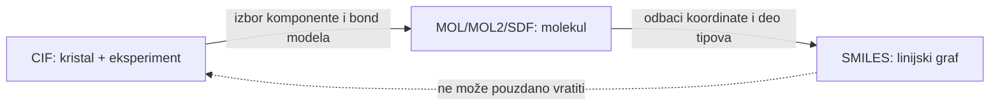

# 12. CIF, MOL, MOL2, SDF i SMILES

**Prioritet: MORAŠ.** Format nije samo ambalaža. Svaki format čuva drugi deo hemijskog značenja, pa konverzija može tiho promeniti pitanje koje aplikacija odgovara.

**Preduslov:** razlikuješ hemijsku povezanost, naboje i vodonike iz [2](02-veze.md), komponente i čvrste forme iz [11](11-cvrste-forme.md), kao i ćeliju, ASU, simetriju i kvalitet modela iz poglavlja 8–10. Ovde porediš šta pojedini zapis čuva; detaljno čitanje strukture CIF teksta sledi u [12A](12a-anatomija-cif.md).

## 12.1 Dva sveta podataka

Najpre razdvoji:

- **molekulski zapis** — atomi, veze, naboji i eventualno jedna 2D/3D konformacija;
- **kristalografski zapis** — asimetrična jedinica, jedinična ćelija, simetrija, periodično pakovanje, eksperimentalni i refinementski metapodaci.

MOL, MOL2, SDF i SMILES su prvenstveno molekulski formati. CIF može da nosi čitav kristalografski eksperiment. Pretvaranje CIF-a u SMILES zato nije „promena ekstenzije“, već projekcija mnogo bogatijeg objekta na molekulski graf.



## 12.2 CIF: datoteka i Crystallographic Information Framework {#122-cif-crystallographic-information-framework}

CIF datoteka (*Crystallographic Information File*) koristi tekstualni, samopisujući format zasnovan na **data names** i rečnicima. Širi *Crystallographic Information Framework* obuhvata i standarde i rečnike koji daju značenje zapisu. Autoritativna definicija pojedinačnih polja je [IUCr core CIF dictionary](https://cif-dictionaries.iucr.org/cifdic/dichtm.php?dic=cif_core_2.4.5); praktični uvod je [IUCr CIF guide](https://www.iucr.org/__data/assets/pdf_file/0019/22618/cifguide.pdf).

Za pun, bezbedan i parsabilan primer pređi odmah i [anatomiju jednog CIF fajla](12a-anatomija-cif.md). Tamo možeš da preuzmeš sintetički `.cif` i pročitaš svaku vrstu reda bez objavljivanja licenciranog projekta/CSD sadržaja.

Osnovni oblici su:

```text
data_N14
_cell_length_a       12.7138(3)
_cell_angle_beta     93.235(1)

loop_
_atom_site_label
_atom_site_fract_x
_atom_site_fract_y
_atom_site_fract_z
C1  0.1234  0.5678  0.9012
```

Važne ideje:

- `data_...` otvara blok podataka;
- par `_ime vrednost` čuva jednu stavku;
- `loop_` čuva tabelu čije se vrednosti ponavljaju po redovima;
- `12.7138(3)` znači vrednost 12.7138 sa standardnom nesigurnošću 0.0003, ne „12.7138 puta 3“;
- `.` i `?` nisu broj nula: prvi označava neprimenljivo/namerno nepodato, drugi nepoznato;
- atom-site koordinate su često **frakcione**, u odnosu na ose ćelije, a ne kartezijanske u ångströmima;
- occupancy, disorder assembly/group, symmetry i alternativne pozicije moraju ostati povezani sa atomom;
- jedan CIF može sadržati više data blokova, dodatne rečnike, refleksije ili ugrađen refinement sadržaj.

!!! example "Lokalni CIF"
    `cu_n14_a.cif` navodi monoklinsku ćeliju, prostornu grupu \(P\,2_1/c\), \(Z=4\), temperaturu 100 K i kristalografske pokazatelje kvaliteta. Fajl je velik jer sadrži i ugrađene SHELX podatke. Ime počinje sa `cu_`, ali u formuli i atomskim mestima nema bakra: Cu Kα označava korišćeno rendgensko zračenje. Naziv fajla nije hemijski dokaz.

## 12.3 MOL: kompaktan connection table

MDL MOL obično sadrži:

1. zaglavlje;
2. counts line;
3. atom block sa koordinatama i simbolima elemenata;
4. bond block sa parovima indeksa i formalnim redom veze;
5. dodatne property linije i `M  END`.

Primer ideje, ne punog zapisa:

```text
  3  2  ... V2000
    ... C
    ... O
    ... N
  1  2  2
  1  3  1
M  END
```

MOL je jednostavan za razmenu, ali tip atoma i veze može biti siromašniji od internog hemijskog modela. U lokalnom `N14.mol` mnogo veza je izvezeno kao single; iz toga se ne sme zaključiti da molekul nema delokalizaciju ili da je bond perception sigurno tačan.

## 12.4 MOL2: atom tipovi, bond tipovi i charges

Tripos MOL2 ima označene sekcije, na primer:

```text
@<TRIPOS>MOLECULE
@<TRIPOS>ATOM
@<TRIPOS>BOND
@<TRIPOS>SUBSTRUCTURE
```

Pored elementa, atom često dobija softverski **atom type** poput `C.ar` ili `N.3`; veza može biti `1`, `2`, `ar`, `am` ili `un`. To su model i dodela izvoznika, ne direktno eksperimentalno opažanje.

Lokalni `N14.mol2` kaže `NO_CHARGES` i daje nule u charge koloni. To znači da **parcijalni naboji nisu dodeljeni**. Ne znači da je svaka lokalna raspodela elektronske gustine ravnomerna, niti da molekul nema polarne veze.

MOL2 može sadržati i opcionu sekciju `@<TRIPOS>CRYSIN` sa parametrima ćelije i oznakom prostorne grupe; lokalni `N14.mol2` je sadrži. Zato nije tačno da svaki MOL2 nužno gubi svu kristalografsku informaciju. Ipak, prisustvo `CRYSIN` ne vraća kompletan CIF: izbor atoma/komponenti, disorder, eksperimentalni metapodaci i podrška parsera i dalje ograničavaju periodičnu analizu.

## 12.5 SDF: mnogo MOL zapisa i svojstva

Structure Data File je niz MOL zapisa razdvojenih sa:

```text
$$$$
```

Posle connection table-a mogu stajati imenovana polja:

```text
> <CCDC_REF_CODE>
CAPHAG
```

SDF je zgodan za skupove molekula i labels/deskriptore. Ipak, naziv polja, jedinica, tip nedostajuće vrednosti i poreklo nisu automatski standardizovani. Schema mora biti eksplicitna.

## 12.6 SMILES: linijski zapis grafa

SMILES kodira atome i veze kao tekst:

- `CCO` — etanol, lanac C-C-O; vodonici se u ovom zapisu podrazumevaju prema pravilima valence;
- `c1ccncc1` — aromatični šestoprsten sa jednim N;
- `C(=N)N` — grananje i double veza;
- `[Na+].[Cl-]` — dve nepovezane jonske komponente;
- `@`, `/` i `\` mogu kodirati određene stereoodnose ako su prisutni.

Brojevi u `c1ccncc1` označavaju zatvaranje prstena, ne broj atoma niti red veze. Veliko `C` i malo `c` razlikuju alifatični/nearomatični i aromatični prikaz ugljenika. SMILES tačka označava prekid neposrednog povezivanja; nema značenje CIF missing-value tačke.

[Daylight SMILES theory](https://www.daylight.com/dayhtml/doc/theory/) opisuje jezik. Bitne posledice:

- isti graf može imati mnogo validnih SMILES stringova;
- **canonical SMILES zavisi od implementacije i verzije**, pa nije globalni identifikator;
- izostavljena stereokemija ostaje nepoznata, ne „automatski racemična“;
- standardni SMILES ne čuva jediničnu ćeliju, space group, occupancy, termalne parametre ni periodično pakovanje;
- metal-ligand veze i aromatičnost mogu biti različito zapisane u različitim alatima.

## 12.7 Šta se gubi pri konverziji

| Konverzija | Tipični gubitak ili odluka |
|---|---|
| CIF → MOL/SDF | ćelija, simetrija, pakovanje, većina eksperimentalnih metapodataka; izbor komponente i veze |
| CIF → SMILES | sve prethodno plus 3D koordinate i konformacija |
| MOL2 → MOL | detaljni atom/bond tipovi, substructure, parcijalni charge model i eventualni `CRYSIN` podaci |
| SDF → SMILES | 3D i većina property polja; komponente i podržani stereo mogu se očuvati, ali to zavisi od export policy-ja |
| SMILES → 3D | generisana konformacija je hipoteza; nije eksperimentalna kristalna geometrija |

[Open Babel format documentation](https://openbabel.org/docs/FileFormats/Overview.html) može objasniti sintaksu konverzija, ali hemijski smisao rezultata i dalje mora biti testiran.

## 12.8 Loss-aware provenance princip

Formati pokazuju zašto original, interpretacija i izvedeni prikaz nisu ista vrsta informacije. Reproduktivno tumačenje zato mora da razlikuje:

| Kategorija | Zašto je potrebna |
|---|---|
| originalni sadržaj i identitet | omogućava proveru šta je stvarno primljeno |
| format/parser kontekst | značenje može zavisiti od standarda, alata i verzije |
| direktno deklarisani podaci | ne smeju se pomešati sa dodeljenim vezama ili normalizacijom |
| izvedeni task-specific prikazi | mogu biti korisni, ali su potencijalno lossy i uslovljeni pravilima |
| warnings, coverage i provenance | „parse success“ ne znači hemijsku ili kristalografsku potpunost |

Ovo su semantičke kategorije, ne propisana storage schema ili budući ingest pipeline.

## 12.9 Provera znanja

1. Zašto SMILES nije dovoljan za poređenje crystal packing-a?
2. Šta znači `NO_CHARGES` u MOL2?
3. Da li `12.7138(3)` u CIF-u predstavlja opseg od 3 jedinice?
4. Zašto uspešna konverzija CIF → SDF nije dokaz da ništa nije izgubljeno?
5. Zašto ime `cu_n14_a.cif` ne dokazuje prisustvo Cu?

??? success "Odgovori"
    1. Ne čuva ćeliju, simetriju, periodičnost ni kristalnu konformaciju/pakovanje.  
    2. Parcijalni charges nisu dodeljeni u tom zapisu.  
    3. Ne; zagrada kodira standardnu nesigurnost poslednjih cifara.  
    4. Parser može napraviti validan siromašniji objekat nakon odluka o komponentama, vezama i disorder-u.  
    5. Sastav se proverava u formuli/atom sites; ovde `CuK\a` opisuje zračenje.

**Kriterijum prolaza:** za svaki od pet formata možeš da navedeš šta čuva, šta ne čuva i jednu opasnu pretpostavku pri konverziji.
