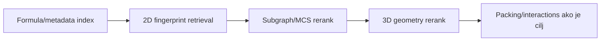

# 14. Molekul kao graf i skup deskriptora

**Prioritet: MORAŠ.** Ovo poglavlje spaja hemiju sa ML projektovanjem. Reprezentacija određuje koje razlike model može da vidi, a koje ne može.

**Preduslovi:** veze i označeni atomi iz2–6, pa formati i standardizacija iz12–13. Periodični blok dodatno traži ćeliju, simetriju i drugi prolaz kontakata7; njegovi preduslovi navedeni su uz račun.

## 14.1 Molekulski graf

Molekul se često modeluje kao označen graf \(G=(V,E)\):

- čvor \(v\in V\) je atom;
- grana \(e\in E\) je model hemijske veze;
- čvor nosi element, formal charge, aromaticity, hybridization, koordinaciono okruženje, eventualno 3D položaj;
- grana nosi bond type/order, aromatic/conjugated status i eventualno dužinu.

Graf je korisna apstrakcija, ali nije cela elektronska struktura. Bond order i aromaticity mogu biti dodeljeni modeli; koordinacione veze nisu uvek prirodno opisane običnim integer bond order-om.

## 14.2 Kristal zahteva periodični graf

### Od dve tačke do periodičnog lanca {#periodicki-graf-most}

**Preduslovi:** [ćelija i koordinate](08-celija.md), [simetrija](09-simetrija.md) i [drugi prolaz kroz kontakte](07-interakcije.md). Pitanje je kako konačna tabela čvorova može da opiše beskonačnu mrežu.

U nastavnom jednodimenzionalnom modelu ćelija ima dužinu 10 Å. Predstavnici čvorova su A na frakcionoj koordinati 0,9 i B na 0,1. Ivica **A→B sa oznakom +1** vodi do B u sledećoj ćeliji, na 1,1:

\[
\Delta r=10(0,1+1-0,9)=2\ \text{Å}.
\]

U konačnom označenom grafu čuvamo samo A, B i oznaku ivice +1. Periodični nastavak sadrži Aₖ na \(10(k+0,9)\) i Bₖ na \(10(k+0,1)\), za sve cele \(k\). Obrnuta ivica B→A ima oznaku −1 i pomeraj −2 Å. Ako dodamo i ivicu B→A sa oznakom 0, dobijamo nastavni lanac sa naizmeničnim razmacima 8 i 2 Å:

```text
... B₀(1 Å) --8 Å-- A₀(9 Å) --2 Å-- B₁(11 Å) --8 Å-- A₁(19 Å) ...

konačni graf: B --[0]--> A --[+1]--> B
```

Duga ivica ovde služi ilustraciji topologije i nije tvrdnja o hemijskoj vezi od 8 Å. Samo ponavljanje izolovanih A–B parova preko granice ne bi dalo povezan lanac; zato smo naveli obe ivice.

Sada za predstavnika B izaberimo 1,1 umesto 0,1. Isti kratki kontakt A→B ima oznaku **0**, jer je \(10(1,1+0-0,9)=2\) Å. Predstavnik se promenio, fizički pomeraj nije. Druga ivica B→A sada dobija oznaku +1. Takva promena izbora predstavnika često se naziva *gauge promena*.

### Ciklus, povratak i rang mreže

Put A₀→B₁→A₀ po kratkoj ivici i njenoj inverznoj ima zbir oznaka \(+1-1=0\): vraća se na isti fizički čvor. Put B₀→A₀→B₁ ima zbir \(0+1=1\). On je zatvoren u konačnom grafu predstavnika, ali u periodičnom nastavku završava u drugoj kopiji B; zato otkriva pravac beskonačnog povezivanja.

Rang povezanog periodičnog dela broji nezavisne translacione pravce koje ovakvi zatvoreni putevi generišu: rang 0 daje konačnu komponentu, 1 lanac, 2 sloj, a 3 prostornu mrežu. Broj nacrtanih ivica i broj nekolinearnih tačaka sami ne određuju taj rang.

### Opšti zapis i granice {#periodicki-graf-formule}

Za već simetrijski razvijene predstavnike \(f_i\), matricu ćelije \(A\) sa baznim vektorima u kolonama i translacionu oznaku \(n_{ij}\in\mathbb Z^3\), fizički pomeraj je

\[
d_{ij}=A(f_j+n_{ij}-f_i).
\]

Ako izaberemo \(f'_i=f_i+s_i\), gde je \(s_i\) celobrojan vektor, ista ivica zahteva

\[
n'_{ij}=n_{ij}+s_i-s_j.
\]

Uvrštavanjem se članovi \(s_i,s_j\) poništavaju i \(d'_{ij}=d_{ij}\). Duž zatvorenog puta poništavaju se i sve promene predstavnika, pa ukupna translacija ostaje ista. Ovo je osnovni most za [periodično mapiranje i unwrap](https://github.com/nemper/crystallography-and-ml-theory/blob/main/ml-ai-strategy/docs/04-precise-pairwise.md) i [neuralni periodični graf](https://github.com/nemper/crystallography-and-ml-theory/blob/main/ml-ai-strategy/docs/05-periodic-crystal-encoders.md). *Unwrap* bira međusobno dosledne ćelijske kopije atoma; za mrežu nenultog ranga ne može sve periodične veze pretvoriti u unutrašnje veze jednog konačnog molekula.

**Referentni sloj.** Ako se polazi od ASU, simetrijske operacije prethode ovom translacionom zapisu i njihovo poreklo se čuva. Graf zavisi od vrste kontakta, zauzeća mesta i nereda u modelu. Formulu za puno periodično rastojanje, uključujući kosu ćeliju, čitaj u drugom prolazu [interakcija](07-interakcije.md); ovde se izvodi samo promena oznaka grafa.

Uz istovremenu celobrojnu unimodularnu promenu bazisa \(U\), sa \(\det U=\pm1\), isti fizički model ima \(A'=AU\), \(f'_i=U^{-1}f_i+s_i\) i

\[
n'_{ij}=U^{-1}n_{ij}+s_i-s_j,\qquad
A'(f'_j+n'_{ij}-f'_i)=A(f_j+n_{ij}-f_i).
\]

Celobrojnost \(U^{-1}\) čuva translacione oznake u \(\mathbb Z^3\). Ovo obuhvata i promenu predstavnika iz primera; superćelija sa većom apsolutnom determinantom dodatno zahteva atomske kopije, kao u [konstrukciji superćelije](08-celija.md#supercelija-2x1x1). Formula se koristi kao zajednička stručna referenca za deterministički i neuralni deo.

Kristal nije samo graf asimetrične jedinice. Simetrijske operacije i translacije stvaraju periodične slike. Kontakt preko granice ćelije može biti najvažnija H-veza u mreži.

Periodični model zato mora da pamti:

- lattice vectors / cell parameters;
- fractional coordinates;
- symmetry operation i translation image za svaku međumolekulsku ivicu;
- component/occupancy/disorder identitet;
- cutoff i hemijsko pravilo kojim je kontakt napravljen.

Ako sve atome samo preseliš u jednu kartezijansku kutiju, možeš prekinuti stvarnu mrežu ili duplirati interakcije.

## 14.3 Deskriptori: sažetak uz gubitak

**Deskriptor** je izračunata osobina reprezentacije. Primeri relevantni projektu:

| Nivo | Primeri | Šta približno hvata |
|---|---|---|
| formula/composition | element counts, molecular weight, metal class | sastav, ali ne connectivity |
| 2D topologija | atom/bond counts, rings, rotatable bonds, HBD/HBA | graf i funkcionalnost |
| fingerprint | hashed local substructures | brzo hemijsko susedstvo |
| 3D molekul | distance matrix, torsions, shape moments, pharmacophore features | konformaciju/oblik |
| koordinacioni centar | donor set, coordination number, geometry distortion | lokalnu metalnu geometriju |
| kristal | cell/space group/density, packing motifs, contact network | periodičnu čvrstu formu |
| eksperiment | temperature, radiation, R values, disorder flags | uslove i kvalitet određivanja |

Deskriptor nije neutralan. „Broj H-bond acceptora“ zavisi od protonacije i feature definicije; „density“ može biti prijavljena ili izračunata; „space group“ je kategorija, ne numerička udaljenost.

## 14.4 Circular fingerprints

Extended-connectivity/circular fingerprint algoritmi iterativno opisuju lokalna atomska okruženja do određenog radijusa, a zatim ih mapiraju u skup ili bit-vektor. Osnovni rad je [Rogers i Hahn, 2010](https://pubs.acs.org/doi/10.1021/ci100050t); praktična implementacija i parametri su opisani u [RDKit vodiču](https://www.rdkit.org/docs/GettingStartedInPython.html).

**Radijus je broj koraka kroz veze, ne udaljenost u Å.** Radijus 0 opisuje centralni atom; radijus 1 dodaje njegove neposredne susede, a radijus 2 i susede tih suseda. Oznaka ECFP4 se uobičajeno odnosi na dijametar 4, odnosno radijus 2; RDKit Morgan koristi parametar radijusa. Bit-vektor beleži prisustvo okruženja pomoću 0/1, dok count-vektor beleži i broj pojavljivanja. To su različite reprezentacije i zahtevaju odgovarajuću definiciju mere sličnosti.

Važni parametri:

- atom invariants/features;
- radius;
- bit-vector length ili sparse counts;
- useCounts vs binary presence;
- stereochemistry uključena/isključena;
- aromaticity i standardization policy;
- toolkit i verzija.

Fingerprint collision znači da različita okruženja mogu završiti u istom bitu. Zato fingerprint score nije dokaz identiteta, a objašnjenje treba vratiti na stvarne matched substructures kada je moguće.

## 14.5 3D reprezentacija

Koordinate nose dužine, uglove, torsions i shape, ali uvode invariance zahteve:

- prevod i rotacija celog molekula ne smeju menjati rezultat;
- permutacija ekvivalentnih atoma ne sme proizvesti lažnu razliku;
- mirror image ne treba automatski tretirati isto kada je chirality relevantna;
- različite konformacije istog grafa mogu biti namerno slične ili različite, zavisno od zadatka;
- kristalne i generisane 3D koordinate ne smeju se pomešati bez oznake porekla.

RMSD je smislen tek nakon definisanja atom mapping-a, alignment-a, symmetry-equivalent atom treatment-a i H atom policy-ja.

## 14.6 Interakcioni i packing grafovi

Za crystal-level poređenje mogu se graditi:

- atom-contact graf;
- molecule-centroid graf;
- H-bond network;
- coordination network;
- fingerprint intermolecular interactions;
- local coordination environment oko odabranog atoma/molekula.

Svaka ivica mora nositi rule provenance. Geometrijski cutoff sam po sebi nije hemijska istina; donor/acceptor type, angle, periodic image i uncertainty menjaju tumačenje.

## 14.7 Multimodalni zapis, ne jedna magična reprezentacija

U [povezanom primeru](povezani-primer.md#objekti) isti Q ima izvorni opis sa dodatnom komponentom i namenski pogled na jezgro. B omogućava mapirano 3D poređenje, a C samo grafovski zaključak. Reprezentacija određuje primenljivost metode pre nego što se izračuna bilo koji skor.

Za prvu aplikaciju je razumna hijerarhija:



Ova kaskada je korisna kada je sličan molekulski graf deo definicije relevantnosti. Ako tražimo isti koordinacioni ili packing motiv među hemijski različitim strukturama, strogo odbacivanje po 2D fingerprintu može ukloniti pravi pogodak. Tada treba drugačije generisati kandidate ili sjediniti više skupova kandidata i izmeriti šta svaki korak propušta.

Za drugu aplikaciju, gde su ulazi već izabran skup CIF-ova, mogu se uporedo izračunati:

- chemical graph similarity;
- conformational/geometric similarity;
- coordination environment similarity;
- packing similarity;
- interaction-network similarity;
- data-quality compatibility.

Ne sabiraj ih dok nisu normalizovani, validirani i semantički objašnjeni.

## 14.8 Feature provenance i uncertainty

Feature je interpretabilan samo kada uz vrednost postoji dovoljno konteksta da se razume njegova jedinica i strukturni nivo, metod i verzija, izvorni atomi/polja, parametri, neizvesnost i razlog odsustva. Njihov referentni status objašnjava [centralna napomena](kako-koristiti.md#teorijski-i-referentni-sloj).

Posebno razdvoji:

- **observed/refined** koordinate i polja;
- **derived** vrednosti, poput bond length iz koordinata;
- **assigned** kategorizacije, poput atom type-a;
- **predicted** vrednosti, poput ML property-ja.

Modelu se može dati svaka od njih, ali korisniku se ne smeju prikazati kao ista vrsta činjenice.

## 14.9 Data leakage

Kod CSD-derived skupa nasumični split po pojedinačnim refcode-ovima može staviti vrlo slična ponovljena određivanja ili polymorph family u train i test. Rezultat tada meri prepoznavanje familije, ne generalizaciju.

Split jedinica treba da prati naučno pitanje, na primer:

- scaffold split za novi hemijski scaffold;
- compound-family split za novu supstancu;
- publication/time split za buduće zapise;
- laboratory/source split za robusnost prema poreklu;
- solid-form family split za polymorph zadatak.

## 14.10 Provera znanja

1. Koju informaciju formula ne može da odredi?
2. Zašto fingerprint parametri moraju biti verzionisani?
3. Koje invariance treba 3D model?
4. Zašto asimetrična jedinica nije potpuni packing graf?
5. Kako bliski CSD refcode-ovi mogu izazvati data leakage?

??? success "Odgovori"
    1. Connectivity, izomeriju, konformaciju i packing.  
    2. Menjaju bitove/features i time vrednosti sličnosti i kompatibilnost indeksa.  
    3. Najmanje translation, rotation i atom-permutation invariance/equivariance uz pažljiv chirality tretman.  
    4. Periodični susedi nastaju symmetry/translation operacijama, često preko granice ćelije.  
    5. Mogu predstavljati isto ili gotovo isto jedinjenje/formu/određivanje pa završiti na obe strane split-a.

**Kriterijum prolaza:** za svaku feature porodicu umeš da kažeš njen nivo, poreklo, invariance, šta gubi i za koji od dva proizvoda služi.
