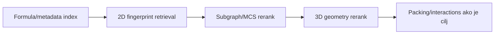

# 14. Molekul kao graf i skup deskriptora

**Prioritet: MORAŠ.** Ovo poglavlje spaja hemiju sa ML projektovanjem. Reprezentacija određuje koje razlike model može da vidi, a koje ne može.

## 14.1 Molekulski graf

Molekul se često modeluje kao označen graf \(G=(V,E)\):

- čvor \(v\in V\) je atom;
- grana \(e\in E\) je model hemijske veze;
- čvor nosi element, formal charge, aromaticity, hybridization, koordinaciono okruženje, eventualno 3D položaj;
- grana nosi bond type/order, aromatic/conjugated status i eventualno dužinu.

Graf je korisna apstrakcija, ali nije cela elektronska struktura. Bond order i aromaticity mogu biti dodeljeni modeli; koordinacione veze nisu uvek prirodno opisane običnim integer bond order-om.

## 14.2 Kristal zahteva periodični graf

Kristal nije samo graf asimetrične jedinice. Simetrijske operacije i translacije stvaraju periodične slike. Kontakt preko granice ćelije može biti najvažnija H-veza u mreži.

Periodični model zato mora da pamti:

- lattice vectors / cell parameters;
- fractional coordinates;
- symmetry operation i translation image za svaku međumolekulsku ivicu;
- component/occupancy/disorder identitet;
- cutoff i hemijsko pravilo kojim je kontakt napravljen.

Ako sve atome samo preseliš u jednu kartezijansku kutiju, možeš prekinuti stvarnu mrežu ili duplirati interakcije.

## 14.3 Deskriptori: sažetak uz gubitak

**Deskriptor** je izračunata osobina reprezentacije. Primeri relevantni projektu:

| Nivo | Primeri | Šta približno hvata |
|---|---|---|
| formula/composition | element counts, molecular weight, metal class | sastav, ali ne connectivity |
| 2D topologija | atom/bond counts, rings, rotatable bonds, HBD/HBA | graf i funkcionalnost |
| fingerprint | hashed local substructures | brzo hemijsko susedstvo |
| 3D molekul | distance matrix, torsions, shape moments, pharmacophore features | konformaciju/oblik |
| koordinacioni centar | donor set, coordination number, geometry distortion | lokalnu metalnu geometriju |
| kristal | cell/space group/density, packing motifs, contact network | periodičnu čvrstu formu |
| eksperiment | temperature, radiation, R values, disorder flags | uslove i kvalitet određivanja |

Deskriptor nije neutralan. „Broj H-bond acceptora“ zavisi od protonacije i feature definicije; „density“ može biti prijavljena ili izračunata; „space group“ je kategorija, ne numerička udaljenost.

## 14.4 Circular fingerprints

Extended-connectivity/circular fingerprint algoritmi iterativno opisuju lokalna atomska okruženja do određenog radijusa, a zatim ih mapiraju u skup ili bit-vektor. Osnovni rad je [Rogers i Hahn, 2010](https://pubs.acs.org/doi/10.1021/ci100050t); praktična implementacija i parametri su opisani u [RDKit vodiču](https://www.rdkit.org/docs/GettingStartedInPython.html).

Važni parametri:

- atom invariants/features;
- radius;
- bit-vector length ili sparse counts;
- useCounts vs binary presence;
- stereochemistry uključena/isključena;
- aromaticity i standardization policy;
- toolkit i verzija.

Fingerprint collision znači da različita okruženja mogu završiti u istom bitu. Zato fingerprint score nije dokaz identiteta, a objašnjenje treba vratiti na stvarne matched substructures kada je moguće.

## 14.5 3D reprezentacija

Koordinate nose dužine, uglove, torsions i shape, ali uvode invariance zahteve:

- prevod i rotacija celog molekula ne smeju menjati rezultat;
- permutacija ekvivalentnih atoma ne sme proizvesti lažnu razliku;
- mirror image ne treba automatski tretirati isto kada je chirality relevantna;
- različite konformacije istog grafa mogu biti namerno slične ili različite, zavisno od zadatka;
- kristalne i generisane 3D koordinate ne smeju se pomešati bez oznake porekla.

RMSD je smislen tek nakon definisanja atom mapping-a, alignment-a, symmetry-equivalent atom treatment-a i H atom policy-ja.

## 14.6 Interakcioni i packing grafovi

Za crystal-level poređenje mogu se graditi:

- atom-contact graf;
- molecule-centroid graf;
- H-bond network;
- coordination network;
- fingerprint intermolecular interactions;
- local coordination environment oko odabranog atoma/molekula.

Svaka ivica mora nositi rule provenance. Geometrijski cutoff sam po sebi nije hemijska istina; donor/acceptor type, angle, periodic image i uncertainty menjaju tumačenje.

## 14.7 Multimodalni zapis, ne jedna magična reprezentacija

Za prvu aplikaciju je razumna hijerarhija:

Za drugu aplikaciju, gde su ulazi već izabran skup CIF-ova, mogu se uporedo izračunati:

- chemical graph similarity;
- conformational/geometric similarity;
- coordination environment similarity;
- packing similarity;
- interaction-network similarity;
- data-quality compatibility.

Ne sabiraj ih dok nisu normalizovani, validirani i semantički objašnjeni.

## 14.8 Feature provenance i uncertainty

Feature je interpretabilan samo kada uz vrednost postoji dovoljno konteksta da se razume njegova jedinica i strukturni nivo, metod i verzija, izvorni atomi/polja, parametri, neizvesnost i razlog odsustva. To su kategorije dokaza, ne propisana buduća record schema.

Posebno razdvoji:

- **observed/refined** koordinate i polja;
- **derived** vrednosti, poput bond length iz koordinata;
- **assigned** kategorizacije, poput atom type-a;
- **predicted** vrednosti, poput ML property-ja.

Modelu se može dati svaka od njih, ali korisniku se ne smeju prikazati kao ista vrsta činjenice.

## 14.9 Data leakage

Kod CSD-derived skupa nasumični split po pojedinačnim refcode-ovima može staviti vrlo slična ponovljena određivanja ili polymorph family u train i test. Rezultat tada meri prepoznavanje familije, ne generalizaciju.

Split jedinica treba da prati naučno pitanje, na primer:

- scaffold split za novi hemijski scaffold;
- compound-family split za novu supstancu;
- publication/time split za buduće zapise;
- laboratory/source split za robusnost prema poreklu;
- solid-form family split za polymorph zadatak.

## 14.10 Provera znanja

1. Koju informaciju formula ne može da odredi?
2. Zašto fingerprint parametri moraju biti verzionisani?
3. Koje invariance treba 3D model?
4. Zašto asimetrična jedinica nije potpuni packing graf?
5. Kako bliski CSD refcode-ovi mogu izazvati data leakage?

??? success "Odgovori"
    1. Connectivity, izomeriju, konformaciju i packing.  
    2. Menjaju bitove/features i time vrednosti sličnosti i kompatibilnost indeksa.  
    3. Najmanje translation, rotation i atom-permutation invariance/equivariance uz pažljiv chirality tretman.  
    4. Periodični susedi nastaju symmetry/translation operacijama, često preko granice ćelije.  
    5. Mogu predstavljati isto ili gotovo isto jedinjenje/formu/određivanje pa završiti na obe strane split-a.

**Kriterijum prolaza:** za svaku feature porodicu umeš da kažeš njen nivo, poreklo, invariance, šta gubi i za koji od dva proizvoda služi.
