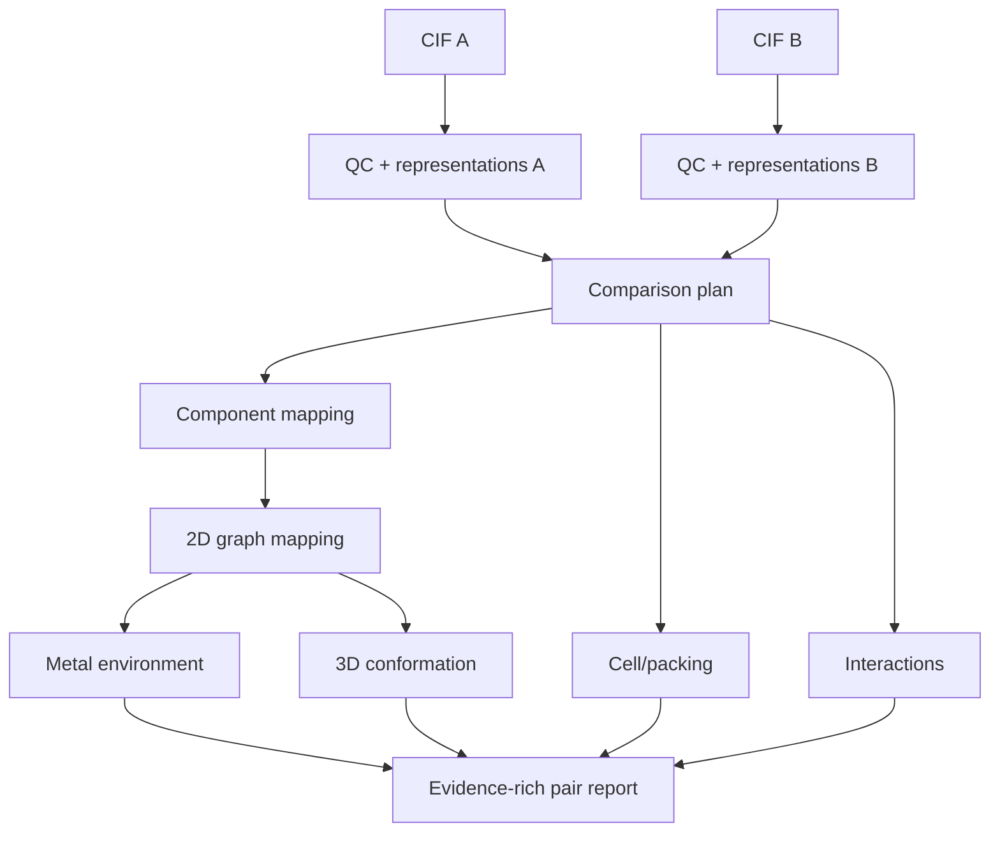

# 19. Precizno poređenje parova

**Cilj druge aplikacije:** za učitani skup CIF-ova izračunati svako potrebno poređenje i vratiti rastavljiv, stručno proverljiv izveštaj — ne samo matricu neobjašnjenih brojeva.

## 19.1 Prvo definiši jedinicu poređenja

Jedan upload može sadržati:

- jedan hemijski molekul;
- coordination entity i counterions;
- solvate/hydrate/co-crystal;
- više independent molecules u asymmetric unit;
- disorder alternatives;
- polymeric coordination network.

Pre bilo kakvog score-a mora biti jasno koje se komponente porede, da li je objekat ligand, ceo entity ili crystal i koji nivoi imaju dovoljno podataka u oba zapisa. Ovde je **comparison plan** naziv za tu semantičku odluku, ne specifikacija softverskog objekta.

## 19.2 Kvadratna složenost

Za \(n\) različitih struktura broj neuređenih parova je:

\[
N_{pairs}=\frac{n(n-1)}{2}.
\]

| \(n\) | parova |
|---:|---:|
| 10 | 45 |
| 100 | 4.950 |
| 1.000 | 499.500 |
| 2.110 | 2.224.995 |

Kvadratni rast objašnjava nekoliko opštih principa skaliranja: veličine koje zavise samo od jedne strukture mogu se ponovo koristiti, simetrično poređenje ne treba računati u oba smera bez naučnog razloga, a exhaustive all-pairs analiza nije isto što i candidate-pruned aproksimacija. Ako se koristi aproksimacija, njena propuštenost mora biti merena; način izvršavanja i skladištenja nije deo ovog teorijskog poglavlja.

## 19.3 Pair pipeline

Sledeći dijagram je **nenormativna ilustracija** zavisnosti između vrsta poređenja, a ne propis redosleda ili komponenti konkretnog sistema.

Pojedina grana može dati validno merenje, ostati neodređena, biti neprimenljiva, nemati potreban ulaz ili ne uspeti. Te situacije imaju različito značenje i ne smeju se sve pretvoriti u score nula.

## 19.4 Component mapping

Pre atom mapping-a rešava se problem komponenti:

1. classify components bez brisanja originala;
2. generiši candidate pairings po sastavu/grafu/ulozi;
3. pronađi globalno konzistentno uparivanje komponenti;
4. prijavi unmatched solvente, counterions i coformers;
5. odvojeno izračunaj parent i full-composition poređenje.

„Uporedi samo najveći fragment“ je neprihvatljiv default za metalne komplekse i solid forms.

## 19.5 Molekulski graf i atom mapping

Za tumačenje graph poređenja relevantni su:

- exact/substructure/MCS status;
- broj i procenat mapiranih heavy atoms;
- mapirane atom pairs;
- unmatched atoms/bonds i funkcionalne grupe;
- charge, stereo i tautomer policy;
- multiple equivalent mappings i chosen-tie-breaker;
- confidence ako bond typing nije pouzdan.

Za DAP use case posebno se mapiraju centralni pyridine N, dva imine N i scaffold atoms, pa tek zatim terminalni supstituenti.

## 19.6 Koordinaciono okruženje

Za svaki relevantni metal naučno poređenje razmatra:

- element i formal/oxidation-state evidence;
- koordinacioni broj pod eksplicitnim neighbor modelom;
- donor atom elements/types i ligand membership;
- denticity/bridging/hapticity flags;
- ideal geometry candidates i distortion measure;
- M–donor distances i ključni angles;
- da li mapirani DAP donors stvarno koordiniraju isti metal.

Ne koristi jedan globalni distance cutoff za sve elemente i oxidation states. Nejasan connectivity rezultat ostaje `ambiguous` i ide na human review.

## 19.7 Konformaciono/3D poređenje

Za svaki validni common core važno je razmotriti:

- alignment policy;
- RMSD i maksimalno odstupanje;
- coverage \(N_{\mathrm{mapped}}/N_{\mathrm{eligible}}\);
- ključne torsion razlike;
- symmetry-equivalent atom handling;
- mirror/stereo status;
- experimental vs generated coordinate provenance.

Visok coverage sa umerenim RMSD često je informativniji od veoma niskog RMSD nad tri atoma.

## 19.8 Cell i packing nisu isto

Cell grana može porediti:

- crystal system/space-group type;
- standardized/reduced lattice parameters;
- volume per formula unit;
- density i temperature.

Packing poređenje se odnosi na periodični raspored mapiranih molekula/komponenti i zavisi od obima okruženja, tolerancija, broja poklopljenih molekula i geometrijskog odstupanja. Slična reduced cell je candidate signal, ne packing proof.

## 19.9 Interakcije

Periodični contact networks omogućavaju poređenje:

- H-bond donor/acceptor pairs i geometriju;
- halogen/π i druge definisane kontakte;
- coordination links;
- chain/ring/network motifs;
- solvent-mediated veze;
- coverage i uncertainty zbog H/disorder-a.

Tumačenje interakcionog rezultata zavisi od definicije kontakta i korišćenih geometrijskih parametara.

## 19.10 Zašto rezultat mora ostati rastavljiv

Razmotrimo nenormativan primer: dva zapisa mogu imati visok 2D graph score i dobro mapiran common core, ali različite komponente, neodređenu metalnu povezanost i nedostupno packing poređenje zato što jedan zapis nema validnu ćeliju. Jedan ukupni broj bi sakrio upravo razliku koju stručnjak treba da vidi. U takvom slučaju je naučno tačnije reći da pojedini nivoi nisu ocenjeni nego izmišljati univerzalni overall score. Primer ilustruje semantiku parcijalnog rezultata, ne predlaže result schema-u.

## 19.11 Matrice i klasteri

Matrica ima smisla samo za jasno imenovanu metric component. Heatmap, hijerarhijsko klasterovanje ili mreža mogu pomoći istraživanju, ali njihovo značenje zavisi od definicije distance, linkage-a, threshold-a, missing vrednosti i populacije. Vizuelni obrazac nije zamena za atomski ili periodični dokaz pojedinačnog para.

Ne mešati `not comparable` sa score 0: prvo znači da odgovor nije poznat/primenljiv, drugo da je validno poređenje pokazalo odsustvo sličnosti.

## 19.12 Metamorphic i adversarial testovi

Ista struktura treba da ostane ista nakon:

- permutacije redosleda atoma/komponenti;
- rigidne rotacije/translacije;
- wrap-a preko cell boundary-ja;
- symmetry-equivalent ASU/origin izbora;
- ekvivalentnog \(P\,2_1/c\leftrightarrow P\,2_1/n\) setting-a;
- invertibilne basis/conventional-cell promene;
- validnog različitog SMILES atom ordering-a.

Namerno različiti testovi:

- isti ligand, drugi metal;
- isti metal/donor set, druga geometry;
- isti molekul, drugi polymorph;
- ista formula, drugi constitutional isomer;
- metal samo u counterion-u;
- solvent-mediated vs direct H-bond;
- disorder alternative i missing H.

## 19.13 Provera znanja

1. Zašto `not comparable` nije score 0?
2. Šta mora prethoditi RMSD-u?
3. Zašto se component mapping radi pre atom mapping-a?
4. Da li reduced-cell hit dokazuje isti packing?
5. Koja promena CIF encoding-a ne sme promeniti rezultat?

??? success "Odgovori"
    1. Nema validnog merenja, dok 0 tvrdi validno izmerenu nepodudarnost.  
    2. Definisan common core/atom mapping, alignment i symmetry/H/stereo policy.  
    3. Inače se mogu mapirati solvent/counterion/nezavisni molekuli na pogrešne uloge.  
    4. Ne, samo generiše kandidata na lattice nivou.  
    5. Atom ordering, rigid transform, periodic wrap i ekvivalentni setting/origin/basis, u granicama definisanog zadatka.

**Kriterijum prolaza:** možeš za jedan par napraviti report u kome je svaka tvrdnja vezana za atomski/periodični evidence, algoritam, parametre i confidence.
