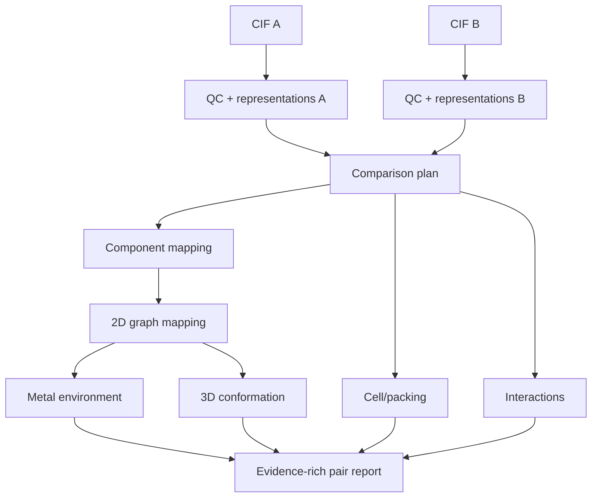

# 19. Precizno poređenje parova

**Cilj druge aplikacije:** za učitani skup CIF-ova obraditi svaki neuređeni par i vratiti rastavljiv, stručno proverljiv izveštaj — ne samo matricu neobjašnjenih brojeva. Kada ulazi ne omogućavaju određeno poređenje, taj par ostaje u obuhvatu sa jasnim razlogom neocenjenog nivoa. Manji korpus omogućava više računskog vremena po paru, ali sam po sebi ne dokazuje veću naučnu tačnost od globalne pretrage; to se proverava evaluacijom.

**Preduslov:** poznaješ geometriju i koordinaciju iz poglavlja 3–6, periodični model i čvrste forme iz 7–11, standardizaciju i reprezentacije iz 13–15 i [prava/poreklo](21-licence-fair.md). Prvi prolaz usmeri na dodelu komponenti, atomsku mapu i 3D račun; naprednu enumeraciju produbljuj uz izabranu metodu. Globalna pretraga iz poglavlja 18 nije preduslov.

## 19.1 Prvo definiši jedinicu poređenja

Jedan upload može sadržati:

- jedan hemijski molekul;
- coordination entity i counterions;
- solvate/hydrate/co-crystal;
- više independent molecules u asymmetric unit;
- disorder alternatives;
- polymeric coordination network.

Pre bilo kakvog score-a mora biti jasno koje se komponente porede, da li je objekat ligand, ceo entity ili crystal i koji nivoi imaju dovoljno podataka u oba zapisa. Ovde je **comparison plan** naziv za tu semantičku odluku, u smislu [centralne napomene o teorijskim primerima](kako-koristiti.md#teorijski-i-referentni-sloj).

## 19.2 Kvadratna složenost

Za \(n\) izabranih ulaznih strukturnih zapisa broj neuređenih parova je:

\[
N_{pairs}=\frac{n(n-1)}{2}.
\]

Ovde se broje zapisi izabrani za poređenje, a ne broj jedinstvenih molekulskih grafova. Dva određivanja istog jedinjenja mogu biti dva legitimna ulaza. Ako CIF ima više data blokova, najpre razjasni koji blokovi predstavljaju ulaze, pa tek onda odredi \(n\); deduplikacija ne sme neopaženo smanjiti obećani obuhvat „svih parova“.

| \(n\) | parova |
|---:|---:|
| 10 | 45 |
| 100 | 4.950 |
| 1.000 | 499.500 |
| 2.110 | 2.224.995 |

Kvadratni rast objašnjava nekoliko opštih principa skaliranja: veličine koje zavise samo od jedne strukture mogu se ponovo koristiti, simetrično poređenje ne treba računati u oba smera bez naučnog razloga, a exhaustive all-pairs analiza nije isto što i candidate-pruned aproksimacija. Ako se koristi aproksimacija, njena propuštenost mora biti merena; način izvršavanja i skladištenja nije deo ovog teorijskog poglavlja.

## 19.3 Pair pipeline

Sledeći dijagram je **nenormativna ilustracija** zavisnosti između vrsta poređenja, a ne propis redosleda ili komponenti konkretnog sistema.



Pojedina grana može dati validno merenje, ostati neodređena, biti neprimenljiva, nemati potreban ulaz ili ne uspeti. Te situacije imaju različito značenje i ne smeju se sve pretvoriti u score nula.

## 19.4 Component mapping

<a name="globalna-dodela"></a>

### Zašto se dodela rešava globalno {#globalna-dodela}

**Pitanje:** da li za svaku komponentu možemo uzeti njen najjeftiniji par? Razmotrimo nastavnu matricu troškova za komponente A₁/A₂ i B₁/B₂; manji broj je povoljniji. Brojevi ilustruju optimizaciju i nisu hemijske energije ili izmerene sličnosti.

| Trošak | B₁ | B₂ |
|---|---:|---:|
| A₁ | 1 | 2 |
| A₂ | 2 | 100 |

Ako prvo pohlepno uzmemo A₁→B₁ sa troškom 1, za A₂ ostaje B₂: zbir je **101**. Potpune dodele postoje samo dve; ukrštena A₁→B₂, A₂→B₁ ima zbir **2+2=4**, pa je globalni optimum. Svaka B komponenta koristi se jednom.

Hemijska dozvoljenost je odvojena od troška. Ako profil zabranjuje A₁→B₂, taj par uklanjamo iz dozvoljenih opcija bez obzira na broj 2; jedina preostala potpuna dodela košta 101. Ako profil dodatno dopušta neuparene komponente uz nastavnu kaznu 3 **za svaku neuparenu komponentu na obe strane**, A₁→B₁ i neuparene A₂/B₂ koštaju \(1+3+3=7\). To je bolji delimični izbor od 101, ali ne sme da se predstavi kao potpuno poklapanje. Zabrana, visok trošak i neupareno stanje imaju različito značenje.

Tek izabrana komponentna mapa određuje koje skupove atoma smemo dalje uparivati. Ako je A₁ dodeljena B₂, atomska mapa te grane traži se unutar B₂, a ne u proizvoljnoj komponenti B₁. Hemijski primer glavne i dodatne komponente prati [Q–B](povezani-primer.md#komponente).

### Referentni sloj: nepotpune i višeznačne dodele

Pre atom mapping-a rešava se problem komponenti:

1. classify components bez brisanja originala;
2. generiši candidate pairings po sastavu/grafu/ulozi;
3. pronađi globalno konzistentno uparivanje komponenti;
4. prijavi unmatched solvente, counterions i coformers;
5. odvojeno izračunaj parent i full-composition poređenje.

„Uporedi samo najveći fragment“ je neprihvatljiv default za metalne komplekse i solid forms.

Kod ponovljenih ekvivalentnih komponenti nekoliko numerički različitih dodela može opisivati isti fizički izbor. Njihove klase pod dozvoljenim permutacijama zovu se **orbite**. Najpre utvrdi multiplicitete, hemijska ograničenja i kaznu neuparivanja; potom razmatraj alternativne optima i *k-best*, odnosno nekoliko najboljih dozvoljenih rešenja. Detalji enumeracije dolaze u [ML/AI pairwise lekciji](https://github.com/nemper/crystallography-and-ml-theory/blob/main/ml-ai-strategy/docs/04-precise-pairwise.md), posle ovog osnovnog računa.

## 19.5 Molekulski graf i atom mapping

<a name="mcs-varijante"></a>

### Izbor MCS-a menja pitanje {#mcs-varijante}

**MCS** (*maximum common subgraph*) traži najveći zajednički podgraf prema izabranom cilju, na primer broju čvorova. U nastavnom primeru svi čvorovi imaju istu oznaku, a sve ivice isti tip:

```text
P: p₁ — p₂ — p₃        T: t₁ — t₂
                           \   /
                             t₃
```

P je putanja sa dve ivice, T trougao sa tri. Mapa p₁→t₁, p₂→t₂, p₃→t₃ čuva ivice p₁–p₂ i p₂–p₃. U T ipak postoji dodatna ivica t₁–t₃, čijeg pandana u P nema.

U sledećoj tabeli zahtevamo **povezano** zajedničko jezgro i maksimalizujemo broj čvorova. Prstenasta pravila proveravaju se prema statusu u izvornim grafovima.

| Odluka | Dopušteno podudaranje | Posledica za ovaj primer |
|---|---|---|
| **non-induced**: dodatne ivice među izabranim čvorovima cilja su dopuštene | cela putanja u trouglu | 3/3 atoma obe strane; dve zajedničke ivice ne dokazuju jednakost grafova |
| **induced**: moraju se očuvati i prisustvo i odsustvo ivica među mapiranim čvorovima | najviše jedna ivica i njena dva čvora | mapa p₁→t₁, p₂→t₂; pokrivenost 2/3 na P i 2/3 na T |
| isti prstenasti status svake mapirane ivice | ivice puta ne smeju na ivice trougla | najviše jedan čvor u povezanom jezgru ako se dodatno ne zahteva isti prstenasti status čvorova |
| očuvanje i prstenastog statusa čvorova | čvor van prstena ne sme na čvor u prstenu | u ovom paru nema dozvoljenog čvora |
| mapiranje samo celih prstenova | ne bira se samo deo trougla kao prstenasto jezgro | pravilo dodatno sužava pretragu; navodi se odvojeno od induced uslova |

Povezano i nepovezano jezgro je druga nezavisna odluka. Uz induced pravilo poredi putanju P sa grafom U koji ima samo ivicu u₁–u₂ i izolovan u₃. Nepovezano jezgro može mapirati {p₁,p₃}→{u₁,u₃}, dva čvora bez ivice i pokrivenost 2/3 obe strane. Zahtev povezanosti zabranjuje baš tu mapu, ali dopušta {p₁,p₂}→{u₁,u₂}, takođe veličine dva. Ista veličina optimuma zato ne znači isti dozvoljeni dokaz.

Pokrivenost se uvek računa kao broj mapiranih dozvoljenih atoma podeljen brojem dozvoljenih atoma **svake strane zasebno**. Hemijske oznake, naboj, stereohemija, prstenovi i dozvoljena povezanost utvrđuju se pre optimizacije; različite opcije predstavljaju različita pitanja grafovima.

### Referentni sloj: optimum i trag mapiranja

*Incumbent* je najbolje trenutno pronađeno dozvoljeno rešenje. Kod prekida pretrage on daje donju granicu vrednosti maksimuma; bez poklopljene dokazane gornje granice nije dokaz globalnog optimuma. Enumeracija ekvivalentnih mapa, ograničenje vremena i izbor između alternativnih rešenja dolaze nakon definisanja MCS varijante i mere cilja.

Za tumačenje graph poređenja relevantni su:

- exact/substructure/MCS status;
- broj i procenat mapiranih heavy atoms;
- mapirane atom pairs;
- unmatched atoms/bonds i funkcionalne grupe;
- charge, stereo i tautomer policy;
- multiple equivalent mappings i chosen-tie-breaker;
- confidence ako bond typing nije pouzdan.

Za DAP use case posebno se mapiraju centralni pyridine N, dva terminalna N atoma u `C=N` granama i scaffold atoms, pa tek zatim terminalni supstituenti.

## 19.6 Koordinaciono okruženje

Za svaki relevantni metal naučno poređenje razmatra:

- element i formal/oxidation-state evidence;
- koordinacioni broj pod eksplicitnim neighbor modelom;
- donor atom elements/types i ligand membership;
- denticity/bridging/hapticity flags;
- ideal geometry candidates i distortion measure;
- M–donor distances i ključni angles;
- da li mapirani DAP donors stvarno koordiniraju isti metal.

Ne koristi jedan globalni distance cutoff za sve elemente i oxidation states. Nejasan connectivity rezultat ostaje `ambiguous` i ide na human review.

## 19.7 Konformaciono/3D poređenje {#geometrijsko-poredenje}

Za svaki validni common core važno je razmotriti:

- alignment policy;
- RMSD i maksimalno odstupanje;
- coverage \(N_{\mathrm{mapped}}/N_{\mathrm{eligible}}\);
- ključne torsion razlike;
- symmetry-equivalent atom handling;
- mirror/stereo status;
- experimental vs generated coordinate provenance.

Visok coverage sa umerenim RMSD često je informativniji od veoma niskog RMSD nad tri atoma.

## 19.8 Cell i packing nisu isto

Cell grana može porediti:

- crystal system/space-group type;
- standardized/reduced lattice parameters;
- volume per formula unit;
- density i temperature.

Packing poređenje se odnosi na periodični raspored mapiranih molekula/komponenti i zavisi od obima okruženja, tolerancija, broja poklopljenih molekula i geometrijskog odstupanja. Slična reduced cell je candidate signal, ne packing proof.

## 19.9 Interakcije

Periodični contact networks omogućavaju poređenje:

- H-bond donor/acceptor pairs i geometriju;
- halogen/π i druge definisane kontakte;
- coordination links;
- chain/ring/network motifs;
- solvent-mediated veze;
- coverage i uncertainty zbog H/disorder-a.

Tumačenje interakcionog rezultata zavisi od definicije kontakta i korišćenih geometrijskih parametara.

## 19.10 Zašto rezultat mora ostati rastavljiv

Razmotrimo nastavni primer: dva zapisa mogu imati visok 2D graph score i dobro mapiran common core, ali različite komponente, neodređenu metalnu povezanost i nedostupno packing poređenje zato što jedan zapis nema validnu ćeliju. Jedan ukupni broj bi sakrio upravo razliku koju stručnjak treba da vidi. U takvom slučaju pojedini nivoi ostaju neocenjeni, uz jasno naveden razlog.

## 19.11 Matrice i klasteri

Matrica ima smisla samo za jasno imenovanu metric component. Heatmap, hijerarhijsko klasterovanje ili mreža mogu pomoći istraživanju, ali njihovo značenje zavisi od definicije distance, linkage-a, threshold-a, missing vrednosti i populacije. Vizuelni obrazac nije zamena za atomski ili periodični dokaz pojedinačnog para.

Ne mešati `not comparable` sa numeričkom nulom: prvo znači da odgovor nije poznat/primenljiv, dok značenje nule zavisi od metrike. Kod binarnog Tanimota za neprazne fingerprinte \(T=0\) znači da nema zajedničkih uključenih bitova; kod RMSD-a \(0\) znači potpuno poklapanje mapiranih koordinata posle poravnanja. Uz svaku matricu zato navedi i da li veća ili manja vrednost označava bolje poklapanje.

## 19.12 Metamorphic i adversarial testovi

Ista struktura treba da ostane ista nakon:

- permutacije redosleda atoma/komponenti;
- rigidne rotacije/translacije;
- wrap-a preko cell boundary-ja;
- symmetry-equivalent ASU/origin izbora;
- ekvivalentnog \(P\,2_1/c\leftrightarrow P\,2_1/n\) setting-a;
- invertibilne basis/conventional-cell promene;
- validnog različitog SMILES atom ordering-a.

Ove promene moraju očuvati **isti fizički periodični model**. Rotira se cela struktura zajedno sa ćelijom; kod promene bazisa ili početka dosledno se transformišu koordinate i simetrijske operacije. Za dva primitivna bazisa istu rešetku garantuje celobrojna transformacija sa determinantom ±1. Prelaz na ne-primitivnu konvencionalnu ćeliju dodatno zahteva odgovarajući broj i raspored ekvivalentnih atomskih mesta. Proizvoljno skaliranje ćelije ili rotacija samo atomskih koordinata nisu ekvivalentno prekodiranje kristala.

Namerno različiti testovi:

- isti ligand, drugi metal;
- isti metal/donor set, druga geometry;
- isti molekul, drugi polymorph;
- ista formula, drugi constitutional isomer;
- metal samo u counterion-u;
- solvent-mediated vs direct H-bond;
- disorder alternative i missing H.

## 19.13 Provera znanja

1. Zašto `not comparable` nije score 0?
2. Šta mora prethoditi RMSD-u?
3. Zašto se component mapping radi pre atom mapping-a?
4. Da li reduced-cell hit dokazuje isti packing?
5. Koja promena CIF encoding-a ne sme promeniti rezultat?

??? success "Odgovori"
    1. Nema validnog merenja; numerička nula ima značenje određene metrike, npr. RMSD 0 označava potpuno prostorno poklapanje mapiranih atoma.
    2. Definisan common core/atom mapping, alignment i symmetry/H/stereo policy.  
    3. Inače se mogu mapirati solvent/counterion/nezavisni molekuli na pogrešne uloge.  
    4. Ne, samo generiše kandidata na lattice nivou.  
    5. Atom ordering, rigid transform, periodic wrap i ekvivalentni setting/origin/basis, u granicama definisanog zadatka.

**Kriterijum prolaza:** možeš za jedan par napraviti report u kome je svaka tvrdnja vezana za atomski/periodični evidence, algoritam, parametre i confidence.
