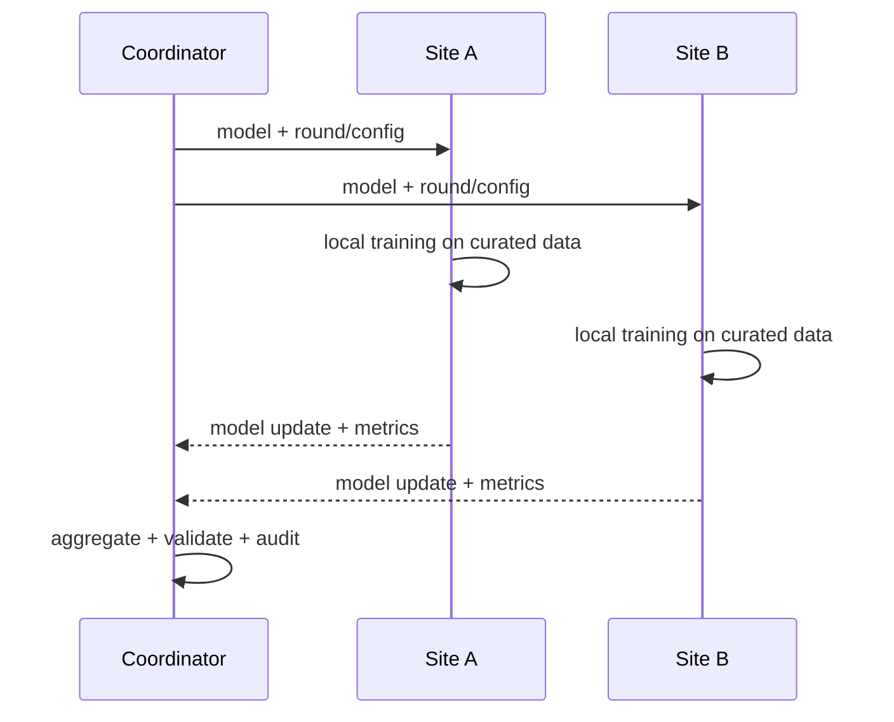

# 22. White paper tokovi i federativno učenje

**Prioritet: MORAŠ za razumevanje izvora. FL se ovde obrađuje samo teorijski; implementacija nije deo ovog materijala.** Ova strana zatvara teorijske teme iz dostavljenog white paper-a: provenance i lifecycle proprietary podataka, povezivanje strukture i svojstva, manufacturability, polymorph risk i federativno učenje.

Dostavljeni dokument *Maximising the Impact of Proprietary Structural Data* je CCDC white paper. On je koristan za problemski okvir i opis CCDC ekosistema, ali nije nezavisna evaluacija proizvoda, tehnička specifikacija naših aplikacija niti dokaz da će određeni ML metod raditi na našem skupu.

**Preduslov i uslovni nastavak:** poznaješ čvrste forme i granice referentnih signala iz [11](11-cvrste-forme.md) i [11A](11a-referentne-raspodele-hbp.md), [evaluaciju](20-evaluacija.md), [prava/poreklo](21-licence-fair.md) i osnovnu razliku pretrage i poređenja iz 18–19. Osnovni prolaz proverava granice naučnih tvrdnji; property i FL razradu produbljuj samo za izabrano pitanje, uz već savladane target, parametre modela, trening i validaciju iz ML osnova.

## 22.1 Četiri nivoa tvrdnje

Nemoj spajati sledeće rečenice:

1. **White paper kaže** da određeni tok ili alat može doneti korist.
2. **Zvanična dokumentacija** opisuje da funkcija postoji u određenom proizvodu/verziji.
3. **Nezavisan ili primarni rad** daje rezultat pod određenim skupom, metodom i ograničenjima.
4. **Naš test** potvrđuje dostupnost, dozvolu, tačnost i vrednost u konkretnom lokalnom okruženju.

Prva rečenica motiviše istraživanje. Tek četvrta može postati lokalni dokaz za ograničenu tvrdnju.

## 22.2 Obim izvora {#222-potpuna-mapa-22-strane-dokumenta}

Nastavne tvrdnje white paper-a nalaze se pre svega na stranama 3–18: proprietary podaci i provenance, structure–property veze, lifecycle/curation, federativno učenje i indikatori polymorph risk-a. Strane 1–2 i 19–22 jesu front/back matter, zaključak/testimonial, reference i kontakt, a ne nezavisna validacija. Teorija je obrađena u sekcijama 22.3–22.6 i povezanim poglavljima; konflikt embedded teksta i rendera analiziran je u [poglavlju 21](21-licence-fair.md).

## 22.3 Lifecycle stanja i dokazni status {#lifecycle-stanja}

White paper razlikuje sadržaj pre pune kuracije od sadržaja odobrenog za standardnu upotrebu. Prenosiva teorijska razlika je između primljenog izvora, tehnički parsiranog sadržaja, automatski validiranog nalaza, stručno pregledanog ili kuriranog zapisa i sadržaja odobrenog ili povučenog za određenu namenu. Nazivi i prelazi zavise od institucije.

`parser_ok` ne dokazuje hemijsku ispravnost, automatska validacija nije stručna ili policy odluka, a vendor oznaka kao „early access“ nije sama po sebi quality dokaz. Svako stanje ima smisla samo uz provenance, pravila, upozorenja, odgovornost, dozvoljeni scope i veze među verzijama.

## 22.4 Struktura–svojstvo nije običan SQL join po imenu

White paper ispravno naglašava da melting point, solubility ili stabilnost postaju korisniji kada su vezani za konkretnu strukturu/solid form. Pojmovno, jedna property opservacija povezuje identitet materijala i čvrste forme sa vrstom svojstva, vrednošću i jedinicom, uslovima, metodom, uzorkom, neizvesnošću i poreklom. Ovo je opis značenja opservacije, ne predlog YAML-a ili konkretne data schema-e.

Bez solid form-a, temperature, solvent/pH, metode i porekla dve brojke mogu izgledati uporedivo, a meriti različite pojave. Isto važi za melting point kada postoje raspad, solvat desolvation, različita brzina zagrevanja ili različit način prijavljivanja.

**Manufacturability** u white paper-u nije jedna fundamentalna skalarna osobina kristala. To je skup procesno zavisnih ishoda: mogućnost pouzdane kristalizacije i izolacije, filtrabilnost/sušenje, stabilnost forme, ponašanje čestica, flow/compaction i reproduktivnost procesa mogu doprinositi odluci. Zato neoznačen binarni pojam „manufacturable“ nema dovoljno naučno značenje bez definisanog procesa, uslova i ekspertskog protokola.

!!! example "Šta ML model zapravo predviđa"
    Umesto „predviđamo stabilnost“, napiši: „za definisanu solid-form familiju, temperaturu, measurement protocol i vremenski horizont rangiramo verovatnoću transformacije, uz dataset/version i calibration interval“. Uža tvrdnja je naučno testabilna.

## 22.5 Tri alata nisu oracle za polymorph risk

White paper na stranama 17–18 spaja više signala. Njihova uloga mora biti precizna:

| Signal | Šta može da pruži | Šta sam ne dokazuje |
|---|---|---|
| **Mogul/geometrijska distribucija** | koliko je bond length/angle/torsion tipičan u verzionisanom, filtriranom skupu sličnih fragmenata | energiju konformera, metastabilnost ili postojanje drugog polimorfa |
| **packing comparison** | sličnost lokalnih molecular clusters pod navedenim atom mapping-om, veličinom klastera, tolerancijama i tretmanom H/disorder-a | jednaku lattice energy, termodinamički poredak ili identitet faze u svim uslovima |
| **hydrogen-bond propensity** | statističku sklonost donor–acceptor parova i upozorenje da očekivana interakcija izostaje | da se veza mora formirati, da je postojeća forma nestabilna ili da je predložena packing alternativa ostvariva |

Mogul dokumentacija opisuje [knowledge-base geometrijsku analizu](https://downloads.ccdc.cam.ac.uk/documentation/API/descriptive_docs/molecular_geometry_analysis.html), a CSD Python API dokumentuje parametrizovanu [packing similarity](https://downloads.ccdc.cam.ac.uk/documentation/API/descriptive_docs/packing_similarity.html). To su implementation izvori; claim o stabilnosti i performansama zahteva poseban eksperiment. Worked primer izbora referentne populacije, robustnog outlier signala, kružnih torzija i celog HBP logistic/fitting/grouping toka nalazi se u [lekciji 11A](11a-referentne-raspodele-hbp.md).

Razuman evidence stack je:

```text
kuriran identitet forme
→ neuobičajena intra/intermolekulska geometrija kao signal
→ packing/contact poređenje kao strukturni kontekst
→ energy/thermodynamic i property analiza sa navedenim modelom
→ nezavisno izmereni PXRD/thermal/spectroscopic i ciljano crystallisation potvrđivanje
```

Nijedan korak ne sme da bude prećutno zamenjen prethodnim. Simulirani PXRD iz istog CIF-a je koristan derivat modela, ali nije nezavisan dokaz; [lekcija o difrakciji](10-difrakcija-kvalitet.md#simulirani-naspram-izmerenog-pxrd-a) navodi potreban kontekst merenja i simulacije. [GSK/CCDC rad](https://pubs.rsc.org/en/content/articlehtml/2021/ce/d1ce00665g) podržava užu tvrdnju da su se analizirani proprietary i javni skup razlikovali u relevantnom solid-form prostoru; ne dokazuje univerzalno povećanje tačnosti svakog polymorph predictor-a.

## 22.6 Federativno učenje, od mehanizma do threat model-a

Opis dve tražene aplikacije sam po sebi ne zahteva FL. Tema je ovde zato što zauzima strane 15–16 white paper-a i može postati važna ako više institucija želi zajednički model bez centralnog skladišta raw struktura.

### Osnovni tok

U najjednostavnijem FedAvg obrascu koordinator pošalje model \(w_t\) odabranim lokacijama. Lokacija \(k\) trenira lokalno i vraća \(w_{t+1}^{(k)}\) ili update. Koordinator računa težinski prosek:

\[
w_{t+1}=\sum_{k\in S_t}\frac{n_k}{\sum_{j\in S_t}n_j}\,w_{t+1}^{(k)},
\]

gde je \(S_t\) skup lokacija izabranih za rundu, a \(n_k\) veličina lokalnog trening skupa lokacije \(k\) korišćenog za taj update; ponavljanje istih primera kroz više epoha ne povećava ovaj broj. Model je skup usaglašenih numeričkih parametara \(w\), a update je njihova promena posle lokalnog učenja. Ako dve lokacije imaju 40 i 60 primera, njihove težine u ovom proseku su 0,4 i 0,6. Potrebni su ista arhitektura i isto značenje parametara/reprezentacija; ne mogu se proizvoljno prosečiti dva različito definisana modela. Originalni obrazac je [McMahan et al. 2017](https://proceedings.mlr.press/v54/mcmahan17a.html).



Raw CIF ne mora da napusti lokaciju, ali kroz mrežu i dalje prolaze model/update, metadata protokola, veličine/timing i metrike. Konačni model je takođe izvedeni artefakt.

### Zašto „podaci ostaju lokalno“ nije puna bezbednosna tvrdnja

| Rizik | Primer u ovom domenu | Potrebna vrsta kontrole |
|---|---|---|
| update/gradient leakage | retka struktura ili svojstvo utiču na update koji omogućava inferenciju | clipping, batching, leakage test; po potrebi formalni DP |
| honest-but-curious coordinator | server pokušava da vidi pojedinačni update | [secure aggregation](https://acmccs.github.io/papers/p1175-bonawitzA.pdf) pod jasno navedenim pretpostavkama |
| malicious participant | šalje poisoned update ili pokušava izvlačenje iz modela | authentication, robust aggregation gde je opravdana, anomaly test, incident response |
| final-model leakage | membership/property inference iz objavljenog modela | release review, access control, attack evaluation, DP kada utility dozvoljava |
| licence/IP | model ili embedding može biti ugovorno regulisan derivat | permission matrix i pisano odobrenje; tehnologija ne daje pravno pravo |
| endpoint compromise | lokalni worker, log ili cache otkrije raw data | izolacija, least privilege, secret management, retention i audit |

[Deep Leakage from Gradients](https://proceedings.neurips.cc/paper_files/paper/2019/file/60a6c4002cc7b29142def8871531281a-Paper.pdf) je konkretan dokaz da update informacije mogu otkriti trening input u određenim uslovima. Secure aggregation skriva pojedinačne update-e od koordinatora pod svojim threat model-om; ne štiti automatski endpoint, finalni model, malicious clients niti rešava licencu.

**Diferencijalna privatnost (DP)** postavlja formalnu granicu tome koliko se raspodela objavljenog izlaza može promeniti kada se doda ili ukloni jedna unapred definisana zaštićena jedinica. Parametri \(\varepsilon\) i \(\delta\) opisuju tu granicu; nisu procenat „privatnosti“ niti mera tačnosti modela. Najpre se mora odrediti da li štitimo jedan kristalografski zapis, celu familiju povezanih zapisa ili doprinos jedne institucije. Garancija za pojedinačni zapis ne postaje automatski garancija za celu instituciju.

U DP-SGD primeru **clipping** ograničava normu doprinosa gradijenta pojedinačnog primera, a zatim se dodaje odgovarajuće podešen slučajan šum i prati kumulativni gubitak privatnosti kroz korake učenja ([Abadi et al. 2016](https://research.google/pubs/deep-learning-with-differential-privacy/)). Sam clipping, grupisanje primera u batch ili proizvoljan šum nisu dokaz DP-a. Secure aggregation može sakriti pojedinačne doprinose tokom sabiranja; DP ograničava šta se može zaključiti iz objavljenog rezultata pod navedenom definicijom susednih skupova. Zbog toga se ove kontrole mogu dopunjavati.

### Hemijska heterogenost je centralni, ne sporedni problem

Za partnerske podatke ne sme se bez provere pretpostaviti IID — da su primeri nezavisni i potiču iz iste raspodele. Partneri mogu biti heterogeni zato što:

- imaju različite scaffold-e, metale, solid forms i razvojne faze;
- mere svojstva različitim protokolima i jedinicama;
- koriste različite parser/curation verzije;
- razlikuju se po veličini i missingness-u;
- label semantics mogu nositi lokalna, nekompatibilna značenja.

Smisleno federativno poređenje zahteva zajedničko značenje targeta, jedinica i uslova, identiteta materijala/solid form-a, reprezentacija, missing vrednosti i evaluacione populacije. FL nad neusaglašenim labelama samo efikasnije agregira nesporazum.

### Pitanja validnosti federativnog poređenja

Pre tumačenja rezultata moraju biti jasni threat model i učesnici, dozvoljeni artefakti i posledice povlačenja; kompatibilnost reprezentacija, modela i aggregation pravila; razlika između lokalnog, dozvoljenog centralnog i federativnog baseline-a; leakage-safe hemijski i vremenski split; globalni i per-site rezultat sa neizvesnošću; ponašanje pod non-IID, dropout, poisoning i leakage stresom; kao i odnos koristi prema jednostavnijim alternativama. Ovo su dimenzije naučne i bezbednosne validacije, ne plan treninga, deployment-a ili release-a.

FL je opravdan kada podaci zaista ne smeju da se centralizuju i kada dodatna složenost donosi merljivu korist. Nije cilj sam po sebi.

## 22.7 Granica prema dve aplikacije

Teme iz ovog poglavlja ograničavaju tumačenje dokaza, ali nisu same po sebi zahtevi za globalnu pretragu ili poređenje parova; te dve funkcije ne zahtevaju federativno učenje.

## 22.8 Provera znanja

1. Zašto early-access i main baza ne smeju biti samo dva foldera bez stanja i politike?
2. Koji minimum mora stajati uz solubility vrednost da bi structure–property veza imala smisla?
3. Da li Mogul „unusual torsion“ dokazuje visoku energiju ili metastabilnost?
4. Šta tačno napušta lokaciju u tipičnom FedAvg toku?
5. Zašto secure aggregation nije zamena za differential privacy, endpoint security ili licencu?

??? success "Odgovori"
    1. Downstream sistemi moraju znati quality/review stanje, dozvoljene upotrebe, verziju, prelaze i audit; folder ne daje tu semantiku.
    2. Identitet materijala i solid form-a, vrednost/jedinica, uslovi, metoda, uzorak/batch, poreklo i quality/uncertainty.
    3. Ne; to je odstupanje od referentne distribucije pod datim query/filter uslovima i signal za dalju proveru.
    4. Model/update i protokolarni metadata/metrics; raw podaci mogu ostati lokalno, ali to nije dokaz da ništa o njima ne curi.
    5. Svaka kontrola pokriva drugi threat model; nijedna sama ne daje univerzalnu privatnost ni pravno pravo.

**Kriterijum prolaza:** možeš da prevedeš ključne tvrdnje white paper-a u proverljiva pitanja i ograničene tvrdnje, odvojiš vendor claim od lokalnog dokaza i nacrtaš FL threat model bez rečenice „raw fajlovi ne odlaze, dakle privatno je“.
