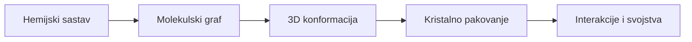

# Hemija koju 2CDC zaista traži

Ovo nije skraćeni fakultetski kurs hemije. Ovo je put od **nula predznanja** do sposobnosti da kao glavni ML inženjer donosiš naučno odbranjive odluke o sličnosti malih molekulskih kristalnih struktura.

Na kraju treba da umeš da pogledaš jedan CIF i razdvojiš najmanje pet pitanja koja se u svakodnevnom govoru sva zovu "da li su slični":

Dve strukture mogu imati istu formulu, a različit graf; isti graf, a različitu konformaciju; istu konformaciju, a različito pakovanje; ili gotovo isto pakovanje, ali različit kvalitet eksperimentalnog modela. Zato jedna univerzalna "hemijska udaljenost" ne postoji.

## Veza sa dostavljenim projektom

Dostavljena specifikacija zahteva dva različita režima:

| Režim | Primarni cilj | Razuman naučni obrazac |
|---|---|---|
| CIF protiv veoma velike baze | odziv i skalabilnost uz dobar odziv relevantnih kandidata | jeftini metapodaci i 2D/3D reprezentacije za dohvat, pa skuplje rangiranje |
| svi parovi u malom ulaznom skupu | maksimalno verodostojno poređenje | višeslojno poravnanje molekula, geometrije, pakovanja i interakcija |

Lokalni CSD izvozi fokusirani su na 18-atomsko DAP-derived query jezgro sa dve `C=N` veze i veliki broj zapisa sa metalima. Zbog toga su koordinaciona hemija, donorni atomi, denticitet i geometrija oko metala obavezne teme za razumevanje dostavljenog materijala. Da li je taj slice i domen finalnog proizvoda ili samo primer ostaje pitanje za fakultet.

## Put kroz knjigu

Tačan redosled i preduslove određuje [zajednička početnička putanja](https://github.com/nemper/crystallography-and-ml-theory/blob/main/ml-ai-strategy/docs/11-ml-ai-plan-ucenja.md). Najpre7 intuicija, zatim8–10 i povratak na7 periodične kontakte. [Nastavljeni primer Q–B–C–D](povezani-primer.md) povezuje odgovarajuće korake kroz oba kursa; pri prvom otvaranju pročitaj samo pitanje i objekte.

1. **Hemijski jezik** - atom, jon, formula, veza, formalno naelektrisanje, funkcionalna grupa i 3D geometrija.
2. **Koordinaciona hemija** - metal, ligand, donor, helat, koordinacioni broj i moguće geometrije.
3. **Kristalografija** - jedinična ćelija, frakcione koordinate, simetrija, periodičnost, difrakcija i kvalitet modela.
4. **Digitalna hemija** - šta CIF/MOL/MOL2/SDF/SMILES čuvaju, šta gube i zašto konverzija nije neutralna.
5. **Sličnost i aplikacije** - grafovi, otisci, deskriptori, poravnanje, pakovanje, evaluacija i dvofazna pretraga.

Ako želiš prvo da vidiš format nad kojim ćeš raditi, otvori [pun, anotiran i parsabilan CIF primer](12a-anatomija-cif.md). Za statistički deo polymorph-risk toka koristi [referentne raspodele, Mogul i HBP](11a-referentne-raspodele-hbp.md). Za granice tvrdnji i teorijske teme dostavljenog dokumenta koristi [pregled obima white paper-a](22-whitepaper-tokovi-fl.md).

Svako poglavlje ima isti ritam: intuitivna slika, precizna definicija, primer iz projekta, zamka, mini-vežba i kriterijum prolaza. Linkovi vode ka izvorima samo kada je korisno pročitati standard, videti interaktivnu ilustraciju ili ući u detalj koji bi nepotrebno produžio ovu knjigu.

## Brza slika lokalnih dokaza

| Artefakt | Šta iz njega znamo |
|---|---|
| white paper, 22 strane | kvalitet i standardizacija struktura, veze struktura-svojstvo, FAIR, CSD alati, pakovanje, polimorfni rizik i federativno učenje |
| `dve funkcionalnosti.txt` | jedan skalabilni globalni pretraživač i jedan precizni poređivač svih parova |
| `cu_n14_a.cif` | pun eksperimentalni CIF: monoklinična ćelija, P 21/c, frakcione koordinate, refleksije, refiniranje i struktura kvaliteta pogodnog za vežbu |
| `N14.mol` / `N14.mol2` | ista hemijska jedinka u dve molekulske reprezentacije sa različitom semantikom tipova veza i atoma |
| `search1.*` | 2.110 CSD zapisa iz lokalnog CSD 5.43/2022 snapshot-a koji zadovoljavaju podstrukturni upit za 18-atomsko DAP-derived jezgro sa dve `C=N` veze |
| `search2.*` | 2.038 od tih zapisa uz nepovezani `4M` uslov: metal je negde u entry-ju, ali query ne dokazuje metal–DAP koordinaciju |
| `tutorial-minimal.cif` | sintetički, redistributabilan CIF 1.1 primer za učenje sintakse; nije eksperiment ni CSD zapis |

!!! warning "Bitna granica"
    Repo ne sadrži CSD izvoze. [CCDC uslovi korišćenja](https://downloads.ccdc.cam.ac.uk/documentation/API/conditions_of_use.html) navode da su CSD komponente i izvedeni podskupovi vlasnički i da se ne redistribuiraju bez odgovarajućeg odobrenja. Sam prijem lokalnih fajlova ne dokazuje njihovu licencu ni dozvoljenu namenu: do potvrde vlasnika/controller-a, dozvoljenih operacija i odobrenog data-plane-a tretiraju se kao **restricted**.

## Šta je uspeh

Spreman si za projektovanje kada možeš bez nagađanja da:

- objasniš razliku između molekula, kristala i eksperimentalnog zapisa o kristalu;
- rekonstruišeš značenje ključnih CIF polja i prepoznaš problematične vrednosti;
- kažeš zašto 2D otisak ne meri kristalno pakovanje;
- definišeš odvojene relevantnosti za hemijski motiv, koordinaciono okruženje, konformaciju, pakovanje i interakcije;
- predložiš filtere, dohvat kandidata, precizno ponovno rangiranje i test-skup bez curenja skoro dupliranih CSD familija;
- svaku tvrdnju o "sličnosti" vežeš za eksplicitnu naučnu namenu i meru uspeha.

[Počni od načina rada →](kako-koristiti.md){ .md-button .md-button--primary }
