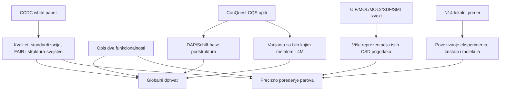
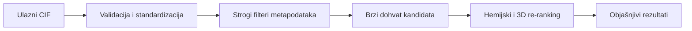

# Šta projekat zapravo traži

## Jedna reč, pet objekata

Reč "struktura" u projektu može značiti:

| Objekat | Minimalna informacija | Primer pitanja |
|---|---|---|
| hemijski sastav | elementi i njihov broj | imaju li istu sumarnu formulu? |
| molekulski graf | atomi, veze, redovi veza, naelektrisanja | sadrže li isti DAP/Schiff-base motiv? |
| konformer | graf plus 3D raspored unutar molekula | da li se razlikuje torzioni ugao? |
| kristalna struktura | ćelija, simetrija, frakcione koordinate, periodičnost | pakuju li se molekuli na isti način? |
| eksperimentalni model | kristalna struktura plus poreklo, neizvesnost i kvalitet | da li je razlika realna ili posledica nereda/merenja? |

To nisu zamenljive reprezentacije. SMILES uglavnom opisuje molekulski graf, MOL2 može čuvati 3D koordinate i dodeljene atom-tipove, a CIF može opisati periodični kristal i eksperiment. Konverzija CIF → SMILES odbacuje ćeliju i pakovanje; generisanje 3D koordinata iz SMILES-a stvara predikciju, ne vraća eksperimentalni kristal.

## Dokazni lanac iz lokalnih fajlova

White paper nije tehnička specifikacija algoritma. On pouzdano postavlja principe: kustosiranje, standardni atom- i bond-tipovi, dosledne jedinice, metapodaci, veze struktura-svojstvo i kontrola kvaliteta. Tvrdnje o konkretnim indeksima, vektorskoj bazi ili graf-neuronskoj mreži zato su **projektantske hipoteze** koje tek treba eksperimentalno proveriti.

## Dve aplikacije nisu isti sistem sa drugim dugmetom

### A. Globalna pretraga

Za bazu reda miliona struktura ne može se za svaki upit odmah raditi najskuplje kristalno poravnanje sa svakim zapisom. Razuman koncept je kaskada:

Filter nije samo optimizacija. Pitanje "sličan u kom smislu?" određuje da li smeju da se mešaju organska jedinjenja i metalni kompleksi, soli i neutralne forme, polimerne i diskretne strukture, uređeni i neuređeni modeli ili merenja veoma različitog kvaliteta.

### B. Poređenje svih parova

Za \(n\) ulaza postoji \(n(n-1)/2\) neuređenih parova. Deset fajlova daje 45, sto daje 4.950, a hiljadu 499.500 parova. "Mali skup" zato nije dozvola za neograničen algoritam.

Ovde ipak možemo koristiti bogatiji profil:

- identitet i zajednički podgraf;
- koordinaciono okruženje metala;
- dužine veza, uglove i torzije uz neizvesnost;
- 3D poravnanje konformera;
- lokalna pakovanja i periodični susedi;
- mreže vodoničnih i drugih usmerenih interakcija;
- po potrebi simulirani difrakcioni obrazac.

Rezultat treba da bude **vektor objašnjenja**, ne samo jedan skor. Jedna agregatna vrednost može postojati za rangiranje, ali korisnik mora videti zašto je par visoko rangiran.

## Najveći naučni rizici

1. **Pogrešna jedinica poređenja.** CSD entry, CIF data block, komponenta, molekul, formula unit i kristal nisu sinonimi.
2. **Lažna preciznost.** RMSD bez definicije atomskog mapiranja, periodične slike, superpozicije i tretmana vodonika nema stabilno značenje.
3. **Informacioni gubitak.** Format-konverzija može promeniti aromatičnost, red veze, protonaciju, koordinacionu vezu ili stereokemiju.
4. **Loš kvalitet kao signal sličnosti.** Disorder, parcijalna occupancy ili propušteni H atomi mogu dominirati deskriptorom.
5. **Curenje familija.** Različiti CSD refkodovi iz iste publikacije, redeterminations ili polimorfne familije mogu završiti i u treningu i u testu.
6. **Neodređen ground truth.** Dva stručnjaka mogu pod "slično" misliti na isti ligand, isti metalni poliedar ili isto pakovanje.
7. **Licenca.** Tehnički moguć izvoz i indeksiranje nisu automatski pravno dozvoljeni za novu aplikaciju.

Sledeća poglavlja grade znanje kojim se svaki od ovih rizika pretvara u proverljiv projektantski zahtev.

