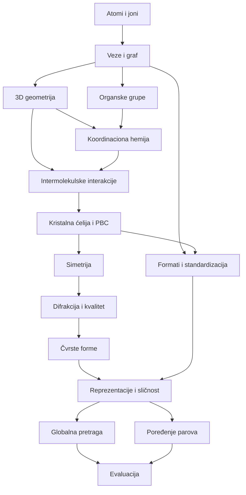

# Plan učenja

## Preporučena putanja od 14 nedelja

| Nedelja | Fokus | Ishod koji moraš demonstrirati | Sati |
|---:|---|---|---:|
| 1 | atomi, elementi, joni, formule, količine i jedinice | čitaš formulu i razlikuješ element, atom, jon, molekul i formula unit | 6 |
| 2 | elektroni, valenca, Lewis, veze, formalni naboj i rezonanca | crtaš jednostavan graf i objašnjavaš zašto bond order može biti dodela | 7 |
| 3 | 3D geometrija, polaritet, stereokemija, konformeri | meriš i tumačiš dužinu, ugao, torziju, RMSD i hiralnost | 7 |
| 4 | funkcionalne grupe, aromatičnost, kiseline/baze, tautomeri | prepoznaješ projektno relevantne grupe i normalizacione rizike | 7 |
| 5 | koordinaciona hemija | određuješ metal, donor, ligand, denticitet, oksidaciono stanje i geometriju | 8 |
| 6 | DAP/Schiff-base domen i lokalni upiti | rekonstruišeš nameru `search1` i `search2` bez mešanja motiva i metalnog uslova | 6 |
| 7 | intermolekulske interakcije i pakovanje | razlikuješ intra/intermolekulsko i gradiš lokalni interaction graph | 7 |
| 8 | ćelija, kristalni sistemi, frakcione koordinate i PBC | rekonstruišeš periodične susede i pretvaraš frakcione u kartezijanske koordinate | 9 |
| 9 | simetrija, space group, ASU, Z/Z' | čitaš P 21/c i razlikuješ ASU, ćeliju i superćeliju | 8 |
| 10 | XRD, Bragg, refiniranje, neizvesnost, disorder i kvalitet | tumačiš ključna polja `cu_n14_a.cif` bez proglašavanja R faktora za istinu | 9 |
| 11 | polimorfi, soli, kokristali, solvates/hydrates | formiraš solid-form familije i objašnjavaš vezu struktura-svojstvo | 7 |
| 12 | formati i standardizacija | praviš tabelu očuvane/izgubljene informacije pri svakoj konverziji | 7 |
| 13 | grafovi, deskriptori i hijerarhijska sličnost | biraš reprezentaciju i metriku prema pitanju, ne prema popularnosti modela | 8 |
| 14 | evaluacija obe aplikacije i završni mini-projekat | braniš protokol pred hemičarem, kristalografom i ML recenzentom | 10 |

Ukupno: približno 106 sati. Brži tempo spaja po dve susedne nedelje, ali ne izbacuje laboratorije.

## Zavisnosti između modula

## Šta svesno ne učimo sada

Sledeće oblasti nisu potrebne za prvu fazu projekta i ne treba da ti pojedu vreme:

- detaljni mehanizmi organskih reakcija i laboratorijska sinteza;
- kompletna termodinamika gasova i rastvora;
- kvantnohemijske derivacije Hartree-Fock/DFT metoda;
- spektroskopija NMR/IR/MS osim osnovne svesti o izvoru podataka;
- biohemija, enzimska kinetika i makromolekulska kristalografija;
- detaljno rešavanje strukture iz sirovih difrakcionih slika;
- memorisanje svih 230 prostornih grupa;
- crystal field teorija u dubini, ligand-field multipleti i magnetizam, osim ako svojstva postanu cilj;
- reakcioni SMIRKS i predikcija reakcija;
- generativna kristalna struktura kao primarni cilj.

Ove teme se vraćaju samo ako ih konkretan zahtev, podatak ili hipoteza u projektu učini relevantnim.

## Nedeljni ritual

Na kraju svake nedelje napravi jednu stranicu beležaka sa tačno četiri sekcije:

1. **Znam da objasnim** - najviše pet pojmova.
2. **Znam da izmerim/izvučem** - polja ili deskriptori iz fajla.
3. **Još mogu da pogrešim** - konkretna zamka.
4. **Posledica za arhitekturu** - jedna odluka ili eksperiment.

To postaje projektantski dnevnik i kasnije deo metodologije disertacije.

