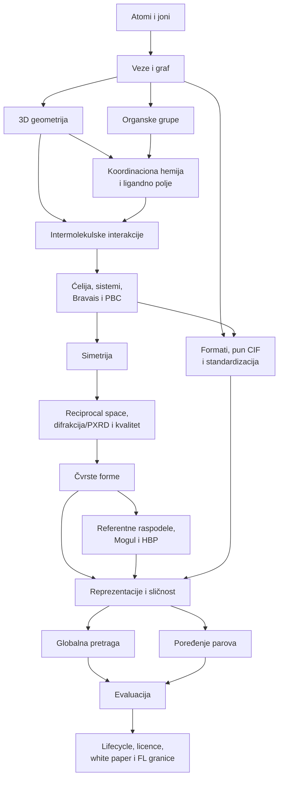

# Plan učenja

## Preporučena putanja od 15 nedelja

| Nedelja | Fokus | Ishod koji moraš demonstrirati | Sati |
|---:|---|---|---:|
| 1 | atomi, elementi, joni, formule, količine i jedinice | čitaš formulu i razlikuješ element, atom, jon, molekul i formula unit | 6 |
| 2 | elektroni, valenca, Lewis, veze, formalni naboj i rezonanca | crtaš jednostavan graf i objašnjavaš zašto bond order može biti dodela | 7 |
| 3 | 3D geometrija, polaritet, stereokemija, konformeri | meriš i tumačiš dužinu, ugao, torziju, RMSD i hiralnost | 7 |
| 4 | funkcionalne grupe, aromatičnost, kiseline/baze, tautomeri | prepoznaješ projektno relevantne grupe i normalizacione rizike | 7 |
| 5 | koordinaciona hemija i minimalno ligandno polje | određuješ metal, donor, ligand, denticitet, oxidation state/\(d^n\), spin/Jahn–Teller hipotezu i geometriju bez preteranog zaključka | 9 |
| 6 | DAP/Schiff-base domen i lokalni upiti | rekonstruišeš nameru `search1` i `search2` bez mešanja motiva i metalnog uslova | 6 |
| 7 | intermolekulske interakcije i pakovanje | razlikuješ intra/intermolekulsko i gradiš lokalni interaction graph | 7 |
| 8 | ćelija, 7 sistema/14 Bravaisovih tipova, frakcione koordinate i PBC | normalizuješ system/setting i rekonstruišeš periodične susede bez metričke/simetrijske zabune | 10 |
| 9 | simetrija, space group, ASU, Z/Z' | čitaš P 21/c i razlikuješ ASU, ćeliju i superćeliju | 8 |
| 10 | reciprocal space, \(hkl\), XRD/PXRD, refiniranje, neizvesnost i kvalitet | izvodiš \(hkl\to d\to2\theta\), razlikuješ simulated/measured PXRD i tumačiš `cu_n14_a.cif` bez jednog „quality“ praga | 11 |
| 11 | čvrste forme, referentne raspodele, Mogul i HBP | formiraš solid-form familije i tumačiš outlier/propensity/grouping bez prevođenja u energiju ili polymorph verovatnoću | 10 |
| 12 | formati, puna CIF anatomija i standardizacija | čitaš ceo sintetički CIF i praviš tabelu očuvane/izgubljene informacije pri svakoj konverziji | 8 |
| 13 | grafovi, deskriptori i hijerarhijska sličnost | biraš reprezentaciju i metriku prema pitanju, ne prema popularnosti modela | 8 |
| 14 | obe aplikacije, evaluacija, licenca i FAIR | projektuješ retrieval/rerank i pair-comparison tok sa leakage-safe evaluacijom i dozvoljenim data plane-om | 8 |
| 15 | svih 22 strana white paper-a, lifecycle/FL granice i završni mini-projekat | braniš state contract, evidence granice i kompletan protokol pred hemičarem, kristalografom i ML recenzentom | 10 |

Ukupno: približno **122 sata**, uključujući mini-vežbe i praktikum. Brži tempo spaja po dve susedne nedelje, ali ne izbacuje laboratorije niti tri obavezne remediation strane: [11A — referentne raspodele/HBP](../kristali/11a-referentne-raspodele-hbp.md), [12A — pun CIF](../podaci/12a-anatomija-cif.md) i [22 — potpuna white-paper mapa](../projekat/22-whitepaper-tokovi-fl.md).

## Zavisnosti između modula

## Šta svesno ne učimo sada

Sledeće oblasti nisu potrebne za prvu fazu projekta i ne treba da ti pojedu vreme:

- detaljni mehanizmi organskih reakcija i laboratorijska sinteza;
- kompletna termodinamika gasova i rastvora;
- kvantnohemijske derivacije Hartree-Fock/DFT metoda;
- spektroskopija NMR/IR/MS osim osnovne svesti o izvoru podataka;
- biohemija, enzimska kinetika i makromolekulska kristalografija;
- detaljno rešavanje strukture iz sirovih difrakcionih slika, iako učimo potreban reciprocal/PXRD interpretativni most;
- memorisanje svih 230 prostornih grupa;
- crystal/ligand-field teorija u dubini, multipleti, spektroskopija i magnetizam; obavezni minimum \(d\)-cepanja, spin/Jahn–Teller i strukturne posledice ipak ostaje;
- reakcioni SMIRKS i predikcija reakcija;
- generativna kristalna struktura kao primarni cilj.

Ove teme se vraćaju samo ako ih konkretan zahtev, podatak ili hipoteza u projektu učini relevantnim.

## Nedeljni ritual

Na kraju svake nedelje napravi jednu stranicu beležaka sa tačno četiri sekcije:

1. **Znam da objasnim** - najviše pet pojmova.
2. **Znam da izmerim/izvučem** - polja ili deskriptori iz fajla.
3. **Još mogu da pogrešim** - konkretna zamka.
4. **Posledica za arhitekturu** - jedna odluka ili eksperiment.

To postaje projektantski dnevnik i kasnije deo metodologije disertacije.
