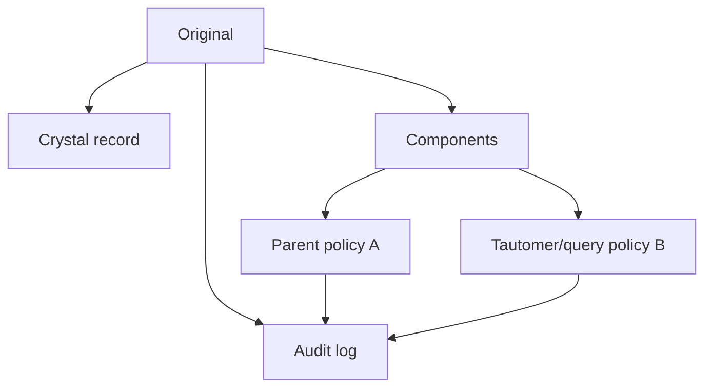

# 13. Standardizacija bez gubitka značenja

**Prioritet: MORAŠ.** Najskuplje greške često ne nastaju u modelu već pre njega, kada različite hemijske forme budu nevidljivo spojene ili jedna forma pogrešno rastavljena.

## 13.1 Normalizacija nije isto što i „popravi molekul“

Ovde koristimo precizne radne termine:

- **parsiranje**: tekst/bajtovi → strukturisan objekat;
- **validacija**: provera sintakse, rečnika, hemijske i kristalografske konzistentnosti;
- **normalizacija**: tehničko ujednačavanje koje treba da očuva značenje;
- **standardizacija**: izbor projektne konvencije, npr. kako tretirati soli ili tautomere;
- **kuracija**: stručna odluka potkrepljena izvorom i tragom izmene.

Standardizovani prikaz nije „istinitiji original“. On je pogled namenjen određenom pitanju.

## 13.2 Četiri paralelna pogleda

Umesto jednog mutabilnog objekta, čuvaj:

| Pogled | Sadržaj | Tipična upotreba |
|---|---|---|
| original | verna ulazna datoteka i parser output | audit, ponovljivost |
| crystal | komponente, ćelija, simetrija, disorder, packing | solid-form i packing poređenje |
| molecular/component | svaka hemijska komponenta sa nabojem i vezama | substructure i interakcije |
| parent/query | dokumentovano uklonjeni solventi/counterions ili normalizovani tautomer | brzi retrieval, nikad jedini zapis |



## 13.3 Redosled sigurnog pipeline-a

1. **Identifikuj datoteku** po sadržaju, ne samo ekstenziji; sačuvaj hash.
2. **Parsiraj bez prepisivanja originala** i sakupi sva upozorenja.
3. **Validiraj CIF prema rečniku** i osnovnim numeričkim/relacionim pravilima.
4. **Inventariši komponente**: glavna organska vrsta, metal, counterion, coformer, solvent, voda.
5. **Sačuvaj formalne naboje i protonaciju** pre bilo kakve parent transformacije.
6. **Obradi disorder i occupancy** kao eksplicitnu neizvesnost, ne kao duplikate atoma.
7. **Dodeli/oceni veze** uz izvor pravila i confidence; metalne veze tretiraj posebno.
8. **Primeni task-specific policy** nad kopijom.
9. **Ponovo izračunaj** formulu, charge balance i druge invariants.
10. **Upiši provenance**: alat, verzija, parametri, timestamp, warnings i pre/posle hash.

## 13.4 Identitet ima hijerarhiju

„Isto jedinjenje“ može značiti različito:

```text
hemijski scaffold
└── konkretna molekulska/protonaciona vrsta
    └── sastav čvrste forme (salt/solvate/co-crystal)
        └── polymorph/phase
            └── pojedinačno kristalografsko određivanje
```

Dva CSD refcode-a mogu biti ponovljena određivanja iste forme, različiti polymorphs, različiti solvates, različite temperature ili različite komponente iste compound family. Duplikat za jedan ML cilj može biti validan zaseban primer za drugi.

## 13.5 Najopasnije transformacije

### Uklanjanje „malih fragmenata“

Najveći fragment nije nužno jedini relevantan. Mali halid može balansirati charge i oblikovati packing; voda može biti član H-bond mreže; metal može imati malo atoma, ali biti centar kompleksa.

### Neutralizacija

Automatsko dodavanje/uklanjanje H može promeniti ligand donor status, ukupan charge, salt identitet i H-bond mrežu. Parent-scaffold prikaz sme postojati samo uz očuvan original.

### Aromatičnost i tautomer

Aromatičnost je model koji toolkit percipira. Tautomer canonicalization menja formalne single/double veze i položaj H. Fingerprint score može zato zavisiti od policy-ja, a ne samo od hemijske bliskosti.

### Metal-ligand povezanost

Organski valence modeli često nisu dovoljni za koordinacione spojeve. Ne treba nasilno popravljati svaku neuobičajenu valencu brisanjem veze. Čuvaj i eksperimentalnu geometriju i eksplicitno poreklo connectivity modela.

### Disorder i occupancy

Alternativne pozicije nisu dve istovremene pune kopije. Ako dve pozicije occupancy 0.5 pretvoriš u dva puna atoma, masa, kontakti i graf postaju pogrešni.

CCDC opisuje neke praktične posledice disorder-a u [CSD Python API dokumentaciji](https://downloads.ccdc.cam.ac.uk/documentation/API/descriptive_docs/disorder.html).

## 13.6 Missing, unknown i not applicable

Nikada ne spajaj sledeće u broj nula:

- nije izmereno;
- nije prijavljeno;
- parser ne podržava;
- algoritam nije uspeo;
- osobina nije primenljiva;
- pouzdano je izmerena vrednost 0.

Za svaki feature čuvaj value, unit, missing-reason, method i confidence. ML model inače može učiti ponašanje parsera ili laboratorije umesto hemije.

## 13.7 Invariants i testovi

Posle svake transformacije automatski proveri ono što bi trebalo da ostane isto:

- broj i identitet elemenata, osim eksplicitno prijavljenih uklonjenih komponenti;
- formalni total charge i charge balance;
- atom map između originala i derivata;
- stereocentri koji nisu cilj transformacije;
- formula/molecular weight u skladu sa sastavom;
- kristalna ćelija i symmetry netaknuti u crystal pogledu;
- deterministic output za istu verziju pravila.

!!! example "Regression primeri iz lokalnog skupa"
    - `N14.mol2`: `NO_CHARGES` ne sme postati dokaz o nultoj polarizaciji.  
    - `N14.mol` i `.mol2`: različit bond typing ne sme neopaženo dati dva „ground truth“ identiteta.  
    - `cu_n14_a.cif`: reč `Cu` iz imena/zračenja ne sme ući u element filter.  
    - metalni query: prisustvo `4M` atoma u zapisu ne sme automatski postati etiketa „DAP koordinira metal“.

## 13.8 Verzije i reproducibilnost

Svaki standardization profile ima identitet, npr.:

```yaml
profile: ligand-retrieval-v1
remove_components: [recognized_crystallization_solvent]
preserve_metals: true
preserve_formal_charge: true
tautomer_policy: none
aromaticity_model: toolkit-X-2026.03
```

Promena toolkita ili pravila zahteva novu verziju i reindeksiranje. Stari embeddings/fingerprints bez feature provenance nisu uporedivi sa novim samo zato što imaju isti broj dimenzija.

## 13.9 Provera znanja

1. Zašto ne treba menjati originalni zapis „in place“?
2. Kada je uklanjanje solventa korisno, a kada štetno?
3. Zašto disorder atom occupancy 0.5 nije pola elementa niti dva atoma?
4. Koja je razlika između unknown i measured zero?
5. Zašto ista standardizacija nije optimalna za scaffold i packing search?

??? success "Odgovori"
    1. Gubi se dokaz, mogućnost audit-a i ponovnog izvođenja drugim pravilima.  
    2. Može pomoći parent-scaffold retrieval-u; šteti solid-form/interaction analizi gde solvent učestvuje u strukturi.  
    3. To je model alternativne ili delimične zauzetosti kristalografskog mesta; mora ostati vezan za disorder model.  
    4. Prvo nema poznatu vrednost, drugo je rezultat sa vrednošću nula.  
    5. Scaffold želi kontrolisano ignorisati neke komponente/formalne prikaze; packing zavisi upravo od punog sastava i periodične geometrije.

**Kriterijum prolaza:** možeš da nacrtaš loss-aware pipeline i za svaku transformaciju navedeš cilj, rizik, invariant i način povratka do originala.
