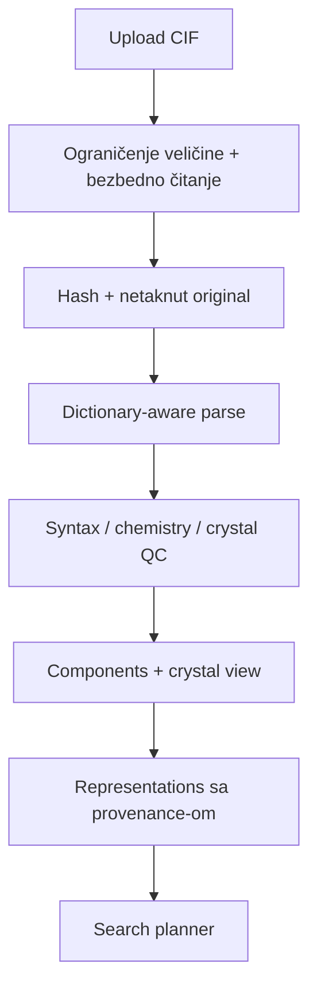

# 18. Globalna pretraga: projektantski nacrt

**Cilj prve aplikacije:** korisnik učitava jedan CIF, zadaje filtere i dobija rangirane, objašnjene CSD kandidate sa jasno navedenim nivoom sličnosti, kvalitetom i pravima pristupa.

Ovo nije „jedan embedding + vector DB“. Pouzdana pretraga je kaskada hemijskih i kristalografskih prikaza.

## 18.1 Ugovor proizvoda pre modela

Za svaki search mode eksplicitno definisati:

| Polje | Primer |
|---|---|
| objekat pretrage | glavni ligand / ceo coordination entity / puna crystal form |
| relevantnost | isti scaffold, sličan metal environment, sličan packing… |
| obavezne razlike | charge, stereo, metal, solid form, disorder |
| filter semantika | element u formuli vs koordinisan metal |
| evidence | matched subgraph, atom mapping, score components |
| abstention | nema pouzdanog grafa; nema 3D; ambiguous disorder |

Prva verzija treba da ponudi odvojene modove umesto neobjašnjivog univerzalnog dugmeta „similar“.

## 18.2 Ingest ulaznog CIF-a



Ingest report mora da pokaže:

- koji data block je izabran i zašto;
- formula/atom-site/component konzistentnost;
- ćeliju, symmetry, occupancy/disorder i coordinate availability;
- šta je direktno iz CIF-a, šta izvedeno, a šta dodeljeno;
- warnings i koje search modes oni onemogućavaju;
- hash i parser/profile verziju.

Ako CIF sadrži velike refleksione ili ugrađene text blokove, parser ih ne treba slati u ML prompt/model niti pretvarati u hemijske tokene.

## 18.3 Filter semantika

UI ne sme imati nejasan filter „metal: Cu“ bez nivoa. Korisnik bira, na primer:

- Cu prisutan u punoj entry formuli;
- Cu u coordination entity;
- Cu direktno koordinisan ciljnom ligandu;
- Cu kao counterion/odvojena komponenta;
- exclude/include solvents and coformers;
- required/forbidden elements u parent graph-u ili punom sastavu;
- quality/3D/disorder/temperature criteria.

Filter prikazuje i broj kandidata pre/posle svakog koraka, pa je query objašnjiv.

## 18.4 Višeslojni indeks

| Sloj | Indeks/ključ | Namena |
|---|---|---|
| provenance | refcode, release, hash, permission | identitet i audit |
| metadata | elementi, formula, components, quality flags | jeftini exact/range filteri |
| 2D graph | fingerprint + substructure index | širok candidate recall |
| coordination | metal, donor set, CN/geometry features | complexes search |
| 3D molecule | conformer/shape features | geometric rerank |
| crystal | standardized cell + packing/contact representation | solid-form search |

Svaki indeks ima `representation_version`. Promena standardization ili feature pravila pokreće novu generaciju indeksa; stari i novi score-ovi se ne mešaju.

## 18.5 Candidate generation i reranking

Predložena kaskada:

1. access-control i hard metadata filter;
2. exact/substructure provera ako je tražena;
3. visok-recall fingerprint/ANN candidate generation;
4. exact graph/MCS reranking;
5. coordination/geometric reranking;
6. packing/interaction analysis samo za dovoljno kvalitetne 3D candidates;
7. score calibration i explanation assembly.

ANN candidate generation i konačni proizvod ne mere se istim recall-om:

- **ANN candidate recall@N prema exact/high-cost pretrazi** meri koliko kandidata iz referentnog skupa, dobijenog nad istim dozvoljenim korpusom i uz iste hard filtere, preživi aproksimativnu fazu. To je test gubitka infrastrukture; exact skup nije samim tim ekspertski ground truth relevantnosti.
- **End-to-end recall@k prema ekspertskoj relevantnosti** meri koliko ekspertski potvrđenih relevantnih zapisa završi u prvih `k` rezultata posle svih filtera, candidate generation-a i reranking-a. To je metrika naučnog/proizvodnog claim-a.

Za obe metrike unapred fiksirati `N`/`k`, korpus, denominator i postupanje sa upitima bez relevantnog zapisa. Brzina bez izmerene propuštenosti nije validacija, ali ni visok ANN candidate recall ne dokazuje da je konačni ranking hemijski relevantan.

## 18.6 Rezultat nije samo lista refcode-ova

Svaki hit treba da ima karticu:

```text
identitet i sastav
CSD release / provenance / dozvola
match mode + rank
2D matched atoms / common subgraph / coverage
metal + mapped donors + coordination comparison
3D mapping + RMSD + policy
packing/interactions + parameters, ako dostupno
quality compatibility + missing data
razlozi za rezultat i warnings
link/download samo ako licenca dozvoljava
```

Score bez explanation-a ne omogućava stručnjaku da otkrije da je rezultat visok samo zbog velikog zajedničkog aromatičnog dela, a ključni metal environment različit.

## 18.7 Failure-aware ponašanje

| Problem | Ispravno ponašanje |
|---|---|
| nema ćelije/symmetry | dozvoli 2D, onemogući packing uz razlog |
| nepoznate/`un` veze | ograniči fingerprint/MCS ili koristi low-confidence graph |
| više komponenti | traži component selection; sačuvaj pun crystal |
| disorder | prikaži alternative/occupancies; ne dupliraj pune atome |
| nepoznata stereo | ne tretiraj kao tačno podudaranje definisane stereo |
| metal connectivity ambiguous | vrati candidate/ambiguous, ne tvrdi coordinated match |
| out-of-license rezultat | ne izlaži strukturu/download; vrati dozvoljeni metadata odgovor |

## 18.8 Skaliranje i skladištenje

- raw licensed store ostaje odvojen od derived feature store-a;
- relational/document metadata i graph/feature objekti imaju zajednički immutable entry/version ID;
- vector index je izvedeni cache, ne source of truth;
- batch build je idempotent i može da se nastavi nakon greške;
- promene CSD release-a daju diff: added/modified/withdrawn i selective reindex;
- query i result logs ne smeju neovlašćeno iznositi proprietary structures;
- expensive reranks se cache-uju po `(query_rep_hash, target_version, metric_version)`.

## 18.9 MVP po naučnom riziku

### Faza A — bez CSD pristupa

- parser/validator nad odobrenim i synthetic fixtures;
- loss-aware representations;
- query contract, provenance i report UI;
- exact local filters i testovi invarijansi.

### Faza B — odobreni pilot snapshot

- 2D retrieval baseline;
- component/metal classification sa expert audit-om;
- hard-negative evaluation set;
- latency i recall benchmark.

### Faza C — 3D i crystal reranking

- mapped geometry;
- coordination environment;
- licensed packing comparison ili validirana alternativa;
- missing/quality-aware abstention.

### Faza D — operativna globalna pretraga

- release synchronization;
- access enforcement;
- monitoring drift-a, coverage-a i query slice grešaka;
- stručna change-control procedura.

## 18.10 Acceptance kriterijumi

- 100% ulaza dobija parse status; nijedna greška se ne pretvara u tih prazan rezultat.
- Originalni hash i sve transformacije su dostupni za audit.
- Search mode i filter scope su vidljivi korisniku.
- ANN candidate recall@N prema exact/high-cost candidate skupu dostiže unapred dogovoren infrastrukturni prag.
- End-to-end recall@k prema ekspertski definisanoj relevantnosti zasebno dostiže prag, uz unapred definisan interval poverenja i prihvatljiv rezultat najlošijeg kritičnog slice-a.
- Svaki prikazani score ima verziju, parametre i objašnjive evidence.
- Nema tvrdnje o packing-u bez validne ćelije/symmetry i dovoljnog 3D kvaliteta.
- License tests blokiraju nedozvoljen bulk export/download.

## 18.11 Provera znanja

1. Zašto vector database nije source of truth?
2. Šta znači Cu filter na četiri različita nivoa?
3. Kada se packing reranker mora preskočiti?
4. Kako meriš kvalitet ANN candidate generation-a?
5. Zašto svaki indeks ima representation version?

??? success "Odgovori"
    1. Sadrži izvedene, verzionisane i potencijalno lossy features; original/provenance žive drugde.  
    2. Prisustvo u entry formuli, u entity-ju, direktna koordinacija ligandu ili odvojena komponenta/counterion.  
    3. Kada nema validne ćelije/symmetry/3D ili je quality/representation nedovoljna.  
    4. Recall-om prema exact ili skupljem referentnom retrieval-u, ukupno i po slice-ovima.  
    5. Promena hemijskog modela/parametara menja features i score semantiku.

**Kriterijum prolaza:** možeš da odbraniš data contract i svaku fazu retrieval kaskade pred hemičarem, kristalografom, ML inženjerom i licencnim vlasnikom.
