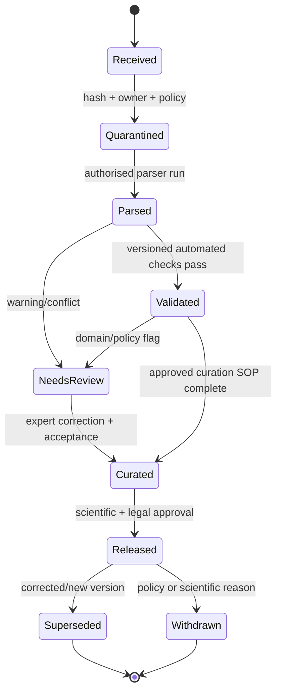
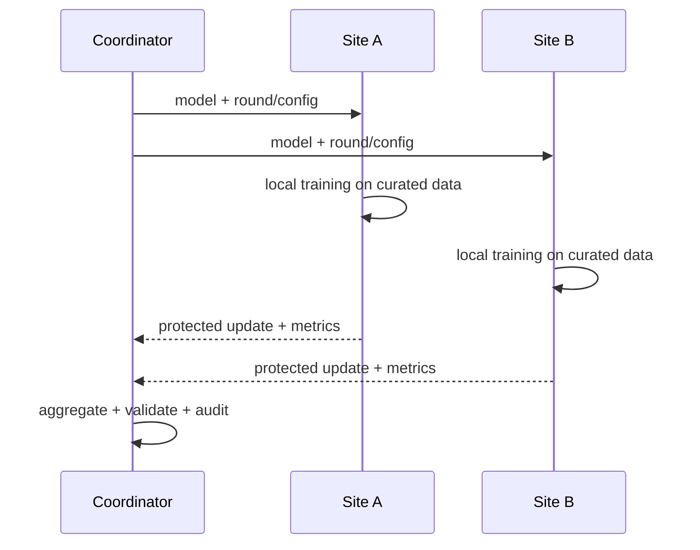

# 22. White paper tokovi i federativno učenje

**Prioritet: MORAŠ za razumevanje izvora; NE MORAŠ odmah implementirati FL.** Ova strana zatvara teme iz dostavljenog white paper-a koje nisu čista hemija: lifecycle proprietary podataka, product/workflow pojmove, povezivanje strukture i svojstva, manufacturability i federativno učenje.

Dostavljeni dokument *Maximising the Impact of Proprietary Structural Data* je CCDC white paper. On je koristan za problemski okvir i opis CCDC ekosistema, ali nije nezavisna evaluacija proizvoda, tehnička specifikacija naših aplikacija niti dokaz da će određeni ML metod raditi na našem skupu.

## 22.1 Četiri nivoa tvrdnje

Nemoj spajati sledeće rečenice:

1. **White paper kaže** da određeni tok ili alat može doneti korist.
2. **Zvanična dokumentacija** opisuje da funkcija postoji u određenom proizvodu/verziji.
3. **Nezavisan ili primarni rad** daje rezultat pod određenim skupom, metodom i ograničenjima.
4. **Naš test** potvrđuje dostupnost, dozvolu, tačnost i vrednost u konkretnom deployment-u.

Prva rečenica motiviše istraživanje. Tek četvrta može postati acceptance evidence za naš sistem.

## 22.2 Potpuna mapa 22 strane dokumenta

Broj strane je fizički redosled u dostavljenom PDF-u.

| Strane | Tema u dokumentu | Gde je teorija obrađena | Granica dokaza |
|---:|---|---|---|
| 1 | naslovna strana | ova mapa | nema naučne tvrdnje; embedded text extractor prikazuje i nevidljiv, tematski nepodudaran docking tekst |
| 2 | sadržaj | ova mapa | navigaciona strana, ne dokaz |
| 3–4 | curated proprietary structural data, metadata, provenance, structure–property veze, digitalizacija; solubility, stability, manufacturability; najava FL | [standardizacija](../podaci/13-standardizacija.md), [FAIR/licence](21-licence-fair.md), sekcije 22.4–22.6 | executive summary je program rada, ne validaciona studija |
| 5 | FAIR, data silos, identifikatori, legacy izvori i verzije | [21. Licence, FAIR i poreklo](21-licence-fair.md) | FAIR ne znači open, kvalitetno ili licencno slobodno |
| 6 | posledice lošeg data management-a za odluke i ML | [evaluacija](20-evaluacija.md), [provenance](21-licence-fair.md) | citirana novčana procena nije procena troška ovog projekta |
| 7 | javni CSD + proprietary podaci i iteracija data → insight → eksperiment | [CSD tok](16-csd-conquest.md), [lokalni skup](17-lokalni-skup.md) | kombinovanje izvora ne uklanja selection bias niti licencu |
| 8–9 | focused subsets, razlika javnog i internog prostora, curation, atom/bond typing, geometrijske distribucije i intermolekulske interakcije | [interakcije](../kristali/07-interakcije.md), [čvrste forme](../kristali/11-cvrste-forme.md), [standardizacija](../podaci/13-standardizacija.md), sekcija 22.5 | „unusual“ je statistički signal u definisanom referentnom skupu, ne automatski energetski ili stabilnosni dokaz |
| 10–11 | ConQuest, Mercury, CSD Python API; struktura–svojstvo, crystallisation conditions, melting point, solubility i priprema podataka za FL | [CSD tok](16-csd-conquest.md), sekcija 22.4 | broj dostupnih property vrednosti je vremenski promenljiv; property mora biti vezan za formu i uslove |
| 12 | automatizovani in-house tok, on-site WebCSD, „early access“ i glavna baza | sekcija 22.3 | naziv proizvoda ne zamenjuje state machine, permissions i quality gate |
| 13–14 | Manage Databases, CSD-Editor, review/ingest i automatski database-ready format | sekcija 22.3 | capability, format, tier, API i ponašanje proveravaju se u tačnoj instalaciji i licenci |
| 15–16 | federativno učenje nad lokalno zadržanim podacima | sekcija 22.6 | FL ne daje sam po sebi confidentiality, privacy ili licence compliance |
| 17–18 | polymorph-risk case: proprietary/public coverage, Mogul, packing comparison i hydrogen-bond propensity | [čvrste forme](../kristali/11-cvrste-forme.md), sekcija 22.5 | skup indikatora prioritizuje istragu; ne dokazuje neotkriven polimorf ni termodinamički poredak |
| 19–20 | zaključak i eksterni testimonial | ova mapa | sažetak i mišljenje nisu nezavisna benchmark evaluacija |
| 21 | osam referenci | [izvori](../referenca/izvori.md) | svaka podržavajuća tvrdnja se proverava u originalnom radu; citation list nije automatska validacija |
| 22 | kontakt CCDC-a | nema gradiva | administrativna strana |

!!! warning "PDF ima nevidljiv tekstualni konflikt"
    Vizuelno su strane 1–2 naslov i sadržaj ovog white paper-a, ali text extraction vraća i zaostali tekst o *ultra-large docking*-u. Pošto se ne vidi u renderu i ne pripada dokumentu, ne tretira se kao tema kursa. To je praktičan primer zašto PDF ingest mora ukrstiti text layer i render.

## 22.3 Od vendor naziva do generičkog data lifecycle-a

White paper opisuje konkretne CCDC komponente. Za arhitekturu prvo prevedi svaki naziv u generičku odgovornost:

| Pojam iz white paper-a | Generička odgovornost | Šta mora lokalno da se potvrdi |
|---|---|---|
| on-site **WebCSD** | kontrolisani web search/view pristup internoj strukturnoj bazi | deployment boundary, identiteti/uloge, dozvoljena polja, audit, stvarna verzija |
| **early-access database** | staging/quarantine kolekcija dostupna pre pune kuracije | jasna oznaka kvaliteta, ko sme da je koristi, šta ML/search sme da indeksira |
| **main database** | validated/released skup za standardnu upotrebu | quality gate, odobrenje, version/snapshot, rollback i supersession |
| **Manage Databases** | administracija ingest-a, statusa i baza | da li plugin postoji u ugovorenom tier-u i koji poslovi su stvarno automatizovani |
| **CSD-Editor** | stručna korekcija hemijskog/kristalografskog zapisa | ko je curator, šta je promenjeno, pre/posle diff, razlog i odobrenje |
| database-ready conversion | derivacija formata pogodnog za CCDC desktop/API alate | format/verzija, warnings, gubici, idempotency i reproduktivnost |
| **ConQuest / Mercury / CSD Python API** | query, vizuelizacija/analiza i programski workflow | capability test, parametri, licenca, headless/deployment ograničenja i output prava |

Zvanični pregled CSD-Core navodi [ConQuest, Mercury, Mogul, CSD-Editor, WebCSD i CSD Python API](https://www.ccdc.cam.ac.uk/solutions/csd-core//). CCDC podrška opisuje [My Structures/CSD-Editor tok](https://support.ccdc.cam.ac.uk/support/solutions/articles/103000306386-what-is-the-my-structures-service-) i [zašto nov zapis može prvo biti early-access](https://support.ccdc.cam.ac.uk/support/solutions/articles/103000306285-i-know-that-a-particular-crystal-structure-has-been-published-why-is-it-not-included-in-the-latest-r). Te stranice potvrđuju vendor terminologiju; ne potvrđuju našu institucijsku konfiguraciju.

### Minimalna state machine



„Early access“ je poslovno ime za kontrolisano stanje, ne dozvola da upozorenja nestanu. Svaki downstream indeks i model mora znati koja stanja prima. Na primer, broad retrieval može uključiti `NeedsReview` uz vidljivo upozorenje, dok gold evaluation set može zahtevati `Released`.

Nazivi stanja imaju smisla samo uz **state contract**:

| Stanje | Minimalno značenje | Obavezni evidence/owner |
|---|---|---|
| `Received` | bajtovi su registrovani, ali nisu odobreni za obradu | source/hash, owner/controller i ingest događaj |
| `Quarantined` | pristup i downstream upotreba su blokirani dok policy gate nije razrešen | access policy, razlog, odgovorna uloga |
| `Parsed` | parser je proizveo strukturisan zapis | parser/verzija, report, raw→parsed mapping; nema tvrdnje o hemijskoj ispravnosti |
| `Validated` | tačno navedeni automatski ruleset je prošao | ruleset/verzija, svi check rezultati i machine owner |
| `NeedsReview` | postoji konflikt, warning ili domain/policy odluka | issue lista, severity, dodeljeni reviewer |
| `Curated` | odobreni curation SOP je završen | SOP/verzija, pre/posle diff, evidence i odgovorni curator/policy owner |
| `Released` | skup je odobren za imenovanu scientific/operational upotrebu | release approver-i, licenca/policy scope, snapshot i rollback |

`Curated` ne mora u svakoj instituciji značiti identičan odnos automatike i čoveka, ali taj odnos mora biti unapred definisan SOP-om. Sam `parser_ok=true` ili odsustvo warning-a nikada nije prećutna stručna kuracija. Ako se dozvoli potpuno automatski curation path, rules, scope, owner, exception handling i periodični expert audit moraju biti machine-readable i verzionisani.

Za svaki prelaz čuvaj: ko/šta ga je pokrenulo, vreme, originalni hash, verziju parsera/ruleset-a/SOP-a, diff, warnings, odobrenje i koji derivati moraju da se invalidiraju.

## 22.4 Struktura–svojstvo nije običan SQL join po imenu

White paper ispravno naglašava da melting point, solubility ili stabilnost postaju korisniji kada su vezani za konkretnu strukturu/solid form. Minimalna jedinica nije samo `(compound_name, value)`:

```yaml
material_identity: internal_material_v7
solid_form_id: polymorph_II
structure_version: crystal_model_2026_04
property_type: equilibrium_solubility
value: 1.8
unit: mg/mL
conditions:
  solvent: water
  temperature_K: 298.15
  pH: 6.8
method: validated_protocol_v3
sample_batch: batch_041
uncertainty: 0.2
source_record: lab_result_9081
review_status: released
```

Bez solid form-a, temperature, solvent/pH, metode i porekla dve brojke mogu izgledati uporedivo, a meriti različite pojave. Isto važi za melting point kada postoje raspad, solvat desolvation, različita brzina zagrevanja ili različit način prijavljivanja.

**Manufacturability** u white paper-u nije jedna fundamentalna skalarna osobina kristala. To je skup procesno zavisnih ishoda: mogućnost pouzdane kristalizacije i izolacije, filtrabilnost/sušenje, stabilnost forme, ponašanje čestica, flow/compaction i reproduktivnost procesa mogu doprinositi odluci. U projektu zato ne pravi label `manufacturable = true` bez operacionalne definicije, procesa, uslova i ekspertskog protokola.

!!! example "Šta ML model zapravo predviđa"
    Umesto „predviđamo stabilnost“, napiši: „za definisanu solid-form familiju, temperaturu, measurement protocol i vremenski horizont rangiramo verovatnoću transformacije, uz dataset/version i calibration interval“. Uža tvrdnja je naučno testabilna.

## 22.5 Tri alata nisu oracle za polymorph risk

White paper na stranama 17–18 spaja više signala. Njihova uloga mora biti precizna:

| Signal | Šta može da pruži | Šta sam ne dokazuje |
|---|---|---|
| **Mogul/geometrijska distribucija** | koliko je bond length/angle/torsion tipičan u verzionisanom, filtriranom skupu sličnih fragmenata | energiju konformera, metastabilnost ili postojanje drugog polimorfa |
| **packing comparison** | sličnost lokalnih molecular clusters pod navedenim atom mapping-om, veličinom klastera, tolerancijama i tretmanom H/disorder-a | jednaku lattice energy, termodinamički poredak ili identitet faze u svim uslovima |
| **hydrogen-bond propensity** | statističku sklonost donor–acceptor parova i upozorenje da očekivana interakcija izostaje | da se veza mora formirati, da je postojeća forma nestabilna ili da je predložena packing alternativa ostvariva |

Mogul dokumentacija opisuje [knowledge-base geometrijsku analizu](https://downloads.ccdc.cam.ac.uk/documentation/API/descriptive_docs/molecular_geometry_analysis.html), a CSD Python API dokumentuje parametrizovanu [packing similarity](https://downloads.ccdc.cam.ac.uk/documentation/API/descriptive_docs/packing_similarity.html). To su implementation izvori; claim o stabilnosti i performansama zahteva poseban eksperiment. Worked primer izbora referentne populacije, robustnog outlier signala, kružnih torzija i celog HBP logistic/fitting/grouping toka nalazi se u [lekciji 11A](../kristali/11a-referentne-raspodele-hbp.md).

Razuman evidence stack je:

```text
kuriran identitet forme
→ neuobičajena intra/intermolekulska geometrija kao signal
→ packing/contact poređenje kao strukturni kontekst
→ energy/thermodynamic i property analiza sa navedenim modelom
→ nezavisno izmereni PXRD/thermal/spectroscopic i ciljano crystallisation potvrđivanje
```

Nijedan korak ne sme da bude prećutno zamenjen prethodnim. Simulirani PXRD iz istog CIF-a je koristan derivat modela, ali nije nezavisan dokaz; [lekcija o difrakciji](../kristali/10-difrakcija-kvalitet.md#simulirani-naspram-izmerenog-pxrd-a) daje potreban measurement/simulation manifest. [GSK/CCDC rad](https://pubs.rsc.org/en/content/articlehtml/2021/ce/d1ce00665g) podržava užu tvrdnju da su se analizirani proprietary i javni skup razlikovali u relevantnom solid-form prostoru; ne dokazuje univerzalno povećanje tačnosti svakog polymorph predictor-a.

## 22.6 Federativno učenje, od mehanizma do threat model-a

Opis dve tražene aplikacije ne zahteva FL u MVP-u. Tema je ovde zato što zauzima strane 15–16 white paper-a i može postati važna ako više institucija želi zajednički model bez centralnog skladišta raw struktura.

### Osnovni tok

U najjednostavnijem FedAvg obrascu koordinator pošalje model \(w_t\) odabranim lokacijama. Lokacija \(k\) trenira lokalno i vraća \(w_{t+1}^{(k)}\) ili update. Koordinator računa težinski prosek:

\[
w_{t+1}=\sum_{k\in S_t}\frac{n_k}{\sum_{j\in S_t}n_j}\,w_{t+1}^{(k)},
\]

gde je \(n_k\) broj lokalnih trening primera koji učestvuju u rundi. Originalni obrazac je [McMahan et al. 2017](https://proceedings.mlr.press/v54/mcmahan17a.html).



Raw CIF ne mora da napusti lokaciju, ali kroz mrežu i dalje prolaze model/update, metadata protokola, veličine/timing i metrike. Konačni model je takođe izvedeni artefakt.

### Zašto „podaci ostaju lokalno“ nije puna bezbednosna tvrdnja

| Rizik | Primer u ovom domenu | Potrebna vrsta kontrole |
|---|---|---|
| update/gradient leakage | retka struktura ili svojstvo utiču na update koji omogućava inferenciju | clipping, batching, leakage test; po potrebi formalni DP |
| honest-but-curious coordinator | server pokušava da vidi pojedinačni update | [secure aggregation](https://acmccs.github.io/papers/p1175-bonawitzA.pdf) pod jasno navedenim pretpostavkama |
| malicious participant | šalje poisoned update ili pokušava izvlačenje iz modela | authentication, robust aggregation gde je opravdana, anomaly test, incident response |
| final-model leakage | membership/property inference iz objavljenog modela | release review, access control, attack evaluation, DP kada utility dozvoljava |
| licence/IP | model ili embedding može biti ugovorno regulisan derivat | permission matrix i pisano odobrenje; tehnologija ne daje pravno pravo |
| endpoint compromise | lokalni worker, log ili cache otkrije raw data | izolacija, least privilege, secret management, retention i audit |

[Deep Leakage from Gradients](https://proceedings.neurips.cc/paper_files/paper/2019/file/60a6c4002cc7b29142def8871531281a-Paper.pdf) je konkretan dokaz da update informacije mogu otkriti trening input u određenim uslovima. Secure aggregation skriva pojedinačne update-e od koordinatora pod svojim threat model-om; ne štiti automatski endpoint, finalni model, malicious clients niti rešava licencu.

### Hemijska heterogenost je centralni, ne sporedni problem

Partneri gotovo sigurno nisu IID:

- imaju različite scaffold-e, metale, solid forms i razvojne faze;
- mere svojstva različitim protokolima i jedinicama;
- koriste različite parser/curation verzije;
- razlikuju se po veličini i missingness-u;
- label semantics mogu nositi lokalna, nekompatibilna značenja.

Pre prve federativne runde potreban je zajednički **data contract**: target definicija, jedinice/uslovi, identity i solid-form pravila, allowed representations, split policy, minimalni quality profil, schema/version i ponašanje za missing vrednosti. FL nad neusaglašenim labelama samo efikasnije agregira nesporazum.

### Minimalni validacioni protokol

1. Definiši threat model, učesnike, dozvoljene artefakte i withdrawal/deletion postupak.
2. Zamrzni schema, feature/model code, random seeds, aggregation i client-selection pravila.
3. Napravi lokalni baseline po lokaciji i centralni baseline samo nad podacima koje je dozvoljeno centralizovati.
4. Splituj po hemijskoj/solid-form familiji i vremenu, ne slučajno po CSD entry-ju.
5. Prijavi globalne i per-site metrike, calibration, worst-site rezultat i confidence interval.
6. Testiraj non-IID stres, dropout, poisoning i definisane leakage napade.
7. Uporedi korist sa jednostavnijim alternativama: local-only model, shared public pretraining ili razmena agregiranih statistika.
8. Release modela dozvoli tek posle scientific, privacy, security i licence review-a.

FL je opravdan kada podaci zaista ne smeju da se centralizuju i kada dodatna složenost donosi merljivu korist. Nije cilj sam po sebi.

## 22.7 Šta iz white paper-a ulazi u dve aplikacije sada

| Tema | Globalna pretraga | Poređenje parova | Status |
|---|---|---|---|
| curation, atom/bond typing, jedinice i provenance | stabilan ingest i reproducibilni indeksi | fer poređenje istog značenja | obavezno od prvog prototipa |
| structure–property veze | property-aware filter/rerank samo kada je label valjan | objašnjenje razlika između formi | schema sada; modeli tek uz odobrene podatke |
| early-access/main lifecycle | indeks po state/policy; ne mešati quality tiers | jasno upozorenje za nereviewed par | obavezna state machine |
| WebCSD/CCDC alati | potencijalni licencirani backend ili referentna funkcija | referentni/ekspertski workflow | capability/licence test čeka pristup |
| polymorph-risk indikatori | retrieval relevantnih analogâ | bogat comparison profile | istraživački sloj, ne automatska dijagnoza |
| federativno učenje | nije potrebno za samu pretragu | nije potrebno za determinističko poređenje | odloženo dok stakeholder ne potvrdi multi-site model cilj |

## 22.8 Provera znanja

1. Zašto early-access i main baza ne smeju biti samo dva foldera bez stanja i politike?
2. Koji minimum mora stajati uz solubility vrednost da bi structure–property veza imala smisla?
3. Da li Mogul „unusual torsion“ dokazuje visoku energiju ili metastabilnost?
4. Šta tačno napušta lokaciju u tipičnom FedAvg toku?
5. Zašto secure aggregation nije zamena za differential privacy, endpoint security ili licencu?
6. Da li dve aplikacije iz `dve funkcionalnosti.txt` trenutno zahtevaju FL?

??? success "Odgovori"
    1. Downstream sistemi moraju znati quality/review stanje, dozvoljene upotrebe, verziju, prelaze i audit; folder ne daje tu semantiku.
    2. Identitet materijala i solid form-a, vrednost/jedinica, uslovi, metoda, uzorak/batch, poreklo i quality/uncertainty.
    3. Ne; to je odstupanje od referentne distribucije pod datim query/filter uslovima i signal za dalju proveru.
    4. Model/update i protokolarni metadata/metrics; raw podaci mogu ostati lokalno, ali to nije dokaz da ništa o njima ne curi.
    5. Svaka kontrola pokriva drugi threat model; nijedna sama ne daje univerzalnu privatnost ni pravno pravo.
    6. Ne. FL je tema izvornog white paper-a i mogući budući multi-site zahtev, ne implicitni deo sadašnjeg MVP opisa.

**Kriterijum prolaza:** možeš da prevedeš svih 22 strane white paper-a u proverljive projektne zahteve, odvojiš vendor claim od lokalnog dokaza i nacrtaš FL threat model bez rečenice „raw fajlovi ne odlaze, dakle privatno je“.
