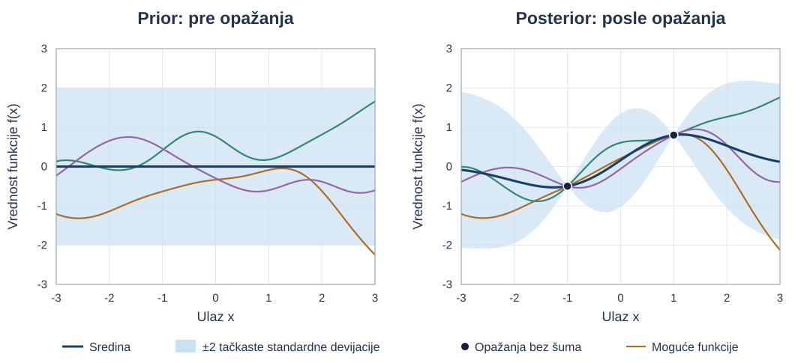
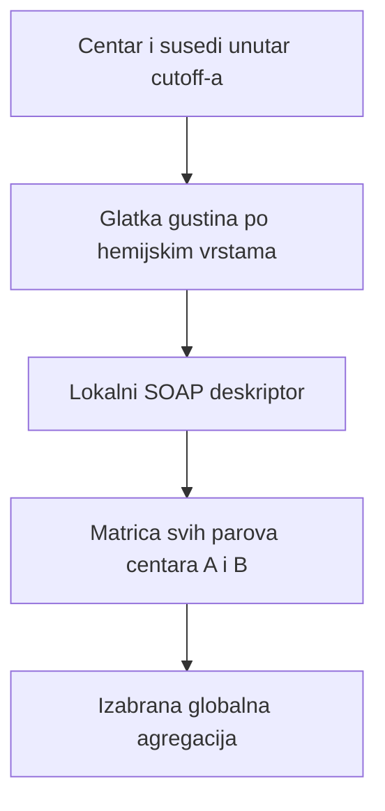
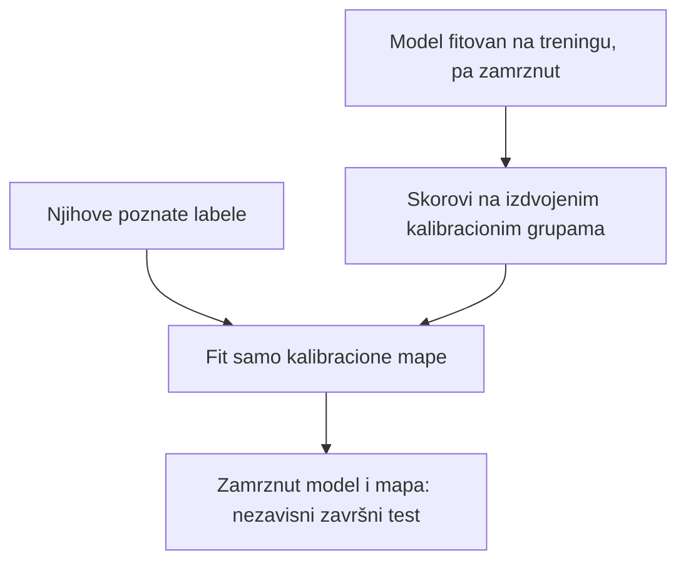

# Klasični ML: baseline-i koji zaista imaju smisla

## Glavni zaključak

Klasični ML nije „zastarela alternativa“ deep modelima. Posebno je primeren kada je input rastavljiva tabela deskriptora, labela ima malo ili srednje mnogo, a rezultat mora biti jeftin i proverljiv.

**Preduslovi:** [ML osnove](00a-osnove-ml.md), posebno uzorak/target, skalarni proizvod, gubitak i odvajanje treninga od testa. Prvi prolaz obuhvata linearne reference, mehaniku stabala i boostinga (§2.4–2.6), kernel uvod (§2.7) i osnovnu kalibraciju (§2.11). PCA/PCR/PLS, GPR, SOAP/REMatch i split-conformal su uslovni nastavci za izbor odgovarajuće porodice; njihovo računanje ne zahteva prethodno čitanje neuralnog dela.

Relevantne porodice metoda su:

- regularizovana linearna/logistička regresija kao transparentna referenca;
- Random Forest i Extra Trees za nelinearne tabularne odnose;
- gradient-boosted trees, pre svega XGBoost/LightGBM/CatBoost porodica, za složenije tabularne odnose;
- SVM/SVR za male i srednje skupove sa pažljivo definisanim kernelom;
- Gaussian Process Regression za male skupe property skupove gde je važna lokalna prediktivna raspodela;
- kNN kao transparentna locality referenca;
- PLS/PCR samo za odgovarajuće niskorangirane, jako korelisane kontinuirane deskriptore;
- calibration i conformal sloj iznad point modela, uz eksplicitne pretpostavke.

Nijedan od njih nije CIF parser, exact substructure matcher, dokaz packing identiteta niti univerzalna mera sličnosti.

Pre formiranja bilo koje supervised matrice obavezan je centralni [cross-format i lifecycle eligibility ugovor](09-cross-format-eligibility.md): svi pogledi istog entry-ja ostaju u istoj split grupi, missing format se ne briše tihim `inner join`-om, a training/calibration/final-test primaju samo eksplicitno dozvoljena lifecycle stanja i rights scope.

## 2.1 Semantički ugovor pre algoritma

Supervised poređenje nije definisano dok za svaki uzorak nisu poznate sledeće kategorije:

| Kategorija | Naučna svrha |
|---|---|
| identitet i grupe | sprečavaju da isti compound, scaffold, solid-form family ili publikacija pređu granicu split-a |
| reprezentacija i missing status | određuju koje su features stvarno dostupne i pod kojom definicijom |
| target, definicija i adjudikacija | vezuju vrednost za konkretan zadatak, anotatore i stepen pouzdanosti |
| uslovi i provenance | razlikuju merenje, račun i eksperimentalni kontekst |
| rights i dozvoljena namena | određuju da li uzorak sme u trening, kalibraciju i evaluaciju |

Tačan tehnički zapis je implementacioni izbor; ove semantičke kategorije ostaju potrebne nezavisno od njega.

Nasumični row split nije prihvatljiv ako bliske redeterminations, isti compound, scaffold ili polymorph family mogu preći u oba skupa. [MoleculeNet](https://doi.org/10.1039/C7SC02664A) je pokazao da scaffold split predstavlja stroži test molekulske generalizacije od random split-a; [materials OOD benchmark](https://doi.org/10.1038/s41524-024-01316-4) pokazuje isti širi problem redundanse kod kristalnih skupova.

## 2.2 Obavezni dummy i linearni baseline-i

### Dummy

Za regresiju:

- sredina/medijana trening target-a;
- group-aware mean kada je to dozvoljen deployment scenario.

Za klasifikaciju:

- uvek većinska klasa;
- stratified random;
- jednostavno pravilo poput `ECFP Tanimoto >= t`, ali prag se bira samo na validation skupu.

Model koji ne pobeđuje dummy ili jedno stručno pravilo nije pokazao dodatnu prediktivnu vrednost.

### Linearna/logistička regresija

Model:

\[
\hat y=\beta_0+\sum_j\beta_jx_j,
\qquad
P(y=1\mid x)=\sigma(\beta_0+\beta^Tx).
\]

Koristi:

- kalibrisana relevantnost para iz malog broja razumljivih score komponenti;
- property baseline nad standardizovanim deskriptorima;
- interpretable quality-risk model;
- pair preference model kada su features definisane kao razlike.

L1/Lasso bira sparse skup, L2/Ridge stabilizuje korelisane features, a Elastic Net kombinuje oba efekta. Koeficijent nije hemijski uzrok: korelacija, transformacija i interakcije određuju tumačenje.

**Ilustrativni 2CDC primer:** logistički model prima ECFP similarity, common-core coverage, donor-set match, RMSD, packing coverage, quality flags i missing-status indikatore. Output je procena verovatnoće tačno definisane ekspertske labele, ne „procenat univerzalne sličnosti“. Sama logistička funkcija ne garantuje kalibraciju: pogrešna specifikacija, regularizacija, promenjena učestalost klasa ili domen mogu je narušiti. Kalibracija se proverava na nezavisnim grupama i po potrebi popravlja, kao u §2.11 ([zvanična dokumentacija o kalibraciji](https://scikit-learn.org/stable/modules/calibration.html)).

## 2.3 k-nearest neighbors

kNN predviđa iz lokalnog susedstva u izabranoj metrici. Za regresiju je jednostavan oblik:

\[
\hat y(x)=\frac{\sum_{i\in N_k(x)}w_i y_i}{\sum_{i\in N_k(x)}w_i},
\qquad
w_i=\frac{1}{(d_i+\epsilon)^p}.
\]

### Gde je koristan

- sanity test „slični trening primeri imaju sličan target“;
- mali lokalni property baseline;
- objašnjenje kroz konkretne susede;
- detekcija da query nema bliskih referenci.

### Granice

- rezultat potpuno zavisi od reprezentacije i distance;
- sparse high-dimensional prostor pati od concentration efekata;
- predikcija bez indeksa skenira ceo trening skup;
- velika hemijska rupa se ne pretvara u pouzdanu ekstrapolaciju izborom većeg `k`;
- sused iz iste leaked family daje lažno dobar rezultat.

Za 2CDC kNN je baseline i explanation aid, ne konačni globalni ranking engine.

## 2.4 Random Forest

**Stablo odlučivanja** deli primere nizom uslova nad osobinama, npr. „da li je common-core coverage veći od praga?“. U listu daje procenu klase ili numeričke vrednosti iz trening primera koji su do njega stigli. Trening bira podele koje popravljaju zadati kriterijum; nije dokaz da je izabrani prag univerzalno hemijsko pravilo.

### Jedno stablo, pa prosek tri stabla

**Pitanje:** kako niz uslova daje broj? U nastavnoj regresionoj tabeli \(x\) je jedna bezdimenziona osobina, a \(y\) izmišljen cilj:

| Uzorak | \(x\) | \(y\) | Stablo 1 | Stablo 2 | Stablo 3 | Prosek tri predikcije |
|---|---:|---:|---:|---:|---:|---:|
| U1 | 1 | 2 | 3 | 2 | 4 | 3 |
| U2 | 2 | 4 | 3 | 6 | 4 | 4,333 |
| U3 | 3 | 6 | 7 | 6 | 4 | 5,667 |
| U4 | 4 | 8 | 7 | 6 | 8 | 7 |

Prvo stablo pita `x ≤ 2,5?`: levi list sadrži U1/U2 i predviđa njihov prosek \((2+4)/2=3\); desni sadrži U3/U4 i predviđa 7. Drugo koristi prag 1,5, pa su sredine listova 2 i 6; treće prag 3,5, pa su 4 i 8. Za novi \(x=2{,}2\), tri stabla daju 3, 6 i 4, a ansambl daje \(13/3\). **Ansambl** je zajednička predikcija više modela. Ova tri dopuštena plitka stabla izdvajaju račun proseka; nisu simulacija svih slučajnih izbora Random Forest treninga.

[Random Forest](https://doi.org/10.1023/A:1010933404324) gradi mnogo stabala nad bootstrap uzorcima i nasumičnim podskupovima features, pa agregira njihove rezultate.

**Bias** je sistematsko odstupanje prosečne predikcije kroz ponovljene trening uzorke; previše jednostavna stabla mogu propuštati stvarni odnos. **Varijansa modela** opisuje koliko se predikcija menja sa trening uzorkom. Prosečavanje dovoljno različitih stabala može smanjiti varijansu, ali ne uklanja zajedničku sistematsku grešku. To su osobine postupka učenja. **Pristrasnost izbora uzorka** je druga stvar: npr. ako podaci obuhvataju samo jednu hemijsku porodicu, mnogo stabala ne čini uzorak reprezentativnim za sve porodice.

### Referentno: uzorkovanje i ograničenja provere

Bootstrap ovde znači uzorkovanje trening redova **sa vraćanjem**, pa neki red može biti izabran više puta, a neki nijednom. **Out-of-bag (OOB)** predikcija za red koristi stabla u čijem bootstrap uzorku taj red nije bio. Ako druga verzija iste strukture ili par koji deli endpoint jeste u uzorku, OOB i dalje može biti optimističan; zato ne zamenjuje grupisanu evaluaciju.

### Zašto odgovara projektu

- uči nelinearne pragove i interakcije bez ručnog zadavanja formule;
- radi sa mešavinom kontinuiranih, binarnih i kodiranih kategorijalnih deskriptora;
- zahteva manje podataka i tuning-a od mnogih dubokih modela;
- inference je lak za lokalno izvršavanje;
- out-of-bag procena je koristan razvojni signal, iako ne zamenjuje grouped test.

### Gde ga probati

1. pair relevance classifier/reranker nad unapred izračunatim evidence features;
2. regression/classification property model za mali/srednji skup;
3. quality-review prioritet, pod uslovom da target označava review odluku;
4. meta-model koji bira da li je skupa packing analiza potrebna — samo ako false-negative rizik ima strogu kontrolu.

### Granice

- stabla loše ekstrapoliraju izvan opsega trening target-a;
- veliki broj sparse fingerprint bitova može biti manje efikasan od odgovarajućeg kernel/linear modela;
- impurity feature importance je pristrasan prema features sa više potencijalnih split-ova i uz korelisane prediktore ([Strobl et al.](https://doi.org/10.1186/1471-2105-8-25));
- sirove vote frakcije nisu automatski kalibrisane verovatnoće;
- RF ne daje atom mapping ni kristalografski dokaz.

Koristi held-out permutation importance po grupama i atomske/substrukturne evidence koje proizvodi deterministički sloj; ne prevodi tree importance u uzročnu hemiju.

## 2.5 Extra Trees

[Extremely Randomized Trees](https://doi.org/10.1007/s10994-006-6226-1) dodatno randomizuju izbor split pragova i tipično koriste ceo razvojni uzorak umesto bootstrap-a. Više randomizacije može smanjiti varijansu i ubrzati trening, uz moguć veći bias.

RF i ExtraTrees čine informativno upareno poređenje na istim outer fold-ovima jer različito menjaju bias i varijansu. ExtraTrees nije „RF upgrade“; relativni rezultat zavisi od target-a i features.

## 2.6 Gradient-boosted trees {#stabla-i-boosting}

**Pitanje:** šta ako sledeće stablo uči upravo grešku dosadašnje predikcije? Boosting sekvencijalno dodaje korekcije. Na istoj tabeli U1–U4 uzmimo kvadratni gubitak \(\ell=\tfrac12(y-F(x))^2\), početnu konstantu \(F_0=\bar y=5\) i stopu učenja \(\eta=0{,}5\). **Rezidual** \(r_i=y_i-F(x_i)\) kaže koliko treba povećati predikciju; negativna vrednost traži smanjenje.

**Korak 1:** \(r^{(1)}=y-F_0\), fituj stablo \(h_1\) na reziduale, pa \(F_1=F_0+0{,}5h_1\).

| Uzorak | \(y\) | \(F_0\) | \(r^{(1)}\) | \(h_1\) | \(F_1\) |
|---|---:|---:|---:|---:|---:|
| U1 | 2 | 5 | −3 | −2 | 4 |
| U2 | 4 | 5 | −1 | −2 | 4 |
| U3 | 6 | 5 | 1 | 2 | 6 |
| U4 | 8 | 5 | 3 | 2 | 6 |

**Korak 2:** ponovo izračunaj \(r^{(2)}=y-F_1\), fituj \(h_2\), pa \(F_2=F_1+0{,}5h_2\).

| Uzorak | \(y\) | \(F_1\) | \(r^{(2)}\) | \(h_2\) | \(F_2\) |
|---|---:|---:|---:|---:|---:|
| U1 | 2 | 4 | −2 | −2 | 3 |
| U2 | 4 | 4 | 0 | 2/3 | 13/3 |
| U3 | 6 | 6 | 0 | 2/3 | 19/3 |
| U4 | 8 | 6 | 2 | 2/3 | 19/3 |

Prvo stablo deli na \(x\le2{,}5\): proseci reziduala su −2 i 2. Drugo deli na \(x\le1{,}5\): levi rezidual je −2, a desni prosek \((0+0+2)/3=2/3\). Prag 3,5 daje jednako dobar drugi split u ovom simetričnom primeru; ovde smo deklarisali izbor 1,5. Srednja kvadratna greška \(\frac14\sum_i(y_i-F(x_i))^2\) pada \(5\to2\to1\); prosečni izabrani gubitak je polovina tih vrednosti. To je trening račun, bez tvrdnje o uspehu na novim strukturama.

Opšti korak je \(F_m=F_{m-1}+\eta h_m\). Za ovaj gubitak negativni gradijent po predikciji jeste rezidual; drugi gubici daju druge korekcione ciljeve. RF prosečava stabla koja predviđaju cilj, dok ovde nova stabla zavise od greške već izgrađenog ansambla. Broj stabala, dubina i \(\eta\) biraju se na razvojnim grupama. Ova mehanika prethodi [učenju rangiranja i LambdaMART-u](03-global-retrieval-ann-ranking.md); rangovski gubitak menja signal korekcije, a ne potrebu za njegovom jasnom definicijom.

### Opciono: bibliotečke optimizacije posle osnovnog koraka

[XGBoost](https://doi.org/10.1145/2939672.2939785) uvodi regularizovan i sparsity-aware skalabilni sistem. [LightGBM](https://proceedings.neurips.cc/paper/6907-lightgbm-a-highly-efficient-gradient-boosting-decision-tree) grupiše numeričke vrednosti u histograme radi bržeg traženja split-a; GOSS (*gradient-based one-side sampling*) bira poduzorak prema gradijentima uz odgovarajuće ponderisanje, a EFB (*exclusive feature bundling*) spaja osobine koje se retko istovremeno pojavljuju. [CatBoost](https://proceedings.neurips.cc/paper/2018/hash/14491b756b3a51daac41c24863285549-Abstract.html) koristi ordered boosting, postupak sa uređenim poduzorcima za ograničavanje određenog trening pomeranja, i poseban tretman kategorija. Ovi detalji ne menjaju početnu pouku: sledeći korak koriguje postojeću predikciju.

| Porodica | Tipična primenljivost | Poseban oprez |
|---|---|---|
| XGBoost | opšti tabularni classifier/regressor | sparse/missing putanja može naučiti source artefakt |
| LightGBM | veliki tabularni skup i LambdaMART ranking | leaf-wise rast može overfit-ovati mali skup |
| CatBoost | stvarne kategorije uz numeričke features | ordered encoding ne sprečava compound/family leakage |

### Gde je najjači kandidat

- heterogeneous tabular deskriptori;
- pairwise relevance sa mnogo nelinearnih interakcija;
- property prediction kada labela nije dovoljno velika za end-to-end GNN;
- LambdaMART ili listwise reranking kada postoje query-grupisane ocene relevantnosti. LambdaMART koristi pairwise gradijente ponderisane promenom ranking metrike; labele mogu biti binarne ili višestepene.

Na 30 QSAR skupova je [XGBoost poređen sa RF i neuralnim mrežama](https://doi.org/10.1021/acs.jcim.6b00591), ali rezultat iz bioaktivnosti ne prenosi se automatski na kristalno pakovanje. [MoleculeNet](https://doi.org/10.1039/C7SC02664A) dodatno podržava da kernel SVM i tree ensemble metode ostaju ozbiljni kandidati u data-scarce režimu.

### Rizici

- lakše overfit-uje tuning skup od RF-a;
- native missing handling može naučiti laboratoriju/source umesto hemije;
- class weights menjaju score i kalibraciju;
- SHAP objašnjava model nad datim feature space-om, ne dokazuje fizički mehanizam;
- listwise objective bez stvarnih query grupa optimizuje pogrešan problem.

## 2.7 SVM i SVR

### Od skalarnog proizvoda do Gram matrice {#kernel-gram}

**Pitanje:** kako model koristi sve parne odnose ulaza? Za tri nastavna vektora \(x_1=(1,0)\), \(x_2=(0,1)\), \(x_3=(1,1)\) prvo uzmi običan skalarni proizvod. Tabela svih proizvoda je **Gram matrica**:

\[
K_{ij}=K(x_i,x_j)=x_i^Tx_j,\qquad
\mathbf K=\begin{pmatrix}1&0&1\\0&1&1\\1&1&2\end{pmatrix}.
\]

Red i kolona biraju dva uzorka. Na primer, \(K_{13}=1\cdot1+0\cdot1=1\), a dijagonala \(K_{33}=2\) daje kvadrat dužine trećeg vektora. Matrica nije originalna tabela osobina: ona je tabela odnosa **svih parova** iz te tabele.

**Kernel** računa skalarni proizvod u transformisanom prostoru, \(K(x,z)=\phi(x)^T\phi(z)\), čak i kada \(\phi\) ne konstruišemo eksplicitno. Za skalar \(s\), transformacija \(\phi(s)=(1,s,s^2)\) daje \(K(s,t)=1+st+s^2t^2\); za \(s=1,t=2\) rezultat je 7. Linearni model u ovim novim osobinama može opisati nelinearan odnos u početnom \(s\).

**Pozitivna semidefinitnost (PSD)** znači \(c^T\mathbf Kc\ge0\) za svaki realan vektor težina \(c\). Intuicija je neposredna za skalarne proizvode:

\[
c^T\mathbf Kc=\left\|\sum_i c_i\phi(x_i)\right\|^2\ge0.
\]

Kvadrat dužine ne može biti negativan. Za našu matricu i \(c=(1,1,-1)\) zbir vektora je nula, pa je i izraz nula: „semidefinitno“ dozvoljava takav slučaj. Nasuprot tome, naizgled uredna simetrična tabela \(\begin{pmatrix}1&2\\2&1\end{pmatrix}\) daje −2 za \(c=(1,-1)\); zato ne može biti Gram matrica realnih skalarnih proizvoda. Nenegativni skorovi sami nisu dovoljni. Validan kernel mora dati PSD matricu za **svaki** dopušten konačan izbor ulaza; provera samo jednog uzorka nije opšti dokaz.

### Margina, C, gamma i tolerisani pojas

[SVM (*support-vector machine*, mašina potpornih vektora)](https://doi.org/10.1007/BF00994018) traži granicu odluke uz široku **marginu**, razmak do najbližih relevantnih trening primera, odnosno potpornih vektora. Parametar \(C>0\) određuje cenu kršenja margine u odnosu na regularizaciju: veći \(C\) snažnije kažnjava trening kršenja, dok manji može dopustiti više njih radi jednostavnije granice. To nije hemijski prag sličnosti.

**RBF (*radial basis function*) kernel** opada sa kvadratom rastojanja:

\[
K(x,z)=\exp[-\gamma\|x-z\|^2],\qquad\gamma>0.
\]

Za rastojanje 1, \(\gamma=1\) daje \(e^{-1}\approx0{,}368\), a \(\gamma=0{,}25\) daje \(e^{-0{,}25}\approx0{,}779\). Na rastojanju 2 vrednosti su 0,018 i 0,368. Veća \(\gamma\) znači uži, lokalniji uticaj; skaliranje osobina zato menja i smisao udaljenosti. \(C\) i \(\gamma\) biraju se zajedno unutar trening/razvojnih grupa.

**SVR (*support-vector regression*)** predviđa broj. U uobičajenoj \(\epsilon\)-varijanti greška do \(\epsilon\) ne nosi cenu u delu gubitka koji meri odstupanje; izvan pojasa plaća se višak \(\max(0,|y-\hat y|-\epsilon)\). Ako je \(y=3\), \(\epsilon=0{,}2\), predikcija 3,1 nosi taj gubitak 0, a 3,5 nosi 0,3. Regularizacija i dalje ostaje u ukupnom cilju. Definicije parametara i varijanata daje [zvanični SVM/SVR vodič](https://scikit-learn.org/stable/modules/svm.html).

Ista kernel osnova potrebna je za [GPR](#gpr-prior-posterior) i [SOAP/REMatch](#soap-rematch-primer): dobar skor poređenja ne nasleđuje automatski uslove za kovarijansu ili SVM kernel.

### Dobar režim

- stotine do nekoliko hiljada pouzdanih labela;
- descriptor ili fingerprint input sa smislenim kernelom;
- jasna binarna odluka ili smooth regression target;
- potrebna jaka alternativna metoda za small-data režim.

Linear SVM odgovara veoma sparse visokoj dimenziji. RBF SVM hvata nelinearnost, ali zahteva scaling i pažljiv `C/gamma` nested tuning. Specijalizovan Tanimoto/min-max kernel može biti hemijski smisleniji za nenegativne fingerprint/count features; njegovu kernel upotrebu u hemijskom kontekstu razmatraju [Ralaivola et al.](https://doi.org/10.1016/j.neunet.2005.07.009), ali konkretna implementacija mora potvrditi pozitivnu definitnost i numeričku semantiku izabranog prikaza.

### Granice

- kernel matrica i tuning slabo skaliraju na vrlo velike skupove;
- decision margin nije verovatnoća;
- objašnjenje je teže od malog linearnog ili tree modela;
- kalibracija zahteva izdvojene podatke i grupisanje.

## 2.8 PLS/PCR i latentni linearni modeli

**Uslovni nastavak:** ovaj blok je preduslov ako biraš regresiju preko latentnih komponenti. **Pitanje:** da li pravac koji sažima najviše promena ulaza ujedno najbolje predviđa cilj? **Latentna komponenta** je izvedena koordinata, npr. ponderisana suma dve merene osobine; nije dodatno merenje skrivenog hemijskog svojstva.

U nastavnom primeru dve kontinuirane osobine već su centrirane, uporedivih skala i pozitivno povezane. Biramo pravce \(v=(1,1)/\sqrt2\) i \(w=(-1,1)/\sqrt2\), i projekcije \(t=x^Tv\), \(u=x^Tw\):

| Uzorak | \(x_1\) | \(x_2\) | Zajednička komponenta \(t\) | Razlika \(u\) | Cilj \(y=u/\sqrt2\) |
|---|---:|---:|---:|---:|---:|
| L1 | −3 | −1 | \(-2\sqrt2\) | \(\sqrt2\) | 1 |
| L2 | −1 | −3 | \(-2\sqrt2\) | \(-\sqrt2\) | −1 |
| L3 | 1 | 3 | \(2\sqrt2\) | \(\sqrt2\) | 1 |
| L4 | 3 | 1 | \(2\sqrt2\) | \(-\sqrt2\) | −1 |

Projekcija L1 na prvi pravac daje \(t=-2\sqrt2\); rekonstrukcija samo iz te komponente je \(tv=(-2,-2)\). Četiri reda sa po dve osobine tako možemo zameniti jednim brojem po uzorku, uz gubitak informacije o razlici osobina. Uz račun varijanse deljenjem sa 4, \(\operatorname{Var}(t)=8\), a \(\operatorname{Var}(u)=2\). Prvi pravac čuva 80% ukupne varijanse, ali uz svaku vrednost \(t\) postoje i \(y=1\) i \(y=-1\): samo \(t\) ne predviđa ovaj cilj. Komponenta \(u\), sa manjim rasipanjem, ovde ga tačno određuje.

| Postupak i pun naziv | Tok | Gde se koristi \(y\)? |
|---|---|---|
| PCA — *principal component analysis*, analiza glavnih komponenti | \(X\to\) pravci najveće varijanse \(\to\) komponente | nigde pri učenju komponenti |
| PCR — *principal component regression*, regresija na glavnim komponentama | \(X\to PCA\to\) regresija na izabranim komponentama | u završnoj regresiji i validaciji izbora komponenti |
| PLS — *partial least squares*, parcijalni najmanji kvadrati | \(X,y\to\) komponente povezane sa ciljem \(\to\) regresija | već pri učenju komponenti, zatim u regresiji |

U ovom simetričnom primeru prvi PCA pravac je \(v\); PCR sa jednom komponentom propušta cilj, dok PLS koristi povezanost sa \(y\) i bira pravac \(w\), do nebitne promene znaka. To ne znači da PLS uopšteno nadmašuje PCR: uz mali uzorak korišćenje \(y\) pri izboru pravca može učiti i šum. [Klasičan prikaz PCA/PLS veze](https://doi.org/10.1016/0898-5529(89)90004-3) razrađuje njihove različite kriterijume.

### Koristi

- mali skup sa mnogo korelisanih kontinuiranih deskriptora;
- spektroskopski ili drugi dense measurement vektori;
- linearna, stabilna i pregledna latentna regresija.

### Ne koristiti kao default

- nad heterogenim bitovima, kategorijama i missing statusima bez opravdane transformacije;
- za automatsku tvrdnju da latentna komponenta ima jedno hemijsko značenje;
- za packing identitet ili graph matching.

Broj komponenti bira se unutar inner CV-a; preprocessing se fituje samo na trening fold-u.

## 2.9 Gaussian Process Regression {#gpr-prior-posterior}

**Pitanje:** kako se menja skup mogućih funkcija kada dobijemo opažanja? **GPR (*Gaussian process regression*, regresija Gaussovim procesom)** polazi od raspodele nad funkcijama. **Prior** je raspodela pre korišćenja opaženih ciljeva; **posterior** je raspodela uslovljena tim opažanjima. Ne bira se samo jedna kriva: mnoge funkcije mogu biti saglasne sa malo podataka.

**Nastavna skica:** ulaz i cilj su bezdimenzioni, prior sredina je nula, a kernel je \(K(x,z)=\exp[-(x-z)^2/2]\), sa jediničnom prior varijansom. Levo su tri uzorka funkcije pre opažanja. Desno su tri uzorka posle opažanja \((-1,-0{,}5)\) i \((1,0{,}8)\). Tamna linija je sredina raspodele, a plavi pojas sredina ± dve **tačkaste** standardne devijacije funkcije. Prikaz namerno pretpostavlja opažanja bez šuma: sve posterior funkcije prolaze kroz obe tačke, a pojas se tu zatvara. To nije simultana garancija da cela funkcija leži u pojasu, niti potvrda pouzdanosti na realnom skupu.

Kernel je sada **kovarijansa**, mera zajedničkog variranja vrednosti funkcije. Bliske ulazne tačke u ovom RBF modelu imaju sličnije moguće vrednosti; dužinska skala kernela određuje koliko daleko ta pretpostavka dopire. Izbor drugog kernela menja očekivanu glatkost ili periodičnost. Za proveru skice, u \(x=0\) dobijamo sredinu približno 0,1603 i standardnu devijaciju 0,5933: dve poznate tačke ne određuju sredinu između njih bez neizvesnosti. Daleko od opažanja pojas se ponovo širi prema prior-u.

### Referentno: funkcija, opažanje i račun

Kod merenja \(y=f(x)+\varepsilon\), **šum opažanja** \(\varepsilon\) opisuje odstupanje merenja od funkcije; to nije isto što i neizvesnost o nepoznatoj funkciji. Uz nezavisan Gaussov šum varijanse \(\sigma_n^2\), GPR koristi \(\mathbf K+\sigma_n^2 I\), gde je \(I\) jedinična matrica. Za nulti prior srednji nivo:

\[
\begin{aligned}
\mu_*(x)&=k_*^T(\mathbf K+\sigma_n^2I)^{-1}y,\\
v_f(x)&=K(x,x)-k_*^T(\mathbf K+\sigma_n^2I)^{-1}k_*.
\end{aligned}
\]

\(k_*\) sadrži kovarijanse novog ulaza sa trening ulazima, a \(\mathbf K\) je njihova [Gram matrica](#kernel-gram). Varijansa **novog opažanja** pri istom nezavisnom šumu je \(v_y=v_f+\sigma_n^2\). Skica koristi \(\sigma_n=0\), pa su te dve veličine iste samo u tom idealizovanom slučaju. Formule i uslovljavanje razrađuju [Rasmussen i Williams, poglavlje 2](https://gaussianprocess.org/gpml/chapters/RW2.pdf), a [zvanični GPR vodič](https://scikit-learn.org/stable/modules/gaussian_process.html) povezuje ih sa modelima šuma.

### Gde je koristan

- desetine do niske hiljade skupih, dobro definisanih property labela;
- aktivno učenje ili Bayesian optimization kada je akviziciona odluka deo cilja;
- SOAP ili drugi kernel nad strukturama sa opravdanom pozitivnom semidefinitnošću; izbor globalne agregacije/matching-a mora posebno zadovoljiti taj uslov (videti §4.10);
- scenario gde lokalna smoothness pretpostavka ima hemijski smisao.

### Oprez

- exact trening tipično zahteva \(O(n^3)\) vreme i \(O(n^2)\) memoriju;
- predictive variance nije automatski kalibrisana greška pod distribution shift-om;
- loš kernel daje precizno izraženu pogrešnu pretpostavku;
- sparse/variational aproksimacije menjaju metod i zahtevaju posebnu validaciju.

## 2.9a Od SOAP okruženja do REMatch sličnosti {#soap-rematch-primer}

**Uslovni nastavak:** prvo savladaj [kernel i Gram matricu](#kernel-gram), a za periodična okruženja ćeliju, slike i pravilo susedstva iz hemijske osnove. **Pitanje:** ako znamo sličnost svakog para lokalnih okruženja, šta znači sličnost dve cele strukture?

**SOAP (*Smooth Overlap of Atomic Positions*)** zamenjuje oštre atomske položaje glatkim „oblačićima“ oko suseda izabranog centra. Preklapanje tih gustina omogućava poređenje blago pomerenih okruženja. Tok je:

Deskriptor kodira raspored u **lokalnom** okruženju pod izabranim pravilima. Agregator odlučuje kako porediti **skupove** tih okruženja; sam ne dodaje izgubljenu informaciju. Pretpostavimo da A i B imaju po dva centra i nastavnu matricu lokalnih sličnosti:

\[
\mathbf C=\begin{array}{c|cc}
&B_1&B_2\\\hline
A_1&0{,}9&0{,}4\\
A_2&0{,}3&0{,}8
\end{array}.
\]

Ovo su sintetički brojevi za proveru agregiranja. \(\mathbf C\) je međustrukturni blok poređenja i ne mora biti simetričan; ne treba ga pomešati sa Gram matricom jednog zajedničkog skupa svih okruženja.

| Agregacija | Težine ili dozvoljena dodela | Račun rezultata |
|---|---|---|
| običan prosek | svaki par ima težinu 1/4 | \((0{,}9+0{,}4+0{,}3+0{,}8)/4=0{,}60\) |
| strogo najbolje uparivanje | svaki centar koristi se tačno jednom; dve moguće permutacije | \(\max[(0{,}9+0{,}8)/2,(0{,}4+0{,}3)/2]=0{,}85\) |
| meko raspodeljeno uparivanje | \(P=\begin{pmatrix}0{,}4&0{,}1\\0{,}1&0{,}4\end{pmatrix}\); svaki red i kolona sabiraju se na 1/2 | \(0{,}4(0{,}9+0{,}8)+0{,}1(0{,}4+0{,}3)=0{,}75\) |

Kod mekog uparivanja jedan centar deli svoju masu na više drugih centara. Prikazane težine preferiraju dijagonalu, ali ne isključuju druge parove. **REMatch (*Regularized Entropy Match*)** bira takve težine kompromisom između velikog lokalnog podudaranja i entropije raspodele težina. Običan prosek sve parove tretira jednako; strogi optimum bira jednu potpunu dodelu. Brojevi u tabeli su agregati pre eventualne dodatne normalizacije samosličnošću; nisu procenti istih atoma ili dokazi istog pakovanja.

### Napredno: od gustine do regularizovanog računa

Jedna gustina po vrsti \(\alpha\) ima oblik \(\rho_i^\alpha(r)=\sum_{j\in\alpha}f_{cut}(r_{ij})\exp[-\|r-r_{ij}\|^2/(2\sigma_{atom}^2)]\), gde je \(r_{ij}\) pomeraj suseda od centra, \(f_{cut}\) glatko ograničava domet, a \(\sigma_{atom}\) širina oblačića. Ekspanzija u radijalnoj i ugaonoj bazi i njihov *power spectrum* daju standardni rotaciono invariantni vektor. Ovi koraci dolaze pre poređenja deskriptora; bazni redovi i normalizacija pripadaju definiciji lokalnog SOAP-a ([SOAP rad](https://doi.org/10.1103/PhysRevB.87.184115)).

Za jednako ponderisana dva centra REMatch bira \(P\ge0\), sa rednim i kolonskim zbirovima 1/2, maksimalizovanjem \(\sum_{ij}P_{ij}C_{ij}+\lambda H(P)\), gde je \(H(P)=-\sum_{ij}P_{ij}\ln P_{ij}\) i \(\lambda>0\). Završni skor iz tabele je \(\sum P_{ij}C_{ij}\), bez dodavanja entropijskog člana. Za našu matricu \(\lambda=1/(2\ln4)\approx0{,}3607\) daje upravo prikazano \(P\); to se proverava odnosom dijagonalne i vandijagonalne težine 4. Veće \(\lambda\) približava težine ravnomernom proseku, a granica \(\lambda\to0\) najboljoj dodeli. Numeričko balansiranje težina objašnjava [izvorni REMatch rad](https://arxiv.org/html/1601.04077v2).

**Ograničenja:** globalni prosek validnih lokalnih kernel vektora jeste njihov skalarni proizvod posle prosečavanja. Proizvoljan najbolji matching ili naknadne hemijske zabrane nemaju automatski PSD svojstvo, pa GPR traži opravdanje za tačno izabranu globalnu konstrukciju. Standardni SOAP ne razlikuje ogledalska okruženja; agregacija to ne može povratiti. **Adapted-average SOAP** je posebna konstrukcija prosečavanja analognih atoma i dozvoljenih molekulskih simetrijskih mapiranja, različita od REMatch-a. Njeni uslovi o \(Z'\), molekulskoj simetriji, rigidnosti i hemijskoj primenljivosti ostaju u [naprednoj referenci §4.10](04-precise-pairwise.md#soap-rematch-reference), zajedno sa parametrima koji menjaju značenje poređenja.

## 2.10 Unsupervised i anomaly metode

| Metod | Dozvoljena uloga | Ne dokazuje |
|---|---|---|
| PCA | linearna eksploracija, collinearity i outlier kandidat | klastere hemijske istine |
| UMAP/t-SNE | vizuelni prikaz lokalnog susedstva | globalne distance i stabilne klase |
| k-means | grubo particionisanje odgovarajućeg Euclidean embedding-a | prirodne kristalne familije |
| agglomerative clustering | dendrogram uz eksplicitnu distance/linkage politiku | jedinstven „tačan“ broj klastera |
| HDBSCAN | promenljiva gustina i noise kandidati | hemijsku nevalidnost |
| Isolation Forest | multivariate anomaly triage | da je zapis pogrešan |
| One-Class SVM/LOF | lokalni OOD signal | pouzdanu naučnu abstention odluku bez kalibracije |

Za pairwise aplikaciju clustering se radi nad jednom validiranom distance komponentom ili eksplicitno naučenim task-specific rastojanjem. Dendrogram nad neobjašnjenim weighted average score-om samo vizuelno skriva problem.

## 2.11 Calibration, intervali i abstention

### Kalibracija zamrznutog klasifikatora {#kalibracija}

**Pitanje:** kako od već izračunatog skora naučiti prognozu učestalosti pozitivnog događaja? **Kalibraciona mapa** uči se nad izlazom zamrznutog modela: njegove težine i ulazne transformacije se u tom koraku više ne menjaju.

U izmišljenom kalibracionom skupu imamo 12 nezavisnih slučajeva; ponovljeni skorovi sabrani su u tri reda samo radi preglednosti:

| Skor zamrznutog modela \(s\) | Četiri stvarne binarne labele | Učestalost pozitivnih | Naučeno \(p(s)\) |
|---|---|---:|---:|
| −1 | 0, 0, 0, 1 | 1/4 | 0,25 |
| 0 | 0, 0, 1, 1 | 2/4 | 0,50 |
| 1 | 0, 1, 1, 1 | 3/4 | 0,75 |

**Logistička kalibracija**, iz Platt porodice, fituje dva nova parametra \(a,b\) u \(p(s)=\sigma(as+b)\). Oni smanjuju zbir binarnih log-gubitaka na ovih 12 kalibracionih slučajeva. Za nastavnu verziju bez regularizacije ili zaglađivanja labela rešenje je \(a=\ln3\approx1{,}09861\), \(b=0\): sigmoid tada tačno daje navedene učestalosti. Ovo jeste izračunata mapa, ali slaganje na skupu na kom je učena nije nezavisni dokaz kalibracije. Originalni Platt postupak i konkretne biblioteke mogu koristiti i zaglađene ciljne vrednosti.

**Isotonic kalibracija** umesto jedne sigmoidne krive uči fleksibilniju neopadajuću mapu skora u verovatnoću. U ovom primeru mogla bi reprodukovati iste tri učestalosti; u složenijem skupu spaja susedne delove da očuva monotonost. Može uvoditi platoe i izjednačene predikcije, a na malom uzorku lako preprilagodi mapu. [Zvanični vodič za kalibraciju](https://scikit-learn.org/stable/modules/calibration.html) definiše ove postupke, dok [Niculescu-Mizil i Caruana](https://doi.org/10.1145/1102351.1102430) porede njihov učinak.

### Neuralni nastavak: kalibraciona temperatura

Zadrži iste labele, a neka zamrznuti model daje dva logita \((z_1,z_0)=(2s,0)\), prvo za pozitivnu pa za negativnu klasu. [Logit, sigmoid i softmax](00a-osnove-ml.md#log-exp-softmax) već su uvedeni. **Temperature scaling** fituje samo \(T>0\) u \(\operatorname{softmax}(z/T)\), minimizovanjem log-loss-a na kalibracionom skupu ([Guo et al.](https://proceedings.mlr.press/v70/guo17a.html)). Za ovu tabelu optimum je \(T=2/\ln3\approx1{,}82048\): tada je \(P(y=1)=\sigma(2s/T)=\sigma(s\ln3)\).

| \(s\) | Zamrznuti logiti \((z_1,z_0)\) | \(P(y=1)\), \(T=1\) | \(P(y=1)\), fitovano \(T\) |
|---|---|---:|---:|
| −1 | (−2, 0) | 0,11920 | 0,25 |
| 0 | (0, 0) | 0,50000 | 0,50 |
| 1 | (2, 0) | 0,88080 | 0,75 |

Pozitivno \(T\) čuva izbor najvećeg logita i postojeća izjednačenja. \(T>1\) ublažava samouverenost, a \(0<T<1\) je povećava. Kalibracioni log-loss ovde pada sa približno 0,6490 na 0,6059; samo završni nezavisni test ocenjuje prenos te mape. Ova temperatura se uči **posle** zamrzavanja modela; temperatura u InfoNCE-u utiče na samo učenje reprezentacije i ima drugu ulogu.

**Kalibracija i prag su različiti koraci.** Za \(s=1\) prognoza se promenila sa 0,8808 na 0,75. Ako zatim fiksnu prognozu 0,75 porediš sa pragom 0,7 ili 0,8, dobijaš različite odluke uz potpuno istu verovatnosnu prognozu. Prag zavisi od cilja i cene grešaka, bira se u unapred definisanom razvojnom/kalibracionom protokolu i zamrzava pre testa; ne dobija se samom kalibracijom.

### Referentno: šta se proverava nezavisno

Proizvoljan similarity score „0,8“ nema verovatnosno značenje samo zato što je u intervalu [0,1]. Nasuprot tome, izlaz modela definisan kao procena \(P(y=1\mid x)\) jeste verovatnosna predikcija i kada je loše kalibrisan. Brier i log-loss mogu oceniti takvu predikciju **pre i posle** kalibracije; ne zahtevaju da je kalibracija već dokazana. Niži Brier/log-loss sam ne dokazuje bolju kalibraciju, jer odražava i diskriminaciju; reliability prikaz proverava slaganje predikcija i učestalosti događaja.

- Platt/logistic calibration je stabilnija kada calibration set nije velik.
- Isotonic je fleksibilniji, ali može overfit-ovati mali calibration set.
- Calibration split mora poštovati iste compound/family granice kao test.
- Promena prevalence-a ili domena može pokvariti kalibraciju.

Za retku pozitivnu klasu obavezni su precision–recall prikaz i AUPRC; [Saito i Rehmsmeier](https://doi.org/10.1371/journal.pone.0118432) objašnjavaju zašto ROC prikaz može biti intuitivno varljiv pod velikim imbalance-om.

### Split-conformal: od reziduala do intervala {#split-conformal}

**Uslovni nastavak za conformal granu. Pitanje:** koliki pojas oko nove tačkaste predikcije treba uzeti na osnovu grešaka izdvojenih kalibracionih primera? Zamrzni regresioni model i izračunaj apsolutne reziduale \(r_i=|y_i-\hat y_i|\). To su **nonconformity skorovi**, mere nesaglasnosti prognoze i poznatog cilja; veći skor znači veće odstupanje.

U nastavnom kalibracionom skupu, cilj i greška su u istoj izmišljenoj jedinici:

| Slučaj | \(\hat y_i\) | \(y_i\) | \(r_i\) |
|---|---:|---:|---:|
| C1 | 10 | 11 | 1 |
| C2 | 20 | 18 | 2 |
| C3 | 30 | 30,5 | 0,5 |
| C4 | 40 | 37 | 3 |
| C5 | 50 | 51,5 | 1,5 |
| C6 | 60 | 59,8 | 0,2 |
| C7 | 70 | 72,5 | 2,5 |
| C8 | 80 | 79,2 | 0,8 |
| C9 | 90 | 94 | 4 |

Sortirano: \(0{,}2;0{,}5;0{,}8;1;1{,}5;2;2{,}5;3;4\). Želimo nominalnu pokrivenost \(1-\alpha=0{,}8\), uz \(n=9\). **Konačno-uzorački kvantil** definišemo kao \(k\)-ti sortirani skor, sa indeksima od 1:

\[
k=\left\lceil(n+1)(1-\alpha)\right\rceil=\lceil10\cdot0{,}8\rceil=8,
\qquad \hat q=r_{(8)}=3.
\]

Oznaka \(\lceil\cdot\rceil\) zaokružuje naviše na ceo broj. Ako je \(k=n+1\), uzima se \(\hat q=+\infty\); ne interpolira se proizvoljno niti se indeks odseca na \(n\). Nova predikcija \(\hat y_{new}=12\) daje interval \([12-3,12+3]=[9,15]\). Novo \(y\) nije korišćeno u njegovoj konstrukciji. Za zahtev od 90% sa istih devet skorova dobili bismo \(k=9\), \(\hat q=4\) i širi interval \([8,16]\). To pokazuje mehanizam i grubost malog kalibracionog uzorka; devet tačaka nije dokaz stabilne praktične pokrivenosti.

### Pretpostavke i različita značenja pokrivenosti

U osnovnom split-conformal postupku model i pravilo skora fitovani su bez ovog kalibracionog skupa. Kalibracioni primeri i novi primer moraju biti **exchangeable**: njihova zajednička raspodela ne menja se permutacijom redosleda; nezavisni identično raspodeljeni primeri dovoljan su slučaj. Pod tim uslovima \(P(Y_{new}\in C(X_{new}))\ge1-\alpha\), gde verovatnoća prosečava slučajnost kalibracionog skupa i novog primera. To je **marginalna** pokrivenost. Ne tvrdi 80% za svaki fiksan \(x\), svaki metal ili svaku hemijsku porodicu, niti nužno 80% za svaki već realizovan kalibracioni skup. Kvantil i pretpostavke razrađuje [uvod Angelopoulosa i Batesa](https://arxiv.org/abs/2107.07511), uz širi okvir [Shafera i Vovka](https://jmlr.org/papers/v9/shafer08a.html).

| Veličina | Na šta se odnosi | Šta ne znači |
|---|---|---|
| interval evaluacione metrike | neizvesnost procene, npr. prosečne MAE ili razlike dva modela, pod protokolom resamplovanja | interval cilja sledeće strukture |
| predikcioni interval | skup mogućih vrednosti jednog novog numeričkog cilja | interval srednje greške modela |
| skup klasnih oznaka | npr. \(\{0,1\}\), konstruisan klasifikacionim nonconformity pravilom | jedna garantovano tačna klasa ili regresioni interval |
| modelna varijansa | npr. \(v_f\) u GPR-u, zavisna od modela i kernela | sama po sebi empirijski potvrđena pokrivenost |

**Udeo odgovorenih slučajeva** pri uzdržavanju (*abstention coverage*) ima denominator svih upita. **Pokrivenost predikcije** broji koliko stvarnih ciljeva upada u izdate intervale/skupove, pod deklarisanim protokolom. Sistem može izdati interval za svaki slučaj (100% odgovora), a ostvariti 80% predikcione pokrivenosti. Naknadno odbacivanje slučajeva ne prenosi automatski marginalno conformal jamstvo na podskup na koji je sistem odgovorio.

Referentna ograničenja ostaju:

- coverage se proverava empirijski ukupno i po kritičnim grupama;
- porodično, vremensko ili source pomeranje može prekršiti potrebnu pretpostavku;
- `90% interval` ne znači da je svaka hemijska podgrupa pokrivena 90%;
- interval ne popravlja pogrešan target, label noise ili licencni problem.

## 2.12 Režimi količine podataka

Broj nezavisnih grupa utiče na razuman kapacitet modela, ali ne postoji univerzalna numerička granica:

| Režim | Primerene hipoteze | Glavni rizik |
|---|---|---|
| veoma malo nezavisnih label grupa | pravila, deskriptivna analiza, regularizovani linearni modeli; GPR ako kernel ima smisla | nestabilna procena i prevelik tuning prostor |
| mali ili srednji skup | linear/Elastic Net, RF/ExtraTrees, SVM/SVR, GPR i pažljivo regularizovan boosting | family leakage i overfitting izbora modela |
| veći heterogeni skup | linear/sparse reference, tree ensembles i, uz odgovarajuću reprezentaciju, neuralni modeli | source artefakti i neujednačena pokrivenost domena |
| veoma veliki skup sa validnim 3D signalom | end-to-end ili pretrained graph modeli mogu postati opravdani uz tabularne reference | trošak, OOD ponašanje i nedokazana task-specifična korist |

Efektivni (n) je broj nezavisnih compound/scaffold/solid-form grupa, ne broj skoro dupliranih CIF redova. Matbench nalaz o relativnoj prednosti graph modela sa većim skupovima je koristan signal, ali njegovi pretežno inorganic/DFT zadaci nisu direktna granica za 2CDC.

## 2.13 Ilustrativni problemski obrasci

### Pair relevance

**Target:** ekspertna ordinalna ocena za tačno jedan režim pretrage, pri čemu nula označava nerelevantan par, jedan povezan par, a dva snažno podudaranje.

**Primerene porodice:** rastavljivi stručni score, linearni ili ordinalni model i tree ensembles. Query-grupisani learning-to-rank ima smisla samo ako labele zaista predstavljaju rangiranje ili preferencije unutar query-ja.

**Split:** query i compound/solid-form family ne prelaze fold granicu. Strukture se prvo dodeljuju particijama, pa se parovi prave unutar particije; pair-random split bi mogao da ostavi `A–B` u train-u, a `A–C` u testu.

**Metrike:** nDCG@k sa eksplicitnom gain funkcijom nad ocenama `0/1/2`; recall@k i MAP prema unapred definisanom binarnom događaju relevantnosti, na primer `grade >= 1`, uz zasebno prijavljen stroži rezultat za `grade = 2` kada je potreban; kalibracija tačno imenovane verovatnoće, na primer `P(grade >= 1)`, `P(grade = 2)` ili cele ordinalne raspodele; latencija i worst-slice po metalu/disorder-u/missing 3D.

### Property regression

**Target:** jedna property vrednost sa jedinicom, uslovima i measurement/computation provenance-om.

**Primerene porodice:** dummy i regularizovana linearna referenca, PLS kada su features odgovarajuće, tree ensembles, SVR i GPR kada veličina skupa i kernel to opravdavaju.

**Metrike:** MAE kao primarna, RMSE za velike greške, group bootstrap interval, calibration/coverage intervala i OOD slice.

### Quality review triage

**Target:** da li je u eksplicitno definisanom profilu potreban stručni pregled, ne „CIF je dobar/loš“.

**Primerene porodice:** rule-based alerts, logistički model i tree ensembles.

**Ograničenje:** potreban je visok recall na unapred definisanim high-risk slučajevima; model prioritizuje pregled i ne može automatski proglasiti strukturu naučno validnom.

## 2.14 Matrica primenljivosti

| Posao | Transparentna referenca | Porodice koje vredi porediti | Uslov primenljivosti |
|---|---|---|---|
| 2D retrieval | exact ECFP/count + Tanimoto | optimizovan exact, representation-matched ANN, learned embedding | ANN meri aproksimaciju iste reprezentacije; learned embedding je nova semantička hipoteza |
| tabular pair relevance | logistički model | RF/ExtraTrees, kalibrisan GBDT, LambdaMART | LambdaMART zahteva query grupe i ocene relevantnosti, binarne ili višestepene |
| mali property regression | mean + Ridge | RF/ExtraTrees/GBDT, SVR, GPR | izbor zavisi od efektivnog broja grupa, kernela i uncertainty cilja |
| veći property skup sa validnim 3D | descriptor model | tree ensemble ili periodic/geometric GNN | 3D model mora pokazati korist na grouped/OOD evaluaciji |
| review triage | stručna pravila | kalibrisan linearni ili tree model, conformal reject sloj | target je prioritet pregleda, ne naučna validnost |
| OOD signal | distance do trening domena | ensemble, descriptor OOD ili specialized deep OOD metod | signal mora biti validiran prema konkretnom shift-u |

Ako složeniji model nema materijalno bolji grouped/OOD rezultat od jednostavnije reference, podaci ne opravdavaju dodatnu složenost.

## 2.15 Leakage-safe evaluacija

Zavisnosti validne supervised evaluacije su:

1. zamrzni raw/provenance snapshot i target definiciju;
2. deduplikuj i napravi compound/scaffold/solid-form/publication/time grupe;
3. odvoji netaknuti temporalni ili release test;
4. koristi spoljašnji grouped CV za procenu, a unutrašnji grouped CV za preprocessing, features i hyperparameter izbor;
5. calibration radi iz posebnih grupa ili grouped out-of-fold predikcija;
6. fituj imputer, scaler, PCA/PLS i feature selection samo na training delu fold-a;
7. pragove zamrzni pre finalnog testa;
8. bootstrap i interval razlike računaj po query-ju ili compound family-ju, ne po međuzavisnim parovima.

[Varma i Simon](https://doi.org/10.1186/1471-2105-7-91) pokazuju bias kada ista CV procedura i bira model i prijavljuje njegovu grešku. [DataSAIL](https://doi.org/10.1038/s41467-025-58606-8) formalizuje similarity-aware split za one- i two-entity ML probleme. To je neposredno relevantno parovima: veliki broj kombinacija ne proizvodi isti broj nezavisnih dokaza.

Evaluacioni izveštaj obuhvata:

- primarnu metriku i paired interval prema baseline-u;
- macro prosek po query-ju;
- najgori unapred definisan metal/form/disorder/missing-3D slice;
- calibration i coverage–risk krivu;
- latency, memoriju i procenat abstention-a;
- sve neuspele i neuporedive ulaze, ne samo uspešne redove.
