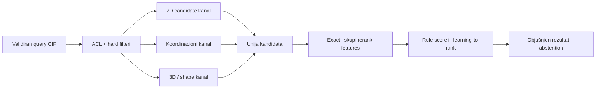

# Globalna pretraga: candidate generation, ANN i learning-to-rank

## Glavni zaključak

Globalna pretraga ne može se svesti na „CIF → jedan embedding → vector database → top 10“. Njene algoritamske uloge čine višestepenu kaskadu:



Svaki sloj ima različit zadatak:

1. **filter** uklanja nedozvoljene ili logički neodgovarajuće zapise;
2. **reprezentacija i metrika** definišu šta „blizu“ znači;
3. **indeks** ubrzava pronalaženje približnih suseda po toj metrici;
4. **reranker** koristi skuplje, rastavljive dokaze da preuredi mali skup;
5. **kalibracija/abstention** vezuju odluku za tačno definisan target.

Exact ECFP/count fingerprint + Tanimoto daje transparentnu 2D referencu. Za svaku dense reprezentaciju exact Flat je oracle prema kome se mere HNSW, IVF i PQ varijante; njihov izbor zavisi od recall–latency–memory kompromisa, filtera i troška kompresije. Porodica rerankera zavisi od dostupne supervizije: pravila su prikladna bez labela, pointwise modeli za pojedinačne relevance labele, a LambdaMART za stvarne query-grupisane ocene relevantnosti, binarne ili višestepene.

**Granica prema tekstualnom RAG-u:** svaki „dense embedding“ u ovom poglavlju znači validiranu reprezentaciju molekula, koordinacionog okruženja, 3D oblika ili periodične strukture. Dokumentacioni RAG, BM25, sentence embeddings i jezički rerankeri imaju drugi korpus, drugi relevance contract i drugi indeks. Generic text embedding CIF teksta nije crystal-similarity reprezentacija.

!!! warning "Prerequisite korpusa"
    Nijedan kanal ne indeksira „redove koji imaju odgovarajući format“ bez accounting-a. [Cross-format i lifecycle eligibility ugovor](09-cross-format-eligibility.md) određuje purpose-specific canonical view, fallback za entry bez SMILES/2D/3D pogleda, lifecycle inclusion politiku, denominatore i uslove pod kojima izvedeni rezultat više nije važeći.

## Prvi prolaz: jedan ceo upit {#primer-celog-upita}

Pretpostavimo coordination-mode query sa DAP motivom i Cu zahtevom.

1. Parser napravi parent/coordination reprezentacije i prijavi ambiguity.
2. Korisnik potvrdi da li scope zahteva samo pripadnost istom entry-ju ili koordinaciju sva tri mapirana DAP N atoma.
3. ACL i metadata engine izdvoje dozvoljene Cu zapise.
4. Exact motif indeks potvrdi DAP podgraf.
5. 2D fingerprint kanal vrati kandidate do kvote izabrane prema search mode-u i recall krivi.
6. Coordination kanal vrati zasebno budžetiran skup, uključujući neke kandidate sa nižim 2D score-om.
7. Unija se deduplikuje, ali čuva poreklo kanala.
8. Exact mapping proveri koji Cu je vezan za koje donor atome.
9. Geometrija izračuna CN, uglove i distortion samo kada su koordinate dovoljne.
10. Ranker sortira prema unapred definisanoj semantici relevantnosti koordinacionog motiva.
11. Obrazložen rezultat odvojeno navodi:
    - DAP subgraph coverage;
    - Cu scope;
    - donor mapping;
    - geometry status;
    - quality/missing warnings;
    - score/model/index verzije.

Kandidat sa Cu kao counterion može imati visok 2D Tanimoto, ali mora pasti na coordination dokazu. Kandidat sa različitim perifernim supstituentom može imati niži 2D score, a biti mnogo relevantniji po lokalnoj koordinaciji — razlog za multichannel retrieval.

**Preduslovi i čitalački slojevi.** Za osnovni postupak dovoljni su [vektori, rastojanja i ML evaluacija](00a-osnove-ml.md). Prvi prolaz prati [mali račun pretrage](#mehanika-ann) i [MinHash potpise](#minhash-primer). Zatim kroz hemiju20 i klasični ML savladaj [stabla i boosting](02-classical-ml.md#stabla-i-boosting), pa se u drugom prolazu vrati na [stručno ocenjen upit i učenje rangiranja](#rangiranje-primer). Ugovori u §3.1 i memorijske/reproduktivne pojedinosti u §3.7–3.8 i §3.19 služe stručnom referentnom prolazu.

## 3.1 Četiri odvojena ugovora

### Ugovor reprezentacije

Navodi:

- objekat: parent ligand, jedna komponenta, coordination entity ili cela crystal form;
- standardization profil;
- atom/bond/stereo/charge/isotope politiku;
- 2D, koordinacioni, 3D ili periodic/crystal nivo;
- verziju toolkit-a i parametara;
- ponašanje kod disorder-a, missing 3D i nepoznatih veza.

### Ugovor metrike

Navodi:

- funkciju sličnosti/rastojanja;
- njen domen i opseg;
- da li je veće bolje;
- simetriju i invariance;
- threshold semantiku;
- način tretiranja missing komponente.

### Ugovor indeksa

Navodi:

- tačnu reprezentaciju i metricu koju indeks aproksimira;
- build parametre i random seed;
- query parametre;
- podršku za filtere, insert/update/delete;
- memoriju, build vreme i expected recall;
- verziju korpusa i indeksa.

### Ugovor relevantnosti

Navodi šta ekspert ocenjuje, na primer:

- isti parent scaffold;
- isti koordinacioni motiv;
- sličnu lokalnu geometriju;
- isto ili povezano kristalno pakovanje;
- korisnost kandidata kao precedenta za dati upit.

Bez ova četiri ugovora nDCG ili „95% accuracy“ nema stabilno značenje.

## 3.2 Hard filteri nisu ML problem

Ovo se rešava deterministički:

- pristup i licenca;
- required/forbidden element;
- R-factor ili temperatura u dozvoljenom opsegu;
- ima/nema 3D koordinate;
- polymeric/non-polymeric, ako je polje pouzdano definisano;
- explicit exact formula/refcode/release uslov;
- korisnikov obavezni inclusion/exclusion uslov.

Koriste se relacijski, bitmap, inverted ili drugi exact indeksi. ML može eventualno označiti zapis za stručni pregled ako metadata nije pouzdana, ali ne sme tiho pretvoriti hard uslov u verovatnoću.

ACL, tenant i licencni predikati su **security enforcement**, ne običan relevance filter. Moraju važiti pre distance search-a kroz autorizovanu masku/ID selector, fizički dozvoljenu particiju ili exact-after-filter put. Isti kandidat se ponovo autorizuje pri prikazu/download-u. Permission scope je deo konteksta važenja izvedenog rezultata; promena prava zahteva njegovu invalidaciju ili ponovnu proveru.

Autorizovana maska je dovoljna samo ako konkretni engine i threat model garantuju da nedozvoljeni ID-jevi ne mogu u rezultat, log, cache ili merljiv side channel. Kada to nije dokazano, koristi se fizička particija ili exact search nad materijalizovanim dozvoljenim view-om.

**2CDC upozorenje:** „Cu prisutan u entry-ju“, „Cu u istoj komponenti“, „Cu u direktnom kontaktu sa ligandom“ i „isti Cu koordinisan svim mapiranim DAP azotima“ su četiri različita predikata. Nijedan embedding ne sme da sakrije tu razliku.

## 3.3 Višekanalne reprezentacije

| Kanal | Primer reprezentacije | Metrika | Uloga |
|---|---|---|---|
| sastav/metadata | element count, charge, component flags | exact/range/set | hard filter i jeftin prior |
| 2D graf | ECFP/Morgan binary ili count | Tanimoto/generalized Tanimoto | širok chemical-neighborhood recall |
| motiv/podgraf | query graph, SMARTS-like motiv | subgraph relation | exact uslov ili skupi rerank |
| koordinacija | metal, donor multiset, CN, geometry features | exact + feature distance | coordination-mode candidate/rerank |
| 3D molekul | USR/USRCAT ili validiran dense shape vektor konačnog conformer-a | odgovarajuća vector metrika | shape kandidat pre atom mapping-a; nije packing |
| crystal/packing | invariance-testiran periodic descriptor/embedding | metod-specifična | alternativna porodica, nikada nepretpostavljena zamena za packing poređenje |

Odvojeni search modes imaju odvojene primarne kanale. Jedan model ne treba da nagađa da li korisnik pod „slično“ misli isti scaffold, isti metal environment ili sličan packing.

### Granice USR/USRCAT-a

[USR](https://doi.org/10.1002/jcc.20681) i [USRCAT](https://doi.org/10.1186/1758-2946-4-27) računaju se nad eksplicitno odabranom konačnom molekulskom komponentom/conformer-om. Ne predstavljaju unit cell, periodične intermolekulske kontakte ni crystal packing. Pošto se originalni USR zasniva na momentima udaljenosti, reflection-invariant je i sam ne razlikuje enantiomerne oblike; stereo ostaje zaseban exact uslov/feature.

### Periodic-invariance gate

Crystal embedding ne ulazi u indeks dok isti fizički kristal ne daje ekvivalentan rezultat pod najmanje ovim metamorfnim transformacijama:

- permutacija atomskih redova, globalna translacija i rotacija;
- wrapping preko periodične granice i promena origin-a;
- symmetry-equivalent setting/opis;
- primitivna naspram konvencionalne ćelije;
- ekvivalentan supercell opis;
- ista kompletna periodic distance shell sa svim slikama/multiedges;
- permutacija ties na cutoff/top-k granici.

[Matformer](https://proceedings.neurips.cc/paper_files/paper/2022/file/6145c70a4a4bf353a31ac5496a72a72d-Paper-Conference.pdf) eksplicitno motiviše periodic invariance i problem proizvoljnog odabira među jednako udaljenim susedima. To nije dokaz da je Matformer optimalan za 2CDC; jeste dokaz da crystal reprezentacija mora testirati ovu klasu ekvivalencija.

## 3.4 ECFP + Tanimoto: transparentna 2D referenca

[Extended-connectivity fingerprints](https://doi.org/10.1021/ci100050t) iterativno kodiraju lokalna atomska okruženja. Za binary fingerprint sa skupovima uključenih bitova \(A\) i \(B\):

\[
T(A,B)=\frac{|A\cap B|}{|A|+|B|-|A\cap B|}.
\]

Za bit-vektore se presek i broj uključenih bitova mogu računati brzim bitwise operacijama i `popcount` instrukcijama. Zbog toga exact skeniranje nekoliko miliona fingerprinta može biti mnogo jači baseline nego što izraz „brute force“ sugeriše; mora se izmeriti na ciljnom hardveru pre uvođenja aproksimacije.

### Šta definiše reprezentaciju

| Kategorija | Primer odluke koja menja rezultat |
|---|---|
| objekat | parent, komponenta ili drugi standardizovani molekulski pogled |
| lokalno okruženje | radijus odnosno prečnik obuhvaćenih veza |
| kodiranje | binary ili count; sparse identifikatori ili folded bit-vektor |
| atomska i vezna semantika | invariants, naboj, izotopi, chirality i bond types |
| standardizacija | aromaticity model i prethodne normalizacije |
| numerička realizacija | toolkit, njegova verzija, hashing i folding pravilo |

`radius=2` često se naziva ECFP4 zbog prečnika četiri veze, ali naziv nije dovoljan: implementation, invariants, folding i standardization menjaju bitove.

### Metrika indeksa mora ostati ista

Binary ECFP + Tanimoto ne sme se bez dokaza pretvoriti u `float32` vektor i poslati u cosine/L2 indeks. Time bi ANN optimizovao drugo susedstvo. Dozvoljene opcije su:

- exact binary Tanimoto/Jaccard implementacija;
- indeks koji eksplicitno podržava istu binary metricu;
- MinHash/LSH aproksimacija sa izmerenim recall-om prema Jaccard/Tanimoto oracle-u;
- zaseban learned dense embedding, tretiran kao nov candidate kanal sa sopstvenim oracle-om.

Naziv „HNSW“ opisuje strategiju grafa, ne garantuje koju distance funkciju konkretna biblioteka podržava. Capability i numerička semantika implementacije deo su definicije evaluiranog metoda.

### Binary naspram count varijante

- binary kaže da se feature pojavio;
- count čuva multiplicitet;
- folded bit-vektor uvodi collisions;
- sparse identifikatori smanjuju folding collision, ali povećavaju storage/compute zahteve;
- ista „Tanimoto“ etiketa ne znači identičnu formulu za sve count implementacije.

Za nenegativne count vektore najmanje dve česte, ali različite opcije su min–max/Ružička:

\[
S_{\min/\max}(a,b)=\frac{\sum_i\min(a_i,b_i)}{\sum_i\max(a_i,b_i)},
\]

i dot-product Tanimoto:

\[
S_{\mathrm{dot}}(a,b)=
\frac{a^Tb}{\|a\|^2+\|b\|^2-a^Tb}.
\]

Obe se svode na binary Jaccard kada su komponente 0/1, ali nad count vrednostima mogu dati drugačiji poredak ([analiza Tanimoto porodice mera](https://doi.org/10.1186/s13321-015-0069-3)). Reproduktivna definicija zato navodi tačnu jednačinu, sparse/folded oblik, count-simulation pravilo, hashing i toolkit verziju; binary i count su odvojene hipoteze.

### Zašto score nije dokaz

Visok Tanimoto može nastati zbog velikog zajedničkog dela dok je ključni donor ili metal environment različit. Nizak score može sakriti mali, ali za upit presudan motiv. Rezultat zato prikazuje matched substructures/common core i posebne koordinacione dokaze; fingerprint ostaje candidate/ranking signal.

## 3.5 Exact referenca pre ANN-a

### Iste tačke, četiri različita postupka {#mehanika-ann}

**Pitanje:** kako ubrzati pronalaženje suseda, i gde se pritom može izgubiti pravi rezultat? Posmatrajmo zaseban nastavni vektorski primer sa upitom \(q=(0,0)\). Koordinate su bezdimenzioni izmišljeni deskriptori, ne atomski položaji niti tvrdnja o hemijskoj relevantnosti.

| Tačka | Vektor | Kvadrat rastojanja do \(q\) |
|---|---|---|
| \(x_1\) | \((0{,}9,0{,}2)\) | \(0{,}81+0{,}04=0{,}85\) |
| \(x_2\) | \((0{,}4,0{,}9)\) | \(0{,}16+0{,}81=0{,}97\) |
| \(x_3\) | \((1{,}5,0)\) | \(2{,}25\) |
| \(x_4\) | \((2{,}5,1)\) | \(7{,}25\) |
| \(x_5\) | \((4,1)\) | \(17\) |
| \(x_6\) | \((4{,}5,2)\) | \(24{,}25\) |

**Exact Flat** računa svih šest rastojanja i vraća poredak \(x_1,x_2,x_3,x_4,x_5,x_6\). Kvadriranje nenegativnog rastojanja ne menja taj poredak. Ovaj potpuni rezultat je referenca (*oracle*) za aproksimaciju iste metrike.

**HNSW** koristi graf susedstva da dođe do obećavajućeg dela skupa. Zamislimo ručno zadat gornji sloj \(x_5\leftrightarrow x_3\), a donji sloj sa sledećim ivicama:

```text
x6 — x5 — x3 — x2
           |
           x4 — x1
```

Pretraga iz \(x_5\) prelazi u \(x_3\), jer rastojanje pada sa \(17\) na \(2{,}25\). U donjem sloju razmatra \(x_2\) i \(x_4\). Sa samo jednim zadržanim najboljim kandidatom ostaje \(x_2\), a put preko udaljenijeg \(x_4\) se odbacuje: najbliži \(x_1\) nije ni pregledan. Šira pretraga koja zadrži i proširi \(x_4\) otkriva \(x_1\). Parametar `efSearch` kontroliše širinu skupa kandidata koji pretraga održava; nije broj vraćenih rezultata niti unapred tačan broj obrađenih čvorova. Ovo je namerno mali graf koji pokazuje moguć promašaj, a ne tvrdnja da bi HNSW izgradnja baš ovako povezala ovih šest tačaka. Mehanizam slojeva i zadržavanja kandidata opisuje [izvorni HNSW rad](https://arxiv.org/abs/1603.09320).

**IVF-Flat** najpre deli iste tačke prema najbližem unapred naučenom predstavniku particije (*coarse centroid*). Radi ručnog računa zadajmo predstavnike \(c_1=(0,1)\), \(c_2=(2,0)\), \(c_3=(5,1)\). Njima pripadaju liste \(\{x_2\}\), \(\{x_1,x_3,x_4\}\), \(\{x_5,x_6\}\). Na primer, \(x_1\) je bliži \(c_2\) nego \(c_1\), jer su kvadratna rastojanja \(1{,}25<1{,}45\). Upit je, međutim, bliži \(c_1\): njegove kvadratne udaljenosti do predstavnika su \(1,4,26\). Zato `nprobe=1` otvara samo prvu listu i vraća \(x_2\), propuštajući \(x_1\). Sa `nprobe=2` otvara i drugu listu i nalazi \(x_1\); sa sve tri liste i bez dodatnog ograničenja skeniranja pregledao bi ceo skup. `nlist` je broj particija, a `nprobe` broj otvorenih particija po upitu.

**PQ — kvantizacija po delovima (*product quantization*)** može promeniti poredak i kada su obe tačke pronađene. Podelimo svaki 2D vektor u dva jednodimenzionalna dela. Za prvi deo zadajmo rečnik predstavnika (*codebook*) \([0,1,3,5]\), a za drugi \([0,0{,}5,2,3]\), sa identifikatorima od 0 do 3. Svaki deo menjamo najbližim predstavnikom:

| Tačka | Kodovi dva dela | Rekonstrukcija | Približno \(d^2(q,x)\) |
|---|---|---|---|
| \(x_1=(0{,}9,0{,}2)\) | \((1,0)\) | \((1,0)\) | \(1\) |
| \(x_2=(0{,}4,0{,}9)\) | \((0,1)\) | \((0,0{,}5)\) | \(0{,}25\) |

Query ostaje u punoj preciznosti, a tabeliraju se njegova rastojanja do predstavnika delova; zbir dve tabelarne vrednosti daje približno rastojanje do kodiranog kandidata. Sada \(x_2\) izgleda bliže od \(x_1\), iako exact račun kaže suprotno. Rečnici su nastavna ilustracija kompresione greške; u stvarnom PQ-u uče se nad odgovarajućim trening uzorkom. IVF-PQ dodaje ovu grešku rastojanja na već postojeće preskakanje IVF listi. Osnovu takvog računanja daje [izvorni PQ rad](https://doi.org/10.1109/TPAMI.2010.57).

**Pouka:** HNSW i IVF mogu izostaviti tačku iz kandidata; PQ može pogrešno poređati pronađene tačke. Ponovni exact račun nad \(\{x_1,x_2\}\) ispravlja PQ poredak, ali nad samim \(\{x_2\}\) ne može vratiti \(x_1\). Zato se najpre meri obuhvat kandidata, zatim finalni poredak, pa tek onda memorijska korist. Ovi mali računi ne mere brzinu niti biraju najbolji indeks za stvaran korpus.

### Stručni sloj: uslovi exact reference

Validacija svakog približnog indeksa zahteva exact oracle nad zamrznutim evaluation snapshot-om:

```text
isti corpus version
+ isti ACL i hard filteri
+ ista reprezentacija
+ ista metrika
+ exact top-K sa stabilnim tie pravilom
= infrastrukturni referentni susedi
```

Ovaj oracle govori da li je ANN izgubio susede po izabranoj metrici. Ne govori da li su ti susedi naučno relevantni; za to je potreban odvojen ekspertni set.

### Exact Flat za dense vektore

Exact L2 ili inner-product scan čuva pune vektore i poredi query sa svim dozvoljenim kandidatima. [Faiss pregled indeksa](https://github.com/facebookresearch/faiss/wiki/Faiss-indexes) navodi približno `4*d` bajtova po float32 vektoru za Flat indeks.

Exact Flat ima tri odvojene uloge:

- ground truth za ANN recall;
- exact metod kada korpus i latencija to dopuštaju;
- kontrola da loš rezultat nije greška rankera nego same reprezentacije.

Za cosine search vektori se normalizuju, pa se koristi inner product. Ta transformacija mora biti deo representation version-a.

## 3.6 Kandidati za približnu pretragu

| Metod | Snaga | Cena/rizik | Uslov primenljivosti |
|---|---|---|---|
| optimizovan exact bit scan | nema ANN gubitka; jednostavan oracle | linearni scan | referenca i mogući metod kada scale to dopušta |
| exact bounded/inverted Tanimoto | čuva exact rezultat uz cardinality/bound pruning | složeniji indeks; dataset-dependent dobitak | kada pruning smanjuje trošak bez promene metrike |
| MinHash/LSH | prirodno aproksimira Jaccard/set sličnost | drugačiji fingerprint i recall profil | kao zasebna representation-matched aproksimacija |
| HNSW-Flat | visok recall/latency odnos; nema vector quantization | znatna RAM cena; build/tuning; filter komplikacije | kada RAM, izgradnja i filteri odgovaraju workload-u |
| IVF-Flat | manja graph overhead; kontroliše broj listi | mora trenirati coarse quantizer; `nprobe` recall tradeoff | kada clustered search daje bolji Pareto kompromis |
| IVF-PQ | veliko smanjenje memorije | lossy distance i dodatni recall pad | kada je memorija ograničenje i recall je potvrđen prema oracle-u |
| learned dual encoder | može učiti task-specific susedstvo | traži mnogo dobrih labela i false-negative kontrolu | samo uz validnu task-specific superviziju |

Ne postoji bibliotečki benchmark koji bira pobednika za 2CDC. [ANN-Benchmarks](https://doi.org/10.1016/j.is.2019.02.006) pokazuje da implementacije imaju različite recall–latency tradeoff-e i da se algoritmi moraju meriti na konkretnim podacima i metrici. Hemijski specifični [bounds za exact fingerprint search](https://doi.org/10.1021/ci600358f) i [inverted-index pristup](https://doi.org/10.1021/ci200552r) moraju se izmeriti između linear scan-a i lossy ANN-a.

## 3.7 HNSW

[Hierarchical Navigable Small World](https://doi.org/10.1109/TPAMI.2018.2889473) gradi višeslojni proximity graf. Pretraga kreće kroz retke više slojeve, zatim se rafinira u gušćem donjem sloju.

Glavni parametri:

- `M`: broj veza/suseda u grafu; više obično povećava RAM, build vreme i potencijalni recall;
- `efConstruction`: širina pretrage pri gradnji;
- `efSearch`: širina pri query-ju; može se menjati bez rebuild-a i direktno menja recall–latency odnos;
- distance/metric implementation;
- broj niti, ordering i library version.

### Ilustrativna memorija

Za float32 vektor dimenzije \(d\), dominantni donji sloj HNSW-Flat može se grubo proceniti kao:

\[
4d + 8M\ \text{bajta po vektoru},
\]

jer se čuva `4d` bajtova vektora i približno `2M` četvorobajtnih linkova. Za \(d=256\) i \(M=32\):

\[
4\cdot256+8\cdot32=1280\ \text{B/vector},
\]

odnosno najmanje približno **1,28 GB za milion vektora** u decimalnim jedinicama. Stvarni proces troši više zbog viših slojeva, ID-jeva, poravnanja, allocator-a, metadata i runtime overhead-a. Zvanični Faiss pregled zato formulu piše sa dodatnim faktorom za prosečan broj linkova po slojevima, a ne kao fiksnu garanciju.

### Failure modes

- query iz retke oblasti može imati drugačiji recall od proseka;
- veliki `efSearch` može ukloniti dobitak u latenciji;
- post-filter može odbaciti pronađene susede i sakriti validne dozvoljene rezultate;
- updates/deletes i determinističnost zavise od implementacije; konkretno, [Faiss `IndexHNSW`](https://github.com/facebookresearch/faiss/wiki/Faiss-indexes) ne podržava uklanjanje vektora, pa lifecycle ponašanje i validnost izvedenih rezultata zahtevaju zasebno definisanu politiku;
- mnogi identični ili skoro identični vektori mogu degradirati HNSW/IVF pretragu i popuniti top-k;
- HNSW nad pogrešnim embeddingom samo brzo vraća pogrešno definisane susede.

## 3.8 IVF-Flat i IVF-PQ

### IVF-Flat

Standardni Faiss inverted file dodeljuje svaki bazni vektor najbližem coarse centroidu i jednoj inverted listi. Query pretražuje `nprobe` izabranih listi. Višestruka bazna dodela bila bi posebna, eksplicitno imenovana varijanta.

Parametri:

- `nlist`: broj listi;
- trening uzorak coarse quantizer-a;
- `nprobe`: broj pregledanih listi po query-ju;
- strategija za nove release-ove i drift;
- puna vector metrika u pretraženim listama.

IVF-Flat čuva pune vektore; aproksimacija dolazi iz preskakanja listi, ne iz kompresije vektora. Ako se distribucija korpusa promeni, quantizer i raspodela listi se moraju ponovo proveriti.

### Product Quantization

[Product Quantization](https://doi.org/10.1109/TPAMI.2010.57) deli vektor na `M_PQ` podvektora i svaki predstavlja kodom iz malog codebook-a. Time se pune koordinate zamenjuju kratkim kodovima i distance se aproksimiraju lookup tabelama. `M_PQ` nije isti parametar kao `M_HNSW`, koji označava graph connectivity.

IVF-PQ kombinuje:

1. coarse IVF izbor listi;
2. PQ kodove, često nad residualima;
3. približno rangiranje;
4. po mogućnosti full-precision rerank šireg candidate skupa.

Faiss za `IndexIVFPQ` navodi približno `ceil(M_PQ * nbits / 8) + 8` bajtova po vektoru za kod i ID, bez svih spoljnih struktura. Za `d=256`, `M_PQ=32`, `nbits=8`, to je oko 40 MB kodova i ID-jeva na milion vektora. Ako se puni float32 vektori drže u RAM-u za reranking, dodaje se približno 1,024 GB; tu su još centroidi, liste, metadata, allocator, I/O cache i peak memorija za dual-run/rebuild.

IVF-Flat okvirno zahteva `(4d + 8)N` bajtova za vektore i ID-jeve, plus coarse centroids i list structures. End-to-end memory benchmark mora navesti da li su full vectors u RAM-u, memory-mapovani ili u spoljnom store-u i uključiti njihov I/O u latenciju.

PQ je racionalan samo kada je memorija stvarno ograničenje i kada IVF/PQ candidate faza ima prihvatljiv `candidate Recall@N` prema Flat oracle-u. Full-precision rerank zatim preuređuje pronađeni pool i meri finalni `Recall@K`; ne može oporaviti true neighbor koji je candidate faza izostavila.

## 3.9 MHFP6, MinHash i LSH

### Od okruženja do potpisa i kandidata {#minhash-primer}

**Pitanje:** možemo li veliki skup molekulskih okruženja sažeti tako da slični skupovi često dobiju isti deo potpisa? Uzmimo nastavne identifikatore okruženja \(a,b,c,d,e\), uz skupove \(Q=\{a,b,c\}\), \(B=\{a,b,d\}\), \(C=\{c,e\}\), \(D=\{b,c,d\}\). Imena objekata prate [matični primer](https://github.com/nemper/crystallography-and-ml-theory/blob/main/chemistry-foundations/docs/povezani-primer.md#objekti); tokeni su dodatna izmišljena reprezentacija za račun, nisu izvedeni iz spoljnog fajla niti iz geometrije primera.

Za svaki skup koristimo **ista** četiri rangiranja svih tokena. Najlevlji token ima rang 1. MinHash komponenta je najmanji rang tokena koji se nalazi u datom skupu:

| Permutacija, od ranga 1 do 5 | Minimum za Q | Minimum za B | Minimum za C | Minimum za D |
|---|---|---|---|---|
| \(a,b,c,d,e\) | \(a:1\) | \(a:1\) | \(c:3\) | \(b:2\) |
| \(b,d,e,c,a\) | \(b:1\) | \(b:1\) | \(e:3\) | \(b:1\) |
| \(c,e,a,d,b\) | \(c:1\) | \(a:3\) | \(c:1\) | \(c:1\) |
| \(e,c,b,a,d\) | \(c:2\) | \(b:3\) | \(e:1\) | \(c:2\) |

Potpisi su zato \(h(Q)=(1,1,1,2)\), \(h(B)=(1,1,3,3)\), \(h(C)=(3,3,1,1)\), \(h(D)=(2,1,1,2)\). Procena Jaccard sličnosti je udeo jednakih komponenti: za Q/B je \(2/4=0{,}5\), za Q/C \(1/4=0{,}25\), a za Q/D \(3/4=0{,}75\). Exact Jaccard vrednosti originalnih skupova su redom \(2/4=0{,}5\), \(1/4=0{,}25\) i \(2/4=0{,}5\): poslednji par pokazuje grešku kratkog potpisa.

Za nezavisne uniformno slučajne permutacije, verovatnoća istog minimuma jednaka je Jaccard sličnosti: prvi token iz unije mora pripasti preseku. Prosek \(L\) takvih indikatora procenjuje \(J\), sa varijansom \(J(1-J)/L\) u tom idealizovanom modelu. U praktičnom kodu koriste se hash porodice, čije zavisnosti i kolizije treba proveriti; četiri ovde ručno odabrane permutacije samo objašnjavaju postupak.

**Uslovna LSH grana.** Hashiranje osetljivo na lokalnost (*locality-sensitive hashing*) može potpise podeliti u dve trake (*bands*) po dve komponente. Kandidat se bira ako se sa Q poklopi cela prva **ili** cela druga traka. B se bira preko prve \((1,1)\), D preko druge \((1,2)\), dok se C ne bira ni preko jedne. Potom se nad B i D ponovo računa exact Jaccard originalnih skupova i skuplji stručni dokazi. Propušteni C se tim ponovnim rangiranjem ne može vratiti.

Uz idealno nezavisne MinHash komponente, \(b\) traka od po \(r\) komponenti daje verovatnoću kandidature \(1-(1-J^r)^b\). Za \(b=r=2\) i \(J=0{,}5\) to je \(1-(1-0{,}25)^2=0{,}4375\), ne garancija za jedan konkretan potpis. Ovde je broj komponenti \(L=br\). Duži potpis smanjuje grešku procene sličnosti, dok raspored traka određuje propuštanje kandidata i veličinu kandidatnog skupa; promena oba parametra mora razdvojiti ova dva efekta. Ovu klasičnu MinHash/LSH konstrukciju izvodi [autorski udžbenik, poglavlje 3.3–3.4](https://infolab.stanford.edu/~ullman/mmds/ch3n.pdf).

### Stručni sloj: MHFP reprezentacija i dve vrste greške

[MHFP6](https://doi.org/10.1186/s13321-018-0321-8) pravi set SMILES zapisa kružnih atomskih okruženja prečnika do šest veza (radijus tri), uz prstenske SMILES prema izvornom shingling pravilu, i koristi MinHash. To omogućava locality-sensitive hashing za približnu Jaccard sličnost; broj 6 nije radijus okruženja.

To ga čini smislenom alternativom za veliki 2D korpus, ali ne i drop-in ECFP ekvivalentom:

- tokenizacija i canonical SMILES politika utiču na shingles;
- MinHash procenjuje set/Jaccard odnos, pa uvodi sampling grešku;
- broj permutacija i LSH parametri menjaju memoriju/recall;
- benchmark iz originalnog rada nije CSD globalna pretraga;
- LSH recall meri se prema exhaustive search-u istih MHFP potpisa;
- MinHash aproksimacija se, po potrebi, zasebno meri prema exact Jaccard-u originalnih shingle skupova;
- ECFP i MHFP se međusobno porede prema ekspertskim qrels/end-to-end metrikama; slaganje njihovih top-k lista je samo dijagnostika.

## 3.10 Filter-aware pretraga

Za ACL/licencu je sledeći tok bezbednosno nedozvoljen; za običan metadata filter je i naučno nepouzdan:

```text
ANN top 100 → odbaci 97 koji ne ispunjavaju filter → vrati 3
```

Možda postoji 100 vrlo dobrih dozvoljenih kandidata odmah iza njih. [ACORN](https://doi.org/10.1145/3654923) i rad o [window-filtered ANN](https://proceedings.mlr.press/v235/engels24a.html) pokazuju da je filtered ANN poseban problem, ne samo povećavanje standardnog HNSW parametra.

Dozvoljene strategije uključuju:

- security prefilter dozvoljenih ID-jeva kada engine podržava autorizovanu bitset/masku;
- fizički odvojene indekse za stabilne tenant/licencne particije;
- filter-aware graph/IVF implementaciju;
- adaptivno oversampling/`efSearch`/`nprobe` samo kao aproksimativni fallback za nebezbednosne metadata filtere;
- exact scan kada filter svodi korpus na mali skup;
- query planner koji bira put na osnovu selectivity procene.

Oversampling ima maksimalni compute budget. Dobijanje `k` rezultata ne dokazuje da su to najbližih `k` unutar filtriranog skupa. Kada budget istekne, planner prelazi na exact scan/particiju ili označava rezultat kao nepotpun i uzdržava se od tvrdnje o kompletnom top-k.

Ovde postoje **dva različita oracle-a**. Pre ANN merenja, hard-filter evaluator na nezavisno anotiranim fixture-ima zahteva `actual_eligible_ids == expected_eligible_ids` (FP = 0 i FN = 0), uz non-vacuous positive, legitimni zero-hit, boundary i missing/unknown/invalid/failure slučaj. Tek zatim exact-after-filter oracle poredi približnu i exact pretragu **unutar tog već validiranog skupa**. Waterfall conservation i visoka precision sami ne dokazuju da filter nije izgubio dozvoljene entry-je.

Filtered recall se meri prema exact top-`K'` **unutar istog filtriranog skupa**, gde je `K' = min(K, broj dozvoljenih zapisa posle self/duplicate politike)`:

\[
R_{filtered}@K'=\frac{|ANN_K(q,F)\cap Exact_{K'}(q,F)|}{K'},
\]

uz tie-aware varijantu iz §3.16. Ako je `K'=0`, recall nije definisan: odvojeno se proverava da je rezultat prazan i prijavljuje broj takvih upita, bez dodeljivanja lažnog recall-a 0 ili 1. Izveštaj slice-uje filter selectivity i korelaciju filtera sa vector prostorom; retki nasumični filter nije dovoljan test.

### Ilustrativni cost režimi

| Režim posle filtera | Mogući plan |
|---|---|
| mali dozvoljeni skup | exact scan |
| srednji skup | exact SIMD ili filter-aware IVF/HNSW, prema izmerenom cost modelu |
| veliki skup | representation-matched candidate search + exact rerank |

Granice ovih režima zavise od hardvera, metrike, filter kombinacije i traženog recall-a; nisu univerzalni brojčani pragovi.

## 3.11 Unija više candidate kanala

Jedan kanal može sistematski propustiti važan rezultat. Kandidati se zato mogu prikupljati sa zasebnim kvotama:

```text
kvota po 2D fingerprintu
+ kvota po coordination descriptoru
+ kvota po 3D shape-u
+ exact hits obaveznih motiva
→ deduplikovana unija
→ skupi features i reranking
```

Kvote se biraju po search mode-u i recall krivama. Ne treba prvo normalizovati nesamerljive score-ove i uzeti jedan prosečni top-k, jer dominantni kanal može ugušiti jedinstvene kandidate iz drugog.

Za svaki kandidat čuvaju se:

- kanali koji su ga predložili;
- rank i score unutar svakog kanala;
- representation/index version;
- filteri i candidate budget;
- da li je kandidat stigao exact pravilom.

### Identity i deduplikacioni ugovor

Kanal vraća dovoljno identiteta da se component hit bez gubitka podigne na finalni entry/crystal rezultat:

| Kategorija | Svrha |
|---|---|
| entry i crystal-form identitet | definiše nivo finalnog rezultata |
| matched component i coordination entity | čuva objekat na kome je kanal našao hit |
| red reprezentacije i tip objekta | omogućava reverzibilno mapiranje parent/component/coordination/crystal pogleda |
| kanal, rank i score | čuva poreklo candidate signala bez mešanja nesamerljivih score-ova |
| match provenance | povezuje rezultat sa korišćenom reprezentacijom i metodom |

Deduplikacija i candidate recall računaju se na unapred izabranom finalnom nivou, dok se svi component-level hitovi zadržavaju kao evidence. Veza između reda pojedinačne reprezentacije i krajnjeg hemijskog ili kristalnog entiteta verzionisana je i reverzibilna.

Identični 2D fingerprinti se ne smeju tiho svesti na jednu crystal form-u: polymorphs namerno dele 2D graf. [Faiss FAQ](https://github.com/facebookresearch/faiss/wiki/FAQ) dokumentuje i performance problem mnogih identičnih vektora u IVF/HNSW. Exact vector dedup je dozvoljen samo kao infrastrukturna optimizacija uz reverzibilnu fan-out mapu. Ako proizvod želi raznovrsne precedente, dodatno se meri family-collapsed/group-aware nDCG ili uvodi eksplicitni diversity sloj; raw i collapsed metrike se ne mešaju.

## 3.12 Exact i skupi rerank features

Nad deduplikovanom unijom računaju se dokazi koji su preskupi za ceo korpus:

- exact fingerprint score iz originalne reprezentacije;
- exact motif/subgraph match;
- MCS/common-core coverage;
- atom mapping i mapped RMSD;
- metal identity, donor mapping, CN i geometry distortion;
- 3D shape/pharmacophore score;
- packing rezultat validirane COMPACK/PAC implementacije, kada su metod i ulaz primenljivi;
- interaction-network similarity;
- quality i missing reason;
- source/provenance compatibility.

ANN score nikada nije dovoljan kao finalni naučni score. Ako je candidate vector bio PQ-kompresovan, finalni model dobija full-precision ili deterministički ponovo izračunate features.

[COMPACK](https://doi.org/10.1107/S0021889804027074) i [PAC](https://doi.org/10.1107/S1600576722009670) nisu generičke etikete za proizvoljan crystal embedding. Packing poređenje zahteva pouzdanu molekulsku dekompoziciju, koordinate, ćeliju/simetrijsku ekspanziju i eksplicitnu politiku za višekomponentne, polimerne i disordered strukture. Izlaz čuva najmanje matched-molecule coverage i RMSD; PAC dodatno koristi oblik klastera, uključujući radius of gyration. PXRD/periodični embedding može biti candidate signal, ali sam ne dokazuje identičan packing. Neprimenljivo poređenje označava se kao takvo i ne dobija naučnu relacionu labelu niti izmišljenu nulu.

## 3.13 Learning-to-rank: kada i koji model

### Jedan upit, tri zapisa iste supervizije {#rangiranje-primer}

**Pitanje:** šta model treba da nauči iz stručnog redosleda kandidata? Nastavljamo [isti sintetički upit Q](https://github.com/nemper/crystallography-and-ml-theory/blob/main/chemistry-foundations/docs/povezani-primer.md#kandidati). Ekspert daje kandidatu B ocenu 2 — vrlo koristan precedent; kandidatu C ocenu 1 — delimično koristan; kandidatu D ocenu 0 — nije koristan za definisani upit. Ocene su nastavne, vezane za isti kriterijum relevantnosti; nisu procenti niti merenja strukturalne udaljenosti.

Neka \(x(Q,j)\) sadrži dostupne dokaze o upitu i kandidatu \(j\), a \(s_j=f(x(Q,j))\) bude skor modela. Iste ocene daju različite jedinice supervizije:

| Pristup | Zapis trening uzorka | Šta ulazi u gubitak | Šta model predviđa |
|---|---|---|---|
| pointwise — pojedinačni red | \((Q,B,2),(Q,C,1),(Q,D,0)\) | predikcija i ocena svakog reda; npr. regresiono \((s_j-y_j)^2\), ili odgovarajući klasifikacioni/ordinalni gubitak | ocenu, distribuciju klasa ili skor kandidata |
| pairwise — preferencija za isti upit | \((Q,B\succ C),(Q,B\succ D),(Q,C\succ D)\) | razlika dva skora; npr. \(\ln(1+\exp(-(s_i-s_j)))\) kada \(i\succ j\) | skorove čije razlike uređuju kandidate |
| listwise — cela lista upita | \((Q,[B,C,D],[2,1,0])\) | svi skorovi i ocene grupe; npr. cross-entropy između softmax raspodela ocena i skorova | međusobno usklađene skorove i rang-listu |

Listwise primer bira \(p_j=\exp(y_j)/\sum_k\exp(y_k)\), \(\hat p_j=\exp(s_j)/\sum_k\exp(s_k)\) i \(-\sum_jp_j\ln\hat p_j\); to je jedna konkretna konstrukcija, ne definicija svakog listwise metoda. [Logaritamski i softmax uvod](00a-osnove-ml.md#log-exp-softmax) objašnjava ove operacije. Sva tri reda/preferencije dele upit, pa nisu tri nezavisne hemijske grupe.

**Par u App 2 je druga jedinica.** Labela „kristali B i C imaju isti parent graf“ odnosi se na jednu relaciju dva kristala. Preferencija \(B\succ C\mid Q\) poredi korisnost **dva kandidata za treći, zajednički upit**. Binarne App 2 labele postaju ranking ocene tek ako zaseban protokol definiše upit, kandidate i njihovu relevantnost; ne pretvaraju se u preferencije nasumičnim spajanjem parova.

### Zašto zamena na vrhu menja nDCG

Izaberimo \(gain(y)=2^y-1\), popust \(1/\log_2(r+1)\) za poziciju \(r\) i cutoff 3. Sve tri ocene su poznate. Tada

\[
DCG@3=\sum_{r=1}^{3}\frac{2^{y_r}-1}{\log_2(r+1)},\qquad
nDCG@3=\frac{DCG@3}{IDCG@3}.
\]

Idealna lista B,C,D ima \(IDCG=3+1/\log_2 3+0=3{,}63093\). Lista C,B,D ima \(DCG=1+3/\log_2 3=2{,}89279\), pa \(nDCG=0{,}79671\). Zamena prva dva mesta košta \(0{,}20329\) nDCG jedinica. Zamena donja dva mesta daje B,D,C, \(DCG=3+1/2=3{,}5\) i \(nDCG=0{,}96394\): gubitak je samo \(0{,}03606\). To pokazuje dejstvo izabrane gain/discount formule; nije univerzalna tvrdnja da su sve greške pri vrhu uvek veće.

Ako retrieval propusti C i vrati samo B,D, idealni denominator za end-to-end nDCG ostaje definisan poznatim ocenama B,C,D; ne smanjuje se na preživeli skup da bi promašaj nestao. U kontrolisanom eksperimentu samo sa rerankerima može se zasebno koristiti zajednički zamrznut kandidatni skup, ali se to tako imenuje. LambdaMART u nastavku povezuje značaj zamena sa sekvencijalnim korekcijama već objašnjenim u [boostingu](02-classical-ml.md#stabla-i-boosting).

### Stručni sloj: izbor porodice i granice labela

### Režim bez labela

Koristi se verzionisana transparentna formula ili lexicographic pravilo po search mode-u. Na primer:

```text
1. obavezni motif mora biti exact match;
2. zatim sortiraj po common-core coverage;
3. zatim po coordination compatibility;
4. Tanimoto koristi kao tie-breaker;
5. neocenjen packing ne tretiraj kao nulu.
```

Ovo je bolji početak od učenja na pseudo-labelama koje samo kopiraju staru formulu.

### Pointwise baseline

Logistička/ordinalna regresija, RF ili GBDT predviđaju relevantnost svakog `(query, candidate)` reda. Jednostavni su za baseline i mogu se kalibrisati, ali loss ne optimizuje direktno poredak unutar query-ja.

### Pairwise ranking

[RankSVM](https://doi.org/10.1145/775047.775067) uči da relevantniji kandidat dobije veći score od manje relevantnog za isti query. [RankNet](https://doi.org/10.1145/1102351.1102363) koristi probabilistički pairwise loss.

Pairwise trening ne znači da se parovi smeju nasumično deliti: query/compound/solid-form grupa prvo pripada train ili test particiji, pa se preferences formiraju unutar nje.

RankNet-ov output može se tumačiti samo u okviru tačno definisane preferencije `P(i ≻ j | q)` i uz proverenu kalibraciju; nije automatski `P(candidate relevant | q)`. Za verovatnoću relevantnosti jednog rezultata potreban je zaseban pointwise target i calibrator fitovan na group-disjoint validation skupu, uz Brier/log-loss/reliability test po mode-u i kritičnim slice-ovima.

### LambdaMART

[LambdaMART](https://www.microsoft.com/en-us/research/publication/from-ranknet-to-lambdarank-to-lambdamart-an-overview/) kombinuje LambdaRank ideju sa boosted regression trees i podešava gradijente prema promeni ranking metrike poput nDCG.

Dobar je kandidat kada postoje:

- mnogi query-ji;
- više kandidata po query-ju;
- query-grupisane ocene sa razlikama relevantnosti; višestepene `0/1/2` daju bogatiji signal od binarnih;
- dovoljno hard negatives;
- query-grouped trening API;
- stabilne, rastavljive tabularne features.

Višestepene ocene nisu matematički preduslov: i binarne `0/1` ocene mogu trenirati LambdaMART ako su vezane za stvarne query grupe sa razlikama relevantnosti. [LightGBM dokumentacija](https://lightgbm.readthedocs.io/en/stable/Parameters.html#label_gain) definiše dobitke za celobrojne relevance labele. Višestepene ocene daju bogatiju superviziju; nasumično spajanje nepovezanih parova u izmišljeni query ne daje validan ranking zadatak.

Nije opravdan kada je „labela“ samo Tanimoto threshold ili stari rule score. Tada model u najboljem slučaju imitira postojeću formulu, a može dodati leakage.

LambdaMART score nema inherentno probabilističko značenje. Prikazuje se kao ranking score ili se iznad njega gradi i zasebno validira target-specific probability model; nikada se samo ne preimenuje u „procenat sličnosti“.

## 3.14 Features za ranker

Minimalne porodice:

| Porodica | Primeri |
|---|---|
| query/candidate veličina | heavy atom count, component count, metal count |
| 2D | binary/count Tanimoto, MCS atom/bond coverage, motif flags |
| koordinacija | isti metal, donor-set overlap, CN difference, geometry score |
| 3D | mapped atom count, RMSD, max deviation, USRCAT score |
| crystal | packing coverage/RMSD, PXRD/periodic descriptor score |
| interakcije | H-bond/coordination motif overlap, network topology |
| kvalitet | disorder, occupancy, missing H, temperature/R flags |
| retrieval | kanal, originalni rank/score, candidate multiplicity |
| status | odvojeni indikatori da je grana ocenjena, dvosmislena, neprimenljiva, bez potrebnog ulaza, blokirana kvalitetom, prekinuta istekom vremena ili neuspešna |

Ne davati modelu refcode, publication ID, laboratoriju ili release kao slobodan feature osim ako je cilj eksplicitno provenance/risk i postoji dokaz da proxy nije leakage. Missing nije broj nula; status se čuva odvojeno od vrednosti.

### Monotone constraints

Boosted trees mogu dobiti monotone constraints, ali samo za bezuslovno poznate odnose. Na primer, veća common-core coverage možda treba da ne smanjuje score kada su svi drugi feature-i fiksni. Međutim, veći Tanimoto nije bezuslovni dokaz relevantnosti u svakom search mode-u. Svaki constraint zahteva stručni zapis i ablation test.

## 3.15 Labele i hard negatives

### Semantika labele

Svaka ocena mora biti vezana za query, search mode i kandidata, uz grade, rastavljive graph/coordination/geometry/packing odluke, razloge, anotatore, adjudikaciju i stepen pouzdanosti.

Ocena `2` u scaffold mode-u nije ista semantika kao `2` u packing mode-u. Zato su potrebni odvojeni rankeri ili eksplicitan mode input i zasebne slice metrike; iz zajedničke numeričke oznake ne sledi zajednički target.

### Hard negatives

Korisni negativi su kandidati koji:

- imaju visok ECFP, ali različit ključni motif;
- imaju isti metal i donor elements, ali pogrešan donor mapping;
- dele scaffold, ali su različite charge/stereo politike;
- imaju sličnu ćeliju/space group, ali različit packing;
- prolaze jedan kanal, a padaju na stručnom cilju.

Neoznačeni par nije automatski negativan. Positive–unlabeled ili aktivno označavanje je sigurnije od masovnog proglašavanja svih nepoznatih parova nulom.

### Dostavljeni `search1`/`search2` nisu ground truth

`search2` je uređeni, filterisani podskup `search1`. Ako se redovi iz `search2` označe kao pozitivni, a isključena 72 kao negativni, model samo uči kriterijum kojim je `search2` već napravljen. To je label circularity, ne dokaz relevantnosti ni koordinacije.

Ti fajlovi su korisni za:

- razumevanje export šeme i ordering-a;
- parser i reconciliation testove;
- demonstraciju filter semantike;
- pravljenje pitanja za ekspertsko označavanje.

Nisu validan supervised benchmark bez nezavisne ciljne definicije i novih oznaka.

## 3.16 Evaluacija kroz tri odvojena nivoa

### A. Infrastrukturni ANN recall

Za svaki query klasični ID-overlap je:

\[
\mathrm{Recall@N}=\frac{|\mathrm{ANN}_N(q)\cap \mathrm{Exact}_K(q)|}{|\mathrm{Exact}_K(q)|},\qquad N\ge K.
\]

Meri koliko exact top-\(K\) suseda preživi u ANN candidate budget-u \(N\). Obavezno navesti:

- `K`, `N`, ties i self-match politiku;
- isti ACL/filter corpus;
- macro prosek po query-ju, ne samo micro;
- najgori critical slice;
- confidence interval po query grupama.

Kod diskretnih/folded fingerprint score-ova mnogo kandidata može biti vezano na granici. Stabilni ID tie-break daje reproduktivan, ali arbitrarno izabran exact top-`K`. Za similarity score \(s\), neka je granični score \(t=s_{(K)}(q)\), skup strogo boljih suseda \(H=\{x:s(q,x)>t\}\), boundary tie klasa \(B=\{x:s(q,x)=t\}\) i \(h=|H|\). Tie-aware recall je:

\[
R^{tie}_{K@N}=\frac{
|ANN_N\cap H|+\min\left(K-h,|ANN_N\cap B|\right)
}{K}.
\]

Za distance se koristi \(H=\{x:d(q,x)<t\}\) i ista equality boundary klasa. Tako su svi strogo bolji susedi obavezni, dok bilo koji kandidat iz tie klase na K-toj granici dobija jednaku zaslugu. Izveštaj čuva tie-aware recall, ID-overlap recall i boundary-tie stopu.

### B. Candidate recall prema ekspertu

\[
\mathrm{ExpertCandidateRecall@N}=
\frac{\text{relevantni ekspertski kandidati u uniji}_N}
{\text{svi poznati relevantni kandidati u evaluacionom pool-u}}.
\]

Ovo meri reprezentacije i candidate kanale, ali denominator je ograničen dubinom pool-a i kvalitetom označavanja. Negativne tvrdnje tipa „nijedan drugi relevantan rezultat ne postoji“ zahtevaju posebno pooling/proveravanje.

### Qrels i nepotpune oznake

[Retrieval evaluacija sa nepotpunim informacijama](https://www.nist.gov/publications/retrieval-evaluation-incomplete-information) pokazuje da standardne metrike mogu biti pristrasne kada je veliki deo rezultata neocenjen. Zato se svaka verzija qrels-a definiše izvršivim protokolom:

1. duboka unija rezultata svih različitih baseline-a i challengera;
2. svi exact-rule hitovi i stratifikovan/nasumičan uzorak iz repa;
3. slepo, randomizovano stručno ocenjivanje bez modela, score-a i kanala porekla;
4. eksplicitna kategorija neocenjenog rezultata, koja nikada automatski nije grade 0;
5. zamrznuti test pool sa judgment coverage-om po sistemu i top-k;
6. dopuna pool-a pre fer poređenja kada nova porodica retrievera vraća mnogo novih unjudged top-k hitova;
7. bpref/condensed-metric sensitivity dok judgments nisu dovoljno kompletni.

Definicija nDCG-a navodi gain funkciju, discount, cutoff, unjudged politiku i tretman query-ja bez poznatog relevantnog rezultata.

### C. End-to-end ranking

- nDCG@k za graded relevance;
- recall@k za kritične relevantne rezultate;
- MAP/MRR gde target to opravdava;
- precision@k i broj nepotrebnih review-a;
- Brier/log-loss/reliability za zaseban pointwise probability target, ako se rezultat prikazuje kao verovatnoća;
- odgovarajuće latency kvantile;
- throughput, RAM, index build/update vreme;
- procenat svakog non-assessed branch statusa, grešaka i abstention-a.

Ranking score nije automatski verovatnoća. Bolji zbirni nDCG može i dalje sakriti neprihvatljiv recall za retku metalnu podgrupu, pa odluka mora uključiti worst-slice rezultat.

### Tri različite tvrdnje o generalizaciji

Jedan split ne odgovara na sva pitanja:

| Tvrdnja | Test dizajn |
|---|---|
| novi query nad istim poznatim corpusom | query-family-disjoint outer split |
| nova hemijska porodica | similarity/scaffold/parent/solid-form-disjoint split na potrebnim query/candidate osama |
| budući CSD release | temporal/release holdout bez naknadnog tuning-a |

Inverse/duplicate pair i skoro identične redeterminations ne prelaze granicu. Model, preprocessing, candidate kvote, pragovi i calibrator biraju se samo u inner grouped validation sloju. Poređenje prijavljuje paired bootstrap/permutation interval po query-family grupama i unapred definiše postupak za višestruka poređenja ([DataSAIL](https://doi.org/10.1038/s41467-025-58606-8); [IR paired-test studija](https://doi.org/10.1145/1321440.1321528)).

## 3.17 Ilustrativne eksperimentalne ose

### 2D infrastruktura

Informativno poređenje obuhvata exact fingerprint metode sa eksplicitno izabranom binary ili count jednačinom, njihove representation-matched bounded/inverted ili MinHash/LSH aproksimacije i, zasebno, dense reprezentacije sa Flat oracle-om naspram HNSW/IVF/PQ indeksa. Različite reprezentacije se porede prema ekspertnoj relevantnosti, dok se ANN recall uvek meri prema exact oracle-u iste reprezentacije.

Meriti recall–latency–memory Pareto front, ne jednu prosečnu metriku.

### Filter selectivity

Svaki indeks testirati sa:

- bez filtera;
- čestim element filterom;
- retkim metalom;
- više conjunctive filtera;
- autorizovanom ACL particijom/maskom;
- query-jem koji posle filtera ima malo rezultata.

ACL/licenca se u svim varijantama primenjuju pre distance search-a. Za nebezbednosne metadata filtere uporediti filter-aware prefilter, aproksimativni post-filter/oversampling i exact-after-filter, uključujući filter–vector correlation i worst-slice filtered recall.

### Multichannel candidate recall

Ablacije:

```text
2D only
coordination only
3D only
2D + coordination
2D + 3D
sva tri + exact motif rules
```

Optimalna kombinacija je najmanja koja ispunjava ekspertni recall uz dozvoljeni compute.

### Reranker porodice

Transparentna pravila, logistički/ordinalni modeli i tree ensembles odgovaraju različitim količinama i vrstama supervizije. LambdaMART zahteva query-grupisane ocene relevantnosti, binarne ili višestepene, dok hemijski cross-encoder ima smisla samo kada zajednička obrada dve strukturisane reprezentacije donosi merljivu korist koja opravdava trošak.

Ovde „cross-encoder“ znači model koji zajednički prima dve strukturisane hemijske/grafovske/periodične reprezentacije i trenira se na crystal-relevance labelama. Ne znači generic jezički cross-encoder nad sirovim CIF tekstom.

Svi modeli u jednom poređenju dobijaju isti training/test candidate-pool policy. Outer split odgovara tačno jednoj deklarisanoj generalization tvrdnji iz §3.16; ne svodi se uvek na običan query split. Kandidat koji nije generisan ne može biti spašen dobrim rankerom, pa se candidate i reranking greške izveštavaju odvojeno.

## 3.18 Primer jednog query-ja

Ceo coordination-mode upit nalazi se [na početku lekcije](#primer-celog-upita). Nakon ovog prolaza njegovih jedanaest koraka povezuju se sa odvojenim ugovorima reprezentacije, metrike, indeksa i relevantnosti. [Nastavljeni sintetički primer](https://github.com/nemper/crystallography-and-ml-theory/blob/main/chemistry-foundations/docs/povezani-primer.md#evaluacija) dodaje proverljive imenioce: propušten relevantan kandidat C ostaje retrieval greška i kada je pronađeni B ispravno poređen i stavljen prvi.

## 3.19 Kategorije reproducibilnosti

Ovaj referentni sloj prati centralnu [granicu teorije i implementacije](00-scope.md#granica-izmeu-strategije-i-implementacije).

Reproduktivna definicija retrieval rezultata povezuje:

| Kategorija | Zašto je potrebna |
|---|---|
| corpus, canonical view i permission snapshot | određuju nad kojim dozvoljenim kandidatima je pretraga izvedena |
| search mode, filteri, reprezentacije i metrike | određuju semantiku susedstva |
| candidate kanali, budžeti i ANN parametri | određuju šta je uopšte moglo stići do rerankera |
| exact rerank features, ranker i kalibracija | određuju finalni poredak i značenje score-a |
| per-channel poreklo i finalni rezultati | omogućavaju rastavljanje candidate i ranking greške |
| latencija, warning i failure statusi | dokumentuju računsku primenljivost i nepotpune grane |
| biblioteka, hardver, numeričko okruženje i stvarno korišćen indeks | omogućavaju audit implementaciono zavisnog ponašanja |

Indeks je izvedeni prikaz, ne source of truth. Promena standardizacije, aromaticity modela, fingerprint parametra, embedding weights-a, distance normalizacije ili corpus/permission konteksta znači da stari izvedeni rezultat više nije ista eksperimentalna konfiguracija. Mešanje nekompatibilnih verzija reprezentacije, mape entiteta, indeksa i rankera nije validno poređenje.

Za IVF/PQ reproduktivnost uključuje training sample, centroid/codebook/OPQ definiciju i seed; za HNSW uključuje insertion ordering i thread režim. Cost poređenje dodatno navodi cold/warm stanje, batch/concurrency uslove i peak memoriju.

Faiss dokumentuje da paralelni HNSW `add` ima nespecificiran ordering i da neke numeričke operacije nisu bit-exact između okruženja ([reproducibility napomene](https://github.com/facebookresearch/faiss/wiki/Threads-and-asynchronous-calls)). Zato seed i konfiguracija sami nisu dovoljni za audit stvarno korišćenog artefakta.

### Feature parity između evaluiranih i korišćenih uslova

Ranker features poput originalnog ranka, kanala i candidate multiplicity menjaju distribuciju kada se promene kvote, `efSearch`, `nprobe`, filter planner ili merge policy. Zbog toga trening, evaluacija i korišćeni uslovi moraju imati istu feature i missing-state semantiku. Promena retrievera ili candidate politike zahteva novu proveru rankera i kalibracije na odgovarajućoj distribuciji; stara kalibracija se ne prenosi slepo.

## 3.20 Matrica algoritamskih trade-off-a

| Sloj | Transparentna referenca | Alternative | Uslov ili ograničenje |
|---|---|---|---|
| hard filter | exact relational/bitmap/inverted uslov | cost-aware izbor exact puta | nema ML aproksimacije za egzaktan predikat |
| 2D candidate | exact ECFP + Tanimoto | bounded/inverted exact, MHFP/LSH ili druga representation-matched aproksimacija | learned embedding je zasebna semantička hipoteza |
| dense ANN | exact Flat oracle | HNSW-Flat, IVF-Flat ili IVF-PQ | recall se meri prema istom Flat oracle-u; PQ je memorijski kompromis |
| coordination | explicit exact/descriptor filter | poseban candidate kanal ili learned embedding | exact mapping ostaje potreban za koordinacioni dokaz |
| 3D candidate | validiran shape descriptor | learned geometric embedding | molekulski oblik nije crystal packing |
| candidate merge | unija sa per-channel poreklom | rule-based ili learned fusion | learned fusion zahteva labele i ablation kanala |
| rerank bez labela | lexicographic/rule formula | nema opravdanog supervised modela | pseudo-supervision ne stvara novu relevantnost |
| rerank sa labelama | logistički/ordinalni model | tree ensemble ili LambdaMART | LambdaMART zahteva query-grupisane ocene, binarne ili višestepene |
| finalna odluka | rastavljive score komponente | kalibracija i abstention | nikad jedan neobjašnjiv „procenat sličnosti“ |

## 3.21 Anti-patterni

- jedan embedding za molecule, coordination i packing bez mode specifikacije;
- top-k post-filter bez filtered-recall testa;
- ACL/licenca sprovedeni tek posle distance search-a;
- poređenje ANN brzine bez exact recall-a;
- treniranje rankera na redosledu koji je napravio prethodni ranker;
- tretiranje svih redova iz skupa `search2` kao pozitivnih, a svih preostalih redova iz skupa `search1` kao negativnih;
- pair-random ili split koji ne odgovara deklarisanoj generalization tvrdnji;
- nepoznati kandidati označeni kao negativni;
- missing packing score pretvoren u nulu;
- PQ score prikazan korisniku kao hemijska sličnost;
- isti threshold posle promene fingerprinta/embeddinga;
- pobednik iz javnog ANN benchmarka proglašen pobednikom na CSD-u;
- unjudged kandidat automatski proglašen negativnim;
- cross-encoder nad CIF tekstom tretiran kao crystal comparator;
- click-through korišćen kao relevantnost bez position/exposure korekcije i stručnog audita.

## 3.22 Kriterijumi validnosti

Retrieval tvrdnja je validna kada:

1. hard-filter evaluator pre ANN-a daje tačnu jednakost sa nezavisnim expected-ID skupom, FP = 0 i FN = 0, na positive, zero-hit, boundary i missing/status fixture-ima;
2. svaki ANN kandidat se poredi sa exact oracle-om iste reprezentacije/metrike i istog zamrznutog corpus/filter contract-a;
3. candidate recall, ekspertni recall i finalni ranking imaju odvojene izveštaje;
4. critical slice zadovoljava unapred definisan, claim-specifičan kriterijum;
5. filtered ANN zadovoljava unapred definisan tie-aware recall kriterijum prema exact-after-filter oracle-u, ukupno i u worst selectivity/correlation slice-u;
6. svaki rezultat ima poreklo kanala i ponovo izračunate exact features;
7. ranker nije treniran na kružnim pseudo-labelama;
8. relevantni latency kvantil, RAM, build/update vreme i cena odgovaraju deklarisanom computational scope-u;
9. stvarno korišćeni indeks i ranker mogu da se povežu sa corpusom, reprezentacijama, parametrima i numeričkim okruženjem;
10. kvar jedne grane daje eksplicitan status bez naučne relacione labele i abstention kada je potreban, ne izmišljenu nulu;
11. licencni i ACL filter važe pre distance/candidate search-a i ponovo pri prikazu rezultata;
12. qrels coverage i unjudged politika omogućavaju fer poređenje svih kandidata;
13. feature-parity provera se ponavlja posle promene retrievera ili candidate politike.
