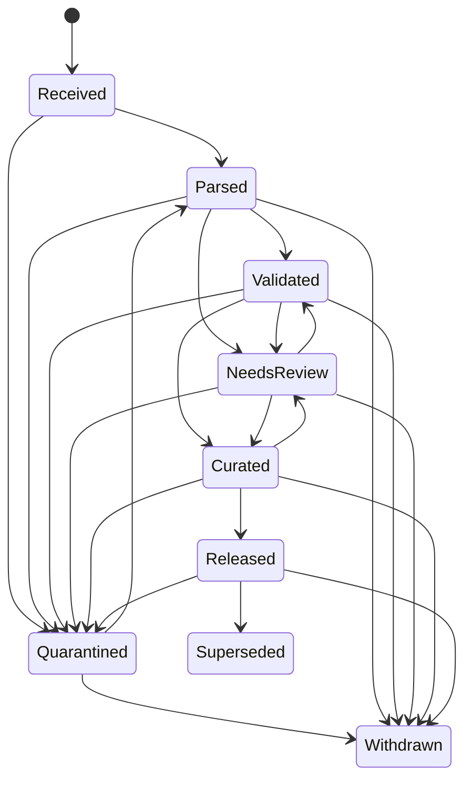

# Cross-format reconciliation i lifecycle eligibility

## Odluka u jednoj rečenici

Nijedan fingerprint, graf, crystal embedding, indeks, trening red ili evaluation primer ne nastaje direktno „iz CIF-a“ ili „iz SMILES-a“: prvo se pravi verzionisan **per-entry inventar svih dostupnih pogleda**, eksplicitno se beleže loss/conflict/missing stanja, zatim purpose-specific politika bira dozvoljeni canonical view i lifecycle stanje.

Ovaj ugovor je zajednički gate za:

- [globalni retrieval](../retrieval/03-global-retrieval-ann-ranking.md);
- [precizno pairwise poređenje](../pairs/04-precise-pairwise.md);
- [periodične/deep encodere](../deep/05-periodic-crystal-encoders.md);
- [metric learning i evaluaciju](../deep/06-metric-learning-and-evaluation.md);
- [lokalni RAG/SLM](../language/07-local-slm-rag.md);
- [spoljni API broker](../language/08-api-llm-security.md).

Bez ovog gate-a „isti entry“ može dobiti različit graf zavisno od formata, lossy zapis može prepisati bogatiji, `inner join` može tiho izbaciti najteže strukture, a indeks ili model može nastaviti da služi povučenu/neodobrenu verziju.

!!! info "Granica dokaza"
    Brojke na ovoj strani su reprodukovani nalazi iz dostavljenog lokalnog snapshot-a, ne statistika aktuelnog punog CSD-a. Raw CIF/MOL/MOL2/SDF/SMILES/CQS fajlovi ostaju van Git repoa. Exact CSD-derived statistika, hash, model, indeks ili report po default-u zadržava `C3` prava dok recorded owner/licence odluka ne odobri tačan C1/publication/repository scope, rok i storage/processor; privatni GitHub sam nije licencni izuzetak. Ako takva odluka ne postoji, distribution build zadržava samo qualitative/synthetic primer i locator ka lokalnom licenciranom evidence-u. Ovaj modul propisuje contract i testove, ali se puna korpusna validacija ponavlja u licenciranom data-plane-u.

## Zašto je ovo ML problem, a ne samo ETL

Format menja ono što algoritam vidi:

| Gubitak ili konflikt | Direktna ML posledica |
|---|---|
| nema ili je pogrešan bond order | menja ECFP bitove/counts, exact graph, MCS i message-passing edges |
| nema SMILES-a | SMILES-only trening/indeks menja ciljnu populaciju |
| nema mapiranih 3D koordinata | relevantni mapped-3D/Kabsch daje `missing_input`; packing/periodic takođe ne može bez potrebnog modela |
| Cartesian koordinate postoje, ali nema validne ćelije/simetrije | isolated molecular 3D/Kabsch može ostati primenljiv; samo periodic/packing/PXRD daje `missing_input` ili `quality_blocked` |
| `Du`/suppressed disorder atom | broj atoma, komponente, neighbors i stoichiometry nisu obična hemijska činjenica |
| različiti charge/aromaticity/stereo zapisi | menja standardizaciju, mapping, similarity i label semantics |
| matching problem ili parser conflict | rezultat mora biti `ambiguous/not_assessed`, ne tiha imputacija |
| lifecycle state je zastareo | indeks/model može sadržati povučenu, superseded ili nereviewed strukturu |

Zato se model ne evaluira samo na redovima koji su preživeli izabrani format. Mora se meriti i **representation coverage**, abstention i kvalitet po source-format/missingness slice-u.

## Lokalni nalazi koji postaju obavezni regression ugovor

### N14: jedan entry, tri nejednaka pogleda

Dostavljeni bogati eksperimentalni CIF, MOL i MOL2 opisuju isti N14 primer, ali ne prenose istu informaciju:

- svi imaju 51 atom i 54 bond record-a;
- MOL označava svih 54 veza kao `single`;
- MOL2 ima 34 `single` i 20 `un` veza;
- CIF sadrži širi geometrijski i eksperimentalni kontekst, punu ćeliju/simetriju i velike RES/HKL tekstualne blokove;
- ime `cu_n14_a.cif` nije composition label: deklarisana formula nema Cu.

Obavezna posledica: MOL/MOL2 ne smeju prepisati bogatiji source zato što se lakše parsiraju. Isto tako, CIF ekstenzija sama ne daje prednost: pojednostavljeni CSD CIF eksport iz lokalnog skupa nema bond loop, dok konkretni eksperimentalni CIF ima eksplicitne bond zapise. Precedence je **field/view-specific**, ne `extension-specific`.

### CSD izvozi: availability nije slučajna dekoracija

U lokalnom `search2` snapshot-u:

- postoji 2.038 entry-ja;
- 1.954 ima upotrebljiv coordinate/atom model, a 84 nema;
- 1.805 ima SMILES, a 233 nema;
- istih 233 nedostaje i u `search1`, koncentrisano u složenijim metalnim zapisima;
- MOL2 sadrži 7.805 `Du` atoma u 627 record-a;
- 176 SD record-a nosi matching problem uz „No disordered atoms“, a 84 matching problem uz unknown disorder.

Complete-case skup zato nije neutralan podskup. Primarna App 1 recall metrika ne sme imati denominator samo nad entry-jima sa SMILES-om ako je proizvodni corpus širi.

## Šest nepromenljivih pravila

1. **Registruj izvor pre parsiranja.** Byte hash, owner, rights, database release i source format postoje pre derivata.
2. **Ne postoji nevidljivi overwrite.** Svaka canonical činjenica čuva sve source bindings, izbor, conflict i transformaciju.
3. **Lossy format ne prepisuje bogatiji.** Može biti fallback ili nezavisni evidence, nikada prećutni autoritet.
4. **Nema tihog `inner join`-a.** Join vraća union inventar i status za svaki očekivani view.
5. **Eligibility prethodi reprezentaciji.** Purpose, lifecycle, rights i quality politika odlučuju šta sme u fingerprint/index/train/eval.
6. **Svaka promena invalidira lineage.** Nova source verzija, curation state ili ruleset ponovo evaluira pogođene view-e, embedding-e, indekse, labele i report-e.

## Autoritativni per-entry inventar

Minimalni zapis je vezan za stabilan entry/version identitet, ne za redni broj u eksportu:

```yaml
entry_version_id: internal-entry@version
identity_bindings:
  entry_lineage_root_id: stable-all-versions-id
  source_system: controlled-source-id
  source_entry_id: opaque-or-authorized-id
  base_family_id: derived-or-reviewed-family-id
  material_id: optional-material-id
  solid_form_id: optional-solid-form-id
source_snapshot:
  database_release: exact-or-not-applicable
  query_tool_version: exact-or-not-applicable
  exported_at: timestamp-or-unknown
  ingested_at: timestamp
  source_valid_from: timestamp-or-unknown
  source_valid_to: timestamp-or-null
  available_to_2cdc_at: timestamp-or-unknown
rights_and_scope:
  semantics: current_entry_projection_not_view_override
  confidentiality_class: C0_to_C4
  source_license_id: exact-policy-reference
  rights_status: unknown_or_allowed_or_denied_or_expired
  repository_distribution_decision_id: ...
  tenant_id: ...
  project_id: ...
  allowed_purposes: [...]
lifecycle:
  state: Received_or_Quarantined_or_Parsed_or_Validated_or_NeedsReview_or_Curated_or_Released_or_Superseded_or_Withdrawn
  lifecycle_policy_id: ...
  ruleset_version: ...
  sop_version: ...
  review_status: ...
  state_event_id: ...
  release_scope_id: null_or_exact_scope
  allowed_lifecycle_purposes: [...]
  release_expires_at: null_or_timestamp
  release_approver_id: null_or_controlled_identity
  decided_at: ...
  effective_at: ...
  recorded_at: ...
views:
  - view_id: source-cif@hash
    format: cif
    byte_hash: sha256:...
    source_binding:
      source_snapshot_id: ...
      parent_artifact_or_derivation_id: ...
      source_valid_from: ...
      available_to_2cdc_at: ...
    rights_and_scope:
      confidentiality_class: C0_to_C4
      source_license_id: ...
      rights_status: ...
      allowed_purposes: [...]
      tenant_id: ...
      project_id: ...
      repository_distribution_decision_id: ...
    lifecycle_binding_id: ...
    view_trust_state: received_or_parsed_or_validated_or_needs_review_or_curated
    parser_and_version: ...
    availability: present
    parse_status: complete_or_partial_or_failed
    capabilities: [formula, cell, symmetry, fractional_coordinates]
    coordinate_contract:
      frame: fractional_or_cartesian_or_none
      unit: angstrom_or_fractional_or_none
      coordinate_set: asymmetric_unit_or_expanded_or_isolated
      cell_version_id: ...
      space_group_setting_and_origin: ...
      symmetry_operation_ids: [...]
      lattice_image_offsets: [...]
      fractional_cartesian_transform_id: ...
      atom_site_mapping_id: ...
    losses: [bond_loop_absent]
    conflicts: []
  - view_id: source-sdf@hash
    format: sdf
    byte_hash: sha256:...
    parser_and_version: ...
    availability: absent
    parse_status: not_run
    capabilities: []
    losses: []
    conflicts: []
reconciliation:
  policy_id: cross-format-v1
  decision_id: ...
  decided_at: ...
  effective_at: ...
  recorded_at: ...
  canonical_view_ids: [...]
  unresolved_conflicts: [...]
derivation_lineage_id: ...
```

Top-level rights/lifecycle je trenutna entry projekcija za brzo filtriranje, ali nije autorizaciona prečica. Prvi prikazani view je šablon: **svaki** prisutan view, canonical field/fact i derivat čuva sopstveni source, rights, tenant, time, lifecycle/trust i lineage binding. Mixed-provenance kombinacija nasleđuje strože klase/prava dok eksplicitni trusted regrading ne odobri uži output. Jedna licenca za CIF ne preliva se automatski na MOL2, property tabelu ili kasnije spojeni interni zapis.

### Availability nije boolean

Za svaki field/view koristi se najmanje:

```text
present
absent
unknown
not_applicable
parse_failed
quarantined
conflicting
withheld_by_policy
```

`0`, prazan string, CIF `?`, CIF `.`, odsutno polje i zabranjeno polje nisu ista vrednost. Model input dobija value + status + provenance ili eksplicitno abstain-uje.

## Reconciliation nije „izaberi najbolji fajl“

### Tri paralelna grafa

Jedan univerzalni graf bi sakrio poreklo. Čuvaju se najmanje:

| Pogled | Sadržaj | Dozvoljena tvrdnja |
|---|---|---|
| `declared_graph` | eksplicitni atom/bond/stereo/charge zapisi iz imenovanog izvora | „izvor je deklarisao“ |
| `curated_graph` | stručno/ruleset odobrena interpretacija sa diff-om | production 2D/mapping view za definisan purpose |
| `geometry_neighbor_candidates` | distance/Voronoi/chemistry kandidat-veze iz koordinata | kandidat za coordination review, ne automatski bond-order ground truth |

`consensus` nije prosto glasanje formata. Dva lossy eksporta nisu dva nezavisna glasa protiv bogatog originala; često su derivati istog upstream zapisa.

### Koordinatni ugovor: CIF nije samo „još jedan 3D fajl“

Koordinate se ne porede dok oba view-a nemaju eksplicitan `coordinate_contract` i proverljiv transformacioni lanac:

- **CIF** tipično daje frakcione koordinate u odnosu na konkretnu jediničnu ćeliju. Cartesian položaj nastaje tek preko verzionisane matrice ćelije, uz jasno navedenu konvenciju osa i jedinicu;
- **MOL/MOL2/SDF** tipično daju Cartesian koordinate izolovanog molekula ili odabranog sklopa. One same po sebi ne čuvaju kristalno pakovanje, izbor asimetrične jedinice ni sve symmetry/lattice slike;
- isti kristal može biti zapisan u drugom setting-u, izboru origin-a, bazisu ćelije ili sa atomom pomerenim za celobrojni lattice vektor. Numerički različite koordinate zato nisu automatski različita struktura;
- asymmetric-unit site, symmetry-expanded site i izdvojeni molecular atom nisu isti identifikator. Mapiranje čuva source site, symmetry operation, lattice offset, component/molecule instance i konačni atom-map ID;
- fractional/Cartesian konverzija, change-of-basis/origin transform i wrapping moraju biti eksplicitni i round-trip provereni. Za periodic equivalence se, prema profilu, enumerišu dozvoljene symmetry i celobrojne lattice/basis transformacije uz zamrznute tolerancije; samo vizuelno preklapanje ili poklapanje redukovanih ćelija nije dokaz identiteta.

Praktična granica je važna: dva validno mapirana **izolovana Cartesian** molekula mogu se poravnati Kabsch algoritmom i kada ćelija/simetrija nedostaju. Taj rezultat govori samo o toj mapped molecular conformaciji. Bez validne cell/symmetry/periodic-image provenance ne sme se iz njega izvesti packing, periodic-equivalence ili PXRD tvrdnja. Obrnuto, periodic poređenje koristi transformacije i image offset-e iz [preciznog pairwise ugovora](../pairs/04-precise-pairwise.md) i [periodičnog graph builder-a](../deep/05-periodic-crystal-encoders.md), a ne raw koordinatne redove.

### Field-level odluka

Za svaki atom, edge, stereo centar, charge, component, cell i coordinate model reconciliation zapisuje:

```yaml
fact_id: edge-local-id
candidate_values:
  - value: single
    source_view_id: source-mol@hash
    source_status: declared
  - value: unknown
    source_view_id: source-mol2@hash
    source_status: declared_lossy
selected_value: unresolved
decision_status: needs_review
policy_rule_id: bond-order-conflict-v1
review_evidence_ids: []
```

Nije dozvoljeno pretvoriti `unresolved` u `single` samo zato što fingerprint biblioteka zahteva bond type. Dozvoljene akcije su:

- koristiti drugi odobren canonical view;
- izračunati jasno označen bond-perception kandidat i poslati na review;
- koristiti representation koja eksplicitno podržava unknown edge;
- preskočiti samo neprimenljivi kanal i zadržati entry u drugim kanalima;
- vratiti `not_assessed`.

## Purpose-specific canonical view

Canonical nije jedna tabela za sve zadatke:

| Purpose | Minimalni view | Ako nedostaje |
|---|---|---|
| composition hard filter | validirana composition mapa sa decimalnom stoichiometry | field unavailable; ne čitaj iz filename-a |
| ECFP/Tanimoto | odobren 2D graph + atom/bond/stereo/charge policy | ne računaj fingerprint; uključi fallback kanal |
| exact graph/MCS | profile-specific curated/declared graph sa unknown pravilima | `not_comparable` ili bounded partial view |
| coordination | mapirani donor graph + više geometry neighbor kandidata | `ambiguous/not_assessed`, ne formula-based CN |
| mapped 3D/Kabsch | atom mapping + koordinate za iste mapirane atome | bez RMSD claim-a |
| packing/PXRD | validna ćelija, simetrija, coordinate model i disorder policy | `missing_input` ako je profil traži, `quality_blocked` ako je view prisutan ali nevalidan |
| periodic GNN | versioned periodic graph + image offsets + occupancy/disorder contract | ne šalji zero-filled pseudo-kristal |
| property model | material/solid-form identitet + target uslovi/metoda/uncertainty | red nije validan supervised primer |

Statusi prate zajednički pair contract: `not_applicable` znači da metoda konceptualno nema smisla za izabrani objekat/profil; `missing_input` znači da bi bila relevantna, ali neophodan podatak nedostaje; `quality_blocked` znači da podatak postoji, ali ne prolazi quality/applicability gate. Ove kategorije se ne sabiraju u isti denominator.

## App 1: routing bez tihog gubitka entry-ja

### Kanalna matrica

| Dostupnost | 2D kanal | Coordination kanal | 3D/periodic kanal | Obavezni status |
|---|---|---|---|---|
| resolved 2D + validan 3D | ECFP/count | kada metal/donor view prolazi | da | puna kanalna pokrivenost |
| resolved 2D, nema 3D/cell | ECFP/count | samo graph-level kandidat | ne | `packing_status=missing_input` kada izabrani mode traži packing |
| nema SMILES, ali validan SDF/MOL2/API graph | računaj fingerprint iz canonical grafa, ne iz obaveznog SMILES string-a | po view-u | po koordinatama | `smiles_missing_not_graph_missing` |
| unresolved bond order, koordinate postoje | ne lažiraj ECFP | geometry/coordination candidate | samo ako periodic contract prolazi | `2d_graph_unresolved` |
| samo metadata/composition | exact metadata/filter fallback | ne | ne | vidljivo `representation_limited` |
| rights/lifecycle deny | nijedan | nijedan | nijedan | ne otkrivaj postojanje objekta |

Candidate unija beleži iz kog je kanala entry došao. Routing/applicability sloj dobija availability flagove i ne tumači missing channel score kao stvarnu nulu. Ti flagovi nisu automatski dokaz hemijske relevantnosti: scientific relevance ranker sme da ih koristi samo pod target-specific validation gate-om opisanom niže; inače služe za maskiranje, izbor grane, abstention i risk/coverage reporting, ne za nagrađivanje ili kažnjavanje strukture zato što je određeni eksport nedostajao.

### Denominatori koji moraju biti objavljeni

Za svaki query/slice beleži:

```text
snapshot_corpus_total
eligible_after_rights_lifecycle
eligible_after_query_hard_filters
eligible_with_2d_graph
eligible_with_coordination_view
eligible_with_periodic_view
indexed_per_channel
retrieved_union_total
qrels_version
pool_scope_and_depth
judged_eligible_total
unjudged_eligible_total
known_relevant_in_pool
retrieved_known_relevant_by_any_channel
```

Primarni semantic `Recall@C` koristi sve poznate gold-relevantne **query-filter eligible** entry-je u zamrznutom judgment pool-u, uključujući relevantne bez SMILES-a. Ako qrels nisu corpus-complete, rezultat se zove pooled/judged recall uz pool scope i judgment coverage; ne predstavlja se kao dokaz recall-a nad svim neocenjenim CSD entry-jima. Dodatno se prijavljuje conditional recall po kanalu, ali on ne sme sakriti coverage loss.

Waterfall mora da se rekonstruiše. Dataset/query builder zato čuva jedan međusobno isključiv `primary_exclusion_stage` — na primer `rights`, `lifecycle`, `hard_filter`, `representation`, `index_failure` — i odvojen non-exclusive `reason_set`. Važi conservation assert:

```text
snapshot_corpus_total
= rights_or_lifecycle_excluded
+ eligible_after_rights_lifecycle

eligible_after_rights_lifecycle
= hard_filter_excluded
+ eligible_after_query_hard_filters

eligible_after_query_hard_filters
= retrievable_by_at_least_one_route
+ no_available_retrieval_route
+ primary_execution_failure
```

`retrievable_by_at_least_one_route` je disjunktna union populacija: obuhvata chemical kanal ili eksplicitni metadata fallback. `representation_limited` je non-exclusive flag unutar te populacije, ne dodatni član sume. Membership po 2D/coordination/periodic/fallback kanalu takođe se preklapa i služi za slice/ablation, ne za conservation zbir. Brojevi judged/unjudged su treća osa i ne smeju se sabirati sa eligibility exclusion-ima.

Pored marginalnih brojeva čuva se i sparse joint cube po unapred zamrznutim kategorijama `eligibility × representation/status × labeled/unjudged × lifecycle × source/release/time`. To otkriva, na primer, da su gotovo svi bez-SMILES entry-ji istovremeno unjudged ili iz jedne release generacije — signal koji odvojene margine mogu sakriti. Male ćelije se u korisničkom report-u suppress/aggregate-uju prema privacy politici, dok audit assert ostaje u kontrolisanom data-plane-u.

## App 2: availability je deo pair rezultata

Za svaki od `n(n-1)/2` parova formira se `pair_view_manifest`:

```yaml
pair_id: stable-unordered-id
input_a_version: ...
input_b_version: ...
profile: coordination_motif_v1
available_branches:
  composition: true
  graph: partial
  mapped_3d: false
  packing: false
branch_reasons:
  mapped_3d: input_b_coordinates_absent
  packing: input_b_cell_or_symmetry_absent
comparison_status: partial
```

Par se ne briše zato što jedna grana nije dostupna. Output čuva:

- koji upload-i su accepted/rejected i zašto;
- očekivani i izvršeni broj parova;
- status svake grane;
- source/reconciliation verzije oba ulaza;
- warnings i abstention;
- koje se tvrdnje i dalje mogu dati.

Po `comparison_profile`-u se objavljuje disjunktni primary-outcome accounting:

```text
all_accepted_pairs
profile_applicable_pairs
not_applicable_pairs

primary_pair_outcome inside profile_applicable:
  fully_assessed
  partially_assessed
  no_assessment_missing_input
  no_assessment_quality_blocked
  no_assessment_timeout_or_failed
  no_assessment_explicit_abstain_other

separate branch-reason axis:
  missing_input | quality_blocked | timeout | other

separate label axis:
  label_scope_definition
  label_scope_total
  labeled
  unjudged
```

Važe formule:

```text
all_accepted_pairs
= profile_applicable_pairs
+ not_applicable_pairs

profile_applicable_pairs
= fully_assessed
+ partially_assessed
+ no_assessment_missing_input
+ no_assessment_quality_blocked
+ no_assessment_timeout_or_failed
+ no_assessment_explicit_abstain_other

label_scope_total
= labeled
+ unjudged
```

Primary outcome je jedan po paru. Parcijalno procenjen par može nositi više branch-level `missing_input/quality_blocked` razloga, ali se u zbiru pojavljuje samo kao `partially_assessed`; zato reason axis nije conservation suma. `no_assessment_explicit_abstain_other` se koristi samo kada razlog nije missing, quality ili failure. Label scope navodi da li obuhvata sve accepted, profile-applicable ili assessed parove. Coverage–risk i failure stopa prijavljuju se odvojeno; dobar score na assessed parovima ne sme sakriti veliki blocked sloj.

N14 regression posebno zahteva da tri pogleda istog entry-ja ne postanu lažni train/test negativi i da bond-order conflict bude vidljiv u graph branch-u.

## Lifecycle state je odvojen od licence i quality score-a

Minimalna state machine je:



`Parsed` ne znači hemijski tačno. `Validated` znači samo da je imenovani ruleset prošao. `Curated` zahteva verzionisani SOP i owner-a. `Released` uvek navodi konkretan purpose/scope, approver-a i eventualni rok; nije univerzalna dozvola. `NeedsReview` nije sinonim za loš zapis, već vidljiv unresolved scientific/policy status.

Hitni scientific, security, privacy ili licence incident može prebaciti svaki aktivni `Parsed`/`Validated`/`NeedsReview`/`Curated`/`Released` zapis u `Quarantined` ili, kada politika tako nalaže, u `Withdrawn`. Ta tranzicija odmah zatvara read/serve/index/train/eval eligibility i invalidira izvedene artefakte; ne čeka sledeći redovni release. Posle otklanjanja problema `Quarantined` zapis ponovo prolazi parse/validation tok — nema direktnog skoka u `Released`. Za nehitnu korekciju već objavljenog zapisa pravi se nova verzija, stara postaje `Superseded`, a nova prolazi propisani review/release tok.

Lifecycle ne zamenjuje:

- rights/licence/tenant/purpose odluku;
- source-format trust;
- scientific evidence tier;
- numerical quality metric;
- confidentiality klasu.

Sve ose moraju proći.

## Purpose-specific inclusion politika

| Downstream purpose | Podrazumevano dozvoljena stanja | Dodatni uslov |
|---|---|---|
| parser/reconciliation development | synthetic/odobreni `Received`–`NeedsReview` fixtures | izolovan test; bez production claim-a |
| broad internal retrieval | `Validated`, `NeedsReview`, `Curated`, `Released` | stanje/warning vidljiv; ruleset i rights prolaze |
| production high-confidence result | `Curated` ili `Released` | mode-specific quality i licence gate |
| supervised training candidate | `Curated` ili `Released` | target/label review i lineage; exploration je zaseban corpus |
| calibration/final test | **isti structure-state inclusion kao serving mode koji se ocenjuje** | calibration gold je zamrznut pre fit-a; prospective final gold može biti slep i otkriven tek posle immutable predikcije |
| property training | `Released` structure + `Released` property record | solid form, uslovi, metoda, uncertainty |
| external API payload | lifecycle samo nije dovoljan | zaseban C0/C1 egress i rights/vendor gate |

Ovo je početna politika za validaciju sa naučnim/data-owner timom, ne tvrdnja da CCDC koristi iste interne nazive stanja.

### Serving i evaluation moraju imati isti estimand

Najmanje dva product mode-a se ne mešaju:

| Mode | Serving populacija | Evaluation/calibration populacija | Learned score |
|---|---|---|---|
| `high_confidence_v1` | tačno definisan `Curated/Released` scope | isti state/purpose/snapshot policy | dozvoljen posle sopstvenog gate-a |
| `broad_discovery_v1` | `Validated/NeedsReview/Curated/Released` uz vidljiv state/warning | isti broad state mix, purpose i snapshot, sa dovoljno labela po state slice-u | dozvoljen samo ako je baš taj estimand validiran |

Ako broad mode nema odgovarajući labeled calibration/final skup, izvan validiranog state scope-a koristi deterministic/rule ordering ili eksplicitno `uncalibrated/abstain`; ne prenosi se verovatnoća iz Released-only testa. Review status same structure i review status expert labele su različita polja: label može biti strogo adjudicated i kada se testira ponašanje sistema nad `NeedsReview` ulazom.

## State transition i derivati

Svaki prelaz čuva:

```yaml
state_event_id: ...
entry_version_id: ...
from_state: ...
to_state: ...
triggered_by: user_or_workload_identity
lifecycle_policy_id: ...
ruleset_and_sop_versions: [...]
diff_and_warning_ids: [...]
approval_ids: [...]
decision_scope:
  release_scope_id: null_or_exact_scope
  allowed_purposes: [...]
  allowed_audiences_or_serving_modes: [...]
  expires_at: null_or_timestamp
decided_at: ...
effective_at: ...
recorded_at: ...
affected_lineage_roots: [...]
```

Transition pravi novu eligibility generaciju. `retrieval_generation_id`, training manifest i report binding uključuju najmanje:

```text
source snapshot
entry versions
cross-format policy
parser/standardization/ruleset/SOP versions
lifecycle inclusion policy
rights/purpose policy generation
feature/embedding/index/model versions
```

`Superseded` ili `Withdrawn` ne mora odmah fizički obrisati raw izvor ako ugovor zahteva čuvanje, ali ga odmah uklanja iz dozvoljenih novih reprezentacija/read/index/train tokova. Pogođeni derived artefakti se deny/invalidate i rebuild-uju; rollback softvera ne oživljava staru eligibility generaciju.

### Point-in-time/as-of build

Temporalni ili prospective claim zahteva bitemporalni pogled i razdvojena vremena inputa, predikcije i ishoda:

- `valid_from/valid_to` govori kada činjenica važi u source/scientific svetu;
- `available_to_2cdc_at`/`recorded_at` govori kada je sistem mogao da je zna;
- reconciliation i lifecycle odluka imaju sopstvene `decided_at`, `effective_at` i `recorded_at`;
- label/property zapis ima `observed_at`, `revealed_at`, `adjudicated_at` i verziju.

Training i model selection pin-uju `training_model_selection_cutoff`; nijedan njihov feature, preprocessing, threshold ili label ne sme biti otkriven posle tog preseka. Svaki prospective primer/run zatim pin-uje sopstveni `prediction_as_of`: feature, transform, reconciliation, lifecycle i eligibility koriste samo ono što je sistem tada mogao da zna, a predikcija/output se nepromenljivo sačuva pre otkrivanja ishoda.

Gold ishod ili slepa ekspertna adjudikacija legitimno mogu nastati **posle** predikcije. Takva labela se spaja tek u evaluator preko `observed_at/revealed_at/adjudicated_at`; ne vraća se u feature, imputer, threshold, calibration ili model selection za taj zamrznuti test. Kasnije dodat SMILES, bogatiji eksport ili curation correction isto ne sme retroaktivno popraviti pre-cutoff input. Nepoznat availability/recorded timestamp blokira strogi prospective claim ili se zapis nalazi u posebno označenom sensitivity run-u.

### Per-example target vreme sprečava post-review leakage

Globalni cutoff nije dovoljan kada svaki red ima sopstveni događaj. Dataset builder za svaki supervised primer čuva:

```yaml
example_id: ...
target_definition_id: ...
feature_snapshot_as_of: ...
feature_manifest_hash: ...
target_observed_at: ...
target_decided_at: ...
label_revealed_at: ...
temporal_assertion: feature_snapshot_precedes_target_event
```

Za prognostički target važi `feature_snapshot_as_of < target_observed_at/target_decided_at` prema unapred definisanoj semantici događaja. Kasnija labela može legitimno ući u trening budućeg modela ili u evaluator, ali feature red ostaje rekonstruisan iz pre-outcome snapshot-a. Target-specific denylist uklanja svaku činjenicu koja je posledica samog ishoda: za `expert_review_needed` to obuhvata post-review `Curated/Released` state, approval/review status, correction diff, popravljeni graph/view i derivat nastao iz njih. Za property prediction isto se odvaja struktura i metapodatak poznat pre merenja od kasnije izmerene vrednosti. Deskriptivni, neprognostički estimand može imati drugačiji odnos vremena, ali to mora eksplicitno pisati i ne sme se zvati predikcija budućeg ishoda.

## Training i evaluation contract

### Dataset builder mora vratiti accounting tabelu

```yaml
training_model_selection_cutoff: ...
prediction_as_of_policy: per_example_or_frozen_batch
label_reveal_policy: evaluator_only_after_immutable_prediction
per_example_timing:
  feature_snapshot_as_of: ...
  target_observed_or_decided_at: ...
  target_specific_post_outcome_denylist_id: ...
source_snapshot_id: ...
source_entries_total: ...
eligible_after_rights_lifecycle: ...
eligible_after_query_hard_filters: ...
excluded_by_reason:
  accounting_mode: exclusive_primary_stage_plus_nonexclusive_reason_set
  primary_stage_counts:
    rights: ...
    lifecycle: ...
    hard_filter: ...
    parse_or_representation: ...
    target_missing: ...
representation_available:
  graph_2d: ...
  coordination: ...
  periodic_3d: ...
included_in_model_matrix: ...
conservation_assertions_passed: true
```

Nema samo `X.shape` i „dropna missing“. Svaka eliminacija ima reason code i denominator.

### Split se radi posle identity povezivanja, pre fit-a

U istoj grupi ostaju:

- svi CIF/MOL/MOL2/SDF/SMILES pogledi **i sve verzije** istog `entry_lineage_root_id`/stabilnog `source_entry_id`-a;
- transitive closure version/derivation lineage-a i base-refcode/redetermination porodice;
- exact canonical graph/SMILES klaster;
- material/compound/scaffold/solid-form family prema target-u;
- source/publication family kada može proizvesti batch leakage.

Tek zatim se pravi train/development/calibration/final-test ili temporal/prospective split. Različite verzije istog stabilnog entry-ja smeju biti sa obe strane samo u eksplicitnom `future_revision` temporalnom estimand-u: train vidi isključivo raniju verziju, test predstavlja buduću korekciju istog poznatog identiteta, a rezultat se ne opisuje kao unseen-entry generalizacija. Learned imputer, scaler, vocabulary, PCA, feature selection i hard-negative mining fituju se samo na train-u.

### Missingness evaluacija

Pored ukupne metrike prijavljuju se unapred zamrznuti slice-ovi:

- source format i parser verzija;
- SMILES present/missing;
- coordinate/cell/symmetry present/missing;
- matching problem;
- `Du`/disorder status;
- multi-component count;
- unresolved bond-order/charge/stereo;
- lifecycle state;
- element/metal/family/time/OOD.

Model ne prolazi ako dobar complete-case prosek sakriva neuspeh na `representation_limited` populaciji koju proizvod ipak tvrdi da pokriva.

Availability/source/status polja imaju dvostruku ulogu. Za routing, branch applicability, maskiranje nepostojećeg score-a, abstention i coverage-risk ona su potrebna. Za **scientific relevance/property score** nose rizik prečice jer format, missingness, release, curation i judgment-pool selection nisu slučajni. Zato svaki learned model koji ih koristi mora proći sve sledeće:

1. `availability/source/status-only` baseline — ako on neočekivano dobro predviđa labelu, prvo se istražuje selection proces;
2. ablation bez tih polja i bez njihovih visokokorelisanih proxy-ja;
3. group/leave-source-release-version-out i, kada tvrdnja to zahteva, prospective shift test;
4. joint cube audit `eligible × representation × judgment × lifecycle/source/time`, uz metrike po production-relevant ćelijama;
5. poređenje na istoj union populaciji, ne samo na complete-case ili judged pool podskupu.

Dobitak koji nestane bez source/missingness polja ili pod novim source/release/time shift-om ne prihvata se kao dokaz bolje hemijske relevantnosti. Takav signal može ostati u jasno odvojenom risk/abstention modelu, ali ne u naučnom similarity score-u bez eksplicitne stručne hipoteze, validacije na nezavisnom procesu i vidljivog model-card upozorenja.

## Obavezni regression skup

| ID | Fixture | Obavezni ishod |
|---|---|---|
| D01 | N14 CIF/MOL/MOL2 | jedan identity group; tri view-a; bond-order loss/conflict vidljiv; nema overwrite-a |
| D02 | filename sadrži `cu`, formula nema Cu | composition ne čita filename; Cu Kα nije elementarni sastav |
| D03 | CSD-like CIF bez bond loop-a | graph nije izmišljen kao declared CIF graph; koristi drugi odobren view ili abstain |
| D04 | MOL2 sa `Du`/`SUP*` | `Du` nije element; disorder/suppressed status ostaje u lineage-u |
| D05 | SDF fixed-width `121150` | parsira se kao 121 atom/150 veza prema formatu, ne jednim `split()` tokenom |
| D06 | entry bez SMILES-a, sa validnim graph view-om | ne ispada iz corpusa; fingerprint se gradi iz canonical graph-a ako policy dozvoljava |
| D07 | entry bez validnog 2D grafa, sa koordinatama | ECFP kanal abstain; drugi dozvoljeni kanali ostaju aktivni |
| D08 | 84-like zapis bez coordinate model-a | relevantne packing/periodic grane su `missing_input`; metadata/2D ostaju prema dostupnosti |
| D09 | eksporti različitog redosleda + preskočeni SMILES redovi | join po stabilnom ID-ju; nema row-position uparivanja |
| D10 | drugi view ili corrected/superseded version istog entry lineage-a u train/test kandidatu | transitive group splitter ih drži na jednoj strani, osim eksplicitnog point-in-time `future_revision` estimand-a |
| D11 | `NeedsReview` broad retrieval | rezultat samo ako policy dozvoljava, sa vidljivim warning-om; nije gold automatski |
| D12 | transition `Released → Superseded` | stari embedding/index/report deny; nova eligibility generation/rebuild |
| D13 | transition `Released → Withdrawn` tokom job-a | queued/in-flight rezultat se ne objavljuje; current gate pobeđuje rollback |
| D14 | lifecycle dozvoljen, rights denied | sve downstream putanje deny; lifecycle nije autorizacija |
| D15 | property broj bez solid-form/uslova/metode | nije supervised target; nema imputirane univerzalne „stabilnosti“ |
| D16 | SMILES/bogatiji view ili curation odluka dodati posle prospective cutoff-a | pre-cutoff build ih ne vidi; nepoznat availability timestamp blokira prospective claim |
| D17 | broad serving uključuje `NeedsReview`, calibration je samo `Released` | manifest/estimand mismatch; learned calibrated score se ne služi izvan validiranog scope-a |
| D18 | pooled qrels sa mnogo unjudged eligible entry-ja | report navodi pool/qrels verziju, judged coverage i pooled recall; ne tvrdi corpus-complete recall |
| D19 | prospective predikcija je zaključana, gold ishod/review stiže kasnije | kasna labela ulazi samo u evaluator; feature, threshold, calibration i model selection ostaju byte-identični |
| D20 | hitni incident nad `Validated`, `NeedsReview`, `Curated` ili `Released` zapisom | svaki aktivni state može u quarantine/withdraw putanju; current gate odmah blokira read/serve/index/train/eval i invalidira derivate |
| D21 | `Released` zapis se traži za drugi purpose/audience ili posle isteka scope-a | lifecycle gate odbija zahtev iako je state string i dalje `Released`; novi odobreni scope zahteva recorded decision/event |
| D22 | isti mapirani atom ima CIF fractional i MOL2 Cartesian koordinatu | poređenje koristi pinovanu cell matricu, jedinicu i atom/site map; round-trip prolazi, nema raw-coordinate poređenja |
| D23 | isti kristal u drugom setting-u/origin-u ili sa wrapped atomima | kandidat-ekvivalencija se proverava eksplicitnim basis/origin, symmetry i lattice-offset transformom; brojčano različite koordinate nisu lažan negativ |
| D24 | dva mapirana izolovana Cartesian molekula, jedan ili oba bez ćelije/simetrije | molecular Kabsch grana može biti `assessed`; packing/periodic/PXRD grane su `missing_input`, bez prenosa 3D zaključka na kristalno pakovanje |
| D25 | pre-review zapis dobije labelu `expert_review_needed`, pa review popravi graph i prebaci state u `Curated` | feature red ostaje byte-identičan pre-review snapshot-u; post-review state/status/diff/view ne ulaze u input, labela sme u kasniji trening/evaluator |
| D26 | relevance labele su češće prisutne za entry-je sa SMILES-om ili iz jedne release/source generacije | joint cube i source/status-only baseline otkrivaju selection; ablation i leave-source/release-out odlučuju da li signal sme u scientific score |
| D27 | model pobeđuje samo na complete-case/judged pool-u, ali gubi na union production populaciji ili prospective shift-u | promotion se zaustavlja; rezultat se prijavljuje kao uslovljen podskupom, ne kao production dobitak |

## Promotion gate

Nijedan ML/AI eksperiment ne počinje na production-like podacima dok:

1. per-entry union inventory prolazi source accounting;
2. identity/join pravila nemaju neobjašnjena dupliranja ili gubitke;
3. purpose-specific canonical view i conflict policy su verzionisani;
4. lifecycle i rights inclusion policy su mašinski proverljivi;
5. D01–D27 regression skup prolazi;
6. representation availability i denominator report nastaju automatski;
7. split grupiše sve povezane view-e i porodice pre fit-a;
8. transition test invalidira sve pogođene derived lineage grane;
9. serving, training, calibration i final-test manifest imaju isti mode-specific lifecycle estimand;
10. temporalni claim razdvaja training/model-selection cutoff, `prediction_as_of` i kasnije otkriven gold; post-cutoff view/curation ne ulazi u input, a post-prediction labela samo u evaluator;
11. App 1/App 2 accounting waterfall prolazi conservation assert i objavljuje qrels/judgment coverage;
12. naučni/data owner odobri šta `Curated`, `Released` i `NeedsReview` znače u konkretnoj instituciji, uključujući release purpose/audience/expiry i emergency transition politiku;
13. raw/licencirani fajlovi ostaju u kontrolisanom data-plane-u, van repoa i eksternih LLM payload-a.
14. prognostički redovi imaju per-example pre-outcome feature snapshot i target-specific post-outcome denylist;
15. availability/source/status signal prolazi source-only baseline, ablation, joint selection audit i nezavisni source/release/time shift; inače ostaje samo routing/risk signal.

Ako ovaj gate ne prolazi, sofisticiraniji model ne rešava problem: samo uči trenutnu export, missingness i curation politiku kao skrivenu prečicu.

## Veza sa izvornim materijalom

Ovaj contract direktno zatvara zahteve dokumentovane u postojećim poglavljima repoa:

- `docs/projekat/17-lokalni-skup.md`: cross-format loss, 84 zapisa bez coordinate model-a, 233 bez SMILES-a, `Du`, matching problem, N14 i leakage;
- `docs/projekat/22-whitepaper-tokovi-fl.md`: early-access/main lifecycle, review/curation, structure–property veza i invalidacija derivata;
- dostavljeni CCDC white paper, vizuelno strane 12–14: early-access naspram main baze, Manage Databases, Review Structures/CSD-Editor i database-ready tok;
- `dve funkcionalnosti.txt`: globalni candidate/ranking tok i potpuno all-pairs poređenje bez tihog gubitka upload-a ili para.

White paper je vendor problemski okvir, ne benchmark 2CDC algoritma. Lokalni contract, corpus accounting i acceptance testovi su ono što vendor opis pretvara u proverljiv inženjerski zahtev.
