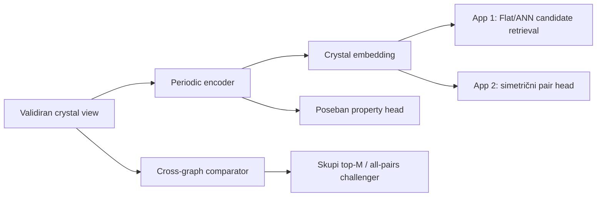

# Periodični crystal encoderi: GNN, transformer i equivariant modeli

## Glavna odluka

Za 2CDC trenutno **ne postoji objavljen benchmark koji dokazuje da su CGCNN, SchNet, DimeNet, MEGNet, ALIGNN, Matformer ili neki universal interatomic potential optimalni za CSD-like crystal similarity, retrieval ili COMPACK-ekvivalentnost**. Njihovi najpoznatiji rezultati uglavnom su property prediction, energija/sile ili materials-discovery zadaci. To su drugačiji targeti.

Zato deep model ne zamenjuje deterministički dokaz iz modula za [precizno pairwise poređenje](../pairs/04-precise-pairwise.md). Njegove prve legitimne uloge su:

1. dodatni **candidate kanal** u aplikaciji 1;
2. naučeni signal za reranking malog candidate skupa;
3. challenger za multi-output pair odluke u aplikaciji 2;
4. property/quality model samo kada postoji poseban validan target.

Preporučeni redosled eksperimenata je:

- **CGCNN** kao jeftin sanity baseline;
- **Matformer** kao prvi periodic dual-encoder kandidat;
- **ALIGNN** kao obavezni angle/coordination challenger;
- descriptor + RF/GBDT i deterministic/packing metode ostaju referentni sistemi;
- cross-graph/equivariant model dolazi tek kada jednostavniji kandidati pokažu merljivu rupu.

Ovo je izbor početnog turnira, ne tvrdnja da je Matformer već produkcioni pobednik.

## 5.1 Tri različita neuronska posla



### Crystal encoder

Jednu periodičnu strukturu pretvara u vektor \(z=f_\theta(C)\). Vektor se može unapred izračunati za corpus i zato je pogodan za globalnu pretragu. Njegovo susedstvo ima značenje samo za loss/label semantiku na kojoj je model treniran.

### Pair model

Prima dva crystal prikaza i predviđa eksplicitne odnose, na primer `same_coordination_motif`, `packing_related` ili `different`. Može koristiti dva nezavisna encoding-a i simetričan head ili zajedničko cross-graph poređenje. Druga opcija je skuplja, ali može učiti lokalna correspondence pravila.

Za simetričnu relaciju obavezno važi \(S(A,B)=S(B,A)\). Još jači, često previđen uslov jeste **nezavisna frame invariance**: ako su \(g_A\in G_A\) i \(g_B\in G_B\) dozvoljene transformacije svojih ulaza, mora važiti

\[
S(g_A A, g_B B)=S(A,B).
\]

Grupe su profile-specific: stereo-sensitive profil koristi nezavisni \(SE(3)\times SE(3)\) — proper rotacije i translacije — plus wrapping, atom/component relabeling i basis/setting gauge; stereo-agnostic profil može proširiti ugovor na \(E(3)\times E(3)\), koji uključuje reflection. Dot product ili cross-attention nad equivariant vektorima iz dva nezavisno izabrana koordinatna sistema ne ispunjava ovo automatski. Comparator koristi profile-invariantne node/pair features pre cross-match-a, eksplicitno alignment/mapping pre poređenja ili arhitekturu sa dokazanim \(G_A\times G_B\) contract-om; stereo-sensitive režim uz to zadržava exact stereo gate/reflection-sensitive kanal. Asimetrični containment je poseban directional target i ne dobija swap invariance.

### Property model

Predviđa band gap, energiju, R-factor risk ili drugi tačno definisan target. Dva kristala sa sličnom predviđenom osobinom ne moraju biti strukturno slična, a različite strukture mogu imati istu osobinu. Latentni prostor property modela zato nije similarity oracle bez zasebne retrieval validacije.

## 5.2 Šta je literatura stvarno pokazala

| Porodica | Ključna ideja | Primarna validacija | 2CDC status |
|---|---|---|---|
| [CGCNN](https://doi.org/10.1103/PhysRevLett.120.145301) | message passing nad crystal graph-om | materials property prediction | obavezni jednostavni deep baseline |
| [SchNet](https://doi.org/10.1063/1.5019779) | continuous-filter convolutions nad udaljenostima | quantum/property zadaci za molekule i materijale | sekundarni distance-only baseline |
| [DimeNet](https://openreview.net/forum?id=B1eWbxStPH) | directional poruke sa uglovima | molekulske energije/sile i QM zadaci | nije prvi periodic izbor; koristan arhitektonski challenger |
| [MEGNet](https://doi.org/10.1021/acs.chemmater.9b01294) | node/edge/global-state graph network | QM9 i Materials Project properties | property-transfer baseline, ne retrieval dokaz |
| [ALIGNN](https://doi.org/10.1038/s41524-021-00650-1) | atom graph + line graph uglova | 52 property zadatka na JARVIS/MP/QM9 | prvi challenger za koordinaciju i uglove |
| [Matformer](https://proceedings.neurips.cc/paper_files/paper/2022/file/6145c70a4a4bf353a31ac5496a72a72d-Paper-Conference.pdf) | periodic graph transformer i periodic pattern encoding | crystal property prediction | prvi periodic retrieval encoder kandidat |
| [NequIP](https://doi.org/10.1038/s41467-022-29939-5) | E(3)-equivariant tensors | interatomic energy/force potencijali | samo ako novi target traži takvu geometriju/fiziku |
| [MACE](https://proceedings.neurips.cc/paper_files/paper/2022/hash/4a36c3c51af11ed9f34615b81edb5bbc-Abstract-Conference.html) | higher-body equivariant poruke | force-field benchmarkovi | nije podrazumevani similarity encoder |
| [M3GNet](https://doi.org/10.1038/s43588-022-00349-3) / [CHGNet](https://doi.org/10.1038/s42256-023-00716-3) | universal interatomic potentials | energija, sile, stress, relaxation/MD | van MVP-a; relevantno tek za eksplicitnu relaxation granu |
| [PRISM](https://doi.org/10.1038/s41524-026-02074-1) | atomistic/cell/multiscale/similarity experts | 2026 property benchmarkovi | watchlist; nov i još bez 2CDC retrieval dokaza |

Najvažniji negativni nalaz je metodološki: bolji MAE za formation energy ne implicira bolji nearest-neighbor poredak za scaffold, koordinaciju ili packing. Čak i rad koji ispituje [ograničenja crystal GNN-ova](https://doi.org/10.1126/sciadv.adi3245) nalazi slabosti u lokalnoj izražajnosti, prenosu dugodometne informacije i readout-u na property zadacima. Zato svaka arhitektura mora proći 2CDC metamorphic i relevance testove, bez obzira na javni leaderboard.

### Najbliži direktni retrieval precedenti

Postoje važni susedni radovi, ali nijedan još ne rešava 2CDC CIF→CIF CSD packing zadatak:

- [CMML](https://doi.org/10.1088/2632-2153/aca23d) trenira CGCNN structure encoder i simulated-XRD encoder bidirectional triplet loss-om nad 122.543 Materials Project strukture. Demonstrira materials-concept/function susedstva u zajedničkom prostoru, ne COMPACK-ekvivalentnost organskih/metal-organic CSD formi.
- [XCCP](https://doi.org/10.1038/s41524-026-02015-y) koristi modifikovani CGCNN i PXRD encoder sa simetričnim InfoNCE loss-om nad 155.003 Materials Project CIF–simulated-PXRD parova i stvarno meri top-k PXRD→CIF retrieval. To je direktan dokaz da cross-modal crystal retrieval može raditi, ali query je diffraction pattern, positive je odgovarajući source CIF, split je random/space-group-stratified, a target nije CIF→CIF hemijska/packing relevantnost.

Ovi radovi opravdavaju contrastive dual-encoder eksperiment. Ne opravdavaju prenošenje njihove metrike, threshold-a, split-a ili confidence formule na CSD. Matformer dual encoder koji se predlaže ovde takođe je **nova 2CDC adaptacija**: originalni Matformer rad nije objavio metric-learning head ni retrieval benchmark.

## 5.3 Input contract: šta model zaista dobija

Model ne dobija „CIF tekst“. Dobija verzionisani, deterministički izveden `crystal_view` sa linkom ka source provenance-u. Schema namerno sadrži više podataka nego tensor: ID-jevi, provenance, quality i loss polja služe auditu i grananju, a target-specific allowlist određuje šta zaista ulazi u model.

```yaml
crystal_view_schema: 2cdc-periodic-v1
source_structure_id: immutable-or-protected-id
standardization_profile: solid_form_v1
lattice:
  matrix_angstrom: [[...], [...], [...]]
  vector_convention: columns_r_equals_Ls
  basis_provenance: ...
sites:
  - site_id: stable-within-view
    element: Zn
    fractional_xyz: [...]
    occupancy: 1.0
    disorder_assembly: null
    special_position_provenance: ...
    component_id: ...
edges:
  - source_site: ...
    target_site: ...
    periodic_image: [0, 1, 0]
    cartesian_displacement_angstrom: [...]
    distance_angstrom: ...
    edge_roles: [spatial_contact, coordination_candidate]
quality_status: ...
loss_report: ...
```

Svaki model artifact navodi tačnu schema verziju. Promena standardizacije, neighbor pravila, radii-ja, disorder politike ili element encoding-a zahteva novi graph/embedding generation ID.

### Site features

Bezbedan početni skup:

- atomic number ili naučeni element embedding;
- formal charge/oxidation state **samo** kada je eksplicitno poznat ili kada se čuva `unknown/inferred` provenance;
- occupancy i disorder status;
- finite-component membership i role odnosi izvedeni deterministički;
- donor/metal/covalent-role flags sa statusom `known/ambiguous/not_assessed`;
- eventualne standardne atomske osobine, verzionisane i bez target leakage-a.

Refcode, autor, laboratorija, publication ID i datum nisu chemistry features. Mogu napraviti impresivan test rezultat preko provenance leakage-a.

`site_id` i `component_id` iz schema-e jesu ključevi za audit, edge povezivanje i grupisanje, ne numerički ili categorical chemistry features. Membership se modeluje relacijom, maskom ili permutation-invariant hijerarhijskim pooling-om. Proizvoljno preimenovanje component/site ID-jeva mora ostaviti output nepromenjen.

Svaki target ima prediction-time feature allowlist zamrznut pre treninga. Na primer, model koji predviđa R-factor/quality risk ne sme dobiti sam R-factor, label-derived `quality_status`, `loss_report` odluku koja koristi isti target, niti polje koje u trenutku predikcije ne postoji. Pipeline test proverava ne samo naziv kolone već i upstream derivaciju svakog feature-a.

### Više tipova ivica

Za ovaj projekat jedan proximity graf nije dovoljan. Čuvaju se odvojene semantike:

- intramolekulska covalent veza;
- koordinaciona veza ili kandidat sa rule provenance-om;
- periodični prostorni kontakt unutar cutoff-a;
- interaction-network veza, na primer H-bond, tek posle validirane determinističke detekcije.

Edge type je feature, ne neproverena nova „veza“. Model ne sme samim učenjem pretvoriti geometrijsku blizinu u potvrđenu kovalentnu ili koordinacionu vezu.

## 5.4 Periodični graf bez gubitka slike

Ovde se koristi eksplicitna konvencija \(r=Ls\): tri lattice vektora su **kolone** matrice \(L\), a fractional koordinate i image/gain \(n\in\mathbb Z^3\) jesu column vektori. Za fractional pozicije \(s_i,s_j\), usmereni displacement je

\[
r_{ij,n}=L(s_j-s_i+n).
\]

Za isti par site-ova može postojati više legitimnih periodičnih slika u cutoff-u. One su multiedges; deduplikovanje samo po `(i,j)` može obrisati stvarno susedstvo.

Za source \(i\), target \(j\) i unimodularnu basis promenu \(L'=LU\), uz moguće novo wrapping predstavljanje \(s'_i=U^{-1}s_i+k_i\), gain se transformiše kao

\[
n'=U^{-1}n+k_i-k_j.
\]

Tada \(L'(s'_j-s'_i+n')=L(s_j-s_i+n)\). Za čisto wrapping prebacivanje je \(U=I\). Edge multiset se u testu poredi modulo site relabeling i ovu vertex-gauge/basis transformaciju, ne literalnom jednakošću `n` trojki.

Graph builder mora pronaći **svaki** \(n\) koji zadovoljava \(\lVert L(s_j-s_i+n)\rVert\le r_c\), uključujući sve ties/slike na granici. Fiksno pretraživanje `{-1,0,1}³` i običan minimum-image shortcut nisu potpuni za opšte, naročito skewed ćelije. Koristi se dokazano potpuna lattice-sphere enumeracija sa granicama izvedenim iz lattice/reciprocal geometrije; [pymatgen `get_points_in_sphere`](https://pymatgen.org/pymatgen.core.html#pymatgen.core.lattice.Lattice.get_points_in_sphere) je jedan zvanično dokumentovan primer algoritamske putanje, ali konkretna implementacija i tolerancije ostaju verzionisane.

Veštački neural self-loop \((i=i,n=0)\) razlikuje se od fizičkog periodic-image suseda \((i=i,n\ne0)\). Drugi se čuva kada zadovoljava cutoff; prvi se uključuje samo ako ga eksplicitno zahteva verzionisano architecture pravilo.

Ako implementacija čuva lattice vektore kao redove, mora koristiti transponovanu, dokumentovanu formulu; mešanje konvencija je test greška. Raw integer `n` je potreban za rekonstrukciju i audit, ali nije sam po sebi invariant feature: menja se pod drugim basis-om, origin-om ili izborom predstavnika site-a. Ordinary invariant CGCNN/Matformer/MLP put koristi normu, uglove ili druge O(3)-invariantne kontrakcije, **ne sirove kartezijanske komponente**. Vektorski displacement sme u tensor samo kroz dokazano SE(3)/E(3)-equivariant operacije, posle kojih retrieval head daje odgovarajući invariantni output. Matematički korektno transformisani gain odnosi čuvaju periodic topology, a metamorphic test potvrđuje isti rezultat pod ekvivalentnim zapisima ([e3nn PBC konvencija i primer](https://docs.e3nn.org/en/latest/guide/periodic_boundary_conditions.html)).

### Radius naspram k-nearest-neighbor grafa

- radius graf ima fizički čitljiv cutoff, ali broj suseda zavisi od gustine;
- kNN stabilizuje veličinu grafa, ali može uključiti udaljene irelevantne kontakte ili preseći degenerisanu neighbor shell;
- kombinovani radius + minimalni-neighbor fallback je moguća nova, verzionisana **2CDC graph politika** sa sopstvenim benchmarkom; slične politike postoje u literaturi i alatima;
- ties na cutoff/k-toj granici uključuju se kao cela shell ili se rešavaju dokazano invariantnim pravilom, ne redosledom atoma.

[ALIGNN](https://doi.org/10.1038/s41524-021-00650-1) u objavljenom crystal setup-u nalazi periodičnu 12-tu neighbor distancu i uključuje celu shell na toj granici, pa degree može biti veći od 12; distance se RBF-kodira, a line graph koristi kosinus ugla ([zvanični builder](https://github.com/usnistgov/alignn/blob/main/alignn/graphs.py)). [Matformer](https://arxiv.org/abs/2209.11807) posebno motiviše užu periodic-boundary invariance i problem arbitrarnih ekvivalentnih suseda. Nijedno pravilo se ne kopira bez ablation-a na organskim, metal-organic, višekomponentnim i polymeric 2CDC slice-ovima.

### Cell i globalne informacije

Lokalni message passing sa konačnim cutoff-om ne vidi automatski celu periodičnu organizaciju. Zato kandidat može kombinovati:

- lokalne atomske/angle poruke;
- basis-invariant lattice descriptor ili reduced/canonical cell prikaz sa eksplicitnim ambiguity statusom;
- formula-unit-normalized volume i druge intenzivne cell features;
- ručno izračunate periodic/packing descriptor-e;
- odvojeni interaction-network summary.

Raw direct metric tensor nije invariantan na unimodularnu promenu basis-a \(G' = U^T G U\); isto važi za naivno upakovane reciprocal/cell komponente. Zato se takve matrice ne šalju u običan MLP. Koristi se matematički invariantna funkcija ili validirana reduced/canonical reprezentacija, uz `ambiguous` kada granica/tolerance ne daje stabilan izbor. Raw \(Z\) raste u supercell-u, a \(Z'\) zavisi od ASU/symmetry modela; oba ostaju audit/provenance polja osim ako poseban profil ne definiše kanonsku, invariance-testiranu upotrebu.

Space-group label ne sme biti shortcut za packing identitet. Eksperimentalno pogrešan ili drugačije postavljen space group, odnosno ekvivalentan setting, mogao bi tada potpuno promeniti embedding bez promene relevantne strukture.

## 5.5 Special positions, occupancy i disorder

### Special positions

Symmetry expansion može generisati koincidentne kopije atoma na special position-u. One se coalesce-uju modulo lattice i numeričke tolerance, uz očuvan symmetry provenance i proverenu multiplicity. Ne smeju se slepo sabrati kao više fizičkih site-ova.

### Partial occupancy

`occupancy=0.5` nije pola atoma sa polovinom element embedding-a u svakom fizičkom realizovanju. Za početni model occupancy je eksplicitni feature i quality status. Ako target zahteva konfiguracioni ensemble, pravi se zaseban, dokumentovan sampling/marginalization metod.

### Disorder

Međusobno isključive disorder alternative ne spajaju se u jedan nemoguć graph. Dozvoljene politike su:

1. `not_applicable/ambiguous` za branch;
2. enumeracija dozvoljenih realizacija sa probability/occupancy policy;
3. ensemble agregacija sa jasno navedenim uncertainty output-om.

Izbor najveće occupancy alternative je deterministički baseline samo ako se korisniku prijavi gubitak; nije neutralna istina.

## 5.6 Obavezna invariance/equivariance specifikacija

Model card mora odvojiti:

- **invariance:** scalar output/embedding ostaje isti;
- **equivariance:** vektorski/tensorski output se transformiše na propisan način;
- **sensitivity:** transformacija predstavlja stvarno drugačiji target i output sme da se promeni.

| Transformacija istog fizičkog kristala | Očekivanje za similarity embedding |
|---|---|
| permutacija atomskih redova | invariant |
| globalna translacija | invariant |
| proper rotacija | invariant za retrieval score; equivariant samo za interne tensorske features |
| wrapping pojedinačnog site-a | invariant |
| promena origin-a | invariant |
| symmetry-equivalent ASU/setting | invariant u toleranciji |
| primitive basis \(U\in GL(3,\mathbb Z), |\det U|=1\), uključujući sign, permutaciju i shear | invariant |
| conventional cell ili supercell \( |\det U|>1 \) uz pravilnu replikaciju motiva | invariant za isti beskonačni kristal |
| uniform strain | **nije** automatska invariance; target-specific augmentation |
| mirror/reflection | zavisi od eksplicitnog stereo režima |

Ne testira se samo finalni score. Porede se neighbor multiset, graph hash gde je primenljivo, embedding, pair logits i objašnjenje/status. Metamorphic suite uključuje i potpuno preimenovanje site/component ID-jeva. Pair model dodatno dobija swap test i transformacije samo A, samo B i oba ulaza nezavisno. Tolerance dolazi iz unapred definisane numeričke analize, ne naknadno iz najgoreg pada modela.

### Supercell zamka

Mean pooling ne garantuje sam po sebi supercell invariance. Replikacija može promeniti cutoff graf, broj duplicate slika, normalization, attention softmax i global features. Test mora fizički napraviti ekvivalentan \(2\times1\times1\) ili drugi supercell i proveriti end-to-end output.

### Chirality i reflection

Reč `scalar` nije dovoljna: u O(3) notaciji `0e` je even scalar, dok je `0o` pseudoscalar koji menja znak pod reflection-om. Model čiji se geometrijski input svodi na distances/unsigned angles/cosines i čiji je readout samo O(3)-invariantni `0e` **nužno kolabira mirror par**. To obuhvata distance-only put, standardni ALIGNN/DimeNet unsigned-angle signal i obični even-parity SOAP. Standardni NequIP/MACE energy head takođe je reflection-invariant; off-the-shelf equivariant model zato nije rešenje za chirality ([e3nn parity definicije](https://docs.e3nn.org/en/stable/api/o3/o3_irreps.html), [O(3) naspram SO(3) modela](https://docs.e3nn.org/en/stable/api/nn/models/gate_points_2101.html)).

E(3)/O(3)-equivariant arhitektura može nositi parity-aware interne reprezentacije, ali stereo-sensitive izlaz zahteva ili exact stereo gate ili eksplicitni kanal koji je invariantan na proper rotacije, a menja se pod reflection-om — na primer signed triple product/`0o` — plus mirror-negative loss i test. Oslanjanje na naziv arhitekture nije dokaz.

Zato postoje dva odvojena profila:

- `stereo_sensitive`: enantiomer/enantiomorph odnos ostaje razdvojen; exact stereo mapping je hard evidence, a neuronski model mora proći mirror-negative test;
- `stereo_agnostic`: reflection se namerno tretira kao ekvivalencija i to je vidljivo u verziji profila.

Ne tvrditi da akronim `E(3)-equivariant` sam garantuje željenu stereo semantiku. Dokaz je exact gate ili reflection-sensitive arhitektura + parity head/objective + test.

## 5.7 Poređenje modelskih porodica

### CGCNN — kontrolni baseline

CGCNN je važan jer ima javni referentni kod/checkpoint-e i direktno radi nad periodic crystal multigraph-om. [Zvanični builder](https://github.com/txie-93/cgcnn/blob/master/cgcnn/data.py) bira do 12 suseda unutar 8 Å u originalnom setup-u, pa 2CDC ponavljanje mora posebno testirati boundary tie i atom-order osetljivost tog izbora. Ako složeniji periodic transformer ne može jasno da pobedi ovu kontrolu na 2CDC metrikama uz isti split i tuning budžet, dodatna kompleksnost nije opravdana.

Ograničenja za ovaj projekat:

- originalna validacija je property prediction;
- lokalni graph i pooling mogu propustiti globalni packing;
- latentni prostor nije treniran da čuva ekspertno definisanu sličnost;
- distance-based poruke bez posebnog dizajna ne rešavaju stereo i correspondence.

### SchNet i DimeNet — geometrijski prethodnici

SchNet uči continuous-filter funkcije udaljenosti; originalni rad eksplicitno uključuje periodične slike u cutoff-u i opisuje invariance na izbor unit cell-a. To ga čini legitimnim periodic distance-only ablation-om, ali ne dokazuje opštu 2CDC basis/supercell invariance niti retrieval semantiku. DimeNet dodaje directional/angle informaciju i time povećava geometrijsku izražajnost. Njihovi primarni benchmarkovi ipak nisu CSD periodic retrieval.

Originalni DimeNet nema native cell/PBC/image graph builder; periodic neighbor i triplet konstrukcija bila bi nova 2CDC adaptacija. [Zvanični DimeNet repozitorijum](https://github.com/gasteigerjo/dimenet) navodi poznate greške u originalnom kodu/radu i preporučuje DimeNet++ kao bržu i tačniju naslednicu. Ako ova porodica uđe u turnir, koristi se proverena DimeNet++/ispravljena implementacija sa novim periodic builder-om i punim invariance testom, ne originalni checkpoint kao gotov crystal model.

Za 2CDC ta porodica nije prvi izbor jer ALIGNN prirodnije daje objavljeni periodic crystal + angle baseline. SchNet ostaje koristan ablation odgovor na pitanje: „koliko dobijamo od uglova i periodic-specific dizajna u odnosu na distance-only encoder?“

### MEGNet — global state i transfer

MEGNet eksplicitno ažurira node, edge i global-state reprezentacije. Objavljeni transfer je uži: formation-energy-trained **element embeddings** preneti su na band-gap i elastic-moduli modele; to nije dokaz opšteg structure-latent transfera. U originalnom crystal eksperimentu global state koristi nulte placeholder-e, pa su cell/condition state features nova 2CDC hipoteza. Global state se ne puni provenance proxy-jima; za similarity target ulaze samo naučno opravdane, invariance-testirane features.

### ALIGNN — angle/coordination challenger

Line graph pretvara par susednih ivica u ugaoni odnos. Zbog toga je primena na coordination polyhedra i donor–metal–donor geometriju mehanistički razumna **2CDC hipoteza**, ne rezultat koji je ALIGNN rad već validirao.

Rizici:

- broj tripleta i račun rastu sa stepenom čvora;
- cutoff/neighbor policy direktno određuju koji uglovi postoje;
- dobar property rezultat ne dokazuje pravilno mapiranje DAP donor mesta;
- exact donor/metal mapping i continuous-shape dokaz ostaju zasebni.

### Matformer — prvi periodic dual-encoder kandidat

Matformer je razuman prvi kandidat jer je eksplicitno dizajniran oko periodičnih crystal reprezentacija i attention-a. „Dual encoder“ ovde znači novu 2CDC metric-learning adaptaciju; objavljeni rad je property predictor. Međutim:

- objavljena meta je property prediction;
- njegov embedding mora tek biti treniran/validiran za svaki 2CDC relevance contract;
- standardni model nema ALIGNN-like eksplicitni line-graph angle kanal; periodična/lattice reprezentacija i lokalna angularna osetljivost zato ostaju odvojena ablation pitanja;
- objavljeni periodic-invariance dokaz odnosi se na pomeranje granice **minimalne** ćelije i eksplicitno ne pokriva \(L'=\alpha L\); ne dokazuje opštu \(GL(3,\mathbb Z)\) rebasing, alternativne primitive basis-e, primitive↔conventional niti supercell invariance ([supplement/proof](https://openreview.net/references/attachment?id=h0s0L0UEPw&name=supplementary_material));
- njegovih šest lattice self-edge dužina menjaju se pod nekim legitimnim sign/shear/rebasis transformacijama, pa se ne prihvataju kao dokaz basis invariance;
- atom order, origin/wrap, sign/permutation/shear basis, setting, primitive–conventional, supercell i cutoff-tie testovi ostaju obavezni; neuspeh zahteva common/canonical cell ili matematički basis-invariant aggregation;
- objavljena E(3)-invariance uključuje reflection, pa stereo-sensitive profil zahteva zasebni exact/parity kanal;
- attention nije atom correspondence dokaz niti COMPACK zamena.

### Equivariant modeli — samo uz jasan dobitak

NequIP i MACE pokazuju vrednost geometric tensors i higher-body poruka za energije i sile. To ne opravdava njihov trošak u similarity sistemu. Uvode se ako Matformer/ALIGNN objektivno ne mogu da predstave potreban orientation/local-geometry signal i ako equivariant challenger pobedi na relevantnom testu. Za chirality se ne koristi standardni even energy readout, već eksplicitno reflection-sensitive `0o`/signed kanal ili exact stereo gate iz §5.6.

### Universal interatomic potentials nisu similarity modeli

M3GNet i CHGNet su namenjeni energiji, silama, stress-u, relaxation-u i dinamici. Latentna blizina takvog modela ne znači isti scaffold, packing ili koordinacioni motiv. Eventualna buduća grana „relax pre comparison-a“ bila bi zaseban naučni projekat, jer relaxation može promeniti eksperimentalnu geometriju i zavisi od domena potencijala.

### PRISM — aktuelni watchlist, ne prečica

PRISM iz 2026. eksplicitno kombinuje atomistic, cell, multiscale i feature-similarity ekspertne grafove. Relevantan je za budući architecture ablation, ali rad i dalje validira property prediction na materials skupovima. Zbog novosti, dodatne složenosti i odsustva 2CDC retrieval/packing benchmarka ne preskače CGCNN–Matformer–ALIGNN turnir.

## 5.8 Predložena 2CDC arhitektura prikaza

Jedan monolitni embedding nije prvi izbor. Encoder daje zajednički trunk, a odvojeni head/subspace-ovi odgovaraju različitim pitanjima:

```text
periodic trunk
├── molecular_identity/scaffold embedding
├── coordination_environment embedding
├── molecular_conformation embedding
├── packing/crystal-form embedding
└── quality/OOD features
```

Shared trunk smanjuje račun, ali se svaki head trenira i meri na svojoj label semantici. Ako negative transfer obori kritičnu granu, koriste se odvojeni modeli. Overall score nikada ne sme sakriti exact stereo/graph/coordination nalaz; kada ga comparison profil definiše kao hard uslov, learned score ne sme da ga preglasa.

### Hybrid descriptor + GNN

Pošto lokalni GNN može propustiti periodični/globalni podatak, produkcioni challenger dobija dve paralelne porodice features:

1. naučeni graph embedding;
2. verzionisane determinističke descriptor-e: sastav, cell/volume, coordination, interaction i packing signale.

Fusion počinje običnim logističkim/GBDT head-om. End-to-end neural fusion mora pokazati dodatni dobitak. To čuva jak fallback i omogućava ablation: tačno se vidi da li GNN donosi signal van poznatih descriptor-a.

## 5.9 Worked primeri

### Isti Zn–DAP kristal, drugi CIF zapis

Drugi fajl promeni red atoma, origin, wrapping i setting. Deterministički comparator utvrdi ekvivalentnost. Encoder mora dati isti nearest-neighbor rezultat i embedding unutar unapred zadate tolerance. Pad na ovom testu je representation bug, ne „model uncertainty“.

### Isti ligand, druga koordinacija

Dva kristala imaju visok ECFP zbog istog DAP scaffold-a, ali u jednom sva tri N donora koordiniraju isti Zn, a u drugom samo dva. Molecular head sme biti blizak; coordination head mora razdvojiti par. Exact donor mapping ostaje veto/evidence.

### Dva polimorfa

Parent/molecular embedding može biti gotovo isti. Packing head treba da registruje razliku, ali se vrednuje prema ekspertno pregledanom COMPACK/PAC/interaction evidence-u. Property embedding koji ih slučajno grupiše nije dokaz istog packing-a.

### Enantiomorph

Mirror test prolazi kroz exact stereo branch. Ako je profil stereo-sensitive, neural score ne sme kolabirati par samo zato što su sve pair distances iste. Ako arhitektura to ne može, output je ograničeni stereo-agnostic signal, ne opšti crystal similarity.

## 5.10 Račun i serving

Za aplikaciju 1 corpus embedding se izračunava offline. Query radi samo:

1. standardizaciju i graph build;
2. jedan encoder forward;
3. exact Flat ili ANN pretragu;
4. deterministički/skupi rerank top kandidata.

Za aplikaciju 2 svi pojedinačni crystal embeddings se cache-uju jednom, pa je jeftin symmetric pair head \(O(n^2)\) u broju parova, bez \(O(n^2)\) ponovnog encoding-a. Cross-graph model i dalje radi po paru i zato dobija poseban pair budget/scheduler.

Cache ključ uključuje:

```text
source hash
+ standardization/graph generation
+ encoder weights checksum
+ pooling/head version
+ numeric precision/runtime version
```

Quantization ili mixed precision je serving eksperiment. Prihvata se tek kada neighbor/rank i critical-slice regresije ostanu unutar praga; manja latentna cosine razlika nije dovoljna ako menja top-k.

## 5.11 Reproduktivni model manifest

Minimalno čuva:

- downstream corpus i license scope;
- pretraining corpus snapshot/ID hash, datum/cutoff, license, dedup/grouping pravila i overlap audit prema svim held-out structure/family/time grupama;
- train/validation/test group ID hash-eve;
- crystal-view i graph-builder verzije;
- neighbor/cutoff/tie i periodic-image politiku;
- element/site/edge/global feature schema;
- disorder, occupancy, H i special-position politiku;
- architecture + commit + dependency verzije;
- init/pretrained weights poreklo i checksum;
- head/loss/sampler/augmentation konfiguraciju;
- seed-ove, determinism režim, hardware i precision;
- izabrani checkpoint i ceo selection criterion;
- embedding normalization, metricu i index generation;
- calibration/OOD/abstention artefakte;
- metamorphic test izveštaj i poznate failure slice-ove.

Model weights bez graph-builder-a i standardization manifesta nisu reproduktivan model.

## 5.12 Anti-patterni

- CIF tekst tokenizovan kao zamena za periodičnu strukturu;
- property MAE korišćen kao dokaz retrieval kvaliteta;
- latentna cosine sličnost nazvana „packing identity“;
- najnovija arhitektura izabrana bez CGCNN/descriptor baseline-a;
- periodic image multiedges deduplikovani po paru site ID-jeva;
- kNN tie razrešen redosledom atoma;
- mean pooling pretpostavljen kao dokaz supercell invariance;
- space group ili refcode kao shortcut feature;
- disorder alternative spojene u nemoguću strukturu;
- mirror invariance skrivena u „rotation invariant“ opisu;
- universal potential korišćen kao gotov crystal embedding;
- promenjen graph-builder bez rebuild-a corpus embeddinga;
- ANN greška pripisana encoderu ili obrnuto.

## 5.13 Gate pre metric-learning eksperimenta

Encoder porodica prelazi u sledeći modul samo ako:

1. graph builder reproduktivno čuva periodične multiedges, site/component semantiku i status neizvesnosti;
2. svi exact-equivalence metamorphic testovi prolaze pre treninga i posle checkpoint-a;
3. stereo profil i reflection ponašanje su eksplicitni;
4. model je evaluiran na 2CDC similarity/relevance targetu, ne samo property transferu;
5. descriptor + linear/RF/GBDT i CGCNN baseline-i dobijaju isti split i tuning budžet;
6. Matformer i ALIGNN se porede na istim crystal view-ovima ili se razlika graph builder-a posebno ablatira;
7. embedding i njegov ANN indeks imaju odvojene exact-oracle izveštaje;
8. nijedan learned signal ne skriva exact graph/stereo/coordination mismatch, niti ga preglasava kada je hard uslov izabranog profila;
9. latency, memorija, throughput i rebuild trošak ulaze u Pareto odluku;
10. data/licence review dopušta pretraining, čuvanje težina i serving u planiranom okruženju;
11. pretraining-overlap audit podržava tačno imenovan inductive, transductive ili prospective claim; model koji je video held-out strukture ne predstavlja se kao strict unseen-entity test.

Detaljan trening loss, label, split i challenger-to-production protokol obrađuje sledeći modul.
