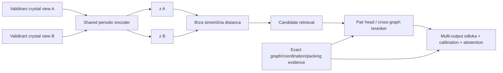

# Metric learning, pair modeli i evaluacija

## Glavni zaključak

Primeren neuralni dizajn zavisi od naučne uloge:

- za **aplikaciju 1**: mode-specific periodic **dual encoder** kao dodatni structural candidate kanal, pa exact/ANN retrieval i query-conditioned rerank za korisnost kandidata kao precedenta;
- za **aplikaciju 2**: shared encoder + simetrični multi-output pair head za učenje imenovanih relacija;
- cross-graph attention/matching model: za candidate podskup ili all-pairs režim samo kada računarski obim to dopušta;
- za target-specific odluku: kalibrisan classifier/ordinal model sa abstention-om, ne sirovi cosine ili InfoNCE score.

Nijedan model ne dobija naziv „crystal similarity model“ bez dodatka koji kaže koju relaciju uči. Isti parent graph, odnos koordinacionih okruženja, sličnost konformera, odnos pakovanja i korisnost precedenta nisu ista relacija.

Dataset i pair builder najpre prolaze [cross-format i lifecycle eligibility ugovor](../data/09-cross-format-eligibility.md): svi source pogledi istog entry-ja grupišu se pre split-a, representation availability ulazi u denominator/slice metrike, a state transition invalidira pogođene labele, embedding-e, indekse i model lineage.



## 6.1 Najpre se definiše target, tek onda loss

Minimalni relation registry:

| Target | Simetrija | Tip labele | Primarni posao |
|---|---|---|---|
| isti parent graph | simetričan | isto/različito | filter/pair odluka |
| odnos koordinacionih okruženja | simetričan | isto/povezano/različito | retrieval + pair |
| sličnost konformera | simetričan | graded ili continuous uz mapping | pair/rerank |
| odnos kristalnog pakovanja | simetričan | isto/povezano/različito | pair/rerank |
| odnos molekulske stereokemije | simetričan | isto/neslaganje | exact pair provera; ne similarity score |
| odnos kristalne handedness | simetričan | isto/neslaganje | enantiomorph/handedness provera kada je primenljiva |
| korisnost precedenta za upit | query-conditional | grade 0/1/2 + reason | App 1 ranking |
| usmereno sadržavanje motiva | **asimetričan** | A sadrži B / B sadrži A / oba ili jednako / nijedno | substructure posao |

Ovo su isključivo naučne labele. Ishod izvršenja svake grane odvojeno razlikuje ocenjeno, dvosmisleno, neprimenljivo, nedostajući ulaz, blokadu kvalitetom, istek vremena i neuspeh. Relation loss računa se samo za ocenjene slučajeve sa poznatom naučnom labelom; nijedan neocenjen ishod ne postaje klasa. Packing relacija razlikuje isto, povezano i različito, dok se parcijalni matched cluster opisuje coverage-om evidence-a, brojem poklopljenih molekula i RMSD-om.

Par koji je pozitivan za isti parent graph može biti negativan za isti packing. Zato se koriste odvojeni modeli/head-ovi ili eksplicitno multi-task učenje sa zasebnim loss-om, maskom dostupnih labela i slice metrikom za svaki target.

### Label ugovor

Labela je definisana tek kada navodi identitet/grupe oba endpoint-a, target i vrednost, reference na exact mapping/packing/interaction evidence, anotatore, adjudikaciju, pouzdanost i poreklo — stručnu anotaciju, metamorphic evidence ili slabo pravilo. Tačan tehnički format je implementacioni izbor.

Labela izvedena slabim pravilom može pomoći pretraining-u ili distillation-u, ali ne sme biti nezavisni gold test modela koji imitira isto pravilo.

Simetrična relacija koristi neuređeni identitet para. Directional target koristi uređeni par i čuva oba smera; eventualni kanonski storage redosled nikada ne menja target smer.

## 6.2 Dual encoder za globalnu pretragu

Shared encoder računa

\[
z_A=\operatorname{norm}(f_\theta(A)),\qquad
z_B=\operatorname{norm}(f_\theta(B)).
\]

Za L2-normalizovane embedding-e cosine i squared Euclidean imaju isti poredak:

\[
\lVert z_A-z_B\rVert_2^2=2-2z_A^Tz_B.
\]

Definicija metoda ipak navodi tačnu normalizaciju i metricu; menjanje jedne menja susedstvo. Ako se norm ne fiksira, inner product, cosine i L2 više nisu ekvivalentni.

### Zašto dual encoder

- corpus vektori se računaju jednom;
- exact Flat daje oracle za istu naučenu metricu;
- HNSW/IVF može ubrzati isti vektor tek posle recall testa;
- query latency je jedan graph build + jedan forward;
- embeddings se mogu ponovo koristiti i za App 2.

Za dva CIF/crystal ulaza i simetričan structural target encoder weights se dele. Ako App 1 query uključuje dodatni tekstualni intent, korisničke filtere ili usmerenu semantiku korisnosti precedenta, shared-cosine structural embedding ostaje samo high-recall kandidat signal treniran na imenovanom simetričnom proxy targetu. Direktno učenje query-conditional korisnosti zahteva role-specific query/corpus tower ili query-conditioned pair/listwise reranker. Nevezani query/document encoderi su nova cross-modal/asymmetric arhitektura i ne preimenuju se u simetričnu crystal metricu.

### Šta dual encoder ne može

- ne daje atom-to-atom mapping;
- globalno pooling može izgubiti mali ključni donor motiv;
- simetrična metrika ne predstavlja directional containment;
- blizina nije probability;
- relevantan kandidat koji loss nikada nije definisao može biti daleko.

Zato App 1 koristi uniju 2D, coordination, 3D i learned kanala. Neural kanal ne postaje jedini recall put.

## 6.3 Loss porodice i njihove pretpostavke

### Pair contrastive loss

Klasični [contrastive loss](https://doi.org/10.1109/CVPR.2006.100) za binary positive/negative parove može se zapisati kao

\[
\mathcal L=y d^2+(1-y)\max(0,m-d)^2,
\]

gde je \(d=d(z_A,z_B)\), \(y=1\) positive i \(m\) margin. To je najjednostavniji embedding baseline, ali margin i odnos easy/hard negativa snažno određuju geometriju.

### Triplet loss

[FaceNet](https://openaccess.thecvf.com/content_cvpr_2015/html/Schroff_FaceNet_A_Unified_2015_CVPR_paper.html) popularizuje uslov

\[
d(a,p)^2+m<d(a,n)^2.
\]

Za 2CDC se testira samo uz potvrđene negative i semi-hard mining. Globalno „najhardest“ negative često je pogrešna labela, redetermination, parsing failure ili nepoznat legitimate positive.

### InfoNCE

[InfoNCE/CPC](https://arxiv.org/abs/1807.03748) za anchor \(i\), positive \(p(i)\) i batch candidate-e koristi softmax nad scaled similarities:

\[
\mathcal L_i=-\log\frac{\exp(s_{i,p(i)}/\tau)}
{\sum_{k\in B}\exp(s_{i,k}/\tau)}.
\]

Denominator sadrži designated positive i sve dozvoljene negative, ali isključuje anchor-self kada bi se inače pojavio kao trivijalan kandidat. U cross-modal ili query↔candidate učenju loss se računa u oba smera **samo** kada je obrnuti retrieval smer semantički validan; inače se koristi directional objective. InfoNCE output je verovatnoća izbora positive-a unutar konkretnog sampled denominator-a; nije \(P(\text{hemijski relevantan}\mid A,B)\).

### Supervised contrastive

[Supervised contrastive learning](https://proceedings.neurips.cc/paper/2020/hash/d89a66c7c80a29b1bdbab0f2a1a94af8-Abstract.html) dozvoljava više positives po anchor-u i koristi sve poznate iste-klase primere u batch-u. Primeren je kada target zaista pravi dosledne klase ili relation groups.

Ne sme se jednom klasom spojiti „isti parent“, „isti metal“ i „sličan packing“. Takav model dobija kontradiktorne positive/negative parove. Ako kategorija „povezano“ nije tranzitivna equivalence relacija, ne pretvara se veštački u class ID za supervised contrastive loss. Ni distance-based pair/triplet loss automatski ne može predstaviti proizvoljnu netranzitivnu relaciju: prvo se radi metric-consistency audit, a kada target nije kompatibilan sa globalnom metrikom koristi se pair comparator ili query-conditioned ranker.

### BCE/ordinal i listwise loss

- binary cross-entropy nad simetričnim pair head-om odgovara binarnom pair-classification targetu;
- ordinal/cumulative-link head odgovara situaciji u kojoj ekspert dosledno uređuje kategorije od različitog, preko povezanog, do istog;
- [ListNet](https://doi.org/10.1145/1273496.1273513) je listwise metod; LambdaMART koristi pairwise lambda-gradijente ponderisane promenom ranking metrike. Oba zahtevaju query-grouped judgments, dok graded labels pomažu ali nisu formalno obavezne za LambdaMART;
- unjudged/truncated candidate nije implicitno grade 0.

### Veza target-a i loss-a

Metamorphic invariance primeri proveravaju reprezentacionu ekvivalenciju, pair contrastive i triplet loss zahtevaju pouzdane negative, a supervised contrastive zahteva metric-consistent relation groups. BCE/ordinal head odgovara direktnoj pair odluci, dok query-grouped pairwise/listwise loss zahteva ranking judgments. Cross-graph model je opravdan kada target zahteva correspondence signal koji dual encoder i determinističke features ne predstavljaju dovoljno dobro; redosled realizacije ne sledi iz same loss teorije.

## 6.4 Positive parovi: tri nivoa dokaza

### A. Exact-equivalence positives

Jedna struktura se transformiše kroz:

- atom/component permutation;
- rigid proper rotation i translaciju;
- origin/wrap promenu;
- symmetry-equivalent ASU/setting;
- dozvoljenu unimodularnu basis promenu;
- primitive/conventional/supercell predstavljanje istog beskonačnog kristala.

Ovi parovi uče reprezentacionu invariance. **Ne uče** da su dva različita kristala relevantna za korisnikov upit.

### B. Relation positives

Ekspert ili validirana metoda potvrđuje tačno jednu relaciju: isti parent, ista koordinacija, sličan conformer ili isti/related packing. Positive se nikada ne prenosi na drugi head bez njegove labele.

### C. Weak positives

Visok ECFP, COMPACK/PAC prag, isti motif ili simulated-PXRD match može generisati candidate za anotaciju ili weak-supervised pretraining. Weak label mora ostati vidljiv i ne ulazi u gold test kao ekspertna istina.

## 6.5 Negative mining bez lažnih negativa

Kristalni korpus sadrži redeterminations, alternativne CIF zapise, symmetry-equivalent ćelije, polymorphs, solvates i više legitimnih rezultata po query-ju. Random/in-batch kandidat zato nije automatski negative. [Debiased contrastive learning](https://proceedings.neurips.cc/paper/2020/hash/63c3ddcc7b23daa1e42dc41f9a44a873-Abstract.html) formalizuje štetu false-negative sampling-a u kontrastivnom učenju.

Obavezna pravila:

1. split se pravi **pre** mining-a;
2. miner vidi samo training particiju;
3. designated positive ostaje i u numerator-u i u denominator-u; ostali poznati positives ulaze kao dodatni positives u multi-positive/SupCon formulaciji ili se uklanjaju samo iz skupa tretiranog kao negative — designated positive se nikada ne briše iz denominator-a;
4. nepoznat ili neocenjen kandidat nije negativan primer;
5. hardest candidate ide u audit queue, ne automatski u label 0;
6. negative pool i miner checkpoint se verzionišu;
7. koristi se mešavina random, within-family i potvrđenih semi-hard negativa;
8. disagreement/hard-mined skup je challenge set, ne reprezentativni test.

Ako postoje pouzdani positives i veliki neoznačen pool, [positive–unlabeled učenje](https://doi.org/10.1145/1401890.1401920) može biti legitimniji baseline od masovne pretpostavke da je sve ostalo negative. Pre toga se eksplicitno definiše da li label-selection mehanizam približno zadovoljava SCAR ili target-specific SAR pretpostavku, kako se procenjuju selection propensity i positive class prior, i sensitivity rezultat na njihovu grešku. Bez identifikabilnog selection ugovora PU probability claim nije dozvoljen.

### Ciljani hard negatives za 2CDC

Svaki hard negative eksplicitno navodi ciljnu relaciju. Isti par može biti negative za packing head, a positive za parent head; globalna negative etiketa ne postoji.

- ista formula, drugi constitutional graph;
- isti parent ligand, druga koordinacija/metallation;
- isti molekul, drugi polymorph/packing;
- isti cell/space group, različit packing;
- enantiomer/enantiomorph u stereo-sensitive profilu;
- solvent/counterion razlika;
- disorder/quality slučaj u kome je zaključak blokiran kvalitetom i nema naučnu relacionu labelu, ne lažno „različito“.

## 6.6 Self-supervised pretraining

[Crystal Twins](https://arxiv.org/abs/2205.01893) koristi 428.275 neoznačenih struktura, CGCNN encoder, Barlow Twins objective i random perturbation/atom/edge masking; rezultat validira fine-tuned **property prediction** na sedam skupova. [CrysGNN](https://openreview.net/forum?id=Y33JsvNrn1o) pretrenira na približno 800.000 crystal graph-ova i takođe pokazuje property-prediction transfer. Njegovi node reconstruction zadaci jesu self-supervised, ali graph-level deo rekonstruiše space group i bira contrastive positive/negative preko crystal-system informacije; zato je preciznije reći **symmetry-metadata-informed pretraining**, ne potpuno label-free graph SSL. Space-group i normalizovani crystal-system podaci ulaze u shortcut, split i pretraining-overlap audit; raw export label i reported/coordinate setting ostaju zasebni provenance, ne paralelne klase. Nijedan rad sam po sebi ne dokazuje 2CDC retrieval metricu.

### Augmentation contract je target-specific

Bezbedni positives za invariance pretraining su dokazano ekvivalentna kodiranja iz §6.4A. Sledeće nisu automatski positive:

- coordinate noise ili strain;
- atom/edge masking;
- uklanjanje solventa;
- protonation/tautomer promena;
- metal ili ligand substitution;
- brisanje donor veze;
- reflection kada je stereo bitan.

Ove transformacije mogu biti korisni pretext corruption zadaci, ali se ne sme tvrditi da čuvaju relaciju pakovanja ili koordinacionih okruženja. Svaka dobija ablation i label-consistency audit.

### Pretraining overlap

Ako je encoder video neoznačene test strukture, rezultat je transductive. Strict unseen-entity ili prospective claim zahteva dedup/group/time overlap audit i pretraining corpus koji poštuje cutoff. „Bez labela“ ne znači „bez leakage-a“.

## 6.7 Pair modeli za aplikaciju 2

### Simetrični two-tower head

Za simetričan target MLP/GBDT head može koristiti commutative features, na primer:

\[
h(A,B)=\left[|z_A-z_B|,\ z_A\odot z_B,\ z_A+z_B,\ d(z_A,z_B),\ x_{det}(A,B)\right],
\]

gde su \(x_{det}\) rastavljivi deterministic branch output-i. Za simetričan target i oni moraju biti commutative ili sadržati oba directional rezultata u simetričnoj agregaciji. `concat(z_A,z_B)` bez simetrizacije može naučiti left/right artefakt. Alternativa je set arhitektura po principu [Deep Sets](https://proceedings.neurips.cc/paper_files/paper/2017/hash/f22e4747da1aa27e363d86d40ff442fe-Abstract.html) ili prosek logits-a oba redosleda.

Kanonski ID ordering eventualno služi skladištenju, ne model symmetry-ju. Test mora menjati ID-jeve, reingest redosled i proveriti \(S(A,B)=S(B,A)\) u dtype-specifičnoj toleranciji.

Directional containment dobija dva odvojena izlaza: da li A sadrži B i da li B sadrži A. Iz njih se izvode slučajevi u kojima važe oba smera ili jednakost, nijedan smer ili dvosmislenost; ne koristi se simetričan metric head. Swap-equivariance znači da zamena A/B mora tačno zameniti dva directional izlaza, dok slučajevi „oba ili jednako“ i „nijedno“ ostaju isti.

### Cross-graph comparator

[Graph Matching Networks](https://proceedings.mlr.press/v97/li19d.html) demonstriraju cross-graph attention za učenje graph similarity-ja u opštem domenu. Za 2CDC to je samo arhitektonski precedent. Crystal varijanta mora očuvati:

- nezavisni frame/gauge contract oba grafa;
- periodic multiedges;
- component i chemical-role constraints;
- stereo profil;
- symmetric output za simetrične relacije;
- bounded memory za velike i disordered strukture.

Bezbedne opcije su cross-match nad profile-invariantnim node/local-environment features, eksplicitno mapiranje/alignment pre zajedničkog modela ili dokazano profile-specific \(G_A\times G_B\) invariantna arhitektura. Za stereo-sensitive profil O(3)-even distance/unsigned-angle features nisu dovoljne: grana čuva SO(3)-invariantan ali reflection-sensitive `0o`/signed kanal ili koristi exact stereo gate, uz test u kome se nezavisno mirror-uje samo A pa samo B ([e3nn parity/irreps](https://docs.e3nn.org/en/stable/api/o3/o3_irreps.html)). Cross-attention težina nije atom mapping dokaz; tačan correspondence ostaje deterministički evidence.

### Računski režimi cross-graph modela

- App 1: ograničen candidate podskup posle visok-recall unije;
- App 2 full mode: svi parovi samo ako \(n(n-1)/2\) i strukturalne veličine staju u kapacitet;
- App 2 pruned mode: kandidat-pruning ima zaseban recall gate;
- istek vremena i nedostatak memorije ostaju različiti neuspešni ishodi sa jasnim razlogom; nijedan nema naučnu relacionu labelu niti postaje similarity 0.

### Multi-output umesto jednog procenta

Ilustrativni izlaz može istovremeno tvrditi da je parent graph isti uz exact dokaz, da je coordination relacija različita zbog različitog mapiranog donor seta i da packing nije ocenjen zbog nerešenog disorder-a. Svaka grana zato nosi svoj ishod, naučnu relacionu labelu samo kada je ocenjiva, probability samo kada je kalibrisana, objašnjenje razloga i evidence coverage. U tom obrascu agregatna odluka abstain-uje umesto da neocenjen packing pretvori u nulu.

Jedan overall model ne sme prosekom sakriti hard mismatch ili neocenjenu ključnu granu.

## 6.8 Split bez endpoint leakage-a

Strukture se prvo grupišu po stable identity/redetermination, a dodatni cold key — parent, compound, scaffold, solid form, publication ili vreme — bira se prema konkretnoj generalization tvrdnji. Tek zatim se generišu parovi i augmentations. Nije bezbedno blanket grupisati po svim ključevima: za target istog parent grafa parent-disjoint query/corpus split može po definiciji ukloniti svaki mogući positive.

Pre konačnog splita report prikazuje broj i masu labela/positives po targetu i slice-u koji su dodeljivi, odbačeni ili postali cross-partition. Ako cold definicija znači da relevantan corpus item ne može postojati, taj slice je open-set **no-match/abstention** test, ne Recall@C retrieval test.

### 2D cold/cold

Za disjunktne endpoint particije \(T,V,C,E\):

```text
train: T × T
model selection: V × V
post-hoc calibration/threshold: C × C
test: E × E
```

Ovo meri generalizaciju kada su oba endpoint-a iz novih grupa. Cross-partition \(T\times E\) parovi se izostavljaju iz glavnog estimand-a. Kada je data premalo za četiri fiksne particije, koristi se nested grouped CV i out-of-fold calibration; outer test i dalje nikada ne bira model, prag ili calibrator.

### 1D warm/cold

Ako ciljna upotreba znači novi query protiv poznatog, zamrznutog corpus-a \(T\), zasebni protokol je:

```text
train: T × T
model selection: V × T
post-hoc calibration/threshold: C × T
test: E × T
```

Cold query grupe \(V,C,E\) su međusobno i prema izabranom cold key-u disjunktne; corpus \(T\) ostaje fiksan. Ovo je drugi estimand, ne dodatni red u cold/cold testu. Ako nema dovoljno podataka, koristi se istorijski/nested grouped OOF ekvivalent koji reprodukuje isti warm/cold selection scope. Calibrator iz \(C\times C\) se ne prenosi na \(C\times T\) bez nove validacije. [DataSAIL](https://doi.org/10.1038/s41467-025-58606-8) formalizuje razliku 1D i 2D split-a i problem nedodeljivih interakcija.

### Temporal/prospective

- pretraining data, feature fit, miner, ANN corpus, threshold i calibrator poštuju cutoff;
- vreme para je najkasniji endpoint timestamp;
- budući release se ne koristi za hard-negative mining;
- rezultat se zove prospective samo ako nijedan upstream artifact nije video post-cutoff strukture.

Random pair split je nevalidan: `A–B` u train-u i `A–C` u testu dele endpoint i često većinu features. Efektivni uzorak je broj nezavisnih query/family/endpoint grupa, ne broj \(n(n-1)/2\) parova.

### Zavisnost parova i intervali

Resampling prati estimand:

- App 1 ranking: resample-uju se cele query/family liste;
- 1D \(E\times T\): resample-uju se cold query grupe iz \(E\), dok zamrznuti corpus \(T\) ostaje fiksan;
- App 2 all-pairs: običan one-way row bootstrap nije dovoljan jer parovi dele oba endpoint-a. Koristi se dyadic/two-way cluster inference ili endpoint-group/node bootstrap koji resample-uje čvorove/grupe i rekonstruiše indukovane parove;
- interval razlike modela je paired: isti resample i isti query/pair skup za oba sistema.

Izbor metode, cluster jedinice i small-sample korekcije zaključava se pre testa; relevantnu teoriju za dyadic podatke daju [Aronow, Samii i Assenova](https://doi.org/10.1093/pan/mpv018) i [Menzel](https://doi.org/10.3982/ECTA15383).

## 6.9 `search1/search2` i druge kružne labele

Dostavljeni `search2` je uređeni/filterisani podskup `search1`. Tretiranje tog podskupa kao pozitivnih primera, a isključenih redova kao negativnih, samo bi naučilo filter/ordering koji je već proizveo fajl.

Ti exporti ostaju korisni za:

- test parsera i definicije podataka;
- reprodukciju filter semantike;
- kandidat pool za novu slepu anotaciju;
- hard-case pitanja za eksperte.

Nisu supervised relevance gold bez nezavisno definisanog targeta i nove adjudikacije. Isto važi za pseudo-labelu koju proizvodi COMPACK, ECFP prag ili stari ranker: legitimna je za distillation/weak training, ali finalni test mora biti nezavisan od teacher-a.

## 6.10 Evaluacija na četiri odvojena nivoa

### A. Representation correctness

- svaki obavezni exact-equivalence metamorphic slučaj prolazi;
- pair swap i nezavisna transformacija A/B prolaze;
- mirror positive/negative ponašanje prati stereo profil;
- embedding ne kolabira: prati se variance po dimenziji, effective rank i duplicate vector stopa;
- nearest-neighbor hubness i norm distribucija prijavljuju se po slice-u.

### B. ANN infrastrukturna tačnost

Exact Flat top-C iste embedding metrike je oracle. ANN izveštava tie-aware Recall@C, p50/p95/p99, throughput, RAM, build/update vreme i filtered workload. Ovo meri indeks, ne hemijsku relevantnost.

### C. Semantic candidate recall

Meri se koliko poznatih expert-relevant positives stiže u union candidate budget. Posebno se porede:

```text
deterministic channels only
learned encoder only
deterministic + learned union
svaki kanal minus-one ablation
```

Denominator zavisi od judgment pool-a. Unjudged dokument nije negative; novi retriever koji donosi mnogo neocenjenih kandidata zahteva pooling dopunu pre fer poređenja.

### D. Finalna pair/ranking odluka

Za App 1:

- Recall@k i nDCG@k;
- MAP/MRR kada label protokol to opravdava;
- review burden/precision@k;
- query-family cluster intervali.

Za App 2:

- per-target PR-AUC i operating-point precision/recall;
- ROC-AUC samo kao sekundarna metrika kada je positive redak;
- macro-F1/balanced accuracy za multi-class;
- Brier, log-loss i reliability za probability head;
- abstention risk–coverage;
- evidence/status coverage i critical false-negative rate.

PR krive su informativnije od samog ROC-a kod retkih positives ([Davis–Goadrich](https://doi.org/10.1145/1143844.1143874)). Ranking i classification threshold se zaključavaju u inner validation-u, ne biraju na outer testu.

## 6.11 Calibration, OOD i abstention

Cosine, margin, InfoNCE i LambdaMART score nisu probability. Poseban pointwise/pair probability head se kalibriše na reprezentativnom grouped calibration skupu sa deployment-like prevalence.

[Temperature scaling](https://proceedings.mlr.press/v70/guo17a.html) je jednostavan neural baseline. Platt/isotonic su binary baseline-i; multiclass target zahteva koherentan simplex calibrator i classwise reliability, a ordinal target cumulative calibrator koji čuva redosled pragova. [Kull et al.](https://proceedings.neurips.cc/paper_files/paper/2019/hash/8ca01ea920679a0fe3728441494041b9-Abstract.html) daju multiclass calibration porodicu, ali konkretan metod se bira u validation-u.

Calibrator je output-, mode-, selection- i generation-specific. Na primer, tvrdi samo \(P(y\mid \text{selected},\text{mode},\text{candidate policy})\) za populaciju na kojoj je fitovan; full, pruned, top-M i druga candidate-union politika mogu imati različitu prevalence/distribuciju. Hard-negative-enriched calibration bez weighting-a ili prirodnog reprezentativnog skupa daje pogrešne verovatnoće.

Class-prior correction je dozvoljen samo uz eksplicitnu label/prior-shift pretpostavku — stabilan class-conditional feature distribution — i sensitivity test. Ne koriguje proizvoljan covariate/concept shift ([Saerens et al.](https://doi.org/10.1162/089976602753284446)).

OOD/anomaly score nije automatska garancija greške. Izveštavaju se:

- distance do training embedding support-a;
- ensemble disagreement kada je budžet opravdan;
- parser/quality/applicability status;
- slice membership i poznat domain limit;
- risk–coverage kriva, kao u selective prediction pristupu ([SelectiveNet](https://proceedings.mlr.press/v97/geifman19a.html)).

Conformal sloj dobija claim samo pod odgovarajućom exchangeability pretpostavkom. Endpoint-zavisni parovi, temporal shift i aktivno birani hard negatives je mogu prekršiti; tada se coverage prikazuje empirijski bez distribution-free tvrdnje ([Barber et al.](https://doi.org/10.1214/23-AOS2276)).

### Critical shift slice-ovi

- novi ligand/scaffold i novi metal/element;
- charge/stoichiometry i broj komponenti;
- polymorph, solvate/co-crystal i \(Z'\);
- coordination polymer;
- disorder/occupancy/missing H;
- space group i normalizovani crystal system, zasebno raw-label i lattice/axes-setting slice, te cell veličina;
- vreme/publication/source;
- mali i veoma veliki graph/pair.

Bez autorizovanog reprezentativnog CSD snapshot-a model može biti istraživačka hipoteza na public/dostavljenim podacima, ali ne podržava corpus-wide CSD claim.

## 6.12 Kategorije evaluacione odluke

Pre merenja se definišu estimand, jedinica agregacije (`query-macro`, micro ili pair), potreban broj nezavisnih grupa i positive događaja, paired interval/LCB sa estimand-ispravnim resampling-om i non-inferiority margina. Slice koji nema dovoljnu efektivnu veličinu dobija status `underpowered`, a ne automatski pass ili fail. Numeričke granice su claim-, rizik- i stakeholder-specifične i ne slede iz literature kao univerzalne konstante.

| Kategorija | Naučni kriterijum |
|---|---|
| data integrity | nula endpoint/family/hash preklapanja u cold/cold split-u; upstream overlap odgovara deklarisanom claim-u |
| metamorphic | svi obavezni ID/order/basis/supercell testovi zadovoljavaju unapred validirane tolerance |
| pair symmetry | swap razlika ostaje unutar dtype- i runtime-specifične numeričke tolerancije |
| ANN | query-macro tie-aware exact-score Recall@C meri se prema exact oracle-u ukupno i po dovoljno snažnim kritičnim slice-ovima |
| semantic candidate | expert-positive Recall@C meri da izgubljen kandidat ne može biti vraćen rerankerom; nepotpune oznake ograničavaju claim na judgment pool |
| non-inferiority i korist | paired interval poredi praktičnu marginu, primarnu relevance metriku i računsku korist |
| pair model | PR-AUC i operativni precision/recall nisu lošiji od RF/GBDT/determinističkog baseline-a |
| calibration | NLL/Brier i risk na ciljanoj coverage nisu lošiji od baseline-a |
| račun | relevantni latency kvantili, RAM, rebuild/update trošak, timeout i recovery odgovaraju deklarisanom computational scope-u |

### False-negative audit

Mined negatives se slepo proveravaju na stratifikovanom uzorku nezavisnih grupa. Kao početna orijentacija, nula grešaka u 300 iid/reprezentativnih provera sa zajedničkom stopom daje približno 1% jednostranu 95% „rule-of-three“ gornju granicu ([Hanley i Lippman-Hand](https://doi.org/10.1001/jama.1983.03330370053031)); zavisni parovi ne smeju se brojati kao 300 nezavisnih opažanja. Kod disproporcionalno stratifikovanog uzorka prijavljuju se sampling-weighted population estimate i stratum-specific intervali/bound-ovi; unresolved audit stavke nisu automatski nula grešaka.

### Label-efficiency analiza

Deep model se meri kroz više unapred definisanih budžeta **nezavisnih grupa**, sa više seed-ova i istim zamrznutim testom. Learning curve, paired interval/non-inferiority odluka i efektivni \(n\) pokazuju da li se korist javlja u praktično dostupnom opsegu labela; jedna tačkasta pobeda pri najvećem budžetu nije dovoljna.

Aktivno odabrane labele mogu efikasno trenirati model, ali aktivno odabran test uvodi selection bias. Koristi se reprezentativni test ili design/importance-weighted estimator ([Active Testing](https://proceedings.mlr.press/v139/kossen21a.html)).

## 6.13 Ilustrativne ose poređenja

### Referentne porodice

Transparentna rule/lexicographic formula, deterministic descriptors sa logističkim/ordinalnim ili tree modelom i exact ECFP/coordination/packing candidate kanali predstavljaju komplementarne reference. Njihove uloge se ne mogu svesti na jedan obavezan redosled.

### Encoderi

CGCNN, Matformer i ALIGNN ispituju različite hipoteze: jednostavan periodic graph, periodic transformer i line-graph/angle signal. SchNet daje distance-only ablation, a equivariant model testira potrebu za tensor/higher-body signalom. To su različite reprezentacione pretpostavke, ne projektni backlog.

### Training varijante

Moguće ose obuhvataju random naspram validiranog SSL init-a, pair naspram supervised contrastive loss-a, frozen naspram fine-tuned encoder-a, tabular naspram MLP head-a, exact Flat naspram ANN-a nad istim embedding-om, deterministic rerank i ograničen cross-graph rerank.

Svaka uporediva varijanta dobija isti split, label subset, tuning pravila i približno jednak search budžet. Candidate generator/retriever-i dobijaju isti eligible corpus, query set, hard filter/ACL, per-query budget i pooling/judgment protokol, ali njihovi output pool-ovi **moraju smeti da se razlikuju** — upravo to meri semantic candidate recall.

Za kontrolisanu reranker ablation svi rankeri dobijaju isti zamrznuti upstream candidate set. Zasebni end-to-end eksperiment zatim meri svaki retriever+rereanker sistem sa sopstvenim kandidatima, kako frozen-pool test ne bi sakrio retrieval grešku. Prijavljuju se svi pokušaji/seed-ovi, ne samo najbolji run.

### Ablacije koje odgovaraju na naučno pitanje

- bez periodic/lattice features;
- bez angle/line-graph grane;
- bez deterministic descriptors;
- bez coordination channel-a;
- bez packing/interaction signal-a;
- jedan universal head naspram mode-specific head-ova;
- random naspram confirmed hard negatives;
- sa/bez SSL init-a;
- frozen naspram fine-tuned encoder-a;
- exact Flat naspram ANN nad istim embedding-om.

## 6.14 Worked primeri

### DAP–Cu query u aplikaciji 1

1. 2D kanal vraća isti DAP scaffold.
2. Learned coordination encoder vraća i kandidate sa perifernim razlikama.
3. Hard filter/exact mapping proverava da isti Cu koordinira sva tri konkretna N donora.
4. Reranker koristi encoder score, common-core, donor mapping, CN/shape i quality status.
5. Kandidat sa Cu samo u counterion-u ne može pobediti exact coordination mismatch visokim cosine score-om.

### Polymorph pair u aplikaciji 2

Molecular head daje visoku sličnost; packing head razlikuje povezano od različitog. Ako COMPACK/PAC nije primenljiv zbog disorder-a, packing zaključak je blokiran kvalitetom, nema naučnu relacionu labelu i navodi razlog, a model abstain-uje. Ne uči se implicitno da missing packing znači negative.

### False-negative slučaj

Batch sadrži redetermination istog solid form-a pod drugim ID-jem. Naivni InfoNCE ga koristi kao negative i gura embeddings apart. Entity/group reconciliation ga uključuje kao dodatni positive u multi-positive loss-u ili ga maskira samo iz negative skupa; designated positive ostaje u denominator-u. Incident ulazi u data-quality izveštaj.

### Novi query protiv starog corpus-a

Ovo je 1D warm/cold evaluacija. Corpus embeddings i indeks su napravljeni pre cutoff-a; query porodica je nova. Rezultat se ne meša sa 2D cold/cold pair tvrdnjom gde su oba endpoint-a nova.

## 6.15 Računsko skaliranje

### App 1

Trošak unapred izračunatih corpus reprezentacija je jedan embedding po autorizovanom entry-ju. Analiza odvojeno meri graph-build, encoder, ANN, exact rerank i odgovarajući rep ukupne latency distribucije. ACL/licenca se primenjuju pre candidate distance search-a kao u retrieval modulu.

### App 2

Za \(n\) struktura postoji \(P=n(n-1)/2\) unordered parova. Shared embeddings se računaju \(n\) puta, a lagani pair head \(P\) puta. Cross-graph comparator se batch-uje po site/edge budget-u, ne samo po broju parova; veliki graph može dominirati memorijom.

Računski izveštaj razlikuje full/pruned mode, cost distribuciju, timeout/failure statuse, peak memoriju i parcijalne rezultate bez pretvaranja neuspeha u score. Tačna queue i retry šema nisu deo algoritamske specifikacije.

### Kompatibilnost reprezentacije i indeksa

Promena standardizacije, graph builder-a, model weights-a, embedding normalizacije, distance metrike ili quantization-a menja definiciju embedding prostora. Indeks i query encoder moraju koristiti kompatibilnu reprezentaciju; lifecycle i rebuild mehanizam je implementacioni izbor.

## 6.16 Informacije potrebne za reproduktivnu evaluaciju

Pored definicije modela iz prethodnog poglavlja navode se:

- definiciju targeta/relacije i verziju annotator guideline-a;
- label provenance, adjudication i sample weights;
- split group definiciju i hash svih particija;
- 1D/2D/temporal estimand;
- augmentation/positive policy;
- negative pool, miner model/checkpoint, mining trenutak/politika i false-negative mask;
- batch composition i sampler seed;
- loss jednačinu, margin/temperature i normalization;
- optimizer, learning-rate politika i early-stop criterion;
- sve tuning trial-ove i selection rule;
- calibration dataset/prevalence i definicija calibrator-a;
- exact Flat rezultati i definicija ANN artefakta;
- candidate merge/top-M politiku;
- per-slice metrics, intervals i failure list;
- hardware/runtime/precision i izmereni computational scope;
- code/dependency i weights identitet.

Tačan tehnički format i infrastrukturni mehanizmi nisu naučni zahtevi; navedene kategorije jesu potrebne da bi se rezultat protumačio i ponovio.

## 6.17 Anti-patterni

- jedan universal embedding za sve relacije;
- property-pretrained latent cosine prikazan kao crystal similarity;
- random pair split;
- mining pre split-a ili iz validation/test pool-a;
- svi in-batch kandidati tretirani kao negatives;
- pretvaranje nepoznatog ili neocenjenog kandidata u oznaku nula;
- tretiranje skupa `search2` kao positive i ostatka `search1` kao negative;
- InfoNCE ili cosine preimenovan u probability;
- canonical ID ordering kao zamena za simetričan head;
- cross-attention weights predstavljene kao atom mapping;
- listwise loss nad truncated/unjudged kandidatima koji implicitno postaju nula;
- weak-rule teacher ocenjen na sopstvenim pseudo-labelama;
- ANN exact-neighbor recall predstavljen kao semantic recall;
- hard-negative challenge set korišćen za prevalence/calibration;
- SSL na test strukturama predstavljen kao strict inductive/prospective rezultat;
- conformal coverage bez exchangeability ugovora;
- threshold, mining ili ANN parametar izabran na outer testu.

## 6.18 Matrica uloga i uslova primenljivosti

| Uloga | Transparentna referenca | Neuralna alternativa | Uslov primenljivosti |
|---|---|---|---|
| invariance učenje | exact metamorphic parovi | Barlow/InfoNCE uz target-safe augmentations | transformacije zaista čuvaju target i prolaze metamorphic testove |
| App 1 structural candidate | deterministic multichannel | periodic shared dual encoder ili angle-aware encoder | semantic recall se meri nezavisno; exact Flat je oracle istog embedding-a |
| App 1 ANN infrastruktura | exact Flat nad istim embedding-om | HNSW/IVF prema retrieval modulu | ANN rešava scale/latency/cost, ne semantičku definiciju |
| App 1 rerank prema korisnosti precedenta | rule/logistic/tree model | query-conditioned pairwise/listwise ili ograničen cross-graph ranker | zahteva query-level judgments i fer candidate-pool evaluaciju |
| App 2 pair | deterministički evidence + tabularni model | shared encoder + simetrični BCE/ordinal multi-head | PR/calibration/evidence/abstention i swap/PBC/stereo testovi |
| skupi pair | exact mapping/packing | invariant cross-graph comparator | opravdan kada rešava dokumentovan failure slice |
| directional motif | exact subgraph relation | directional pair head | meri oba smera, bez pretvaranja u simetričnu metricu |

Learned embedding, SSL ili cross-graph sloj naučno su opravdani tek kada daju dodatni semantic recall ili pair kvalitet pod istim data/split/tuning uslovima, bez gubitka critical slice-a i determinističkog evidence-a. ANN se procenjuje odvojeno: exact Flat je oracle za poredak istog embedding-a, a aproksimaciona greška nije semantička prednost čak i kada slučajno promeni Recall@C.
