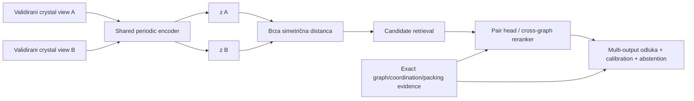

# Metric learning, pair modeli i production gate

## Glavna odluka

Najbolji neural dizajn zavisi od mesta u pipeline-u:

- za **aplikaciju 1**: mode-specific periodic **dual encoder** kao dodatni structural candidate kanal, pa exact/ANN retrieval i query-conditioned rerank za `useful_precedent`;
- za **aplikaciju 2**: shared encoder + simetrični multi-output pair head kao prvi neural challenger;
- cross-graph attention/matching model: samo za top-M parove ili kada obim App 2 staje u budžet;
- za finalnu odluku: kalibrisan target-specific classifier/ordinal model sa abstention-om, ne sirovi cosine ili InfoNCE score.

Nijedan model ne dobija naziv „crystal similarity model“ bez suffix-a koji kaže koju relaciju uči. `same_parent`, `same_coordination_motif`, `same_conformer`, `packing_related` i `useful_search_result` nisu ista relacija.



## 6.1 Najpre se definiše target, tek onda loss

Minimalni relation registry:

| Target | Simetrija | Tip labele | Primarni posao |
|---|---|---|---|
| `same_parent_graph_v1` | simetričan | true/false/ambiguous | filter/pair odluka |
| `coordination_relation_v1` | simetričan | same/related/different/not_assessed | retrieval + pair |
| `conformer_similarity_v1` | simetričan | graded ili continuous uz mapping | pair/rerank |
| `packing_relation_v1` | simetričan | same/related/different/ambiguous | pair/rerank |
| `useful_precedent_v1` | query-conditional | grade 0/1/2 + reason | App 1 ranking |
| `contains_motif_v1(A,B)` | **asimetričan** | A contains B / B contains A / both-or-equal / neither / ambiguous | substructure posao |

Jedan positive u `same_parent_graph_v1` može biti negative u `packing_relation_v1`. Zato se koriste odvojeni modeli/head-ovi ili eksplicitno multi-task učenje sa zasebnim loss-om, maskom dostupnih labela i slice metrikom za svaki target.

### Label ugovor

```yaml
pair_id: stable-unordered-id
left_structure_group: ...
right_structure_group: ...
target: packing_relation_v1
label: related
evidence_refs:
  compack_or_pac: ...
  exact_mapping: ...
  interaction_network: ...
annotators: [...]
adjudication_status: final | unresolved
confidence: certain | probable | ambiguous
label_source: expert | metamorphic | weak_rule
```

`weak_rule` labela može pomoći pretraining-u ili distillation-u, ali ne sme biti nezavisni gold test modela koji imitira isto pravilo.

Schema iz primera je za simetričnu relaciju i koristi unordered `pair_id`. Directional target koristi ordered pair key i čuva oba smera; canonical storage ordering nikada ne menja target smer.

## 6.2 Dual encoder za globalnu pretragu

Shared encoder računa

\[
z_A=\operatorname{norm}(f_\theta(A)),\qquad
z_B=\operatorname{norm}(f_\theta(B)).
\]

Za L2-normalizovane embedding-e cosine i squared Euclidean imaju isti poredak:

\[
\lVert z_A-z_B\rVert_2^2=2-2z_A^Tz_B.
\]

Manifest ipak čuva tačnu normalizaciju i metricu; menjanje jedne menja index contract. Ako se norm ne fiksira, inner product, cosine i L2 više nisu ekvivalentni.

### Zašto dual encoder

- corpus vektori se računaju jednom;
- exact Flat daje oracle za istu naučenu metricu;
- HNSW/IVF može ubrzati isti vektor tek posle recall testa;
- query latency je jedan graph build + jedan forward;
- embeddings se mogu cache-ovati i za App 2.

Za dva CIF/crystal ulaza i simetričan structural target encoder weights se dele. Ako App 1 query uključuje dodatni tekstualni intent, korisničke filtere ili directional `useful_precedent_v1` semantiku, shared-cosine structural embedding ostaje samo high-recall kandidat signal treniran na imenovanom simetričnom proxy targetu. Direktno učenje query-conditional korisnosti zahteva role-specific query/corpus tower ili query-conditioned pair/listwise reranker. Nevezani query/document encoderi su nova cross-modal/asymmetric arhitektura i ne preimenuju se u simetričnu crystal metricu.

### Šta dual encoder ne može

- ne daje atom-to-atom mapping;
- globalno pooling može izgubiti mali ključni donor motiv;
- simetrična metrika ne predstavlja directional containment;
- blizina nije probability;
- relevantan kandidat koji loss nikada nije definisao može biti daleko.

Zato App 1 koristi uniju 2D, coordination, 3D i learned kanala. Neural kanal ne postaje jedini recall put.

## 6.3 Loss turnir

### Pair contrastive loss

Klasični [contrastive loss](https://doi.org/10.1109/CVPR.2006.100) za binary positive/negative parove može se zapisati kao

\[
\mathcal L=y d^2+(1-y)\max(0,m-d)^2,
\]

gde je \(d=d(z_A,z_B)\), \(y=1\) positive i \(m\) margin. To je najjednostavniji embedding baseline, ali margin i odnos easy/hard negativa snažno određuju geometriju.

### Triplet loss

[FaceNet](https://openaccess.thecvf.com/content_cvpr_2015/html/Schroff_FaceNet_A_Unified_2015_CVPR_paper.html) popularizuje uslov

\[
d(a,p)^2+m<d(a,n)^2.
\]

Za 2CDC se testira samo uz potvrđene negative i semi-hard mining. Globalno „najhardest“ negative često je pogrešna labela, redetermination, parsing failure ili nepoznat legitimate positive.

### InfoNCE

[InfoNCE/CPC](https://arxiv.org/abs/1807.03748) za anchor \(i\), positive \(p(i)\) i batch candidate-e koristi softmax nad scaled similarities:

\[
\mathcal L_i=-\log\frac{\exp(s_{i,p(i)}/\tau)}
{\sum_{k\in B}\exp(s_{i,k}/\tau)}.
\]

Denominator sadrži designated positive i sve dozvoljene negative, ali isključuje anchor-self kada bi se inače pojavio kao trivijalan kandidat. U cross-modal ili query↔candidate učenju loss se računa u oba smera **samo** kada je obrnuti retrieval smer semantički validan; inače se koristi directional objective. InfoNCE output je verovatnoća izbora positive-a unutar konkretnog sampled denominator-a; nije \(P(\text{hemijski relevantan}\mid A,B)\).

### Supervised contrastive

[Supervised contrastive learning](https://proceedings.neurips.cc/paper/2020/hash/d89a66c7c80a29b1bdbab0f2a1a94af8-Abstract.html) dozvoljava više positives po anchor-u i koristi sve poznate iste-klase primere u batch-u. To je prvi supervised embedding kandidat kada target zaista pravi dosledne klase ili relation groups.

Ne sme se jednom klasom spojiti „isti parent“, „isti metal“ i „sličan packing“. Takav model dobija kontradiktorne positive/negative parove. Ako `related` nije tranzitivna equivalence relacija, ne pretvara se veštački u class ID za supervised contrastive loss. Ni distance-based pair/triplet loss automatski ne može predstaviti proizvoljnu netranzitivnu relaciju: prvo se radi metric-consistency audit, a kada target nije kompatibilan sa globalnom metrikom koristi se pair comparator ili query-conditioned ranker.

### BCE/ordinal i listwise loss

- binary cross-entropy nad simetričnim pair head-om je prvi finalni pair-classification baseline;
- ordinal/cumulative-link head je bolji kada ekspert dosledno razlikuje `different < related < same`;
- [ListNet](https://doi.org/10.1145/1273496.1273513) je listwise metod; LambdaMART koristi pairwise lambda-gradijente ponderisane promenom ranking metrike. Oba zahtevaju query-grouped judgments, dok graded labels pomažu ali nisu formalno obavezne za LambdaMART;
- unjudged/truncated candidate nije implicitno grade 0.

### Preporučeni red

1. metamorphic invariance pretraining;
2. pair contrastive baseline;
3. supervised contrastive sa svim poznatim positives;
4. triplet kao mining-sensitivity challenger, ne default;
5. BCE/ordinal pair head ili query-grouped ranker za finalni target;
6. cross-graph model samo ako dual encoder + determinističke features ostavljaju dokazanu rupu.

## 6.4 Positive parovi: tri nivoa dokaza

### A. Exact-equivalence positives

Jedna struktura se transformiše kroz:

- atom/component permutation;
- rigid proper rotation i translaciju;
- origin/wrap promenu;
- symmetry-equivalent ASU/setting;
- dozvoljenu unimodularnu basis promenu;
- primitive/conventional/supercell predstavljanje istog beskonačnog kristala.

Ovi parovi uče reprezentacionu invariance. **Ne uče** da su dva različita kristala relevantna za korisnikov upit.

### B. Relation positives

Ekspert ili validirana metoda potvrđuje tačno jednu relaciju: isti parent, ista koordinacija, sličan conformer ili isti/related packing. Positive se nikada ne prenosi na drugi head bez njegove labele.

### C. Weak positives

Visok ECFP, COMPACK/PAC prag, isti motif ili simulated-PXRD match može generisati candidate za anotaciju ili weak-supervised pretraining. Weak label mora ostati vidljiv i ne ulazi u gold test kao ekspertna istina.

## 6.5 Negative mining bez lažnih negativa

Kristalni korpus sadrži redeterminations, alternativne CIF zapise, symmetry-equivalent ćelije, polymorphs, solvates i više legitimnih rezultata po query-ju. Random/in-batch kandidat zato nije automatski negative. [Debiased contrastive learning](https://proceedings.neurips.cc/paper/2020/hash/63c3ddcc7b23daa1e42dc41f9a44a873-Abstract.html) formalizuje štetu false-negative sampling-a u kontrastivnom učenju.

Obavezna pravila:

1. split se pravi **pre** mining-a;
2. miner vidi samo training particiju;
3. designated positive ostaje i u numerator-u i u denominator-u; ostali poznati positives ulaze kao dodatni positives u multi-positive/SupCon formulaciji ili se uklanjaju samo iz skupa tretiranog kao negative — designated positive se nikada ne briše iz denominator-a;
4. `unknown/unjudged` nije negative;
5. hardest candidate ide u audit queue, ne automatski u label 0;
6. negative pool i miner checkpoint se verzionišu;
7. koristi se mešavina random, within-family i potvrđenih semi-hard negativa;
8. disagreement/hard-mined skup je challenge set, ne reprezentativni test.

Ako postoje pouzdani positives i veliki neoznačen pool, [positive–unlabeled učenje](https://doi.org/10.1145/1401890.1401920) može biti legitimniji baseline od masovne pretpostavke da je sve ostalo negative. Pre toga se eksplicitno definiše da li label-selection mehanizam približno zadovoljava SCAR ili target-specific SAR pretpostavku, kako se procenjuju selection propensity i positive class prior, i sensitivity rezultat na njihovu grešku. Bez identifikabilnog selection ugovora PU probability claim nije dozvoljen.

### Ciljani hard negatives za 2CDC

Svaki hard negative nosi `target` polje. Isti par može biti negative za packing head, a positive za parent head; globalna negative etiketa ne postoji.

- ista formula, drugi constitutional graph;
- isti parent ligand, druga koordinacija/metallation;
- isti molekul, drugi polymorph/packing;
- isti cell/space group, različit packing;
- enantiomer/enantiomorph u stereo-sensitive profilu;
- solvent/counterion razlika;
- disorder/quality slučaj koji treba `not_assessed`, ne `different`.

## 6.6 Self-supervised pretraining

[Crystal Twins](https://arxiv.org/abs/2205.01893) koristi 428.275 neoznačenih struktura, CGCNN encoder, Barlow Twins objective i random perturbation/atom/edge masking; rezultat validira fine-tuned **property prediction** na sedam skupova. [CrysGNN](https://openreview.net/forum?id=Y33JsvNrn1o) pretrenira na približno 800.000 crystal graph-ova i takođe pokazuje property-prediction transfer. Njegovi node reconstruction zadaci jesu self-supervised, ali graph-level deo rekonstruiše space group i bira contrastive positive/negative preko crystal-system informacije; zato je preciznije reći **symmetry-metadata-informed pretraining**, ne potpuno label-free graph SSL. Space-group/crystal-system polja ulaze u shortcut, split i pretraining-overlap audit. Nijedan rad sam po sebi ne dokazuje 2CDC retrieval metricu.

### Augmentation contract je target-specific

Bezbedni positives za invariance pretraining su dokazano ekvivalentna kodiranja iz §6.4A. Sledeće nisu automatski positive:

- coordinate noise ili strain;
- atom/edge masking;
- uklanjanje solventa;
- protonation/tautomer promena;
- metal ili ligand substitution;
- brisanje donor veze;
- reflection kada je stereo bitan.

Ove transformacije mogu biti korisni pretext corruption zadaci, ali se ne sme tvrditi da čuvaju `packing_relation` ili `coordination_relation`. Svaka dobija ablation i label-consistency audit.

### Pretraining overlap

Ako je encoder video neoznačene test strukture, rezultat je transductive. Strict unseen-entity ili prospective claim zahteva dedup/group/time overlap audit i pretraining corpus koji poštuje cutoff. „Bez labela“ ne znači „bez leakage-a“.

## 6.7 Pair modeli za aplikaciju 2

### Simetrični two-tower head

Za simetričan target početni MLP/GBDT head dobija commutative features, na primer:

\[
h(A,B)=\left[|z_A-z_B|,\ z_A\odot z_B,\ z_A+z_B,\ d(z_A,z_B),\ x_{det}(A,B)\right],
\]

gde su \(x_{det}\) rastavljivi deterministic branch output-i. Za simetričan target i oni moraju biti commutative ili sadržati oba directional rezultata u simetričnoj agregaciji. `concat(z_A,z_B)` bez simetrizacije može naučiti left/right artefakt. Alternativa je set arhitektura po principu [Deep Sets](https://proceedings.neurips.cc/paper_files/paper/2017/hash/f22e4747da1aa27e363d86d40ff442fe-Abstract.html) ili prosek logits-a oba redosleda.

Cache ID ordering služi skladištenju, ne model symmetry-ju. Test mora menjati ID-jeve, reingest redosled i proveriti \(S(A,B)=S(B,A)\) u dtype-specifičnoj toleranciji.

Directional containment dobija dva odvojena izlaza `A_contains_B` i `B_contains_A`, uz `both/equal`, `neither` i `ambiguous` izvedeno stanje; ne koristi se simetričan metric head. Swap-equivariance znači da zamena A/B mora tačno zameniti dva directional izlaza, dok `both/equal` i `neither` ostaju isti.

### Cross-graph comparator

[Graph Matching Networks](https://proceedings.mlr.press/v97/li19d.html) demonstriraju cross-graph attention za učenje graph similarity-ja u opštem domenu. Za 2CDC to je samo arhitektonski precedent. Crystal varijanta mora očuvati:

- nezavisni frame/gauge contract oba grafa;
- periodic multiedges;
- component i chemical-role constraints;
- stereo profil;
- symmetric output za simetrične relacije;
- bounded memory za velike i disordered strukture.

Bezbedne opcije su cross-match nad profile-invariantnim node/local-environment features, eksplicitno mapiranje/alignment pre zajedničkog modela ili dokazano profile-specific \(G_A\times G_B\) invariantna arhitektura. Za `stereo_sensitive` profil O(3)-even distance/unsigned-angle features nisu dovoljne: grana čuva SO(3)-invariantan ali reflection-sensitive `0o`/signed kanal ili koristi exact stereo gate, uz test u kome se nezavisno mirror-uje samo A pa samo B ([e3nn parity/irreps](https://docs.e3nn.org/en/stable/api/o3/o3_irreps.html)). Cross-attention težina nije atom mapping dokaz; tačan correspondence ostaje deterministički evidence.

### Gde se cross-graph model izvršava

- App 1: top-M posle visok-recall candidate unije;
- App 2 full mode: svi parovi samo ako \(n(n-1)/2\) i strukturalne veličine staju u kapacitet;
- App 2 pruned mode: kandidat-pruning ima zaseban recall gate;
- timeout/OOM daje `not_assessed`, ne similarity 0.

### Multi-output umesto jednog procenta

```yaml
same_parent_graph:
  probability: 0.99
  exact_evidence: matched
coordination_relation:
  class: different
  probability: 0.93
  reason_codes: [different_mapped_donor_set]
packing_relation:
  class: not_assessed
  reason_codes: [disorder_unresolved]
overall:
  decision: abstain
```

Jedan overall model ne sme prosekom sakriti hard mismatch ili neocenjenu ključnu granu.

## 6.8 Split bez endpoint leakage-a

Strukture se prvo grupišu po stable identity/redetermination, a dodatni cold key — parent, compound, scaffold, solid form, publication ili vreme — bira se prema konkretnoj generalization tvrdnji. Tek zatim se generišu parovi i augmentations. Nije bezbedno blanket grupisati po svim ključevima: za `same_parent` target parent-disjoint query/corpus split može po definiciji ukloniti svaki mogući positive.

Pre konačnog splita report prikazuje broj i masu labela/positives po targetu i slice-u koji su dodeljivi, odbačeni ili postali cross-partition. Ako cold definicija znači da relevantan corpus item ne može postojati, taj slice je open-set **no-match/abstention** test, ne Recall@C retrieval test.

### 2D cold/cold

Za disjunktne endpoint particije \(T,V,C,E\):

```text
train: T × T
model selection: V × V
post-hoc calibration/threshold: C × C
test: E × E
```

Ovo meri generalizaciju kada su oba endpoint-a iz novih grupa. Cross-partition \(T\times E\) parovi se izostavljaju iz glavnog estimand-a. Kada je data premalo za četiri fiksne particije, koristi se nested grouped CV i out-of-fold calibration; outer test i dalje nikada ne bira model, prag ili calibrator.

### 1D warm/cold

Ako produkcija znači novi query protiv poznatog, zamrznutog corpus-a \(T\), zasebni protokol je:

```text
train: T × T
model selection: V × T
post-hoc calibration/threshold: C × T
test: E × T
```

Cold query grupe \(V,C,E\) su međusobno i prema izabranom cold key-u disjunktne; corpus \(T\) ostaje fiksan. Ovo je drugi estimand, ne dodatni red u cold/cold testu. Ako nema dovoljno podataka, koristi se istorijski/nested grouped OOF ekvivalent koji reprodukuje isti warm/cold selection scope. Calibrator iz \(C\times C\) se ne prenosi na \(C\times T\) bez nove validacije. [DataSAIL](https://doi.org/10.1038/s41467-025-58606-8) formalizuje razliku 1D i 2D split-a i problem nedodeljivih interakcija.

### Temporal/prospective

- pretraining data, feature fit, miner, ANN corpus, threshold i calibrator poštuju cutoff;
- vreme para je najkasniji endpoint timestamp;
- budući release se ne koristi za hard-negative mining;
- rezultat se zove prospective samo ako nijedan upstream artifact nije video post-cutoff strukture.

Random pair split je nevalidan: `A–B` u train-u i `A–C` u testu dele endpoint i često većinu features. Efektivni uzorak je broj nezavisnih query/family/endpoint grupa, ne broj \(n(n-1)/2\) parova.

### Zavisnost parova i intervali

Resampling prati estimand:

- App 1 ranking: resample-uju se cele query/family liste;
- 1D \(E\times T\): resample-uju se cold query grupe iz \(E\), dok zamrznuti corpus \(T\) ostaje fiksan;
- App 2 all-pairs: običan one-way row bootstrap nije dovoljan jer parovi dele oba endpoint-a. Koristi se dyadic/two-way cluster inference ili endpoint-group/node bootstrap koji resample-uje čvorove/grupe i rekonstruiše indukovane parove;
- interval razlike modela je paired: isti resample i isti query/pair skup za oba sistema.

Izbor metode, cluster jedinice i small-sample korekcije zaključava se pre testa; relevantnu teoriju za dyadic podatke daju [Aronow, Samii i Assenova](https://doi.org/10.1093/pan/mpv018) i [Menzel](https://doi.org/10.3982/ECTA15383).

## 6.9 `search1/search2` i druge kružne labele

Dostavljeni `search2` je uređeni/filterisani podskup `search1`. `search2=positive`, a isključeni redovi `negative` samo bi naučili filter/ordering koji je već proizveo fajl.

Ti exporti ostaju korisni za:

- parser/schema test;
- reprodukciju filter semantike;
- kandidat pool za novu slepu anotaciju;
- hard-case pitanja za eksperte.

Nisu supervised relevance gold bez nezavisno definisanog targeta i nove adjudikacije. Isto važi za pseudo-labelu koju proizvodi COMPACK, ECFP prag ili stari ranker: legitimna je za distillation/weak training, ali finalni test mora biti nezavisan od teacher-a.

## 6.10 Evaluacija na četiri odvojena nivoa

### A. Representation correctness

- 100% obaveznih exact-equivalence metamorphic slučajeva prolazi;
- pair swap i nezavisna transformacija A/B prolaze;
- mirror positive/negative ponašanje prati stereo profil;
- embedding ne kolabira: prati se variance po dimenziji, effective rank i duplicate vector stopa;
- nearest-neighbor hubness i norm distribucija prijavljuju se po slice-u.

### B. ANN infrastrukturna tačnost

Exact Flat top-C iste embedding metrike je oracle. ANN izveštava tie-aware Recall@C, p50/p95/p99, throughput, RAM, build/update vreme i filtered workload. Ovo meri indeks, ne hemijsku relevantnost.

### C. Semantic candidate recall

Meri se koliko poznatih expert-relevant positives stiže u union candidate budget. Posebno se porede:

```text
deterministic channels only
learned encoder only
deterministic + learned union
svaki kanal minus-one ablation
```

Denominator zavisi od judgment pool-a. Unjudged dokument nije negative; novi retriever koji donosi mnogo neocenjenih kandidata zahteva pooling dopunu pre fer poređenja.

### D. Finalna pair/ranking odluka

Za App 1:

- Recall@k i nDCG@k;
- MAP/MRR kada label protokol to opravdava;
- review burden/precision@k;
- query-family cluster intervali.

Za App 2:

- per-target PR-AUC i operating-point precision/recall;
- ROC-AUC samo kao sekundarna metrika kada je positive redak;
- macro-F1/balanced accuracy za multi-class;
- Brier, log-loss i reliability za probability head;
- abstention risk–coverage;
- evidence/status coverage i critical false-negative rate.

PR krive su informativnije od samog ROC-a kod retkih positives ([Davis–Goadrich](https://doi.org/10.1145/1143844.1143874)). Ranking i classification threshold se zaključavaju u inner validation-u, ne biraju na outer testu.

## 6.11 Calibration, OOD i abstention

Cosine, margin, InfoNCE i LambdaMART score nisu probability. Poseban pointwise/pair probability head se kalibriše na reprezentativnom grouped calibration skupu sa deployment-like prevalence.

[Temperature scaling](https://proceedings.mlr.press/v70/guo17a.html) je jednostavan neural baseline. Platt/isotonic su binary baseline-i; multiclass target zahteva koherentan simplex calibrator i classwise reliability, a ordinal target cumulative calibrator koji čuva redosled pragova. [Kull et al.](https://proceedings.neurips.cc/paper_files/paper/2019/hash/8ca01ea920679a0fe3728441494041b9-Abstract.html) daju multiclass calibration porodicu, ali konkretan metod se bira u validation-u.

Calibrator je output-, mode-, selection- i generation-specific. Na primer, tvrdi samo \(P(y\mid selected, mode, candidate\_generation)\) za served populaciju na kojoj je fitovan; `full`, pruned, top-M i druga candidate-union politika mogu imati različitu prevalence/distribuciju. Hard-negative-enriched calibration bez weighting-a ili prirodnog reprezentativnog skupa daje pogrešne verovatnoće.

Class-prior correction je dozvoljen samo uz eksplicitnu label/prior-shift pretpostavku — stabilan class-conditional feature distribution — i sensitivity test. Ne koriguje proizvoljan covariate/concept shift ([Saerens et al.](https://doi.org/10.1162/089976602753284446)).

OOD/anomaly score nije automatska garancija greške. Izveštavaju se:

- distance do training embedding support-a;
- ensemble disagreement kada je budžet opravdan;
- parser/quality/applicability status;
- slice membership i poznat domain limit;
- risk–coverage kriva, kao u selective prediction pristupu ([SelectiveNet](https://proceedings.mlr.press/v97/geifman19a.html)).

Conformal sloj dobija claim samo pod odgovarajućom exchangeability pretpostavkom. Endpoint-zavisni parovi, temporal shift i aktivno birani hard negatives je mogu prekršiti; tada se coverage prikazuje empirijski bez distribution-free tvrdnje ([Barber et al.](https://doi.org/10.1214/23-AOS2276)).

### Critical shift slice-ovi

- novi ligand/scaffold i novi metal/element;
- charge/stoichiometry i broj komponenti;
- polymorph, solvate/co-crystal i \(Z'\);
- coordination polymer;
- disorder/occupancy/missing H;
- space group/crystal system i cell veličina;
- vreme/publication/source;
- mali i veoma veliki graph/pair.

Bez autorizovanog reprezentativnog CSD snapshot-a model može biti research challenger na public/dostavljenim podacima, ali ne dobija production-wide CSD claim.

## 6.12 Početni challenger → production gate

Sledeće vrednosti su **2CDC inženjerski početni predlog**, ne univerzalne konstante iz literature. Zaključavaju se u ADR-u pre outer testa i menjaju samo kroz novu verziju eksperimenta.

Svaki gate pre merenja definiše: estimand, jedinicu agregacije (`query-macro`, micro ili pair), minimum nezavisnih grupa i minimum positive događaja, paired interval/LCB sa estimand-ispravnim resampling-om i non-inferiority margin. Slice koji ne dostigne unapred zadatu efektivnu veličinu nije „pass“; vraća `not_assessed/underpowered`. Isto pravilo važi za ukupni skup i za poređenje label budžeta.

| Gate | Početni kriterijum |
|---|---|
| data integrity | nula endpoint/family/hash preklapanja u cold/cold split-u; upstream overlap odgovara deklarisanom claim-u |
| metamorphic | 100% obaveznih testova; nema ID/order/basis/supercell greške |
| pair symmetry | max swap razlika ≤ dtype-specifične unapred validirane tolerance; ne slepo fiksnih `1e-6` za svaki runtime |
| ANN | query-macro tie-aware exact-score Recall@C ≥ 99,5% ukupno i ≥ 98% u svakom dovoljno snažnom kritičnom slice-u |
| semantic candidate | query-macro expert-positive Recall@C ≥ 99% ukupno i ≥ 95% po dovoljno snažnom kritičnom slice-u |
| non-inferiority | donja 95% estimand-correct paired interval/LCB granica razlike prema baseline-u ≥ −1 pp ukupno i ≥ −3 pp po slice-u |
| korist | uz non-inferiority: ≥2 pp primarne relevance metrike **ili** ≥30% latency/cost dobitka |
| pair model | PR-AUC i operativni precision/recall nisu lošiji od RF/GBDT/determinističkog baseline-a |
| calibration | NLL/Brier i risk na ciljanoj coverage nisu lošiji od baseline-a |
| operacije | p95/p99, RAM, rebuild/update, timeout i recovery staju u unapred definisan SLO |

Visoke candidate-recall vrednosti odgovaraju ulozi prvog sloja, gde izgubljen kandidat ne može biti vraćen rerankerom. Ako su ekspertne oznake nepotpune, semantic prag se tumači samo nad zamrznutim, dokumentovanim judgment pool-om.

### False-negative audit

Mined negatives se slepo proveravaju na stratifikovanom uzorku nezavisnih grupa. Kao početna orijentacija, nula grešaka u 300 iid/reprezentativnih provera sa zajedničkom stopom daje približno 1% jednostranu 95% „rule-of-three“ gornju granicu ([Hanley i Lippman-Hand](https://doi.org/10.1001/jama.1983.03330370053031)); zavisni parovi ne smeju se brojati kao 300 nezavisnih opažanja. Kod disproporcionalno stratifikovanog uzorka prijavljuju se sampling-weighted population estimate i stratum-specific intervali/bound-ovi; unresolved audit stavke nisu automatski nula grešaka.

### Label-efficiency gate

Deep model se meri na najmanje pet log-raspoređenih budžeta **nezavisnih grupa**, sa više seed-ova i istim zamrznutim testom. Mora imati unapred definisanu paired LCB/non-inferiority odluku i dovoljan efektivni \(n\) na najmanje dva uzastopna realistična budžeta; pobeda tačkaste procene ili samo pri najvećem, nedostupnom label budžetu nije praktična optimalnost.

Aktivno odabrane labele mogu efikasno trenirati model, ali aktivno odabran test uvodi selection bias. Koristi se reprezentativni test ili design/importance-weighted estimator ([Active Testing](https://proceedings.mlr.press/v139/kossen21a.html)).

## 6.13 Eksperimentalni turnir

### Frozen reference sistemi

1. transparentna rule/lexicographic formula;
2. deterministic descriptors + logistički/ordinalni model;
3. RF;
4. ExtraTrees;
5. GBDT;
6. exact ECFP/coordination/packing candidate kanali.

### Encoderi

1. CGCNN;
2. Matformer;
3. ALIGNN;
4. SchNet periodic distance-only ablation;
5. eventualni equivariant model tek posle failure analize.

### Training varijante

```text
random init + pair contrastive
random init + supervised contrastive
validirano SSL init + supervised contrastive
frozen encoder + tabular head
fine-tuned encoder + tabular/MLP head
dual encoder + exact Flat
dual encoder + ANN
dual encoder + deterministic rerank
cross-graph rerank top-M
```

Svaka uporediva varijanta dobija isti split, label subset, tuning pravila i približno jednak search budžet. Candidate generator/retriever-i dobijaju isti eligible corpus, query set, hard filter/ACL, per-query budget i pooling/judgment protokol, ali njihovi output pool-ovi **moraju smeti da se razlikuju** — upravo to meri semantic candidate recall.

Za kontrolisanu reranker ablation svi rankeri dobijaju isti zamrznuti upstream candidate set. Zasebni end-to-end eksperiment zatim meri svaki retriever+rereanker sistem sa sopstvenim kandidatima, kako frozen-pool test ne bi sakrio retrieval grešku. Prijavljuju se svi pokušaji/seed-ovi, ne samo najbolji run.

### Ablacije koje odgovaraju na naučno pitanje

- bez periodic/lattice features;
- bez angle/line-graph grane;
- bez deterministic descriptors;
- bez coordination channel-a;
- bez packing/interaction signal-a;
- jedan universal head naspram mode-specific head-ova;
- random naspram confirmed hard negatives;
- sa/bez SSL init-a;
- frozen naspram fine-tuned encoder-a;
- exact Flat naspram ANN nad istim embedding-om.

## 6.14 Worked primeri

### DAP–Cu query u aplikaciji 1

1. 2D kanal vraća isti DAP scaffold.
2. Learned coordination encoder vraća i kandidate sa perifernim razlikama.
3. Hard filter/exact mapping proverava da isti Cu koordinira sva tri konkretna N donora.
4. Reranker koristi encoder score, common-core, donor mapping, CN/shape i quality status.
5. Kandidat sa Cu samo u counterion-u ne može pobediti exact coordination mismatch visokim cosine score-om.

### Polymorph pair u aplikaciji 2

Molecular head daje visoku sličnost; packing head predviđa `related/different`. Ako COMPACK/PAC nije primenljiv zbog disorder-a, packing output je `not_assessed`, a model abstain-uje. Ne uči se implicitno da missing packing znači negative.

### False-negative slučaj

Batch sadrži redetermination istog solid form-a pod drugim ID-jem. Naivni InfoNCE ga koristi kao negative i gura embeddings apart. Entity/group reconciliation ga uključuje kao dodatni positive u multi-positive loss-u ili ga maskira samo iz negative skupa; designated positive ostaje u denominator-u. Incident ulazi u data-quality izveštaj.

### Novi query protiv starog corpus-a

Ovo je 1D warm/cold evaluacija. Corpus embeddings i indeks su napravljeni pre cutoff-a; query porodica je nova. Rezultat se ne meša sa 2D cold/cold pair tvrdnjom gde su oba endpoint-a nova.

## 6.15 Skaliranje i operacije

### App 1

Offline trošak je jedan embedding po autorizovanom corpus entry-ju. Online put meri graph-build, encoder, ANN, exact rerank i ukupni p99 posebno. ACL/licenca se primenjuju pre candidate distance search-a kao u retrieval modulu.

### App 2

Za \(n\) struktura postoji \(P=n(n-1)/2\) unordered parova. Shared embeddings se računaju \(n\) puta, a lagani pair head \(P\) puta. Cross-graph comparator se batch-uje po site/edge budget-u, ne samo po broju parova; veliki graph može dominirati memorijom.

Queue čuva:

- full/pruned mode;
- pair priority i cost estimate;
- timeout/retry;
- peak GPU/CPU memory;
- branch status;
- model/graph generation;
- partial result bez pretvaranja failure-a u score.

### Drift i rebuild

Promena standardization-a, graph builder-a, model weights-a, embedding normalizacije, distance metrike ili quantization-a zahteva novu atomsku `embedding_generation_id` i corpus rebuild/dual-run. Novi encoder ne sme da query-uje stari indeks.

## 6.16 Reproduktivni training manifest

Pored model manifesta iz prethodnog poglavlja čuva:

- target/relation schema i annotator guideline verziju;
- label provenance, adjudication i sample weights;
- split group definiciju i hash svih particija;
- 1D/2D/temporal estimand;
- augmentation/positive policy;
- negative pool, miner model/checkpoint, refresh schedule i false-negative mask;
- batch composition i sampler seed;
- loss jednačinu, margin/temperature i normalization;
- optimizer/scheduler/early-stop criterion;
- sve tuning trial-ove i selection rule;
- calibration dataset/prevalence i calibrator checksum;
- exact Flat vectors/results i ANN artifact checksum;
- candidate merge/top-M politiku;
- per-slice metrics, intervals i failure list;
- hardware/runtime/precision i measured SLO;
- code, container/dependency i weights hash.

## 6.17 Anti-patterni

- jedan universal embedding za sve relacije;
- property-pretrained latent cosine prikazan kao crystal similarity;
- random pair split;
- mining pre split-a ili iz validation/test pool-a;
- svi in-batch kandidati tretirani kao negatives;
- `unknown/unjudged` pretvoren u label 0;
- `search2` kao positive i ostatak `search1` kao negative;
- InfoNCE ili cosine preimenovan u probability;
- canonical ID ordering kao zamena za simetričan head;
- cross-attention weights predstavljene kao atom mapping;
- listwise loss nad truncated/unjudged kandidatima koji implicitno postaju nula;
- weak-rule teacher ocenjen na sopstvenim pseudo-labelama;
- ANN exact-neighbor recall predstavljen kao semantic recall;
- hard-negative challenge set korišćen za prevalence/calibration;
- SSL na test strukturama predstavljen kao strict inductive/prospective rezultat;
- conformal coverage bez exchangeability ugovora;
- threshold, mining ili ANN parametar izabran na outer testu.

## 6.18 Konačna preporuka

| Faza | Optimalni početak | Neural challenger | Production gate |
|---|---|---|---|
| invariance pretraining | exact metamorphic parovi | Barlow/InfoNCE uz target-safe augmentations | svi metamorphic testovi |
| App 1 structural candidate | deterministic multichannel | Matformer shared dual encoder; ALIGNN coordination challenger, svaki na simetričnom targetu | embedding semantic recall; exact Flat je referenca |
| App 1 ANN infrastruktura | exact Flat nad istim embedding-om | HNSW/IVF prema retrieval modulu | uvodi se samo zbog SLO/scale uz exact-oracle recall gate |
| App 1 `useful_precedent` rerank | rule/logistic/RF/GBDT | role-specific/query-conditioned pairwise ili listwise ranker; cross-graph top-M | nDCG/Recall non-inferiority + benefit |
| App 2 pair | deterministic evidence + RF/GBDT | shared encoder + simetrični BCE/ordinal multi-head | PR/calibration/evidence/abstention |
| skupi pair | exact mapping/packing | invariant cross-graph comparator | samo ako rešava dokumentovan failure slice |
| directional motif | exact subgraph relation | directional pair head | meri oba smera, bez metric pretvaranja |

**PROPOSAL:** prvi deep eksperiment nije treniranje ogromnog modela od nule. Uzeti isti validirani `crystal_view`, porediti CGCNN, Matformer i ALIGNN na jednom targetu i koristiti exact Flat. Supervised contrastive se koristi samo za dosledne equivalence/relation grupe; netranzitivni `related` dobija explicit pair comparator/ranker, a query-conditional `useful_precedent` pairwise/listwise ranking. Embedding se zatim spaja sa determinističkim features u GBDT ili malom simetričnom head-u.

Dodatni semantic recall ili pair kvalitet opravdava learned embedding, SSL ili cross-graph sloj. ANN se ne uvodi niti bira radi semantic dobitka: exact Flat je oracle za poredak istog embedding-a, a aproksimaciona greška može samo slučajno promeniti semantic Recall@C naviše ili naniže. Takav incidentalni dobitak nije ugovorna prednost indeksa. ANN se uvodi samo kada exact Flat ne ispunjava scale/latency/cost SLO, a približni indeks prođe exact-neighbor recall, semantic non-inferiority i operativni gate.

Sistem je spreman za neural production samo kada learned kanal pobedi jednostavniji baseline pod istim data/split/tuning ugovorom, ne gubi critical slice, prolazi periodične/stereo testove, ostaje unutar SLO-a i zadržava deterministički evidence i mogućnost abstention-a.
