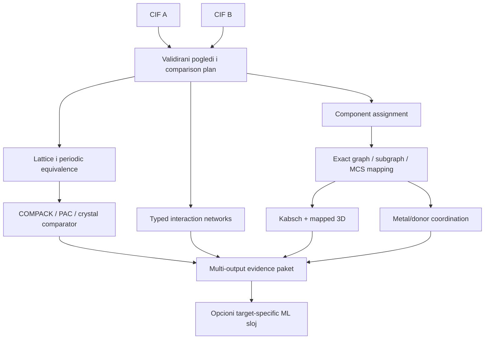

# Precizno poređenje parova: algoritmi, dokazi i granice

## Glavni zaključak

Za drugu 2CDC aplikaciju optimalno naučno jezgro nije neuralni model. Prvi production kandidat je deterministička, višeslojna kaskada:



Preporučeni algoritmi su:

- globalni component assignment: deterministički candidate pairing + Hungarian algoritam;
- exact graph/subgraph: VF2-like matcher sa hemijskim constraint-ima;
- partial graph: bounded MCS sa timeout-om i dvostranom coverage vrednošću;
- rigidno 3D poravnanje: Kabsch tek posle atom mapping-a;
- coordination: više candidate neighbor setova + donor mapping + continuous shape measures;
- packing: validirana COMPACK/Packing Similarity implementacija kao referenca kada je dostupna/licencirana; PAC kao važan challenger;
- soft local/crystal similarity: chemically constrained SOAP–REMatch kao challenger;
- powder signal: jasno parametrizovan simulated-PXRD/VC-PWDF-like komplement, ne jedini dokaz;
- interaction networks: exact motif/fingerprint baseline, WL/graph/optimal-transport challenger;
- ML meta-model: logistic/RF/GBDT tek uz ciljane ekspertske labele i branch-status features.

Rezultat je vektor dokaza sa statusima, ne jedan „84% isto“ broj.

## 4.1 Šta je jedinica poređenja

Pre algoritma bira se `comparison_profile`:

| Profil | Objekat A/B | Primarne grane |
|---|---|---|
| `parent_scaffold_v1` | standardizovani parent graph | graph, MCS, optional 3D core |
| `coordination_motif_v1` | metal + mapirani donor atoms/ligands | graph, donor mapping, CN, shape |
| `molecular_conformer_v1` | jedan eksplicitni molekulski conformer | exact mapping, torsions, RMSD/shape |
| `solid_form_v1` | puni kristalni sastav i periodični raspored | components, packing, interactions, PXRD |
| `redetermination_v1` | pojedinačno kristalografsko određivanje | cell/model/quality/provenance + packing |

Jedan CIF može imati više nezavisnih molekula, counterions, solvente, disorder alternative ili coordination polymer. Zato „najveći fragment“ nije bezbedan implicitni objekat.

Minimalni comparison plan:

```yaml
profile: solid_form_v1
objects:
  a: crystal-view-hash-A
  b: crystal-view-hash-B
component_policy: full_composition_with_roles_v2
graph_policy: charge_stereo_bond_v3
hydrogen_policy: observed_and_modeled_separate
disorder_policy: alternatives_not_simultaneous_v1
periodic_policy: symmetry_expanded_multigraph_v2
branches_requested:
  [composition, graph, coordination, geometry, packing, interactions, pxrd]
```

## 4.2 State machine svake grane

Svaka grana vraća jedan od statusa:

| Status | Značenje |
|---|---|
| `assessed` | metod je završen nad dovoljnim inputom i evidence je raspoloživ |
| `ambiguous` | više legitimnih mapiranja/neighbor modela menja zaključak |
| `not_applicable` | grana nema smisla za izabrani objekat |
| `missing_input` | potreban CIF podatak ne postoji |
| `quality_blocked` | podatak postoji, ali ne podržava claim |
| `timeout` | tačno definisan compute limit je istekao |
| `failed` | implementaciona/numerička greška |

Ovo je jedini `branch_status_v1` enum. Odvojen nullable `relation_label` koristi isključivo verzionisani target enum; na primer `packing_relation_v1 = same | related | different`. `ambiguous`, `not_applicable`, `missing_input`, `quality_blocked`, `timeout` i `failed` nisu naučne klase i zato uz njih važi `relation_label: null`. `partial` takođe nije packing klasa: parcijalnost se čuva kao `evidence_coverage`, `matched_N`, coverage po strani i failure/warning evidence.

`missing_input`, `timeout` i `failed` nisu score 0. Nula tvrdi da je završeno validno poređenje našlo minimalnu sličnost; non-assessed status tvrdi da merenje nije dobijeno. Display zbir poput „not assessed“ sme agregirati više statusa, ali se literalni `not_assessed` ne upisuje ni u `branch_status` ni u `relation_label`.

## 4.3 All-pairs računanje

Za \(n\) struktura ima:

\[
N_{pairs}=\binom n2=\frac{n(n-1)}2
\]

neuređenih parova. Za 2.110 struktura to je 2.224.995 parova.

### Dva eksplicitno različita moda

**Full all-pairs:** svaka primenljiva tražena grana računa se za svaki par. Dozvoljeno je preskočiti samo granu čiji state contract kaže da nije primenljiva ili nema input.

**Candidate-pruned:** jeftin prefilter bira parove za skupu granu. To je aproksimacija; UI i export prikazuju da neke kombinacije nisu analizirane, a prefilter mora imati recall benchmark prema full referenci.

Ne nazivati candidate-pruned matricu „svim precizno upoređenim parovima“.

### Compute plan

1. parse/standardize i per-structure features jednom;
2. izračunaj cheap composition/fingerprint matrice u blokovima;
3. napravi canonical pair key;
4. component i graph mapping cache-uj;
5. geometry/coordination koristi isti atom-map artefakt;
6. packing/interactions računaj samo u odgovarajućem profilu;
7. čuvaj long-form rezultat, a simetrične matrice generiši kao view.

Pair cache key:

```text
(min(structure_version_id_A, structure_version_id_B),
 max(structure_version_id_A, structure_version_id_B),
 comparison_profile_version,
 branch_method_versions)
```

### Pair-order symmetry

App 2 poredi neuređene parove. Cache artefakt uvek ima `canonical_left_id=min(id_A,id_B)`, `canonical_right_id=max(...)`, eksplicitni `left_to_right` component/atom map i provereni inverse. Subgraph containment čuva oba smera. Mapping hash uključuje canonical orientation; reversed API request dobija izvedeni view koji menja directional polja i koristi inverse mapu, ne isti payload sa promenjenim labelama.

Zamena `A ↔ B` mora dati iste simetrične score-ove i statuse, dok se directional polja samo zamene, na primer `coverage_A ↔ coverage_B` i `unmatched_in_A ↔ unmatched_in_B`. Za simetričan target model koristi symmetric pair transforms/set architecture ili eksplicitno prosečava/vezuje `f(A,B)` i `f(B,A)`. Canonical ID ordering je isključivo storage/cache ugovor: left/right slot ne sme dozvoliti različite model težine koje uče hronologiju/source kroz ID redosled. `swap(A,B)` i ID-relabel/reingest su obavezni metamorphic testovi.

## 4.4 Component assignment

Ako A ima komponente \(A_1,\ldots,A_m\), a B komponente \(B_1,\ldots,B_k\), prvo se grade dozvoljeni candidate parovi po:

- elementnom sastavu i formalnom naboju;
- grafu/fingerprintu;
- ulozi: coordination entity, counterion, solvent, coformer;
- stoichiometric multiplicity;
- metal/donor sadržaju;
- task-specific parent/crystal politici.

### Cost matrica

Ilustrativno:

\[
c_{ij}=
w_f d_{formula}(A_i,B_j)
+w_g d_{graph}(A_i,B_j)
+w_r\mathbb{1}[role_i\ne role_j]
+w_q\mathbb{1}[charge_i\ne charge_j].
\]

Težine nisu univerzalna hemijska istina. Pre labela je sigurniji lexicographic policy: prvo zabrani hemijski nedozvoljena uparivanja, zatim optimizuj rastavljive troškove.

[Hungarian metod](https://doi.org/10.1002/nav.3800020109) pronalazi globalno optimalan one-to-one assignment za zadatu cost matricu. Dummy `unmatched` čvorovi sa eksplicitnim troškom dozvoljeni su i kada je `m = k`: dve jednako duge liste ne znače da svaka komponenta ima legitimnog partnera. Standardne implementacije kvadratnog problema tipično su kubne u broju komponenti, što je malo u odnosu na atom/packing grane.

Stoichiometric multiplicities se ili razvijaju u eksplicitne instance ili rešavaju capacity-aware min-cost-flow formulacijom. Jedan Hungarian run vraća samo jedno optimalno rešenje; za ambiguity se enumerišu svi optima/[k-best assignments](https://doi.org/10.1287/opre.16.3.682) unutar definisanog delta-a, uz deterministic ordering.

Enumeration zapis ima `enumeration_complete`, `truncated`, `k_returned`, cost lower/upper granice i delta. Permutacije kopija smeju se quotient-ovati u istu equivalence klasu **samo** kada su dokazano ekvivalentne po svim atributima relevantnim za izabrani profil i kada svaka takva permutacija garantovano daje isti downstream rezultat. Sama jednakost hemijskog grafa ili formule nije dovoljna: kod \(Z' > 1\) hemijski iste komponente mogu biti kristalografski nezavisne, imati različite konformacije, koordinaciona okruženja ili packing uloge. Za njih se čuvaju assignment orbite/permutacije i ocenjuju njihove posledice. Ovo ograničenje sprečava i factorial duplikate i lažno uklanjanje stvarne mapping neizvesnosti; kontekst daju [Desirajuova analiza struktura sa \(Z' > 1\)](https://doi.org/10.1039/B614933B) i [CCDC ConQuest vodič](https://www.ccdc.cam.ac.uk/media/Documentation/2F0D7443-9739-46EB-BE9F-69E62E531FB7/2f0d7443973946ebbe9f69e62e531fb7.pdf).

### Šta Hungarian ne rešava

- ne zna da li je cost hemijski ispravno definisan;
- ne rešava polymeric/infinite entity kao konačan molekul;
- jedna optimalna suma može sakriti više jednako dobrih assignments;
- stoichiometric duplicates zahtevaju multiplicity-aware mapu;
- „solvent“ klasifikacija može biti neizvesna.

Izveštaj zato čuva najbolji assignment, cost po komponenti, unmatched delove i sve alternative unutar definisanog ambiguity delta-a.

## 4.5 Exact graph, subgraph i MCS

### Exact graph isomorphism

Dva označena grafa su exact match ako postoji bijekcija čvorova koja čuva izabrane node/edge atribute. [VF2](https://doi.org/10.1109/TPAMI.2004.75) je praktičan state-space algoritam za graph i subgraph isomorphism.

2CDC node constraints mogu uključiti:

- element i isotope;
- formal charge;
- aromaticity model;
- stereo provenance/tag kao ulaz u mapping-aware proveru;
- ligand/component membership;
- donor/metal role;
- disorder alternative.

Edge constraints mogu uključiti bond type/order, aromaticity i coordination-edge status. Periodic image/gain vector se čuva kao provenance, ali njegova raw integer trojka nije invariantna na basis, origin, wrapping, izbor predstavnika čvora ili supercell promenu. Poredi se tek posle transformacije oba grafa u zajednički lattice mapping i gauge ili preko kanonizovanog periodic quotient/gain odnosa; literalna equality image trojki nije VF2 constraint. Koordinaciona ivica nije automatski ekvivalentna organskoj single vezi.

Promena periodičnog predstavnika jednog čvora dodaje/oduzima njegov integer gauge shift labelama incidentnih ivica. Dve reprezentacije su zato ekvivalentne tek ako postoji zajednička basis transformacija **i vertex-wise gauge transform**; invariantni cycle/path-sum odnosi se zatim mogu porediti. Samo basis transformacija ne rešava wrapping razliku.

Stereo nije običan lokalni string atribut: tetrahedral parity zavisi od permutacije mapiranih suseda. Exact matcher posle candidate bijekcije proverava tetrahedral parity, double-bond `E/Z`, relevantne enhanced stereo groups i unknown/unspecified stanje prema verzionisanoj politici. Unsupported metal/coordination stereochemistry ne postaje „same“ zato što toolkit nema tag; vraća `branch_status: ambiguous` i `relation_label: null`. Korisne formalne reference su [OpenSMILES stereochemistry pravila](http://opensmiles.org/opensmiles.html#stereochemistry) i [RDKit stereochemistry dokumentacija](https://www.rdkit.org/docs/RDKit_Book.html#stereochemistry).

### Subgraph relation

Substructure pitanje je asimetrično: query motif može biti sadržan u većem target-u, dok obrnuto ne važi. Izveštaj zato navodi smer, query coverage i target coverage.

### Maximum Common Subgraph

MCS traži najveći zajednički deo pod zadatim pravilima. Umesto jednog procenta čuvaju se najmanje atom i bond coverage u oba smera:

\[
coverage^{atom}_A=\frac{N_{mapped\ atoms}}{N_{eligible\ atoms,A}},\qquad
coverage^{bond}_A=\frac{N_{mapped\ bonds}}{N_{eligible\ bonds,A}},
\]

uz analogne vrednosti za B.

MCS/subgraph search može imati eksponencijalan worst case. Production ugovor zato ima:

- maksimalno vreme i broj states;
- minimalni atom/bond coverage;
- complete-rings/ring-fusion policy;
- induced naspram non-induced i connected naspram disconnected MCS;
- objective/tie-break, na primer prvo broj mapiranih heavy atoma, zatim broj veza i ring completeness;
- stereo/charge/metal pravila;
- `timeout` status, nikada lažnu nulu;
- svi optimalni non-automorphic mappings ili unapred ograničen k-best/ambiguity set;
- deterministic tie-break i hash svakog prihvaćenog atom mapping-a.

MCS rezultat dodatno nosi `optimality_proven`, najbolji incumbent, poznatu upper bound vrednost i termination reason. Ako timeout prekine dokaz optimalnosti, prijavljeni mapping/coverage je lower-bound kandidat, ne „the maximum common subgraph“. Enumeration optima ima isti `complete/truncated` ugovor kao component assignment.

### Automorphisms

Simetričan molekul može imati više hemijski ekvivalentnih atom maps. Ne bira se prvi toolkit rezultat. Dozvoljene ekvivalentne mape se enumerišu ili implicitno optimizuju, zatim se prijavljuju:

- broj/tip ekvivalentnih mappinga;
- odabrana mapa i razlog;
- minimalni i raspon RMSD-a, označen kao potpun samo ako je enumeration complete;
- da li zaključak zavisi od tie-a.

Ne smeju se isprobavati hemijski neekvivalentne mape samo da bi RMSD izgledao manji.

## 4.6 Kabsch i mapped 3D

[Kabsch algoritam](https://doi.org/10.1107/S0567739476001873) SVD postupkom nalazi optimalnu rigidnu rotaciju koja minimizuje sum of squared deviations između **već korespondentnih** tačaka. On ne pronalazi atom mapping.

Za \(N\) mapiranih atoma, posle centriranja i orientation-preserving poravnanja:

\[
RMSD=\sqrt{\frac{1}{N}\sum_{i=1}^{N}
\|R\mathbf{x}_i+\mathbf{t}-\mathbf{y}_i\|^2}.
\]

Default su uniformne težine. Ako profil opravdano koristi \(w_i\), centroids, rotacija i prijavljena vrednost moraju pratiti isti weighted contract:

\[
RMSD_w=\sqrt{\frac{\sum_i w_i\|R\mathbf{x}_i+\mathbf t-\mathbf y_i\|^2}{\sum_i w_i}}.
\]

Manifest navodi:

- mapping hash i broj mapiranih/eligible atoma;
- heavy-only ili eksplicitnu H policy;
- rigid/flexible policy;
- da li je refleksija zabranjena;
- symmetry-equivalent atom treatment;
- experimental/generated coordinate provenance;
- weights i jedinicu;
- RMSD, median, maximum i ključne torsion razlike.

Pre poravnanja finite molekulska komponenta se rekonstruše kontinuirano preko periodic boundary-ja. Frakcione koordinate iz različitih ćelija ne porede se direktno; za molecular RMSD koriste se odgovarajuće unwrapped kartezijanske koordinate. U suprotnom ista veza koja prelazi granicu ćelije može izgledati kao ogromno geometrijsko odstupanje.

Unwrap koristi cycle-consistent propagation symmetry-operation/image labels kroz covalent graph, uključujući symmetry-generated i special-position atome. Za konačan molekul svi graph cycle sums moraju biti konzistentni sa zatvaranjem; nenulti periodic translation ukazuje na polymeric/infinite komponentu ili pogrešnu connectivity pretpostavku i blokira finite-molecule Kabsch profil. Više symmetry-equivalent realizacija se quotient-uju uz očuvan provenance.

### Chirality

Default koristi proper rotation sa determinant-om `+1`; mirror reflection nije dozvoljen. Enantiomorph/mirror odnos se prijavljuje zasebno. Ako neki search mode namerno ignoriše chirality, to je nova verzija profila, ne skrivena numerička opcija.

### Degenerate point sets

Jedinstvena 3D rotacija nije identifikovana sa manje od tri nekolinearne mapirane tačke. Izlaz čuva rank/singular values centered coordinate skupa i `rotation_identifiable`. Za jednu, dve ili kolinearne tačke može se prijaviti ograničen distance residual, ali ne jedinstvena orientation, torsion ili geometry tvrdnja; status je `ambiguous` za takve claims.

### Coverage pre lepog RMSD-a

RMSD 0,05 Å nad tri atoma nije snažniji dokaz od 0,60 Å nad 35/37 heavy atoma. Kartica uvek prikazuje RMSD zajedno sa dvostranom coverage vrednošću i unmatched funkcionalnim grupama.

### Neizvesnost

Ako su standard uncertainties/covariance dostupni i uporedivi, mogu se računati uncertainty-aware residuals. U suprotnom se nominalni RMSD ne predstavlja kao statistički significance test. Nizak RMSD dva slaba ili korelisano izvedena modela nije automatski snažan dokaz.

## 4.7 Coordination environment

Najrizičniji korak je odluka ko je zaista sused/koordinisan metalu.

### Candidate neighbor sets

Ne koristi se jedan globalni distance cutoff. Generišu se candidate setovi koristeći kombinaciju:

- periodic distance i element-pair/radii pravila;
- eksplicitnu connectivity evidenciju, uz provenance;
- Voronoi/solid-angle signal;
- charge/valence i donor chemistry kao pomoćni signal;
- occupancy/disorder/H uncertainty;
- sensitivity sweep parametara.

[ChemEnv](https://doi.org/10.1107/S2052520620007994) kombinuje modifikovanu Voronoi analizu, distance/solid-angle parametre i continuous symmetry measures, pri čemu može vratiti jedinstveno ili mešano okruženje. To je snažan kandidat za automatic baseline, ali njegov benchmark nad pretežno inorganic/materials okruženjima ne dokazuje optimalnost za organometalne CSD/DAP komplekse; potreban je poseban 2CDC expert audit.

### Continuous shape measure

Za lokalno okruženje \(Q\) i idealni polyhedron \(P\) sa istim brojem vertices, tipičan normalized CSM oblik je:

\[
S_P[Q]=100\min\frac{\sum_k\|\mathbf q_k-\mathbf p_k\|^2}
{\sum_k\|\mathbf q_k-\bar{\mathbf q}\|^2},
\]

uz optimizaciju skale, rotacije i dozvoljenih vertex permutacija. Manje znači bliže idealnom obliku. [Pregled continuous shape pristupa](https://doi.org/10.1016/j.ccr.2005.03.031) pokazuje zašto diskretne etikete poput „octahedral“ mogu sakriti kontinuirane distortion puteve.

Ne čuvati samo najbolju etiketu. Čuvaju se CSM vrednosti prema svim relevantnim idealnim oblicima, neighbor set, CN i gap između najboljih kandidata.

### DAP-specifičan exact dokaz

Za svaki metal i mapirani DAP motif proverava se:

```text
central pyridine N → isti metal?
imine N left      → isti metal?
imine N right     → isti metal?
tri veze direct / ambiguous / absent?
metal je u istoj komponenti ili samo counterion?
```

`entry contains Cu` i `Cu coordinates all three DAP N` ostaju odvojena polja. Oxidation state se ne izmišlja iz formule; navodi se observed/assigned/inferred status i evidence.

### Pair comparison

Nakon donor assignment-a porede se:

- metal element/oxidation evidence;
- CN i alternative;
- donor element/type/ligand membership;
- denticity, bridging/hapticity status;
- M–donor distance vektor i angle/torsion set;
- CSM vector i geometry label mixture;
- coverage i ambiguity.

Hungarian assignment može upariti isto-tipne donore po minimalnom geometrijskom trošku, ali samo unutar chemijski dozvoljene equivalence klase.

## 4.8 Periodični model pre crystal poređenja

Kristal nije samo asimetrična jedinica. Svaka periodična ivica čuva:

```yaml
source_atom: ...
target_atom: ...
symmetry_operation: ...
lattice_image: [i, j, k]
distance_angstrom: ...
edge_type: contact | hbond_candidate | coordination
rule_version: ...
```

Crystal branch mora biti invariant/equivariant prema:

- atom/component permutation;
- rigid translation/rotation;
- boundary wrapping;
- origin i symmetry-equivalent ASU opisu;
- ekvivalentnom space-group setting-u, npr. \(P2_1/c\leftrightarrow P2_1/n\);
- unimodularnoj primitive-basis promeni;
- primitive/conventional/supercell reprezentaciji, u granicama profila.

Dve primitive baze iste rešetke povezane su celobrojnom unimodularnom matricom \(U\in GL(3,\mathbb Z)\), \(|\det U|=1\). Supercell je zaseban slučaj sa celobrojnom matricom \(|\det U|>1\): motiv se mora odgovarajuće replicirati i ponovo mapirati, ne samo transformisati lattice vektore. Ova razlika i višestruke coordinate reprezentacije istog kristala razmatraju se u [IUCrJ radu o definicijama kristalne strukture](https://doi.org/10.1107/S2052252524004056).

Reduced/Niggli cell i space group su candidate/signature signali. Ista ćelija ili ista space group ne dokazuju isto packing; ekvivalentni kristal može imati drugačiji zapis ćelije.

### Special positions posle symmetry expansion-a

Atom sa nenultom site symmetry može kroz više symmetry operacija generisati isto fizičko mesto. Ekspanzija zato:

1. svodi fractional positions modulo lattice translation;
2. koalescira isti species/site/disorder state unutar verzionisane coordinate tolerance;
3. čuva listu svih symmetry-operation provenance putanja;
4. proverava dobijenu multiplicity prema CIF/Wyckoff/site-symmetry podatku;
5. ne spaja različite disorder alternative, species ili occupancy modele.

Bez toga se dupliraju susedi, coordination number, kontakti i occupancy doprinos. Formalna polazna tačka je [IUCr Core CIF dictionary](https://www.iucr.org/resources/cif/dictionaries/browse/cif_core), koji razlikuje multiplicity generisanih mesta i site-symmetry red.

### Lattice candidate algoritam

Deterministički lattice branch:

1. validira ćeliju i gradi metric tensor;
2. pravi standardizovanu/reduced reprezentaciju uz tolerance manifest;
3. po potrebi enumeriše dozvoljene unimodularne integer basis/setting transformacije;
4. poredi lengths/angles, volume i volume po formula unit-u;
5. vraća candidate mappings, ne packing presudu;
6. svaki kandidat proverava atomskim/periodičnim ili packing comparatorom.

Niggli/reduced-cell rezultat blizu degenerate granice može biti numerički nestabilan, pa se originalna ćelija i sve transformacije čuvaju. Supercell mappings se obrađuju zasebno sa multiplicity/motif replikacijom. Space-group label se ne koristi kao jedini gate jer pogrešno/alternativno setting dodeljivanje ne sme sakriti geometrijski match.

## 4.9 COMPACK, PAC i CrystalCMP

### COMPACK / CCDC Packing Similarity

[COMPACK](https://doi.org/10.1107/S0021889804027074) opisuje molecular packing okruženje relativnim položajima/orijentacijama molekula kroz interatomske distance, bez oslanjanja na identične cell/space-group zapise. CCDC-ov [Packing Similarity API](https://downloads.ccdc.cam.ac.uk/documentation/API/descriptive_docs/packing_similarity.html) tipično vraća broj matched molecules i RMSD za definisan cluster/tolerances.

Obavezni parametri:

- referentna komponenta/molecule matching;
- shell/cluster veličina;
- distance/angle tolerancije;
- H atom policy;
- conformational flexibility;
- minimalan broj matched molecules;
- višekomponentni/disorder/polimer policy.

Method paper ne daje automatski pravo korišćenja CCDC implementacije ili podataka. Produkcioni izbor zavisi od konkretnog fakultetskog/CCDC ugovora.

### PAC

[Progressive Alignment of Crystals](https://doi.org/10.1107/S1600576722009670) progresivno poravnava clusters i koristi coordinate \(RMSD_N\); uvodi radius of gyration/shape informaciju da razlikuje geometriju superimposed clustera. Rad prijavljuje slaganje sa COMPACK-om na small-molecule testovima i bolju brzinu u analiziranom setup-u, ali to nije univerzalna garancija za metalne komplekse, co-crystals ili disorder.

### CrystalCMP

[CrystalCMP](https://doi.org/10.1107/S1600576720003787) automatski bira fragmente i poredi molecular packing; representative clusters u objavljenoj metodologiji sadrže jedan izabrani tip molekula. Zato rezultat mora čuvati `selected_molecular_species/fragment_mapping` i nazvati se species-specific packing comparison, ne automatski poređenjem cele soli/solvata/co-crystal forme. Bez legitimnog izbora vraća `ambiguous`/`not_applicable`; za beskonačni coordination polymer finite-molecule metod može biti neprimenljiv. Objavljeni threshold-i zavise od settings-a i evaluiranog skupa, pa je metod research challenger/cross-check, ne izvor univerzalnog „identical packing“ praga.

### Trenutna odluka

1. ako licenca i integracija dopuštaju, COMPACK/Packing Similarity je referentni baseline zbog direktne povezanosti sa CSD praksom;
2. PAC je obavezni reproducibility/speed challenger;
3. disagreement set ide na slepi ekspertni review;
4. nijedan threshold se ne prenosi bez 2CDC calibration skupa;
5. output čuva matched \(N\), RMSD, cluster shape/coverage, parametre i failure reason.

## 4.10 SOAP–REMatch i optimal transport

[SOAP](https://doi.org/10.1103/PhysRevB.87.184115) predstavlja lokalno atomsko okruženje glatkom atomskom gustinom i standardnim power-spectrum kernelom invariantnim na rotaciju i refleksiju. [REMatch](https://doi.org/10.1039/C6CP00415F) kombinuje matricu lokalnih sličnosti u globalni kernel kroz entropy-regularized matching; srodan computational princip je [Sinkhorn regularizovani optimal transport](https://papers.nips.cc/paper/2013/hash/af21d0c97db2e27e13572cbf59eb343d-Abstract.html).

### Parametri koji menjaju značenje

- cutoff radius i periodic neighbor construction;
- Gaussian width;
- radial/angular basis truncation;
- chemical species/alchemical kernel;
- normalization i kernel exponent;
- REMatch regularization;
- izbor centara i pondera;
- full crystal, selected molecule ili local environment nivo.

SOAP–REMatch je privlačan jer daje soft similarity i kernel za GPR/clustering. Standardni SOAP je reflection-invariant, pa sam ne razlikuje enantiomerna/ogledalska lokalna okruženja; REMatch ne može povratiti odbačenu chirality informaciju. Stereo-sensitive profil zato zadržava exact stereochemical gate ili koristi posebno validiran parity/chirality-sensitive deskriptor.

Običan globalni assignment može i upariti lokalna okruženja koja nisu isti atom underlying molekula. Noviji [chemically constrained molecular-crystal SOAP rad](https://doi.org/10.1021/acs.cgd.5c01220) uvodi ograničenja na analogous atoms istog underlying molekula, ali je validiran u užem organic molecular-crystal domenu. Pre upotrebe se proveravaju chemical identity, finite-molecule status, \(Z'\), molecular symmetry i dokumentovani uslovi positive-semidefinite kernel-a. Salts, co-crystals, metal complexes, promenljivi \(Z'\) i coordination networks zahtevaju zasebnu validaciju.

**2CDC odluka:** koristiti kao challenger samo kada applicability gate prolazi i uz hemijski constraint iz exact atom/component mapping-a. Ne proglašavati SOAP score packing identitetom pre benchmarka prema COMPACK/PAC i ekspertima. Za ostale domene rezultat je `not_applicable` ili eksperimentalni signal bez kernel-validity claim-a.

## 4.11 PXRD kao komplementarna grana

Simulirani powder pattern iz CIF-a može se porediti preko:

- peak matching-a uz definisanu tolerance;
- normalized cross-correlation;
- cosine sličnosti nad isto binovanim patternima;
- variable-cell/pattern metodologije koja modeluje lattice deviation.

[VC-PWDF studija](https://doi.org/10.1039/D2CE01080A) poredi powder-based metod sa COMPACK-om na desetinama hiljada parova i nalazi komplementarne failure modes; metod ne pretvara PXRD u jedinstven dokaz atomskog packinga.

Reproduktivni manifest čuva najmanje:

- `probe_type` (`X-ray`, neutron ili electron) i geometriju eksperimenta/simulacije;
- sve radiation komponente sa wavelength vrednostima i težinama, ne samo jednu nominalnu talasnu dužinu;
- izvor/verziju scattering factor-a ili scattering length-a i anomalous-scattering politiku;
- politike za occupancy, disorder alternative, H atome i ADP/Debye–Waller faktor;
- Lorentz–polarization, multiplicity i ostale uključene corrections;
- \(2\theta/q/d\) osu, range, step/binning, peak profile, intensity/background normalization i temperaturu;
- simulator, verziju, numeričke tolerancije i status `simulated`/`measured`;
- za measured pattern: instrument geometry, kalibraciju/zero shift i poznate sample corrections.

Bez ovih polja intensity-based cosine/correlation score nije nužno reproduktivan: različite probe i korekcije daju različite intenzitete i kada je strukturni model isti. Polja se mapiraju na zvanične [IUCr pdCIF definicije](https://www.iucr.org/resources/cif/dictionaries/cif_pd) i [IUCr Core CIF scattering kategorije](https://www.iucr.org/resources/cif/dictionaries/browse/cif_core1); konkretna implementacija mora navesti korišćeni simulator i fizički model.

Važne granice:

- dva CIF-derived simulirana patterna daju izvedenu sličnost, ne nezavisan eksperimentalni dokaz;
- mala promena ćelije/temperature pomera peaks;
- preferred orientation, mixture, noise i instrument menjaju measured pattern;
- sličan powder pattern može sakriti različite strukture/polytypes;
- previše fleksibilan alignment može izravnati stvarnu razliku.

PXRD je dobar disagreement resolver/candidate signal uz packing comparator, ne jedini finalni kriterijum.

## 4.12 Interaction networks

Za svaki crystal gradi se typed periodic multigraph:

- node: atom, donor/acceptor/metal type, component, occupancy/disorder;
- edge: H-bond candidate, coordination, halogen/π ili drugi eksplicitno definisan kontakt;
- atribut: distance, angle, periodic image, rule version, confidence;
- higher motif: chain, ring, layer, 3D network i solvent-mediated put.

### Periodična topologija motiva

Običan cycle detector nad jednom ćelijom nije dovoljan. Za orijentisanu putanju sabiraju se integer translation/gain labels, uz prethodno usaglašenu basis/gauge transformaciju:

- **ring:** zatvorena putanja sa nultim ukupnim translation vektorom;
- **periodic chain:** komponenta čiji nezavisni cycle-sum translation vektori imaju rang 1;
- **layer:** rang 2;
- **3D network:** rang 3.

Ciklus u finite quotient grafu sa nenultim translation sum-om u beskonačnom lift-u nije prsten već nastavlja periodični put. Ova definicija čini dimensionality nezavisnom od proizvoljne supercell veličine; formalni okvir daju [periodic labelled quotient graphs](https://doi.org/10.1107/S2053273325008253) i [quotient-graph dimensionality algoritam](https://doi.org/10.1038/s41524-020-00409-0).

### Baseline

Prvo koriste:

- exact motif presence;
- count fingerprint typed edges/motifs;
- Jaccard/min–max similarity;
- donor/acceptor/metal coverage;
- dimensionality/topology flags.

### Challengers

[Weisfeiler–Lehman subtree kernel](https://www.jmlr.org/papers/v12/shervashidze11a.html) je efikasan način poređenja discrete-labeled graph neighborhoods, ali nije potpuni graph-isomorphism dokaz i može imati collisions/ograničenu diskriminaciju. Graph edit distance je intuitivan, ali exact račun može biti nepraktičan; svaka aproksimacija mora čuvati edit-cost semantiku. Optimal transport nad motif/local-environment features može dati soft poređenje, ali regularization i cost matrica postaju deo metode.

H-bond rezultat je posebno osetljiv na H positions, protonation, disorder i temperature. `No detected edge` nije isto što i dokaz da interakcija fizički ne postoji.

## 4.13 Disorder, occupancy i multiple models

Alternative occupancy 0,6/0,4 nisu dva istovremena puna atoma. Dozvoljene strategije:

- poredi svaku kompatibilnu disorder realizaciju i vrati range/best/worst uz probability caveat;
- marginalizuj/ponderi local features occupancy-jem ako metod to matematički podržava;
- blokiraj granu kada alternative nisu rekonstruisane;
- nikad ne dupliraj obe alternative kao pune atomske susede.

Ako CIF ima više models/data blocks, comparison plan beleži koji je izabran i zašto. Model selection nije posao Kabsch-a ili GNN-a.

## 4.14 Da li je potreban ML meta-model

### Bez ekspertskih labela

Ne. Prikazuje se evidence vector i eventualno unapred definisana lexicographic odluka:

```text
graph exact?
→ coordination exact/ambiguous?
→ geometry coverage + RMSD
→ packing matched N + RMSD
→ interaction agreement
→ quality limitations
```

### Sa labelama za jedan use case

Target, na primer `coordination_relation_v1`, može dobiti:

1. logistički/ordinalni baseline;
2. RF/ExtraTrees;
3. GBDT;
4. calibrated/conformal abstention sloj.

Features su isključivo rastavljivi branch output-i i statusi. Model ne dobija raw ID/source proxy. Strukture se dodeljuju foldovima pre pravljenja parova.

Model/preprocessing/hyperparameter izbor radi se u inner grouped CV-u, a procena u netaknutom outer structure-family/temporal testu ([DataSAIL](https://doi.org/10.1038/s41467-025-58606-8)). Efektivni \(n\) je broj nezavisnih compound/scaffold/solid-form grupa, ne \(n(n-1)/2\) međuzavisnih parova. Calibration/conformal skup poštuje iste granice; standardni marginalni conformal coverage zahteva exchangeability, a shift zahteva drugačije pretpostavke/metod i ne dobija distribution-free garanciju prostim slice izveštajem ([Barber et al.](https://doi.org/10.1214/23-AOS2276)). Coverage se ipak empirijski proverava ukupno i po kritičnim grupama kao deployment dijagnostika.

### Multi-output je bolji od univerzalnog score-a

Mogući targets:

```yaml
branch_status_v1:
  [assessed, ambiguous, not_applicable, missing_input, quality_blocked, timeout, failed]
relation_targets:
  same_parent_graph_v1:
    relation_label_enum: [same, different]
  coordination_relation_v1:
    relation_label_enum: [same, related, different]
  conformer_similarity_v1:
    relation_label_enum: [same_like, different]
  packing_relation_v1:
    relation_label_enum: [same, related, different]
    evidence_coverage_enum: [complete, partial, none]
  interaction_relation_v1:
    relation_label_enum: target_specific_versioned_enum
  overall_usefulness_for_profile_v1:
    relation_label_enum: [0, 1, 2]
sample_branch_output:
  target: packing_relation_v1
  branch_status: assessed
  relation_label: related
  evidence_coverage: partial
```

Svaki target ima sopstveni label guide, calibrator i slice metrike. Relation loss se računa samo tamo gde je `branch_status: assessed` i gold `relation_label` nije `null`; non-assessed slučajevi ulaze u coverage/failure/abstention metrike, ne postaju dodatna klasa. `overall` ostaje `null` ako ključna grana nije ocenjena i target contract ne dozvoljava odluku.

## 4.15 Četiri ilustrativna para

### A — isti molekul, drugačiji atom ordering

- component assignment: exact;
- VF2: exact graph sa više mogućih automorphisms;
- Kabsch: isti rezultat posle izbora ekvivalentne mape;
- očekivanje: atom permutation test ne menja evidence.

Ako RMSD zavisi od reda redova u CIF-u, implementacija je pogrešna.

### B — isti parent ligand, dodatna voda

- parent graph: exact;
- full composition: različit;
- component assignment: voda je `unmatched` ili mapirana na vodu;
- packing/interactions: moraju uključiti/eksplicitno izuzeti vodu prema profilu;
- overall: scaffold mode može biti jak match; solid-form mode nije exact composition match.

### C — Cu postoji, ali je counterion/odvojena vrsta

- entry element filter: Cu=true;
- DAP graph: možda exact;
- coordination donor mapping: sva tri N→isti Cu=false/ambiguous;
- CSM: `not_applicable` za traženi DAP–Cu centar;
- zaključak: nije pozitivan coordination-motif primer samo zato što formula sadrži Cu.

### D — isti molekul, dva polymorph-a

- 2D graph: exact;
- molecular conformation: može biti bliska ili različita;
- reduced cell/space group: može biti ista ili različita;
- COMPACK/PAC: treba da odluči packing odnos pod parametrima;
- interaction network: može otkriti drugi H-bond motif;
- conclusion: molecular identity ne implicira crystal-form identity.

## 4.16 Evaluacioni skup

### Evaluacioni slojevi

1. **metamorphic gold:** ista struktura drugačije kodirana, očekivana invariance poznata;
2. **synthetic negative:** kontrolisano promenjen metal, stereo, donor ili periodic edge;
3. **representative grouped test:** random ili unapred design-weighted uzorak iz ciljane all-pairs populacije za prevalence, calibration i risk;
4. **expert pair labels:** slepo ocenjeni stvarni parovi po jednom profilu;
5. **method challenge:** posebno označen COMPACK/PAC/CrystalCMP/SOAP/PXRD disagreement/candidate-enriched pool;
6. **future authorized CSD pilot:** tek kada ugovor dozvoli pristup i evaluaciju.

Disagreement pool je odličan za nalaženje failure modes, ali nije reprezentativan za punu populaciju i ne procenjuje prevalence, calibration ni prosečni risk. Aktivno biranje test primera uvodi selection bias; koristi se poznat design/importance-weighted estimator ili odvojeni representative test ([Active Testing](https://proceedings.mlr.press/v139/kossen21a.html)). Neoznačeni parovi nisu automatski negativni.

### Split

Strukture/compound/scaffold/solid-form/publication/time grupe se dele pre generisanja parova. `A–B` u train-u i `A–C` u testu nije nezavisna procena. Za metamorphic varijante svi derivati originala ostaju u istoj particiji.

Glavni, production-relevant **2D cold/cold** estimand koristi disjunktne endpoint grupe: ako su particije struktura (T,V,E), train sadrži samo (T\times T), validation samo (V\times V), a test samo (E\times E). Cross-partition parovi poput (T\times E) se iz ovog estimanda izostavljaju. Ako je buduća produkciona situacija „nov query naspram poznatog korpusa“, (T\times E) se meri kao zasebno imenovan **1D warm/cold** režim, sa sopstvenim metrikama; nikad se ne meša u glavni cold/cold test. [DataSAIL](https://doi.org/10.1038/s41467-025-58606-8) daje formalni okvir za razlikovanje 1D i 2D splitova. Manifest navodi ciljnu deployment distribuciju, pravilo za cross-partition parove i tačan estimand pre bilo kakvog model-selection rada.

### Metrike po grani

| Grana | Primarne metrike |
|---|---|
| component assignment | exact/tie-aware assignment accuracy, unmatched precision/recall |
| atom mapping | mapped-pair precision/recall, coverage, exact graph decision |
| 3D | numerical invariance tolerance, RMSD error prema reference mapi |
| coordination | donor-edge precision/recall, CN accuracy, CSM/label agreement |
| packing | same/related/different confusion za `packing_relation_v1`, zasebno matched-N/coverage/RMSD agreement i expert disagreement |
| interactions | typed-edge/motif precision/recall, topology agreement |
| meta-model | grouped ROC/PR, calibration, coverage–risk, worst slice |
| sistem | p50/p95, peak RAM i stopa svakog non-assessed `branch_status_v1` statusa |

Continuous threshold-i se biraju samo na training/calibration grupama. Test izveštaj čuva paired interval po structure-family grupi i sve neuporedive parove.

## 4.17 Metamorphic i adversarial suite

### Mora ostati isto

- permutacija atoma i komponenti;
- rigid translation/rotation;
- periodic wrap;
- origin shift i symmetry-equivalent ASU;
- \(P2_1/c\leftrightarrow P2_1/n\) ekvivalentan setting;
- unimodularna primitive-basis promena;
- primitive/conventional opis i zasebno validiran supercell + replicated-motif opis kada profil poredi isti beskonačni kristal;
- zamena `A ↔ B` uz zamenu directional evidence polja;
- relabel/reingest struktura novim immutable ID-jevima bez promene sadržaja;
- validan drugačiji SMILES atom ordering;
- različit red loop kolona/rows u CIF-u.

### Mora pokazati ciljanu razliku

- isti ligand, drugi metal;
- isti metal/donor set, druga geometry;
- isti formula, constitutional isomer;
- enantiomer/enantiomorph pod stereo-sensitive profilom;
- isti molekul, drugi polymorph;
- metal samo u counterion-u;
- direct naspram solvent-mediated H-bond;
- disorder alternative naspram duplih punih atoma;
- nedostajuća symmetry/ćelija;
- hemijski neekvivalentna mapa sa veštački manjim RMSD-om.

Svaki test navodi očekivane branch statuse i brojeve/tolerance, ne samo overall pass.

## 4.18 Scheduler, paralelizacija i storage

Za 2.224.995 parova, grana od 0,5 s bi na jednom worker-u idealizovano trajala približno 12,9 dana. Sa 32 worker-a idealna donja granica je oko 9,7 sati, pre I/O, imbalance-a, retry-ja i koordinacije.

Production zahtevi:

- deterministic block/upper-triangle partitioning;
- idempotent tasks i retry samo failed branch-a;
- per-structure precompute sharing;
- work stealing zbog teških MCS/packing outliera;
- timeout i memory budget po branch-u;
- symmetric cache i deduplikacija identical inputs;
- immutable result rows sa method/version hash-om;
- partial progress po grani;
- cancellation bez korumpiranog „complete“ statusa;
- long-form Parquet/relational export plus izvedene matrice.

Cheap vectorized scores mogu se računati u blokovima, ali graph/packing jobs imaju neujednačenu cenu. Average latency ne određuje queue kapacitet; potrebni su p95/p99 i tail-size slice.

## 4.19 Optimalna matrica algoritama

| Pitanje | Baseline | Production kandidat | Challenger / razlog |
|---|---|---|---|
| component pairing | ručno/lexicographic | constrained Hungarian + ambiguity set | learned cost samo uz labels |
| exact molecular identity | canonical hash + exact graph | VF2-like exact matcher | drugi toolkit cross-check |
| partial common core | fingerprint prefilter | bounded MCS + timeout | learned mapping nije prvi izbor |
| rigid conformation | fixed mapping RMSD | Kabsch po svim ekvivalentnim mapama | flexible alignment samo za poseban target |
| metal neighbor set | distance/radii candidates | multi-policy sensitivity + expert-calibrated rule | ChemEnv-like strategy |
| geometry label | angles/distances | CSM vector + ambiguity | supervised geometry classifier |
| packing | cell candidate signal | licensed/validated COMPACK reference | PAC; CrystalCMP cross-check |
| soft crystal metric | simple periodic descriptors | domain-gated, chemically constrained SOAP–REMatch challenger | periodic GNN embedding |
| powder signal | fixed-bin cosine/correlation | validated VC-PWDF-like complement | learned PXRD model tek uz data |
| interactions | typed motif fingerprint | exact mapping + motif/network comparison | WL/OT/graph model |
| combined decision | branch report | target-specific calibrated RF/GBDT ako labels postoje | multi-task deep pair model kasnije |

**PROPOSAL:** MVP aplikacije 2 implementira component assignment, exact graph/MCS, Kabsch, explicit DAP–metal donor mapping i rastavljivu result schemu. Packing se dodaje čim postoji pravno i tehnički validirana COMPACK/PAC putanja. SOAP, PXRD, graph kernels i learned pair models ulaze kao challengers iza disagreement benchmarka, ne kao zamena za deterministički evidence.

## 4.20 Anti-patterni

- RMSD pre atom mapping-a;
- „largest fragment“ kao skriven component policy;
- Hungarian cost predstavljen kao hemijska istina;
- MCS timeout pretvoren u score 0;
- najniži RMSD iz hemijski nedozvoljenih atom permutations;
- reflection dozvoljen bez stereo profile-a;
- jedan distance cutoff za sve metal–donor parove;
- `metal in entry` poistovećen sa `metal coordinates DAP`;
- ista cell/space group proglašena istim packingom;
- simulated PXRD iz CIF-a predstavljen kao nezavisna potvrda tog CIF-a;
- SOAP score preimenovan u packing identity;
- bilo koji non-assessed branch status zamenjen nulom ili naučnom klasom;
- all-pairs label za candidate-pruned posao;
- pair-random split;
- canonical ID ordering korišćen kao zamena za simetričnu pair-model arhitekturu;
- overall score bez target-a i expert label guide-a.

## 4.21 Kriterijum prihvatanja

Pairwise jezgro je spremno kada:

1. svaki branch ima input contract, `branch_status_v1`, nullable target-specific `relation_label`, evidence coverage i method version;
2. component/atom mapping su reproduktivni i čuvaju alternative;
3. Kabsch rezultat je invariant na order/rigid transform i ne koristi reflection po default-u;
4. DAP coordination tvrdnja navodi isti konkretan metal i sva tri mapirana donor atoma;
5. periodic testovi prolaze za origin/wrap/setting/basis/supercell profile;
6. packing output čuva matched coverage, RMSD, cluster parametre i failure reason;
7. COMPACK/PAC/SOAP/PXRD disagreement set je stručno pregledan pre threshold claim-a;
8. full i candidate-pruned režimi su jasno razdvojeni i potonji ima recall gate;
9. structure-family split prethodi pair generation-u;
10. svi statusi i evidence ostaju dostupni u long-form exportu;
11. p95/p99, timeout i peak-memory ulaze u capacity plan;
12. nijedan overall model ne može sakriti `ambiguous`, `missing_input` ili `quality_blocked` ključnu granu.
