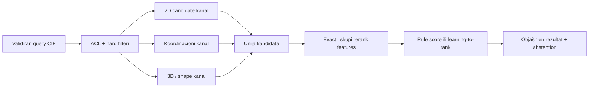

# Globalna pretraga: candidate generation, ANN i learning-to-rank

## Glavni zaključak

Optimalna prva aplikacija nije „CIF → jedan embedding → vector database → top 10“. Pouzdan sistem je višestepena kaskada:



Svaki sloj ima različit zadatak:

1. **filter** uklanja nedozvoljene ili logički neodgovarajuće zapise;
2. **reprezentacija i metrika** definišu šta „blizu“ znači;
3. **indeks** ubrzava pronalaženje približnih suseda po toj metrici;
4. **reranker** koristi skuplje, rastavljive dokaze da preuredi mali skup;
5. **kalibracija/abstention** vezuju odluku za tačno definisan target.

**Trenutna preporuka:** exact ECFP/count fingerprint + Tanimoto je obavezni 2D referentni baseline. Za dense vektore prvo se meri exact Flat, zatim HNSW-Flat ako indeks staje u RAM; IVF-Flat je sledeći kandidat, a IVF-PQ tek kada memorija opravdava lossy kompresiju. Konačni reranking počinje pravilima ili logističkim modelom, RF/GBDT-om, a LambdaMART ulazi tek posle stvarnih query-grupisanih graded relevance labela.

**Granica prema tekstualnom RAG-u:** svaki „dense embedding“ u ovom poglavlju znači validiranu reprezentaciju molekula, koordinacionog okruženja, 3D oblika ili periodične strukture. Dokumentacioni RAG, BM25, sentence embeddings i jezički rerankeri imaju drugi korpus, drugi relevance contract i drugi indeks. Generic text embedding CIF teksta nije crystal-similarity reprezentacija.

## 3.1 Četiri odvojena ugovora

### Ugovor reprezentacije

Navodi:

- objekat: parent ligand, jedna komponenta, coordination entity ili cela crystal form;
- standardization profil;
- atom/bond/stereo/charge/isotope politiku;
- 2D, koordinacioni, 3D ili periodic/crystal nivo;
- verziju toolkit-a i parametara;
- ponašanje kod disorder-a, missing 3D i nepoznatih veza.

### Ugovor metrike

Navodi:

- funkciju sličnosti/rastojanja;
- njen domen i opseg;
- da li je veće bolje;
- simetriju i invariance;
- threshold semantiku;
- način tretiranja missing komponente.

### Ugovor indeksa

Navodi:

- tačnu reprezentaciju i metricu koju indeks aproksimira;
- build parametre i random seed;
- query parametre;
- podršku za filtere, insert/update/delete;
- memoriju, build vreme i expected recall;
- verziju korpusa i indeksa.

### Ugovor relevantnosti

Navodi šta ekspert ocenjuje, na primer:

- `same_parent_scaffold`;
- `same_coordination_motif`;
- `similar_local_geometry`;
- `same_or_related_packing`;
- `useful_precedent_for_query`.

Bez ova četiri ugovora nDCG ili „95% accuracy“ nema stabilno značenje.

## 3.2 Hard filteri nisu ML problem

Ovo se rešava deterministički:

- pristup i licenca;
- required/forbidden element;
- R-factor ili temperatura u dozvoljenom opsegu;
- ima/nema 3D koordinate;
- polymeric/non-polymeric, ako je polje pouzdano definisano;
- explicit exact formula/refcode/release uslov;
- korisnikov obavezni inclusion/exclusion uslov.

Koriste se relacijski, bitmap, inverted ili drugi exact indeksi. ML može eventualno označiti zapis za stručni pregled ako metadata nije pouzdana, ali ne sme tiho pretvoriti hard uslov u verovatnoću.

ACL, tenant i licencni predikati su **security enforcement**, ne običan relevance filter. Moraju važiti pre distance search-a kroz autorizovanu masku/ID selector, fizički dozvoljenu particiju ili exact-after-filter put. Isti kandidat se ponovo autorizuje pri prikazu/download-u. Cache ključ uključuje permission-scope generation; promena prava invalidira ili obavezno ponovo proverava cache.

Autorizovana maska je dovoljna samo ako konkretni engine i threat model garantuju da nedozvoljeni ID-jevi ne mogu u rezultat, log, cache ili merljiv side channel. Kada to nije dokazano, koristi se fizička particija ili exact search nad materijalizovanim dozvoljenim view-om.

**2CDC upozorenje:** „Cu prisutan u entry-ju“, „Cu u istoj komponenti“, „Cu u direktnom kontaktu sa ligandom“ i „isti Cu koordinisan svim mapiranim DAP azotima“ su četiri različita predikata. Nijedan embedding ne sme da sakrije tu razliku.

## 3.3 Višekanalne reprezentacije

| Kanal | Početna reprezentacija | Metrika | Uloga |
|---|---|---|---|
| sastav/metadata | element count, charge, component flags | exact/range/set | hard filter i jeftin prior |
| 2D graf | ECFP/Morgan binary ili count | Tanimoto/generalized Tanimoto | širok chemical-neighborhood recall |
| motiv/podgraf | query graph, SMARTS-like motiv | subgraph relation | exact uslov ili skupi rerank |
| koordinacija | metal, donor multiset, CN, geometry features | exact + feature distance | coordination-mode candidate/rerank |
| 3D molekul | USR/USRCAT ili validiran dense shape vektor konačnog conformer-a | odgovarajuća vector metrika | shape kandidat pre atom mapping-a; nije packing |
| crystal/packing | invariance-testiran periodic descriptor/embedding | metod-specifična | challenger, nikada nepretpostavljena zamena za packing poređenje |

Odvojeni search modes imaju odvojene primarne kanale. Jedan model ne treba da nagađa da li korisnik pod „slično“ misli isti scaffold, isti metal environment ili sličan packing.

### Granice USR/USRCAT-a

[USR](https://doi.org/10.1002/jcc.20681) i [USRCAT](https://doi.org/10.1186/1758-2946-4-27) računaju se nad eksplicitno odabranom konačnom molekulskom komponentom/conformer-om. Ne predstavljaju unit cell, periodične intermolekulske kontakte ni crystal packing. Pošto se originalni USR zasniva na momentima udaljenosti, reflection-invariant je i sam ne razlikuje enantiomerne oblike; stereo ostaje zaseban exact uslov/feature.

### Periodic-invariance gate

Crystal embedding ne ulazi u indeks dok isti fizički kristal ne daje ekvivalentan rezultat pod najmanje ovim metamorfnim transformacijama:

- permutacija atomskih redova, globalna translacija i rotacija;
- wrapping preko periodične granice i promena origin-a;
- symmetry-equivalent setting/opis;
- primitivna naspram konvencionalne ćelije;
- ekvivalentan supercell opis;
- ista kompletna periodic distance shell sa svim slikama/multiedges;
- permutacija ties na cutoff/top-k granici.

[Matformer](https://proceedings.neurips.cc/paper_files/paper/2022/file/6145c70a4a4bf353a31ac5496a72a72d-Paper-Conference.pdf) eksplicitno motiviše periodic invariance i problem proizvoljnog odabira među jednako udaljenim susedima. To nije dokaz da je Matformer optimalan za 2CDC; jeste dokaz da crystal reprezentacija mora testirati ovu klasu ekvivalencija.

## 3.4 ECFP + Tanimoto: obavezni 2D baseline

[Extended-connectivity fingerprints](https://doi.org/10.1021/ci100050t) iterativno kodiraju lokalna atomska okruženja. Za binary fingerprint sa skupovima uključenih bitova \(A\) i \(B\):

\[
T(A,B)=\frac{|A\cap B|}{|A|+|B|-|A\cap B|}.
\]

Za bit-vektore se presek i broj uključenih bitova mogu računati brzim bitwise operacijama i `popcount` instrukcijama. Zbog toga exact skeniranje nekoliko miliona fingerprinta može biti mnogo jači baseline nego što izraz „brute force“ sugeriše; mora se izmeriti na ciljnom hardveru pre uvođenja aproksimacije.

### Šta se mora verzionisati

```yaml
representation: ecfp
object: standardized_parent_component
radius: 2
encoding: binary
n_bits: 2048
chirality: true
bond_types: true
atom_invariant_profile: 2cdc-v1
aromaticity_model: toolkit-specific
toolkit: name-and-version
```

`radius=2` često se naziva ECFP4 zbog prečnika četiri veze, ali naziv nije dovoljan: implementation, invariants, folding i standardization menjaju bitove.

### Metrika indeksa mora ostati ista

Binary ECFP + Tanimoto ne sme se bez dokaza pretvoriti u `float32` vektor i poslati u cosine/L2 indeks. Time bi ANN optimizovao drugo susedstvo. Dozvoljene opcije su:

- exact binary Tanimoto/Jaccard implementacija;
- indeks koji eksplicitno podržava istu binary metricu;
- MinHash/LSH aproksimacija sa izmerenim recall-om prema Jaccard/Tanimoto oracle-u;
- zaseban learned dense embedding, tretiran kao nov candidate kanal sa sopstvenim oracle-om.

Naziv „HNSW“ opisuje strategiju grafa, ne garantuje koju distance funkciju konkretna biblioteka podržava. Capability i numerička semantika implementacije ulaze u index manifest.

### Binary naspram count varijante

- binary kaže da se feature pojavio;
- count čuva multiplicitet;
- folded bit-vektor uvodi collisions;
- sparse identifikatori smanjuju folding collision, ali povećavaju storage/compute zahteve;
- ista „Tanimoto“ etiketa ne znači identičnu formulu za sve count implementacije.

Za nenegativne count vektore najmanje dve česte, ali različite opcije su min–max/Ružička:

\[
S_{\min/\max}(a,b)=\frac{\sum_i\min(a_i,b_i)}{\sum_i\max(a_i,b_i)},
\]

i dot-product Tanimoto:

\[
S_{\mathrm{dot}}(a,b)=
\frac{a^Tb}{\|a\|^2+\|b\|^2-a^Tb}.
\]

Obe se svode na binary Jaccard kada su komponente 0/1, ali nad count vrednostima mogu dati drugačiji poredak ([analiza Tanimoto porodice mera](https://doi.org/10.1186/s13321-015-0069-3)). Manifest zato čuva tačnu jednačinu, sparse/folded oblik, count-simulation pravilo, hashing i toolkit verziju; binary i count su odvojeni eksperimenti.

### Zašto score nije dokaz

Visok Tanimoto može nastati zbog velikog zajedničkog dela dok je ključni donor ili metal environment različit. Nizak score može sakriti mali, ali za upit presudan motiv. Rezultat zato prikazuje matched substructures/common core i posebne koordinacione dokaze; fingerprint ostaje candidate/ranking signal.

## 3.5 Exact referenca pre ANN-a

Za svaki približni indeks čuva se exact oracle nad zamrznutim evaluation snapshot-om:

```text
isti corpus version
+ isti ACL i hard filteri
+ ista reprezentacija
+ ista metrika
+ exact top-K sa stabilnim tie pravilom
= infrastrukturni referentni susedi
```

Ovaj oracle govori da li je ANN izgubio susede po izabranoj metrici. Ne govori da li su ti susedi naučno relevantni; za to je potreban odvojen ekspertni set.

### Exact Flat za dense vektore

Exact L2 ili inner-product scan čuva pune vektore i poredi query sa svim dozvoljenim kandidatima. [Faiss pregled indeksa](https://github.com/facebookresearch/faiss/wiki/Faiss-indexes) navodi približno `4*d` bajtova po float32 vektoru za Flat indeks.

Koristi se kao:

- ground truth za ANN recall;
- realni production kandidat ako korpus/latencija to dopuštaju;
- kontrola da loš rezultat nije greška rankera nego same reprezentacije.

Za cosine search vektori se normalizuju, pa se koristi inner product. Ta transformacija mora biti deo representation version-a.

## 3.6 Kandidati za približnu pretragu

| Metod | Snaga | Cena/rizik | 2CDC početna odluka |
|---|---|---|---|
| optimizovan exact bit scan | nema ANN gubitka; jednostavan oracle | linearni scan | prvi ECFP baseline |
| exact bounded/inverted Tanimoto | čuva exact rezultat uz cardinality/bound pruning | složeniji indeks; dataset-dependent dobitak | obavezni challenger pre ANN-a |
| MinHash/LSH | prirodno aproksimira Jaccard/set sličnost | drugačiji fingerprint i recall profil | MHFP6 challenger |
| HNSW-Flat | visok recall/latency odnos; nema vector quantization | znatna RAM cena; build/tuning; filter komplikacije | prvi dense ANN kandidat |
| IVF-Flat | manja graph overhead; kontroliše broj listi | mora trenirati coarse quantizer; `nprobe` recall tradeoff | drugi dense kandidat |
| IVF-PQ | veliko smanjenje memorije | lossy distance i dodatni recall pad | samo uz dokazanu potrebu |
| learned dual encoder | može učiti task-specific susedstvo | traži mnogo dobrih labela i false-negative kontrolu | kasniji challenger |

Ne postoji bibliotečki benchmark koji bira pobednika za 2CDC. [ANN-Benchmarks](https://doi.org/10.1016/j.is.2019.02.006) pokazuje da implementacije imaju različite recall–latency tradeoff-e i da se algoritmi moraju meriti na konkretnim podacima i metrici. Hemijski specifični [bounds za exact fingerprint search](https://doi.org/10.1021/ci600358f) i [inverted-index pristup](https://doi.org/10.1021/ci200552r) moraju se izmeriti između linear scan-a i lossy ANN-a.

## 3.7 HNSW

[Hierarchical Navigable Small World](https://doi.org/10.1109/TPAMI.2018.2889473) gradi višeslojni proximity graf. Pretraga kreće kroz retke više slojeve, zatim se rafinira u gušćem donjem sloju.

Glavni parametri:

- `M`: broj veza/suseda u grafu; više obično povećava RAM, build vreme i potencijalni recall;
- `efConstruction`: širina pretrage pri gradnji;
- `efSearch`: širina pri query-ju; može se menjati bez rebuild-a i direktno menja recall–latency odnos;
- distance/metric implementation;
- broj niti, ordering i library version.

### Ilustrativna memorija

Za float32 vektor dimenzije \(d\), dominantni donji sloj HNSW-Flat može se grubo proceniti kao:

\[
4d + 8M\ \text{bajta po vektoru},
\]

jer se čuva `4d` bajtova vektora i približno `2M` četvorobajtnih linkova. Za \(d=256\) i \(M=32\):

\[
4\cdot256+8\cdot32=1280\ \text{B/vector},
\]

odnosno najmanje približno **1,28 GB za milion vektora** u decimalnim jedinicama. Stvarni proces troši više zbog viših slojeva, ID-jeva, poravnanja, allocator-a, metadata i runtime overhead-a. Zvanični Faiss pregled zato formulu piše sa dodatnim faktorom za prosečan broj linkova po slojevima, a ne kao fiksnu garanciju.

### Failure modes

- query iz retke oblasti može imati drugačiji recall od proseka;
- veliki `efSearch` može ukloniti dobitak u latenciji;
- post-filter može odbaciti pronađene susede i sakriti validne dozvoljene rezultate;
- updates/deletes i determinističnost zavise od implementacije; konkretno, [Faiss `IndexHNSW`](https://github.com/facebookresearch/faiss/wiki/Faiss-indexes) ne podržava uklanjanje vektora, pa production politika koristi immutable generation, tombstones/ACL sloj i periodični rebuild;
- mnogi identični ili skoro identični vektori mogu degradirati HNSW/IVF pretragu i popuniti top-k;
- HNSW nad pogrešnim embeddingom samo brzo vraća pogrešno definisane susede.

## 3.8 IVF-Flat i IVF-PQ

### IVF-Flat

Standardni Faiss inverted file dodeljuje svaki bazni vektor najbližem coarse centroidu i jednoj inverted listi. Query pretražuje `nprobe` izabranih listi. Višestruka bazna dodela bila bi posebna, eksplicitno imenovana varijanta.

Parametri:

- `nlist`: broj listi;
- trening uzorak coarse quantizer-a;
- `nprobe`: broj pregledanih listi po query-ju;
- strategija za nove release-ove i drift;
- puna vector metrika u pretraženim listama.

IVF-Flat čuva pune vektore; aproksimacija dolazi iz preskakanja listi, ne iz kompresije vektora. Ako se distribucija korpusa promeni, quantizer i raspodela listi se moraju ponovo proveriti.

### Product Quantization

[Product Quantization](https://doi.org/10.1109/TPAMI.2010.57) deli vektor na `M_PQ` podvektora i svaki predstavlja kodom iz malog codebook-a. Time se pune koordinate zamenjuju kratkim kodovima i distance se aproksimiraju lookup tabelama. `M_PQ` nije isti parametar kao `M_HNSW`, koji označava graph connectivity.

IVF-PQ kombinuje:

1. coarse IVF izbor listi;
2. PQ kodove, često nad residualima;
3. približno rangiranje;
4. po mogućnosti full-precision rerank šireg candidate skupa.

Faiss za `IndexIVFPQ` navodi približno `ceil(M_PQ * nbits / 8) + 8` bajtova po vektoru za kod i ID, bez svih spoljnih struktura. Za `d=256`, `M_PQ=32`, `nbits=8`, to je oko 40 MB kodova i ID-jeva na milion vektora. Ako se puni float32 vektori drže u RAM-u za reranking, dodaje se približno 1,024 GB; tu su još centroidi, liste, metadata, allocator, I/O cache i peak memorija za dual-run/rebuild.

IVF-Flat okvirno zahteva `(4d + 8)N` bajtova za vektore i ID-jeve, plus coarse centroids i list structures. End-to-end memory benchmark mora navesti da li su full vectors u RAM-u, memory-mapovani ili u spoljnom store-u i uključiti njihov I/O u latenciju.

**Gate:** PQ se ne uvodi zato što zvuči skalabilno. Uvodi se tek kada HNSW-Flat/IVF-Flat ne ispunjavaju memorijski budžet i kada IVF/PQ candidate faza zasebno prođe `candidate Recall@N` prema Flat oracle-u. Full-precision rerank zatim preuređuje pronađeni pool i meri finalni `Recall@K`; ne može oporaviti true neighbor koji je candidate faza izostavila.

## 3.9 MHFP6, MinHash i LSH

[MHFP6](https://doi.org/10.1186/s13321-018-0321-8) pravi set kružnih substructure SMILES shingles do šest veza i koristi MinHash, čime omogućava locality-sensitive hashing za približnu Jaccard sličnost.

To ga čini smislenim challenger-om za veliki 2D korpus, ali ne i drop-in ECFP ekvivalentom:

- tokenizacija i canonical SMILES politika utiču na shingles;
- MinHash procenjuje set/Jaccard odnos, pa uvodi sampling grešku;
- broj permutacija i LSH parametri menjaju memoriju/recall;
- benchmark iz originalnog rada nije CSD globalna pretraga;
- LSH recall meri se prema exhaustive search-u istih MHFP potpisa;
- MinHash aproksimacija se, po potrebi, zasebno meri prema exact Jaccard-u originalnih shingle skupova;
- ECFP i MHFP se međusobno porede prema ekspertskim qrels/end-to-end metrikama; slaganje njihovih top-k lista je samo dijagnostika.

## 3.10 Filter-aware pretraga

Za ACL/licencu je sledeći tok bezbednosno nedozvoljen; za običan metadata filter je i naučno nepouzdan:

```text
ANN top 100 → odbaci 97 koji ne ispunjavaju filter → vrati 3
```

Možda postoji 100 vrlo dobrih dozvoljenih kandidata odmah iza njih. [ACORN](https://doi.org/10.1145/3654923) i rad o [window-filtered ANN](https://proceedings.mlr.press/v235/engels24a.html) pokazuju da je filtered ANN poseban problem, ne samo povećavanje standardnog HNSW parametra.

Dozvoljene strategije uključuju:

- security prefilter dozvoljenih ID-jeva kada engine podržava autorizovanu bitset/masku;
- fizički odvojene indekse za stabilne tenant/licencne particije;
- filter-aware graph/IVF implementaciju;
- adaptivno oversampling/`efSearch`/`nprobe` samo kao aproksimativni fallback za nebezbednosne metadata filtere;
- exact scan kada filter svodi korpus na mali skup;
- query planner koji bira put na osnovu selectivity procene.

Oversampling ima maksimalni compute budget. Dobijanje `k` rezultata ne dokazuje da su to najbližih `k` unutar filtriranog skupa. Kada budget istekne, planner prelazi na exact scan/particiju ili rezultat označava `incomplete` i abstain-uje od tvrdnje o kompletnom top-k.

Filtered recall se meri prema exact top-`K'` **unutar istog filtriranog skupa**, gde je `K' = min(K, broj dozvoljenih zapisa posle self/duplicate politike)`:

\[
R_{filtered}@K'=\frac{|ANN_K(q,F)\cap Exact_{K'}(q,F)|}{K'},
\]

uz tie-aware varijantu iz §3.16. Izveštaj slice-uje filter selectivity i korelaciju filtera sa vector prostorom; retki nasumični filter nije dovoljan test.

### Primer planera

| Dozvoljeno posle filtera | Plan |
|---:|---|
| 2.000 | exact scan |
| 200.000 | exact SIMD ili IVF/HNSW uz masku, benchmark odlučuje |
| 2.000.000 | HNSW/IVF/MHFP candidate search + exact rerank |

Brojevi su ilustrativni, ne hard-coded pragovi. Produkcioni planner koristi izmerene cost modele po hardveru, metrici i filter kombinaciji.

## 3.11 Unija više candidate kanala

Jedan kanal može sistematski propustiti važan rezultat. Kandidati se zato prikupljaju sa minimalnim kvotama, na primer:

```text
top 500 po 2D fingerprintu
+ top 200 po coordination descriptoru
+ top 200 po 3D shape-u
+ exact hits obaveznih motiva
→ deduplikovana unija
→ skupi features i reranking
```

Kvote se biraju po search mode-u i recall krivama. Ne treba prvo normalizovati nesamerljive score-ove i uzeti jedan prosečni top-k, jer dominantni kanal može ugušiti jedinstvene kandidate iz drugog.

Za svaki kandidat čuvaju se:

- kanali koji su ga predložili;
- rank i score unutar svakog kanala;
- representation/index version;
- filteri i candidate budget;
- da li je kandidat stigao exact pravilom.

### Identity i deduplikacioni ugovor

Kanal vraća dovoljno identiteta da se component hit bez gubitka podigne na finalni entry/crystal rezultat:

```yaml
entry_id: ...
crystal_form_id: ...
matched_component_id: ...
coordination_entity_id: ...
representation_row_id: ...
channel_object_type: parent | component | coordination_entity | crystal
channel_rank: ...
channel_score: ...
match_provenance: ...
```

Deduplikacija i candidate recall računaju se na unapred izabranom finalnom nivou, dok se svi component-level hitovi zadržavaju kao evidence. `representation_row_id → entity_id` mapa je verzionisana i reverzibilna.

Identični 2D fingerprinti se ne smeju tiho svesti na jednu crystal form-u: polymorphs namerno dele 2D graf. [Faiss FAQ](https://github.com/facebookresearch/faiss/wiki/FAQ) dokumentuje i performance problem mnogih identičnih vektora u IVF/HNSW. Exact vector dedup je dozvoljen samo kao infrastrukturna optimizacija uz reverzibilnu fan-out mapu. Ako proizvod želi raznovrsne precedente, dodatno se meri family-collapsed/group-aware nDCG ili uvodi eksplicitni diversity sloj; raw i collapsed metrike se ne mešaju.

## 3.12 Exact i skupi rerank features

Nad deduplikovanom unijom računaju se dokazi koji su preskupi za ceo korpus:

- exact fingerprint score iz originalne reprezentacije;
- exact motif/subgraph match;
- MCS/common-core coverage;
- atom mapping i mapped RMSD;
- metal identity, donor mapping, CN i geometry distortion;
- 3D shape/pharmacophore score;
- packing rezultat validirane COMPACK/PAC implementacije, kada su metod i ulaz primenljivi;
- interaction-network similarity;
- quality i missing reason;
- source/provenance compatibility.

ANN score nikada nije dovoljan kao finalni naučni score. Ako je candidate vector bio PQ-kompresovan, finalni model dobija full-precision ili deterministički ponovo izračunate features.

[COMPACK](https://doi.org/10.1107/S0021889804027074) i [PAC](https://doi.org/10.1107/S1600576722009670) nisu generičke etikete za proizvoljan crystal embedding. Packing poređenje zahteva pouzdanu molekulsku dekompoziciju, koordinate, ćeliju/simetrijsku ekspanziju i eksplicitnu politiku za višekomponentne, polimerne i disordered strukture. Izlaz čuva najmanje matched-molecule coverage i RMSD; PAC dodatno koristi oblik klastera, uključujući radius of gyration. PXRD/periodični embedding može biti candidate signal, ali sam ne dokazuje identičan packing. Neprimenljivo poređenje je `not_assessed`, ne nula.

## 3.13 Learning-to-rank: kada i koji model

### Faza bez labela

Koristi se verzionisana transparentna formula ili lexicographic pravilo po search mode-u. Na primer:

```text
1. obavezni motif mora biti exact match;
2. zatim sortiraj po common-core coverage;
3. zatim po coordination compatibility;
4. Tanimoto koristi kao tie-breaker;
5. neocenjen packing ne tretiraj kao nulu.
```

Ovo je bolji početak od učenja na pseudo-labelama koje samo kopiraju staru formulu.

### Pointwise baseline

Logistička/ordinalna regresija, RF ili GBDT predviđaju relevantnost svakog `(query, candidate)` reda. Jednostavni su za baseline i mogu se kalibrisati, ali loss ne optimizuje direktno poredak unutar query-ja.

### Pairwise ranking

[RankSVM](https://doi.org/10.1145/775047.775067) uči da relevantniji kandidat dobije veći score od manje relevantnog za isti query. [RankNet](https://doi.org/10.1145/1102351.1102363) koristi probabilistički pairwise loss.

Pairwise trening ne znači da se parovi smeju nasumično deliti: query/compound/solid-form grupa prvo pripada train ili test particiji, pa se preferences formiraju unutar nje.

RankNet-ov output može se tumačiti samo u okviru tačno definisane preferencije `P(i ≻ j | q)` i uz proverenu kalibraciju; nije automatski `P(candidate relevant | q)`. Za verovatnoću relevantnosti jednog rezultata potreban je zaseban pointwise target i calibrator fitovan na group-disjoint validation skupu, uz Brier/log-loss/reliability test po mode-u i kritičnim slice-ovima.

### LambdaMART

[LambdaMART](https://www.microsoft.com/en-us/research/publication/from-ranknet-to-lambdarank-to-lambdamart-an-overview/) kombinuje LambdaRank ideju sa boosted regression trees i podešava gradijente prema promeni ranking metrike poput nDCG.

Dobar je kandidat kada postoje:

- mnogi query-ji;
- više kandidata po query-ju;
- graded labels, na primer `0/1/2`;
- dovoljno hard negatives;
- query-grouped trening API;
- stabilne, rastavljive tabularne features.

Nije opravdan kada je „labela“ samo Tanimoto threshold ili stari rule score. Tada model u najboljem slučaju imitira postojeću formulu, a može dodati leakage.

LambdaMART score nema inherentno probabilističko značenje. Prikazuje se kao ranking score ili se iznad njega gradi i zasebno validira target-specific probability model; nikada se samo ne preimenuje u „procenat sličnosti“.

## 3.14 Features za ranker

Minimalne porodice:

| Porodica | Primeri |
|---|---|
| query/candidate veličina | heavy atom count, component count, metal count |
| 2D | binary/count Tanimoto, MCS atom/bond coverage, motif flags |
| koordinacija | isti metal, donor-set overlap, CN difference, geometry score |
| 3D | mapped atom count, RMSD, max deviation, USRCAT score |
| crystal | packing coverage/RMSD, PXRD/periodic descriptor score |
| interakcije | H-bond/coordination motif overlap, network topology |
| kvalitet | disorder, occupancy, missing H, temperature/R flags |
| retrieval | kanal, originalni rank/score, candidate multiplicity |
| status | `not_assessed`, `ambiguous`, `failed`, `not_applicable` indikatori |

Ne davati modelu refcode, publication ID, laboratoriju ili release kao slobodan feature osim ako je cilj eksplicitno provenance/risk i postoji dokaz da proxy nije leakage. Missing nije broj nula; status se čuva odvojeno od vrednosti.

### Monotone constraints

Boosted trees mogu dobiti monotone constraints, ali samo za bezuslovno poznate odnose. Na primer, veća common-core coverage možda treba da ne smanjuje score kada su svi drugi feature-i fiksni. Međutim, veći Tanimoto nije bezuslovni dokaz relevantnosti u svakom search mode-u. Svaki constraint zahteva stručni zapis i ablation test.

## 3.15 Labele i hard negatives

### Label schema

```yaml
query_id: immutable-id
search_mode: coordination_motif_v1
candidate_id: immutable-id
grade: 0 | 1 | 2
decision:
  graph: ...
  coordination: ...
  geometry: ...
  packing: ...
reason_codes: [...]
annotators: [...]
adjudication: ...
confidence: certain | probable | ambiguous
```

Ocena `2` u scaffold mode-u nije ista semantika kao `2` u packing mode-u. Prvi release zato koristi odvojene rankere ili makar eksplicitni mode input i zasebne slice metrike.

### Hard negatives

Korisni negativi su kandidati koji:

- imaju visok ECFP, ali različit ključni motif;
- imaju isti metal i donor elements, ali pogrešan donor mapping;
- dele scaffold, ali su različite charge/stereo politike;
- imaju sličnu ćeliju/space group, ali različit packing;
- prolaze jedan kanal, a padaju na stručnom cilju.

Neoznačeni par nije automatski negativan. Positive–unlabeled ili aktivno označavanje je sigurnije od masovnog proglašavanja svih nepoznatih parova nulom.

### Dostavljeni `search1`/`search2` nisu ground truth

`search2` je uređeni, filterisani podskup `search1`. Ako se redovi iz `search2` označe kao pozitivni, a isključena 72 kao negativni, model samo uči kriterijum kojim je `search2` već napravljen. To je label circularity, ne dokaz relevantnosti ni koordinacije.

Ti fajlovi su korisni za:

- razumevanje export šeme i ordering-a;
- parser i reconciliation testove;
- demonstraciju filter semantike;
- pravljenje pitanja za ekspertsko označavanje.

Nisu validan supervised benchmark bez nezavisne ciljne definicije i novih oznaka.

## 3.16 Evaluacija kroz tri odvojena nivoa

### A. Infrastrukturni ANN recall

Za svaki query klasični ID-overlap je:

\[
\mathrm{Recall@N}=\frac{|\mathrm{ANN}_N(q)\cap \mathrm{Exact}_K(q)|}{|\mathrm{Exact}_K(q)|},\qquad N\ge K.
\]

Meri koliko exact top-\(K\) suseda preživi u ANN candidate budget-u \(N\). Obavezno navesti:

- `K`, `N`, ties i self-match politiku;
- isti ACL/filter corpus;
- macro prosek po query-ju, ne samo micro;
- najgori critical slice;
- confidence interval po query grupama.

Kod diskretnih/folded fingerprint score-ova mnogo kandidata može biti vezano na granici. Stabilni ID tie-break daje reproduktivan, ali arbitrarno izabran exact top-`K`. Za similarity score \(s\), neka je granični score \(t=s_{(K)}(q)\), skup strogo boljih suseda \(H=\{x:s(q,x)>t\}\), boundary tie klasa \(B=\{x:s(q,x)=t\}\) i \(h=|H|\). Tie-aware recall je:

\[
R^{tie}_{K@N}=\frac{
|ANN_N\cap H|+\min\left(K-h,|ANN_N\cap B|\right)
}{K}.
\]

Za distance se koristi \(H=\{x:d(q,x)<t\}\) i ista equality boundary klasa. Tako su svi strogo bolji susedi obavezni, dok bilo koji kandidat iz tie klase na K-toj granici dobija jednaku zaslugu. Izveštaj čuva tie-aware recall, ID-overlap recall i boundary-tie stopu.

### B. Candidate recall prema ekspertu

\[
\mathrm{ExpertCandidateRecall@N}=
\frac{\text{relevantni ekspertski kandidati u uniji}_N}
{\text{svi poznati relevantni kandidati u evaluacionom pool-u}}.
\]

Ovo meri reprezentacije i candidate kanale, ali denominator je ograničen dubinom pool-a i kvalitetom označavanja. Negativne tvrdnje tipa „nijedan drugi relevantan rezultat ne postoji“ zahtevaju posebno pooling/proveravanje.

### Qrels i nepotpune oznake

[Retrieval evaluacija sa nepotpunim informacijama](https://www.nist.gov/publications/retrieval-evaluation-incomplete-information) pokazuje da standardne metrike mogu biti pristrasne kada je veliki deo rezultata neocenjen. Zato se `qrels_version` pravi izvršivim protokolom:

1. duboka unija rezultata svih različitih baseline-a i challengera;
2. svi exact-rule hitovi i stratifikovan/nasumičan uzorak iz repa;
3. slepo, randomizovano stručno ocenjivanje bez modela, score-a i kanala porekla;
4. eksplicitni status `unjudged`, koji nikada automatski nije grade 0;
5. zamrznuti test pool sa judgment coverage-om po sistemu i top-k;
6. dopuna pool-a pre fer poređenja kada nova porodica retrievera vraća mnogo novih unjudged top-k hitova;
7. bpref/condensed-metric sensitivity dok judgments nisu dovoljno kompletni.

Manifest nDCG-a čuva gain funkciju, discount, cutoff, unjudged politiku i tretman query-ja bez poznatog relevantnog rezultata.

### C. End-to-end ranking

- nDCG@10 za graded relevance;
- recall@10/50 za kritične relevantne rezultate;
- MAP/MRR gde target to opravdava;
- precision@k i broj nepotrebnih review-a;
- Brier/log-loss/reliability za zaseban pointwise probability target, ako se rezultat prikazuje kao verovatnoća;
- p50/p95/p99 latency;
- throughput, RAM, index build/update vreme;
- procenat `not_assessed`, grešaka i abstention-a.

Ranking score nije automatski verovatnoća. nDCG pobednik može i dalje imati neprihvatljiv recall za retku metalnu podgrupu, pa release gate uključuje worst-slice rezultat.

### Tri različite tvrdnje o generalizaciji

Jedan split ne odgovara na sva pitanja:

| Tvrdnja | Test dizajn |
|---|---|
| novi query nad istim poznatim corpusom | query-family-disjoint outer split |
| nova hemijska porodica | similarity/scaffold/parent/solid-form-disjoint split na potrebnim query/candidate osama |
| budući CSD release | temporal/release holdout bez naknadnog tuning-a |

Inverse/duplicate pair i skoro identične redeterminations ne prelaze granicu. Model, preprocessing, candidate kvote, pragovi i calibrator biraju se samo u inner grouped validation sloju. Turnir prijavljuje paired bootstrap/permutation interval po query-family grupama i unapred definiše postupak za višestruka poređenja ([DataSAIL](https://doi.org/10.1038/s41467-025-58606-8); [IR paired-test studija](https://doi.org/10.1145/1321440.1321528)).

## 3.17 Benchmark matrica

Na odobrenom pilot snapshot-u pokrenuti:

### Eksperiment 1 — 2D infrastruktura

1. exact ECFP binary popcount scan + Tanimoto;
2. exact bounded/inverted Tanimoto;
3. exact count fingerprint sa eksplicitno izabranom jednačinom;
4. MHFP6 exhaustive oracle + MinHash/LSH;
5. eventualni dense embedding + Flat;
6. isti dense embedding + HNSW-Flat;
7. IVF-Flat;
8. IVF-PQ candidate gate + full-precision rerank.

Meriti recall–latency–memory Pareto front, ne jednu prosečnu metriku.

### Eksperiment 2 — filter selectivity

Svaki indeks testirati sa:

- bez filtera;
- čestim element filterom;
- retkim metalom;
- više conjunctive filtera;
- autorizovanom ACL particijom/maskom;
- query-jem koji posle filtera ima malo rezultata.

ACL/licenca se u svim varijantama primenjuju pre distance search-a. Za nebezbednosne metadata filtere uporediti filter-aware prefilter, aproksimativni post-filter/oversampling i exact-after-filter, uključujući filter–vector correlation i worst-slice filtered recall.

### Eksperiment 3 — multichannel candidate recall

Ablacije:

```text
2D only
coordination only
3D only
2D + coordination
2D + 3D
sva tri + exact motif rules
```

Optimalna kombinacija je najmanja koja ispunjava ekspertni recall uz dozvoljeni compute.

### Eksperiment 4 — reranker turnir

1. transparentno pravilo;
2. logistički/ordinalni model;
3. RF;
4. ExtraTrees;
5. pointwise GBDT;
6. LambdaMART;
7. kasnije hemijski cross-encoder samo kao skup challenger.

Ovde „cross-encoder“ znači model koji zajednički prima dve strukturisane hemijske/grafovske/periodične reprezentacije i trenira se na crystal-relevance labelama. Ne znači generic jezički cross-encoder nad sirovim CIF tekstom.

Svi modeli u jednom poređenju dobijaju isti training/test candidate-pool policy. Outer split odgovara tačno jednoj deklarisanoj generalization tvrdnji iz §3.16; ne svodi se uvek na običan query split. Kandidat koji nije generisan ne može biti spašen dobrim rankerom, pa se candidate i reranking greške izveštavaju odvojeno.

## 3.18 Primer jednog query-ja

Pretpostavimo coordination-mode query sa DAP motivom i Cu zahtevom.

1. Parser napravi parent/coordination reprezentacije i prijavi ambiguity.
2. Korisnik potvrdi `same_entry` ili `coordinates_all_three_dap_n` scope.
3. ACL i metadata engine izdvoje dozvoljene Cu zapise.
4. Exact motif indeks potvrdi DAP podgraf.
5. 2D fingerprint vrati 500 kandidata.
6. Coordination kanal vrati 200, uključujući neke sa nižim 2D score-om.
7. Unija se deduplikuje, ali čuva poreklo kanala.
8. Exact mapping proveri koji Cu je vezan za koje donor atome.
9. Geometrija izračuna CN, uglove i distortion samo kada su koordinate dovoljne.
10. Ranker sortira po `coordination_motif_v1` label semantici.
11. Kartica rezultata odvojeno prikazuje:
    - DAP subgraph coverage;
    - Cu scope;
    - donor mapping;
    - geometry status;
    - quality/missing warnings;
    - score/model/index verzije.

Kandidat sa Cu kao counterion može imati visok 2D Tanimoto, ali mora pasti na coordination dokazu. Kandidat sa različitim perifernim supstituentom može imati niži 2D score, a biti mnogo relevantniji po lokalnoj koordinaciji — razlog za multichannel retrieval.

## 3.19 Production schema i reproducibilnost

Minimalni query log bez nedozvoljenog raw sadržaja:

```yaml
query_hash: ...
retrieval_generation_id: ...
corpus_release: ...
permission_scope_hash: ...
permission_scope_generation: ...
search_mode: coordination_motif_v1
representation_versions: [...]
feature_schema_and_code_hash: ...
filter_ast_version: ...
index_artifact_checksums: [...]
candidate_policy_version: ...
candidate_budgets: {...}
ann_parameters:
  ef_search: ...
  nprobe: ...
reranker_version: ...
threshold_version: ...
per_channel_candidate_ids_ranks_scores_or_safe_hashes: [...]
exact_rerank_feature_hash_or_protected_reference: ...
final_result_ids_or_safe_hashes: [...]
latency_breakdown_ms: {...}
warnings: [...]
```

Index je izvedeni cache, ne source of truth. Svaka promena standardization-a, aromaticity modela, fingerprint parametra, embedding weights-a ili distance normalizacije daje novu generation oznaku i backfill/dual-run plan.

Jedan atomski `retrieval_generation_id` vezuje corpus/metadata snapshot, permission policy generation, representation-row→entity mapu, feature code, stvarne index artefakte i ranker. Mešovite generacije se odbijaju.

Build manifest dodatno čuva:

- corpus ordering i vector-row map checksum;
- library/build/compiler verzije, CPU/GPU, BLAS, thread/NUMA i determinism režim;
- stvarni checksum serijalizovanog indeksa, ne samo parametre;
- za IVF/PQ: training-sample ID/hash, centroid/codebook/OPQ artefakte i seed-ove;
- za HNSW: insertion ordering i thread režim;
- benchmark cold/warm cache, batch size i concurrency;
- peak RAM/disk tokom dual-run rebuild-a.

Faiss dokumentuje da paralelni HNSW `add` ima nespecificiran ordering i da neke numeričke operacije nisu bit-exact između okruženja ([reproducibility napomene](https://github.com/facebookresearch/faiss/wiki/Threads-and-asynchronous-calls)). Zato seed i konfiguracija sami nisu dovoljni za audit stvarno korišćenog artefakta.

### Training–serving feature parity

Ranker features poput originalnog ranka, kanala i candidate multiplicity menjaju distribuciju kada se promene kvote, `efSearch`, `nprobe`, filter planner ili merge policy. Zato:

- offline i online put koriste isti versioned feature code i missing-state semantiku;
- training candidate-pool manifest se čuva uz model;
- promena retrievera, kvota, merge politike ili feature schema automatski pokreće reranker regresiju i po potrebi retraining/recalibration;
- probability calibrator se proverava na novoj deployment distribuciji, ne prenosi se slepo.

## 3.20 Konačna odluka za globalnu pretragu

| Faza | Baseline | Prvi production kandidat | Challenger / gate |
|---|---|---|---|
| hard filter | SQL/bitmap/inverted exact | isto + cost-based planner | bez ML-a |
| 2D candidate | exact ECFP + Tanimoto scan | exact bounded/inverted ili scan ako ispunjava SLO | MHFP6/LSH ili validiran ANN |
| dense ANN | exact Flat oracle | HNSW-Flat ako RAM odgovara | IVF-Flat; IVF-PQ samo zbog memorije |
| coordination | explicit exact/descriptor filter | poseban candidate kanal + exact mapping rerank | learned embedding tek uz labele |
| 3D candidate | USR/USRCAT/validiran shape descriptor | odvojeni kanal | learned geometric embedding |
| candidate merge | union sa kvotama | verzionisana mode-specifična politika | learned fusion tek posle ablation-a |
| rerank bez labela | lexicographic/rule formula | isto uz audit | nema pseudo-supervision-a |
| rerank sa labelama | logistic/ordinal | RF/GBDT turnir | LambdaMART uz query-grupisane grades |
| finalna odluka | score komponente | evidence + calibration/abstention | nikad jedan neobjašnjiv procenat |

**PROPOSAL:** za MVP ne kupovati kompleksnost vector baze dok exact ECFP benchmark ne pokaže potrebu. Ako dense kandidat postane koristan, krenuti od Flat oracle-a i HNSW-Flat-a. PQ, learned embedding i LambdaMART ulaze samo iza zasebnih recall/data gates. Time svaka optimizacija rešava izmereno usko grlo, umesto da menja značenje naučnog rezultata.

## 3.21 Anti-patterni

- jedan embedding za molecule, coordination i packing bez mode specifikacije;
- `top_k` post-filter bez filtered-recall testa;
- ACL/licenca sprovedeni tek posle distance search-a;
- poređenje ANN brzine bez exact recall-a;
- treniranje rankera na redosledu koji je napravio prethodni ranker;
- `search2=positive`, preostali `search1=negative`;
- pair-random ili split koji ne odgovara deklarisanoj generalization tvrdnji;
- nepoznati kandidati označeni kao negativni;
- missing packing score pretvoren u nulu;
- PQ score prikazan korisniku kao hemijska sličnost;
- isti threshold posle promene fingerprinta/embeddinga;
- pobednik iz javnog ANN benchmarka proglašen pobednikom na CSD-u;
- unjudged kandidat automatski proglašen negativnim;
- cross-encoder nad CIF tekstom tretiran kao crystal comparator;
- click-through korišćen kao relevantnost bez position/exposure korekcije i stručnog audita.

## 3.22 Kriterijum prihvatanja

Sloj je spreman kada:

1. svaki ANN kandidat se poredi sa exact oracle-om iste reprezentacije/metrike i istog zamrznutog corpus/filter contract-a;
2. candidate recall, ekspertni recall i finalni ranking imaju odvojene izveštaje;
3. critical slice ne pada ispod unapred dogovorenog praga;
4. filtered ANN prelazi unapred definisan tie-aware recall prag prema exact-after-filter oracle-u, ukupno i u worst selectivity/correlation slice-u;
5. svaki rezultat ima poreklo kanala i ponovo izračunate exact features;
6. ranker nije treniran na kružnim pseudo-labelama;
7. p95 latencija, RAM, build/update vreme i cena su unutar SLO-a;
8. stvarni checksumovani indeks i ranker mogu da se reprodukuju/audituju kroz jedan `retrieval_generation_id`;
9. kvar jedne grane daje `not_assessed`/abstention, ne izmišljenu nulu;
10. licencni i ACL filter važe pre distance/candidate search-a i ponovo pri prikazu rezultata;
11. qrels coverage i unjudged politika omogućavaju fer poređenje svih kandidata;
12. training-serving feature parity test prolazi posle svake promene retrievera ili candidate politike.
