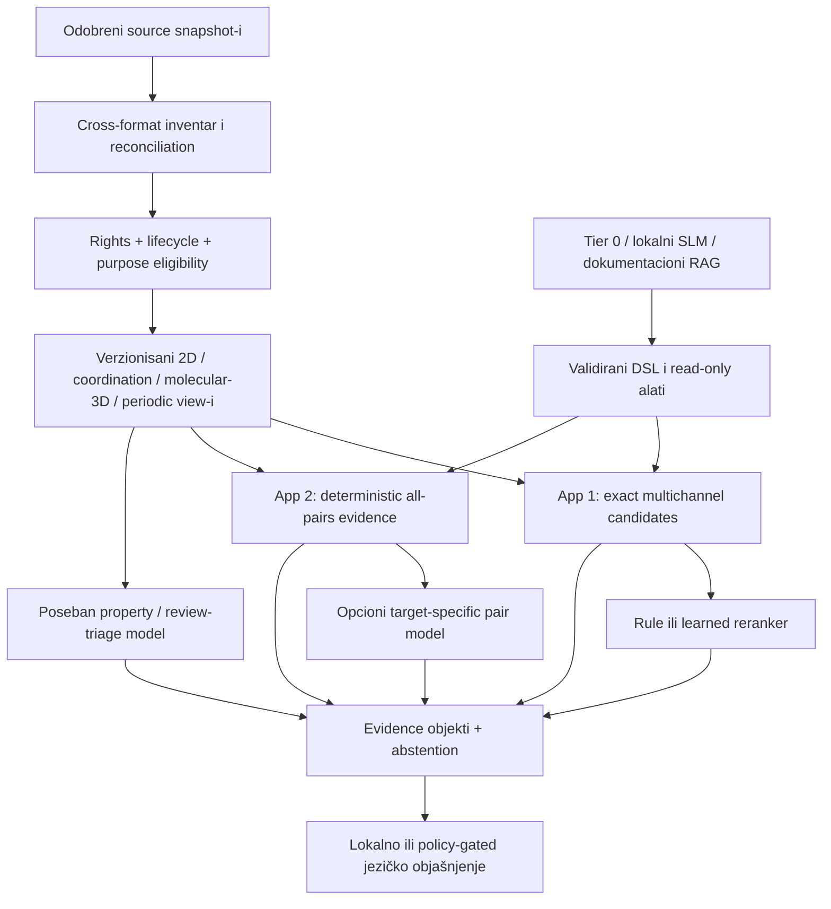
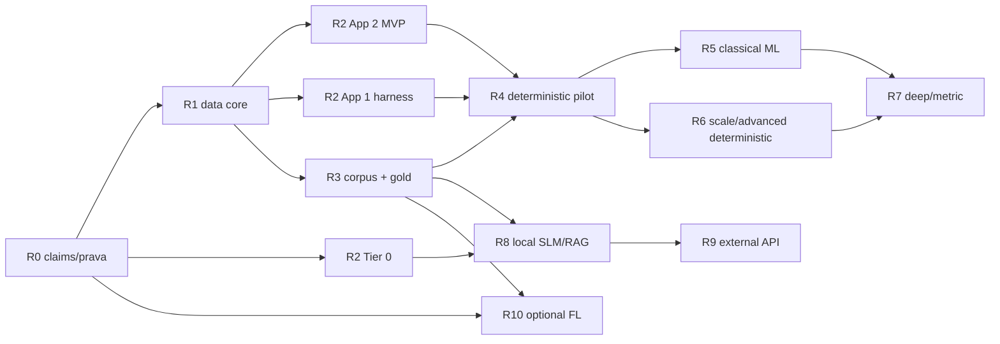

# Optimalni 2CDC stack i fazni roadmap

## Izvršna odluka

Za sadašnji 2CDC scope optimalan sistem nije jedan „AI model“, već slojevita arhitektura u kojoj se složenost kupuje tek kada zamrznuti test pokaže da je potrebna:

1. **deterministički data i scientific core** čuva formate, prava, identitet, hemijske grafove, periodičnost i dokaz;
2. **aplikacija 1** počinje višekanalnim exact retrieval-om i objašnjivim reranking-om;
3. **aplikacija 2** počinje determinističkim all-pairs evidence pipeline-om;
4. **klasični ML** je prvi learned sloj kada postoje ciljne ekspertske labele;
5. **periodični GNN/transformer i metric learning** su challengeri za dokumentovanu recall/quality rupu, ne zamena za scientific core;
6. **lokalni SLM/RAG** je opcioni UX i dokumentacioni sloj;
7. **spoljni LLM API** je poslednja, policy-gated optimizacija samo nad minimalnim `C0/C1` činjenicama;
8. **federativno učenje** se odlaže dok stvarno ne postoji multi-site target čiji se podaci ne mogu zakonito centralizovati.



Ovo je **najbolji redosled eksperimenata prema trenutno dostupnim dokazima**, ne tvrdnja da je unapred poznat production pobednik. Production izbor nastaje samo na odobrenom 2CDC corpus-u, ciljnom hardveru i unapred zamrznutom gold/qrels skupu.

## Kako čitati matrice

| Oznaka | Značenje |
|---|---|
| **MVP/default** | najjednostavniji metod koji može korektno ispuniti sadašnji ugovor |
| **production kandidat** | metod koji prvi ulazi u fer lokalni benchmark; nije unapred pobednik |
| **challenger** | složeniji metod koji mora dokazati marginalnu korist nad zamrznutim default-om |
| **defer/stop** | metod nema potreban target, podatke, prava, scale problem ili dokaz dobitka |

„Optimalan“ u ovoj dokumentaciji znači Pareto izbor po:

- scientific validity i coverage-u;
- recall/ranking ili pair quality metrikama za tačno imenovan target;
- worst-slice ponašanju, kalibraciji, OOD i abstention-u;
- latenciji, memoriji, throughput-u, rebuild-u i ceni;
- auditabilnosti, licenci, privatnosti i mogućnosti rollback-a.

Ako su dva sistema praktično izjednačena, bira se jednostavniji, jeftiniji i manje rizičan.

## Globalni gate-ovi pre algoritma

Nijedan learned ili generativni eksperiment ne preskače sledeće:

| Gate | Minimalni dokaz | Ako ne prolazi |
|---|---|---|
| source i entitlement | ko je owner/controller, koji snapshot, koje operacije i derivati su dozvoljeni | nema ingest-a, index-a, treninga ni egress-a |
| cross-format reconciliation | union CIF/MOL/MOL2/SDF/SMILES inventar, conflict/loss/missing status i canonical-view policy | nema feature matrice ni gold skupa |
| lifecycle/purpose | machine-readable `Validated/NeedsReview/Curated/Released/...` politika sa scope-om i expiry-jem | zapis se ne koristi za dati purpose |
| identity i split | svi view-i/verzije/lineage i target-relevantne porodice grupisani pre split-a | nema generalization tvrdnje |
| temporalnost | training cutoff, per-example pre-outcome feature snapshot i immutable prospective predikcija | nema prospective/predictive tvrdnje |
| target | verzionisana definicija, jedinica/conditions ili expert label guide | nema supervised modela |
| denominator | accepted/excluded/missing/blocked/unjudged accounting nad punom ciljnom populacijom | nema validne recall/accuracy tvrdnje |
| deterministic correctness | parser, mapping, PBC/stereo/invariance i metamorphic fixtures prolaze | ne trenira se model nad pokvarenim prikazom |
| baseline parity | isti corpus, split, tuning budžet, candidate policy i metric manifest | poređenje modela se odbacuje |
| licence/privacy/security | model, weights, index, report, processor i deployment scope odobreni | artefakt ostaje izolovan ili se eksperiment prekida |

Detaljan executable ugovor je u [cross-format i lifecycle modulu](../data/09-cross-format-eligibility.md), a opšta podela poslova u [mapi pipeline-a](../01-pipeline-decision-map.md).

### CSD entitlement je tvrda, zasebna granica

Ako za konkretnu instituciju, operaciju, purpose, publiku/lokaciju i vreme ne postoji pozitivna recorded CSD odluka — ili je status `unknown`, `denied` ili `expired` — svi CSD-backed read/ingest/cache/index/embedding/train/report/display/download/export/external-API i background job tokovi su fail-closed. Queued/in-flight poslovi se zaustavljaju, a pogođeni raniji derivati i generations dobijaju deny/invalidate prema retention/withdrawal politici; rollback aplikacije ne vraća staro pravo.

Razvoj tada sme da nastavi samo nad sintetičkim, otvoreno licenciranim ili eksplicitno autorizovanim **non-CSD** fixture-ima. To nije ekvivalent CSD produkcionom corpus-u i ne može dati globalni CSD coverage/performance claim. Drugi, blaži slučaj je kada prava postoje, ali odobren snapshot nije reprezentativan: kontrolisani eksperiment može raditi, ali se zaključak ograničava na taj snapshot/slice.

## Master matrica po sloju

| Sloj | MVP/default | Prvi challenger | Šta se ne radi sada |
|---|---|---|---|
| parsing | dictionary-aware deterministički CIF parser + strogi MOL/MOL2/SDF parseri | drugi parser/toolkit kao differential oracle | LLM parsiranje CIF-a |
| canonical view | field-level reconciliation + provenance + explicit conflict | expert-assisted review queue | „jedan najbolji fajl“ ili silent overwrite |
| hard filter/ACL | exact SQL/bitmap/inverted/graph predicate pre retrieval-a | cost-based planner | ML procena uslova koji mora biti egzaktan |
| App 1 candidate retrieval | exact 2D + mode-specific coordination i molecular-3D kanali, union sa kvotama | invariance-gated periodic descriptor/embedding kao opcioni dodatni kanal | jedan generic CIF-text embedding |
| App 1 2D scale | exact scan, zatim exact bounded/inverted uz istu Tanimoto semantiku | same-metric aproksimacija samo ako exact ne ispunjava SLO | MHFP/LSH predstavljen kao „isti brži ECFP“ |
| App 1 dense scale | exact Flat nad već semantički validiranim dense descriptor/embedding-om | HNSW-Flat, zatim IVF-Flat; IVF-PQ samo zbog memorije | ANN pre exact-neighbor oracle-a |
| App 1 rerank | rules/lexicographic; uz labele logistic/RF/ExtraTrees/GBDT | LambdaMART samo uz query-grouped qrels | treniranje na `search1/search2` redosledu |
| App 2 molecular | constrained assignment + VF2/MCS + Kabsch posle mapiranja | target-specific learned pair head | RMSD pre atom mapping-a |
| App 2 coordination | donor mapping + više neighbor politika + CSM/evidence | ALIGNN/shared periodic pair signal | formula/metal-presence kao koordinacioni dokaz |
| App 2 packing | periodic equivalence + validiran COMPACK/PAC put | SOAP–REMatch, CrystalCMP, PXRD komplement | cell/space-group jednakost kao packing identitet |
| combined pair odluka | multi-output evidence sa statusima | calibrated RF/GBDT; zatim simetrični neural multi-head | univerzalni neobjašnjiv „% sličnosti“ |
| property model | dummy + Ridge/Elastic Net + RF/ET/GBDT turnir | SVR/GPR za mali skup; periodic GNN za dovoljno veliki validan 3D skup | property latent kao similarity oracle |
| review triage | stručna pravila | calibrated logistic/RF/GBDT + reject/coverage sloj | automatsko proglašavanje strukture validnom |
| jezički UI | Tier 0 formulari, kontrolisani rečnik i šabloni | Qwen3.5-4B constrained NL→DSL | slobodan SQL/API/code generation |
| dokumentacioni RAG | field-aware BM25 | BM25 + Qwen3-Embedding-0.6B + RRF | mešanje sa crystal-similarity indeksom |
| spoljni LLM | isključen | C0 offline tournament, pa odobren C1 shadow/canary | raw CIF/CSD/CQS ili `C2–C4` egress |
| federativno učenje | odloženo | FedAvg samo posle multi-site/threat/data-contract gate-a | FL kao sinonim za privatnost ili licencnu dozvolu |

## Aplikacija 1 — optimalna kaskada globalne pretrage

### 1. Exact filteri i eligible corpus

**MVP/default:** rights, tenant, purpose, lifecycle i hard chemical filteri se izvršavaju pre pretrage. Exact uslovi ostaju exact: sastav, element, charge/stoichiometry politika, imenovan motif/subgraph, quality state i odobrene property granice.

**Gate:** svaki query report rekonstruiše `snapshot → rights/lifecycle eligible → hard-filter eligible → retrievable/not retrievable/execution failure`. Pre retrieval-a nezavisno anotirani fixture-i zahtevaju `actual_eligible_ids == expected_eligible_ids`, FP = 0 i FN = 0, uključujući non-vacuous positive, legitimni zero-hit, boundary i missing/unknown/invalid/failure slučaj. Tek potom se filter-aware recall meri prema exact-after-filter oracle-u.

**Stop:** ako se nedozvoljeni kandidat uopšte distance-score-uje ili ako oversampling bez oracle testa tvrdi kompletan filtered top-k, arhitektura se vraća na pre-filter particiju/exact put.

### 2. Višekanalni candidate generation

| Search signal | MVP/default | Challenger | Primarna mera |
|---|---|---|---|
| 2D parent/scaffold | binary ECFP + set Tanimoto i count ECFP + odgovarajući generalized Tanimoto, uz pinovan standardization/fingerprint manifest | MHFP6/LSH ili target-trained molecular embedding | query-macro known-positive Recall@C + representation coverage |
| coordination motif | exact metal/donor/motif signature i descriptor filter | target-specific learned coordination embedding | recall koordinacionih positives, donor-map error, worst metal slice |
| isolated 3D shape | validiran USR/USRCAT ili drugi shape descriptor nad jasno definisanim conformer-om | learned geometric embedding | shape-channel recall uz mapped-3D applicability |
| periodic/crystal | nije obavezni MVP kanal; deterministic periodic descriptor tek ako search mode to traži i invariance/ablation gate prolazi | Matformer dual encoder; ALIGNN za angle/coordination | marginalni expert candidate recall uz exact Flat i invariance gate |
| metadata-only fallback | exact composition/approved metadata route | nema learned hemijske tvrdnje bez reprezentacije | visible coverage, abstention i fallback recall |

Kandidati se spajaju **unijom sa mode-specific kvotama i provenance-om kanala**. Missing score nije nula. Availability/source/status se koristi za routing i risk; u scientific relevance score ulazi samo ako prođe source-only baseline, ablation i source/release/time shift iz data contract-a.

### 3. Exact pre ANN-a

Indeks ne bira semantiku; on samo ubrzava tačno imenovanu reprezentaciju i metricu. Dve putanje se ne spajaju:

**Binary/count fingerprint put:**

1. exact scan sa pinovanom binary ili count Tanimoto formulom;
2. exact bounded/inverted implementacija koja vraća isti ugovorni poredak;
3. eventualna aproksimacija iste metrike tek ako najbolji exact put ne zadovoljava p95/throughput/cost SLO;
4. MHFP/MinHash/LSH je zaseban representation experiment sa sopstvenim semantic gate-om, ne „brži isti ECFP“.

**Dense descriptor/learned-embedding put:**

1. reprezentacija prvo mora pokazati semantic candidate korist u odnosu na postojeće kanale;
2. exact Flat nad njenom pinovanom cosine/dot/L2 metrikom je neighbor oracle;
3. HNSW-Flat ulazi ako Flat ne zadovoljava SLO i RAM je prihvatljiv;
4. IVF-Flat je sledeći lokalni Pareto kandidat;
5. IVF-PQ dolazi tek kada puna preciznost ne staje u memorijski/cost budžet i lossy indeks prolazi exact-oracle, semantic non-inferiority i rerank test.

Infrastrukturna metrika je tie-aware `R^tie_(K@N)` prema exact top-`K` susedima u ANN candidate budget-u `N≥K`, sa zamrznutim `K`, `N`, corpus/ACL/filter, self-match i tie ugovorom. Ona meri indeks. Expert candidate recall nad poznatim relevantnim entry-jima meri reprezentaciju/candidate uniju; te dve metrike se ne nazivaju isto niti se jedna koristi kao dokaz druge.

Ne uvodi se vector baza zato što „projekat koristi AI“. Uvodi se tek kada izmereni scale/SLO problem opravda novu aproksimacionu grešku i operativni lifecycle.

### 4. Reranking po količini labela

| Dostupni supervision | Optimalni početak | Sledeći turnir | Zabranjena prečica |
|---|---|---|---|
| nema ekspertskih labela | lexicographic/rule score i rastavljivi evidence | stručna revizija formule i disagreement pool | pseudo-labela iz postojećeg search rezultata |
| binary/ordinal pair labels, ali nema query qrels | logistic/ordinal classifier | RF, ExtraTrees, GBDT uz kalibraciju | predstavljati pair classifier kao listwise optimum |
| query-grouped graded judgments | logistic/RF/GBDT pointwise referenca | LambdaMART; pairwise/listwise challenger | random split parova ili unjudged=negative |
| click/usage signal | samo istraživanje selection/exposure bias-a | propensity-aware pomoćni signal | click-through kao stručni gold |

Primarne metrike su razdvojene:

- **ANN recall** prema exact neighbor oracle-u iste reprezentacije;
- **semantic candidate recall** prema ekspertno poznatim positives u zamrznutom pool-u;
- **end-to-end ranking** kroz nDCG/MAP/Recall i expert utility;
- calibration/coverage–risk, worst-slice, latency, RAM i rebuild cost.

Pobednik mora zadržati high-recall candidate gate; reranker ne može vratiti relevantan entry koji candidate sloj nije proizveo.

Qrels se ne prave samo iz top rezultata jednog sistema. Judgment pool je zamrznuta duboka unija različitih retriever/ranker porodica, exact/rule hitova i stratifikovanog corpus uzorka; eksperti ocenjuju slepo uz `unjudged`, ambiguity i confidence status. Kada novi retriever donese mnogo novih neocenjenih top rezultata, pool se dopunjava i svi kandidati se ponovo porede na istoj qrels verziji. Bez corpus-complete ocene rezultat se eksplicitno zove pooled/judged recall.

## Aplikacija 2 — optimalno precizno all-pairs jezgro

Za `n` prihvaćenih upload-a full režim obrađuje tačno `n(n−1)/2` neuređenih parova. Fast/candidate-pruned režim je drugi proizvodni mode sa sopstvenim recall gate-om; ne sme se prikazivati kao full all-pairs rezultat.

### Determinističke grane

| Pitanje | MVP/default | Challenger/reference | Obavezni output/gate |
|---|---|---|---|
| component assignment | constrained Hungarian/min-cost assignment sa dummy/unmatched opcijama | k-best/ambiguity set; learned cost samo uz labele | sve alternative blizu optimuma, coverage i unmatched razlog |
| exact molecular identity | canonical hash kao prefilter + VF2-like exact matcher | drugi toolkit kao differential cross-check | atom/bond/stereo/charge policy i exact mapping |
| partial common core | fingerprint bound + bounded MCS | target-specific mapping model tek posle failure analize | timeout nije score 0; coverage A→B i B→A |
| rigid molecular 3D | Kabsch po svim hemijski dozvoljenim mapama | poseban flexible alignment profil | RMSD + mapped atom coverage + reflection/stereo policy |
| coordination | više distance/radii/Voronoi candidate setova + exact metal/donor mapping | ChemEnv-like/ALIGNN signal | CN, donor identitet, CSM vector, ambiguity/sensitivity |
| lattice/periodic equivalence | explicit basis/origin/symmetry/lattice-image transform candidates | nezavisna comparator implementacija | origin/wrap/setting/basis/supercell metamorphic pass |
| packing | validiran/licenciran COMPACK/Packing Similarity kao referenca kada postoji | objavljeni PAC kao nezavisni challenger; CrystalCMP samo species-specific cross-check | matched cluster coverage, RMSD i failure reason; CrystalCMP čuva `selected_molecular_species/fragment_mapping`, inače `branch_status: ambiguous/not_applicable` i `relation_label: null`, posebno za coordination networks |
| soft local/crystal similarity | deterministic descriptors | chemically constrained SOAP–REMatch | exact atom/component constraints, finite-molecule/domain i stereo/reflection gate; tolerance sensitivity; ne naziva se identity dokazom |
| diffraction complement | parametrizovan simulated PXRD/VC-PWDF-like signal | learned PXRD samo uz nezavisne measured labels | potpuni simulation/measurement manifest iz teksta ispod; simulated nije nezavisan dokaz source CIF-a |
| interaction network | typed exact motif/fingerprint | WL kernel, graph model ili optimal transport | mapped interaction types, network coverage i directionality |

Intensity-based PXRD poređenje je reproduktivno tek kada manifest navede probe i geometriju, sve radiation komponente i težine, scattering-factor izvor/verziju, occupancy/disorder/H/ADP politiku, primenjene korekcije, osu i opseg, profile/broadening, binning/interpolaciju, normalizaciju i temperaturu, simulator/verziju/tolerancije; za measured pattern dodatno navodi instrument, kalibraciju i zero-shift. Samo `wavelength + bins` nije dovoljan ugovor.

### Kombinovanje rezultata

MVP vraća **vektor dokaza**, na primer:

```yaml
pair_id: ...
comparison_profile: coordination_motif_v1
component:
  relation_target: component_relation_v1
  branch_status: assessed
  relation_label: partial_match
  evidence_coverage: partial
graph:
  relation_target: same_parent_graph_v1
  branch_status: assessed
  relation_label: different
  evidence_coverage: partial
mapped_3d:
  branch_status: assessed
  relation_label: null
  rmsd_angstrom: ...
  mapped_coverage_a: ...
  mapped_coverage_b: ...
coordination:
  branch_status: ambiguous
  relation_label: null
  same_metal: true
  mapped_donors: ...
packing:
  branch_status: missing_input
  relation_label: null
  evidence_coverage: none
warnings: [...]
method_manifest_ids: [...]
```

Sve grane koriste jedinstveni `branch_status_v1`; `relation_label` je zaseban nullable target enum. Za `packing_relation_v1` jedine naučne klase su `same | related | different`; parcijalna pokrivenost ostaje evidence, ne četvrta klasa. Relation loss se maskira za svaki status osim `assessed`.

Bez ciljanih labela nema univerzalnih pondera. Uz dovoljne ekspertske labele prvo se porede logistic/ordinal, RF, ExtraTrees i calibrated GBDT nad branch evidence/status poljima. Model ne sme da preglasa exact hard constraint niti da sakrije `ambiguous`, `missing_input`, `quality_blocked`, timeout ili low coverage.

### Neuralni challenger za App 2

Redosled je:

1. jednom cache-ovati validirani periodic encoder po strukturi;
2. shared encoder + simetrični multi-output BCE/ordinal head za simetrične targete, nad komutativnim feature-ima kao `|zA-zB|`, `zA*zB`, `zA+zB` i imenovane distance/evidence komponente;
3. poseban directional head za `A_contains_B` i `B_contains_A`;
4. fusion learned embedding-a i determinističkih descriptor/evidence features kroz mali head ili GBDT;
5. cross-graph comparator samo nad dokumentovanim failure slice-om ili budžetiranim top-M/all-pairs skupom.

Cross-graph sloj se ne uvodi samo zato što je arhitektonski moćniji. Mora pokazati korist tamo gde exact mapping/packing + shared pair head greše, uz nezavisnu frame invariance, swap/directionality test, calibration i operativni budžet.

## Klasični ML — izbor prema efektivnom broju nezavisnih grupa

Efektivni `n` nije zbir cardinality-ja preklapajućih compound/scaffold/solid-form/publication/time osa. Za deklarisani estimand unapred se bira target-relevantan relation graph, računa njegov transitive grouping i broje nezavisne **outer-split/resampling jedinice**. App 1 su to tipično query/family liste; App 2 koristi endpoint/family jedinice i dyadic/two-way postupak jer parovi dele oba kraja. Sirovi pair/query redovi, različiti view-i i zbir više group-ID brojeva nisu efektivni `n`. Sledeće su početne eksperimentalne zone, ne univerzalni zakoni:

| Nezavisne label grupe | Prioritet | Challenger | Odluka |
|---:|---|---|---|
| `0` | pravila, deskriptivna analiza, disagreement sampling | nema supervised production modela | prvo napraviti label guide i blind gold |
| `< 200` | regularizovan linear/logistic; GPR za mali smisleni regression kernel | vrlo ograničen RF/ExtraTrees, SVR | bez širokog hyperparameter search-a; intervali i abstention obavezni |
| `200–2.000` | Elastic Net/logistic, RF/ExtraTrees, SVM/SVR; GPR gde staje | GBDT kroz nested grouped CV | model selection po grouped/OOD, ne random row split-u |
| `2.000–20.000` | RF/ExtraTrees + GBDT kao glavni tabularni turnir | shallow MLP ili GNN uz validnu reprezentaciju | deep mora pobediti jake tabularne baseline-e |
| `20.000+` | boosting i linear/sparse baseline-i ostaju | pretrained/periodic GNN uz overlap audit | veličina sama ne ukida target, split i invariance gate |

### Po target-u

| Target | Obavezni baseline | Prvi ozbiljan turnir | Poseban uslov |
|---|---|---|---|
| App 1 expert relevance | rule + logistic/ordinal | RF, ExtraTrees, GBDT | LambdaMART tek uz query-level judgments |
| App 2 overall/pair relation | deterministic branch report + logistic | RF/ExtraTrees/GBDT | multi-output i branch statusi ostaju vidljivi |
| property regression | mean/median + Ridge/Elastic Net | RF/ExtraTrees/GBDT; SVR/GPR za mali skup | solid form, uslovi, metoda, uncertainty i pre-outcome snapshot |
| quality-review triage | expert rules | calibrated logistic/RF/GBDT | skoro sav high-risk recall; samo red prioriteta, ne scientific release |
| OOD/risk | descriptor distance/range checks | ensemble disagreement + explicit OOD model | OOD score ne popravlja nepoznatu hemiju; vodi abstention-u |

RF nije automatski pobednik zato što je robustan, niti je GBDT automatski pobednik zato što često dominira tabularnim benchmarkovima. Svaki dobija isti nested grouped CV/tuning budžet; jednostavniji model ostaje optimalan ako složeniji nema praktično i statistički podržan dobitak.

## Deep/periodični modeli — kada zaista ulaze

### Minimalni turnir

| Red | Kandidat | Uloga | Zašto je tu |
|---:|---|---|---|
| 0 | deterministic descriptors + linear/RF/GBDT | obavezna jaka referenca | meri da li GNN donosi nov signal |
| 1 | CGCNN | jednostavni periodic deep sanity baseline | poznata crystal graph referenca, mali prag kompleksnosti |
| 2 | Matformer | prvi periodic dual-encoder kandidat | periodic-aware transformer, ali nova 2CDC metric-learning adaptacija |
| 3 | ALIGNN | angle/coordination challenger | line-graph uglovi su relevantni za koordinaciju |
| 4 | SchNet periodic distance-only | ablation | meri korist uglova/periodic-specific dizajna |
| 5 | equivariant/cross-graph model | failure-driven challenger | samo ako prethodni modeli ne predstavljaju potreban signal |

Matformer, ALIGNN i CGCNN radovi prvenstveno validiraju property zadatke, ne 2CDC CSD-like similarity. Zbog toga model prolazi tek kada:

- deterministički periodic graph builder prolazi atom-order, origin/wrap, setting/basis, primitive/conventional, supercell, boundary-tie i stereo/reflection testove;
- target ima tačno verzionisano ime iz relation/target registry-ja, na primer `same_parent_graph_v1`, `coordination_relation_v1`, `packing_relation_v1`, `useful_precedent_v1` ili konkretni property target;
- metric loss se koristi samo za relaciju kompatibilnu sa globalnim prostorom; netranzitivno `related` dobija pair comparator/ranker;
- exact Flat meri embedding susedstvo pre ANN-a;
- grouped cold/cold i prospective split, pretraining-overlap i false-negative audit prolaze;
- learned kanal materijalno pobedi deterministic/tabular + CGCNN referencu bez pada critical slice-a;
- latency, RAM, training/rebuild trošak i licenca staju u budžet.

### Početni neuralni acceptance pragovi

Pragovi se zamrzavaju pre finalnog testa i mogu se pooštriti kada gold postane veći:

| Gate | Početni kriterijum iz validacionog protokola |
|---|---|
| representation | 100% obaveznih metamorphic testova; nula identity/order/basis/supercell grešaka |
| ANN infrastruktura | query-macro tie-aware `R^tie_(K@N)` prema exact top-`K` najmanje 99,5% ukupno i 98% po dovoljno snažnom critical slice-u |
| semantic candidate | query-macro `ExpertCandidateRecall@N` najmanje 99% ukupno i 95% po dovoljno snažnom critical slice-u |
| non-inferiority | donja 95% paired granica razlike prema baseline-u najmanje −1 pp ukupno i −3 pp po slice-u |
| praktična korist | uz non-inferiority: najmanje +2 pp primarne metrike ili najmanje 30% latency/cost dobitka |
| pair model | PR-AUC i operativni precision/recall nisu lošiji od RF/GBDT/determinističke reference |
| calibration/abstention | NLL/Brier i risk pri ciljanoj coverage nisu lošiji od baseline-a |

Ovi brojevi nisu hemijske konstante. Oni su unapred definisani engineering gate-ovi za high-recall ulogu i zahtevaju dovoljno veliki, reprezentativan qrels/gold slice; ako efektivni uzorak nije dovoljan, claim ostaje `insufficient_evidence`.

Deep promotion dodatno prolazi **label-efficiency gate**: najmanje pet log-raspoređenih budžeta nezavisnih grupa, više seed-ova i isti netaknuti test. Za svaki budžet koristi se paired LCB/non-inferiority odluka sa dovoljnim efektivnim uzorkom; model mora proći na najmanje dva uzastopna realistična budžeta. Pobeda samo pri najvećem, praktično nedostupnom broju labela ili samo jednim seed-om nije dokaz optimalnosti.

## Lokalni SLM i dokumentacioni RAG

### Tier 0 je pravi baseline

Obe tražene aplikacije mogu raditi bez generativnog modela:

- kontrolisani formulari i search/comparison profili;
- deterministički parser namere nad ograničenim poljima;
- stručni terminološki rečnik i uska pitanja za razjašnjenje;
- template report direktno iz evidence objekata.

Ako SLM ne daje merljivo bolji task completion/UX uz isti scientific rezultat, Tier 0 ostaje production optimum.

### NL → DSL shortlist

| Uloga | Početak | Challengeri | Stop uslov |
|---|---|---|---|
| default lokalni generalista | Qwen3.5-4B, grammar-constrained DSL, bez fine-tuning-a u prvom testu | Qwen3.5-2B za efikasnost; Qwen3.5-9B za kvalitet | nema materijalne koristi nad Tier 0 ili ne prolazi critical Serbian/English/Latin/Cyrillic slice |
| uski function parser | deterministic parser | task-specific FunctionGemma 270M | nepoznat tool/field, slab `clarify/reject`, licence/hardware problem |
| vendor-diversity test | isti Qwen baseline | Phi-4-mini, mala Gemma 4, Ministral 3 3B | leaderboard bez 2CDC task dobitka |
| jači lokalni fallback | odabrani mali model | gpt-oss-20b samo za dokumentovano teške slučajeve | hardware/latency trošak bez critical-slice dobitka |

SLM proizvodi samo kandidatski DSL ili narativ. Schema, semantic, licence, tenant, purpose i tool-policy validatori odlučuju; deterministički engine ponovo računa candidate/pair set i sve score-ove.

### RAG shortlist

| Faza | Optimalni izbor | Gate |
|---|---|---|
| lexical baseline | field-aware BM25 nad prethodno autorizovanim corpus-om | exact tag/refcode/DOI i source locator recall |
| hybrid kandidat | BM25 + Qwen3-Embedding-0.6B + RRF | bolji qrels recall/nDCG po jeziku/terminu uz isti ACL corpus |
| diversity challenger | BGE-M3 | pobeđuje jednostavniji hybrid na lokalnim qrels, ne samo javnom benchmarku |
| reranker | Qwen3-Reranker-0.6B nad malim eligible union skupom | marginalni nDCG/recall dobitak opravdava p95/RAM |
| generator | isti odabrani lokalni SLM nad evidence paketom | claim-level entailment/citation i nula promene scientific rezultata |

Dokumentacioni RAG i chemical/crystal similarity retrieval imaju odvojene korpuse, embedding-e, metrike, qrels i indekse. Raw CIF tekst se ne pretvara u sentence embedding da bi predstavljao kristal.

### Jezički model nikada nije scientific ili policy autoritet

Ni lokalni ni spoljni model ne dobija pravo da:

- parsira raw CIF/CQS ili bira data block kao source of truth;
- određuje bondove, koordinaciju, symmetry/PBC, atom mapping, MCS, Kabsch/RMSD, packing, PXRD, SOAP ili property vrednost;
- računa fingerprint, ANN kandidata, finalni score, kalibraciju ili uncertainty;
- donosi ACL/licence/tenant/purpose/download/export odluku;
- izvršava slobodno generisan SQL/Cypher, shell/kod, arbitrary URL, Files/search ili remote tool/MCP poziv.

Model može samo da predloži dozvoljeni DSL, zatraži razjašnjenje ili verbalizuje već izračunat minimalni evidence paket. Deterministički validatori i engine ostaju autoritet, a isti scientific rezultat mora postojati kada je jezički model potpuno isključen.

## Spoljni LLM API

**Production default je: isključen.** Naučne odluke, restricted podaci i `C2/C3/C4` ostaju u lokalnom deterministic + Tier 0/SLM toku.

Ako postoji dokaziv jezički/UX problem koji lokalni sloj ne rešava, redosled je:

1. offline `C0` vendor-neutral tournament;
2. prvi balanced kandidat: OpenAI `gpt-5.6-terra` preko stateless Responses toka sa `store=false`;
3. efficiency/hard-case kandidati: `gpt-5.6-luna` i `gpt-5.6-sol`;
4. cross-provider challengeri iz API modula;
5. tek zatim pisano odobren `C1` shadow bez uticaja na korisnika;
6. mali canary sa kill switch-em, token/cost budžetom i lokalnim fallback-om.

Model/vendor lista je snapshot od 23. avgusta 2026. i mora se ponovo proveriti pre deployment-a. Model naziv ne daje retention, privacy ni CCDC pravo; merodavni su tačan ugovor, org/project/region/feature podešavanja i centralni egress manifest.

API se odmah odbacuje ako:

- payload ili schema otkrivaju raw/licencirani/neobjavljeni sadržaj, koordinate, tajne ili tenant identitet;
- unknown rights/retention/processor state ne fail-closed blokira poziv;
- schema-valid odgovor menja candidate set, pair set, score, status, denominator ili warning;
- provider outage prekida scientific core;
- nema materijalne task koristi nad lokalnim baseline-om;
- security, latency ili cost gate ne prolazi.

Detalji su u [lokalnom SLM/RAG modulu](../language/07-local-slm-rag.md) i [API/security modulu](../language/08-api-llm-security.md).

## Structure–property, polymorph-risk i federativno učenje

### Property modeli

Property je zaseban target, ne sporedni similarity feature bez ugovora. Svaki red mora vezati:

- material i konkretan solid form/structure version;
- property type, vrednost i jedinicu;
- uslove, metod, sample/batch i measurement/computation provenance;
- uncertainty/quality i vreme kada je rezultat postao poznat.

Tek tada se primenjuje klasični ML turnir; periodic GNN ulazi uz dovoljno veliki validan 3D skup. Sličan property output ne dokazuje sličnu strukturu.

### Manufacturability nije jedan scalar target

White-paper pojam manufacturability prvo se rastavlja na merljive, procesno uslovljene ishode. Ilustrativni target može biti `filtration_time_under_protocol_v1`, `batch_meets_defined_flowability_spec_v1` ili drugi unapred odobren ishod — ne neodređena kolona „manufacturable=yes/no“. Uz strukturu/solid form zapisuje se najmanje materijal/batch, formulation/process koraci, temperatura/pritisak/solvent i druga relevantna podešavanja, oprema/site/protokol, sampling vreme, merna metoda, specifikacija, odstupanja i uncertainty.

Split grupiše isti material/formulation/process campaign/site/time izvor prema tačnom deployment estimand-u, a feature snapshot mora prethoditi ciljnom procesnom ishodu. Bez operativne definicije, uporedivih protokola, lineage-a i dovoljno nezavisnih batch/campaign grupa nema manufacturability modela. Crystal similarity ili jedna property predikcija ne sme se preimenovati u manufacturability dokaz.

### Polymorph-risk

Mogul/geometrijske distribucije, packing comparison, hydrogen-bond propensity, interaction mreže i analog retrieval grade **indikatore za istragu**. Ne daju automatsku dijagnozu neotkrivenog polimorfa, stabilnosti ili termodinamičkog poretka. Production claim zahteva referentni skup, validirane vendor/open implementacije, jasno definisan estimand i nezavisne eksperimentalne/energetske dokaze.

### Federativno učenje

FL nije potreban za App 1 retrieval ni deterministički App 2. Aktivira se samo ako stakeholder potvrdi sve:

1. postoji zajednički supervised target na više institucija;
2. raw podaci se zakonito/ugovorno ne mogu centralizovati;
3. schema, label semantics, units, quality i split policy su usaglašeni;
4. local-only i shared-public-pretraining baseline-i nisu dovoljni;
5. threat model pokriva update/gradient, coordinator, malicious client, endpoint i final-model leakage;
6. secure aggregation/DP/robustness kontrole odgovaraju konkretnom threat model-u;
7. licence dozvoljavaju lokalni trening, update, agregaciju i release finalnog modela;
8. globalni i worst-site rezultat opravdavaju operativni trošak.

Ako ijedan preduslov nedostaje, status je `DEFER`, ne „budući must-have“.

## Roadmap R0–R9

Faze su evidence gate-ovi, ne kalendarsko obećanje. Mogu se delimično paralelizovati, ali se nijedna ne promoviše preko zavisnosti.

Ovaj roadmap navodi buduće poslove i kriterijume redosleda. Ne propisuje gotove šeme, fixture fajlove, API payload-e, kod niti infrastrukturnu konfiguraciju; to se projektuje i realizuje u odgovarajućoj razvojnoj fazi.

### R0 — claims, prava i acceptance ugovori

**Isporuke:**

- potpisan scope obe aplikacije i comparison/search profili;
- permission matrix za source, export, hash, embedding, model, report, Git/CI, cloud processor i publication;
- data class/lifecycle/purpose politika;
- target/label/qrels vodiči i unapred definisane metrike/SLO/praktične margine;
- zapis šta se može raditi bez CSD pristupa, a šta je blokirano.

**Exit:** nijedna ključna operacija nema `unknown` owner/licence/claim semantiku.

### R1 — zajednički deterministički data core

**Isporuke:**

- union inventar CIF/MOL/MOL2/SDF/SMILES i byte/source lineage;
- parsirani declared/curated/geometry-candidate view-i;
- coordinate, symmetry, cell, atom/site mapping i cross-format reconciliation;
- identity/version/family graph, lifecycle state machine i derived invalidation;
- D01–D29 data regression suite, uključujući nezavisni hard-filter set-equality gate i rhombohedral→trigonal schema normalizaciju, plus source/denominator report.

**Exit:** isti source snapshot daje isti canonical/purpose view; nema silent overwrite/join drop/leakage.

### R2 — prototipovi bez baze i bez ML-a

Tri trake mogu paralelno:

- **App 2 MVP:** full pair enumeracija, component assignment, exact graph/MCS, Kabsch, DAP–metal donor/coordination evidence i long-form result schema;
- **App 1 fixture harness:** query DSL, exact filteri, multichannel interfaces, exact scan/oracle interfejsi i synthetic/open fixture qrels — bez tvrdnje o globalnom CSD recall-u;
- **Tier 0:** formulari, controlled vocabulary, template report i read-only tool boundary.

**Exit:** open/synthetic i dozvoljeni lokalni fixture-i prolaze metamorphic, swap/directionality, failure/accounting i security testove.

### R3 — odobren corpus, gold i qrels

**Isporuke:**

- ovlašćen CSD/in-house data-plane pristup ili formalno potvrđen alternativni corpus;
- zamrznuti representative snapshot i query/problem sampling plan;
- blind expert qrels za App 1 i gold/disagreement set za App 2;
- property/review labele samo za odobrene targete;
- group/time/prospective split i judgment coverage plan;
- zamrznuti, intent-family-grouped NL→DSL gold na srpskoj latinici, ćirilici i engleskom, sa `clarify/reject/abstain` i execution-equivalence oracle-om;
- dokumentacioni RAG qrels sa exact source/version/locator gold-om, rare-token i bilingual/cross-lingual slice-ovima, plus quarantined/unauthorized negative fixtures;
- grounded-report evidence oracle i security/prompt-injection/tool/tenant/rights regression skup;
- izolaciju finalnih intent/paraphrase family-ja, qrels/gold-a i security slučajeva od prompt primera, fine-tuning-a i model-selection judgment-a. Svi RAG sistemi ipak pretražuju isti zamrznuti eligible corpus koji sadrži relevantne dokumente; document-family holdout se radi samo za eksplicitni unseen-document estimand, ne blanket pravilom koje bi uklonilo gold dokument iz indeksa.

**Exit:** dovoljno nezavisnih grupa i slice coverage za imenovani claim. Bez entitlement-a se App 1 ne promoviše van fixture prototipa.

### R4 — deterministički production pilot

**App 1:** exact hard filters, exact ECFP/count, mode-specific coordination i molecular-shape kanali, quota union, exact rerank features, rule score i denominator report. Periodic descriptor/embedding nije R4 zavisnost; dodaje se tek posle sopstvenog invariance, semantic-recall i minus-one ablation gate-a.

**App 2:** kompletno deterministic evidence jezgro; packing grana samo ako postoji validirana/licencirana COMPACK/PAC/reference putanja.

**Exit:** candidate semantic recall, pair branch correctness, worst-slice, p95/p99, timeout, memory, audit i rights gate prolaze.

### R5 — klasični ML turnir

**App 1/App 2/property/triage po target-u:** dummy/rule → linear/logistic/ordinal → RF → ExtraTrees → GBDT; SVM/SVR/GPR/PLS samo u odgovarajućem data režimu. LambdaMART samo ako R3 zaista daje query-grouped judgments.

**Exit:** paired grouped/OOD test pokazuje praktičan dobitak, critical slice non-inferiority, calibration/abstention i operativni fit. Inače R4 ostaje production optimum.

### R6 — scale i napredni deterministički challengeri

**App 1:** za fingerprint prvo exact scan → exact bounded/inverted uz istu Tanimoto semantiku; za svaki već validirani dense descriptor exact Flat → HNSW-Flat → IVF-Flat, uz PQ samo zbog memorije. Novi learned embedding prvo prolazi R7 semantic gate, pa tek onda isti dense infrastructure put. Filter-aware recall i immutable index generation su obavezni.

**App 2:** COMPACK/PAC disagreement benchmark; CrystalCMP, SOAP–REMatch, PXRD i interaction-network challengeri samo uz svoje species/domain/stereo/simulation applicability ugovore, dostupna prava i tačan target.

**Exit:** svaki dodatni sloj rešava izmereno usko grlo ili scientific failure slice; inače se uklanja.

### R7 — periodic deep i metric learning

**Turnir:** descriptor+GBDT, CGCNN, Matformer, ALIGNN, SchNet ablation; shared dual encoder/pair head. Supervised contrastive samo za konzistentne relation groups; pair/listwise head za netranzitivne ili query-conditioned targete.

**Exit:** invariance, exact-Flat, semantic, grouped/prospective, overlap, false-negative, label-efficiency kroz najmanje pet budžeta/više seed-ova, calibration, SLO i licence gate. Cross-graph/equivariant model samo posle dokumentovane residual greške.

### R8 — lokalni SLM i dokumentacioni RAG

**Turnir:** Tier 0 → Qwen3.5-4B constrained DSL → efficiency/accuracy/diversity challengeri; BM25 → Qwen dense + RRF → opcioni reranker. Scientific output mora ostati byte/semantički jednak kada se model isključi.

**Exit:** bolji task completion/UX uz nula policy/scientific bypass-a, critical multilingual slice, hardware/SLO/licence i tested fallback.

### R9 — spoljni API samo ako još postoji dokaziva rupa

**Turnir/rollout:** `C0` offline → odobren `C1` shadow → mali canary → ograničen production. Centralni broker, minimum payload, output ACL, content-free audit, circuit breaker i local fallback.

**Exit:** external API materijalno pobeđuje lokalni Pareto baseline bez egress/security/rights greške. U suprotnom ostaje isključen.

### Opcioni R10 — federativno učenje

Ne ulazi u osnovni roadmap. Otvara se samo posle eksplicitnog multi-site business/scientific zahteva i svih FL gate-ova iz prethodne sekcije.

## Zavisnosti i paralelizacija



Najvažnija praktična posledica sadašnjeg ograničenja je: bez CSD pristupa može se završiti R0–R2, veliki deo parserskih/metamorphic testova i Tier 0/RAG dokumentacioni prototip. Ne može se pošteno zaključiti corpus-wide App 1 recall, izabrati ANN konfiguracija za stvarnu distribuciju, trenirati production ranker niti dokazati CSD-like deep generalizacija.

## Stop/defer matrica

| Uslov | Obavezna odluka |
|---|---|
| nema pozitivnog CSD entitlement-a za konkretnu operaciju/purpose | hard fail-closed za CSD read/ingest/cache/index/embedding/train/report/display/export/API/background; invalidacija pogođenih derivata; samo synthetic/open/eksplicitno autorizovani non-CSD fixtures |
| prava postoje, ali odobren corpus nije reprezentativan | eksperiment je dozvoljen samo za taj snapshot/slice; nema globalnog App 1 performance claim-a |
| nema ekspertskih qrels/labela | rules/evidence ostaju; nema LTR-a, calibrated relevance probability ni learned final pair odluke |
| samo `search1/search2` ili vendor output kao „gold“ | koristi se za fixture/disagreement, ne kao nezavisan target |
| premalo nezavisnih grupa | pravila/linear/ograničen classical model; deep i širok tuning se odlažu |
| ANN ne prolazi exact oracle | exact indeks ostaje production; ANN se odbacuje bez obzira na brzinu |
| candidate recall ne prolazi | ne pokušava se spasiti rerankerom |
| deep dobitak nestaje prema descriptor+GBDT/CGCNN ili critical slice pada | deep kanal se ne promoviše |
| source/status-only model nosi dobitak | scientific score se blokira; signal eventualno ostaje samo u risk/abstention sloju |
| cross-graph ne rešava dokumentovanu residual grešku | ostaje van pipeline-a |
| property nema solid-form/uslove/metodu/uncertainty | nema supervised target-a niti imputirane „stabilnosti“ |
| SLM ne pobeđuje Tier 0 u UX/task kvalitetu | Tier 0 ostaje production |
| RAG dense/reranker nema marginalni qrels dobitak | ostaje BM25 ili BM25+dense+RRF bez reranker-a |
| API prava/retention/region/processor nisu jasni | fail-closed, lokalni tok |
| API nema korist nad lokalnim Pareto baseline-om | provider se ne uvodi |
| nema stvarnog multi-site non-centralizable target-a | FL ostaje odložen |

## Šta će kasnije morati da prati prihvaćeni model

Bez obzira na porodicu, release paket sadrži:

- immutable source/data/eligibility snapshot i rights decision ID;
- target/label/qrels definiciju i adjudication/judgment coverage;
- identity, split, time i pretraining-overlap manifest;
- feature/graph/embedding/index/model/code/config checksum-e;
- tuning budžet, seed-ove i sve pokušaje, ne samo pobednika;
- baseline i paired interval razlike;
- overall, query/family macro i unapred definisane worst-slice metrike;
- calibration, OOD, coverage–risk, abstention i failure accounting;
- p50/p95/p99, RAM/VRAM, throughput, rebuild/update i cost;
- metamorphic/security/licence test report;
- poznate granice, model card, owner, monitoring, rollback i invalidation plan.

## Šta je sada stvarna inženjerska preporuka

Ako tim sutra počinje implementaciju, redosled nije „prvo treniraj model“:

1. formalizovati R0 i dogovoriti šta R1 data core mora da obezbedi;
2. izgraditi App 2 deterministički MVP, jer se može najviše validirati nad dostavljenim/sintetičkim fixture-ima bez pune baze;
3. paralelno napraviti App 1 exact multichannel harness i Tier 0 UI, bez lažnog corpus claim-a;
4. obezbediti licencirani data-plane i stručni gold/qrels;
5. pustiti deterministički pilot, pa RF/ExtraTrees/GBDT turnir;
6. rešavati scale exact→ANN samo ako benchmark pokaže potrebu;
7. tek zatim CGCNN–Matformer–ALIGNN/metric-learning turnir;
8. lokalni SLM/RAG dodati samo za merljiv UX; spoljni API samo ako lokalni sloj ostavi dokazivu rupu;
9. FL ne planirati kao MVP deliverable.

Ovaj redosled čuva najvažniju stvar: svaka nova metoda ima jasan posao, referentni sistem, dokaz dobitka i mogućnost da bude odbijena. „Napredniji“ model nije uspeh sam po sebi; uspeh je bolji, reproducibilan 2CDC rezultat pod istim scientific i operational ugovorom.

## Gde su detalji i izvori

Ova strana je sinteza već validiranih modula; ne zamenjuje njihove definicije, caveat-e ni primarne izvore:

- [scope i pravila optimalnosti](../00-scope.md);
- [mapa pipeline-a i decision gate](../01-pipeline-decision-map.md);
- [klasični ML](../classical/02-classical-ml.md);
- [globalni retrieval, ANN i ranking](../retrieval/03-global-retrieval-ann-ranking.md);
- [precizno pairwise poređenje](../pairs/04-precise-pairwise.md);
- [periodični encoderi](../deep/05-periodic-crystal-encoders.md);
- [metric learning i production evaluacija](../deep/06-metric-learning-and-evaluation.md);
- [lokalni SLM i RAG](../language/07-local-slm-rag.md);
- [spoljni API i security](../language/08-api-llm-security.md);
- [cross-format/lifecycle data contract](../data/09-cross-format-eligibility.md).

Potpuna mapa svih tema iz dostavljenog 22-stranog white paper-a, uključujući structure–property, early-access/main lifecycle, polymorph-risk i federativno učenje, ostaje u glavnom hemijskom kursu `docs/projekat/22-whitepaper-tokovi-fl.md`. Vendor white paper motiviše problem; production odluke iz ove matrice mora da potvrdi lokalni 2CDC benchmark.
